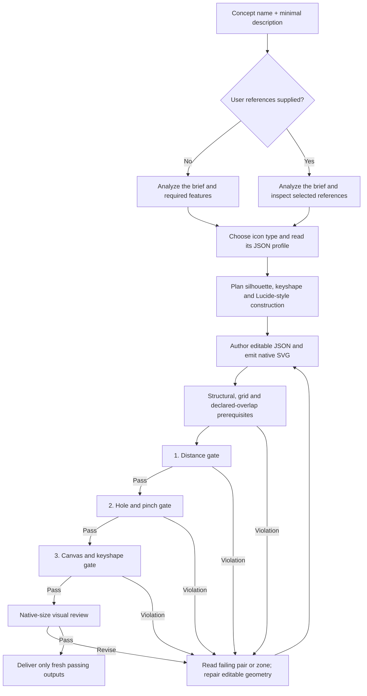

# Canonical Icon Pipeline

This document is the single operational sequence for making, checking, repairing,
and delivering Unlimited Shapes icons. The lane adapters link here and describe
only what changes for their input. There are two intake modes: **concept name +
minimal description**, either **without references** or **with optional SVG,
PNG, or other reference files**. Both join the same design and verification loop:

- [icon-execution-steps.md](icon-execution-steps.md) — one supplied SVG.
- [icon-batch-execution-steps.md](icon-batch-execution-steps.md) — a staged SVG batch.
- [Normal-icon rework](../icons/rework.md) — a local manifest pack or a symbol-library payload; remote upload is separately authorized.

## Authority

Use these documents in this order:

1. Start with the selected type's skill, local `rules.md`, and generated
   `profile.md`: [normal](../icons/SKILL.md), [sub](../sub-icons/SKILL.md), or
   [container](../container-icons/SKILL.md). These are role/workflow templates,
   not an enumeration of allowed sizes. For a custom named type, use this shared
   pipeline and the [profile configuration guide](profile-configuration.md).
   `core/icon_profiles.json` supplies current geometry and validation settings.
2. [icon-rules.md](icon-rules.md) defines the shared visual and geometry requirements.
3. [atomic-shapes.md](atomic-shapes.md) defines schema-version-2 geometry and
   on-demand Lucide reference use.
4. This page defines execution order and repair loops.
5. The selected lane adapter adds scope, staging, review, and delivery differences.

[icon-authoring-guide.md](icon-authoring-guide.md),
[qa-overlays-guide.md](qa-overlays-guide.md), and
[negative-space-repair-examples.md](negative-space-repair-examples.md) explain
technique and interpretation. They do not replace the three normative documents
above. An installed skill may help execute the work, but it does not override the
in-repository specification.

`core/icon_profiles.json` schema v2 is the machine authority for canvas, stroke,
keyshapes, validation defaults/overrides, inheritance, and container-slot values.
Centers and same-size design/ship compatibility aliases are derived. The Profile Manager,
emitter, validators, generated profile references, and tests consume that source. Update the
affected type's `rules.md` when a profile change also alters its purpose or
delivery contract. [icon-types.md](icon-types.md) is the routing guide.

Check its generated Markdown profile references with:

```bash
python3 core/generate_profile_assets.py --check
```

After an authorized direct profile edit, run the command without `--check` to
regenerate mirrors, then run the check form. The [profile manager](profile-configuration.md)
validates and regenerates mirrors when it saves. Neither route migrates icons;
configuration changes require fresh emission, QA, and native-size acceptance.

See [scripts.md](scripts.md) for the exhaustive command, module, exit-behavior,
and type-support matrix.

## Profile support

Declare the type first. The canonical emitter and validators use the selected
profile throughout the pipeline.

| Type | Numeric profile | Automated path | Additional review and delivery |
| --- | --- | --- | --- |
| `normal` | [Normal profile](../icons/profile.md) | Profile-aware emission; structural/grid/overlap prerequisites; distance → holes → keyshape gates | [Normal rules](../icons/rules.md) |
| `sub` | [Sub profile](../sub-icons/profile.md) | The same core path using the sub profile | [Sub rules](../sub-icons/rules.md) |
| `container` | [Container profile](../container-icons/profile.md) | The same outer gates plus declared slot and clearance validation | [Empty and filled review](../container-icons/rules.md#filled-preview) |

Authoring, canonical output, and acceptance review use the same resolved native
canvas and stroke. Built-in defaults are normal/main 48px, sub 32px, and container
64px at 4px stroke, but custom profiles and edited values are valid. A container
preview uses its configured outer canvas and translates a separately authored
accepted-profile insert into the slot without scaling.

## Workflow map



The required order is:

```text
analyze brief (+ supplied references) and choose type
→ read profile and plan the icon → author editable geometry → emit
→ structural/grid/overlap prerequisites
→ distance → holes/pinches → canvas/keyshape → native-size review → deliver
```

`validate_icon.py` includes some spacing and keyshape checks. Treat those as an
early baseline, not a substitute for the three ordered acceptance gates. Repair
the first failing gate, regenerate both aliases, and restart at distance after
rechecking the prerequisites. A batch runner may collect later diagnostics on a
failed icon; those findings never authorize delivery. Any geometry or effective
profile change invalidates all three earlier passes. Errors, unresolved reviews,
missing inputs, and stale evidence block acceptance; see [Repair loop](#repair-loop).

## Suggested artifact layout

Keep source evidence, editable composition, emitted output, and QA separate:

```text
work/<job>/
├── sources/              # only when user references exist
├── detection/            # only for supplied SVG references
│   ├── <name>-shapes.json
│   └── <name>-preflight.png
├── editable/
│   └── <name>.json
├── output/
│   ├── <name>.svg          # canonical native SVG
│   └── <name>-design.svg   # same-size compatibility alias
└── qa/
    ├── grid/
    ├── overlap/
    ├── spacing/
    ├── holes/
    ├── keyshape/
    └── previews/
```

Run commands from the repository root. Install the Python dependencies before
using the raster QA tools:

```bash
python3 -m pip install -r requirements.txt
```

## 0. Route the request

Normalize each selected input to a concept name, minimal description, required
identity-bearing features, any supplied symbol ID, intended role, and a list of
user reference files (empty is valid). Preserve supplied wording and IDs. For
older reference-only requests, derive a short brief from the selected evidence
and record that it is inferred; ask only if ambiguity would change the subject.
Do not add files or variants to the requested scope.

Choose the intake mode and, only when needed, a staging adapter:

| Input | Adapter | Intake script |
| --- | --- | --- |
| Name + minimal description, no references | Selected type's skill and brief-only intake below | none |
| Name + minimal description + PNG/other files, or mixed references for one subject | Selected type's skill and reference-backed intake below | format-appropriate inspection; SVG detection only for actual SVGs |
| One selected SVG | [single-icon adapter](icon-execution-steps.md) | none |
| Explicit staged set of SVGs | [batch adapter](icon-batch-execution-steps.md) | none |
| Symbol rework JSON | [rework adapter](../icons/rework.md) | `core/fetch_rework_batch.py` |
| Local manifest-based rework pack | [local pack lane](../icons/rework.md#local-manifest-pack-lane) | `core/rework_pack.py inspect`, then `prepare` |

The SVG and manifest helpers have narrower input contracts; a pack requiring a
prototype is not a requirement for ordinary brief-only authoring. A batch may
contain either intake mode, but each icon keeps its own brief and evidence.

Analyze the intended role, then declare exactly one `iconType` per editable icon.
Use the user-selected type when specified; otherwise choose from meaning and
intended use, not the source file's canvas or final bounds. Read that type's
resolved JSON profile **before designing the icon**: canvas, stroke, keyshapes,
grid, distance floor, enclosed-radius/fill-depth thresholds, and any protected
slot. Record the idea: dominant silhouette, essential parts, intended joins and
openings, selected keyshape, and why it preserves recognition.

Select its keyshape from
the resolved profile's keyshapes (built-in `profile.md` or generated aggregate)
by visually inspecting the dominant whole-icon
silhouette at its native size. A small wheel, button, window,
badge, or inset does not choose the whole icon's keyshape.

### Brief-only intake

Use the name and minimal description directly to identify the subject, essential
parts, and arrangement. Record `sourceAnalysis.sourceOrigin: "brief"`,
`conceptName`, `minimalDescription`, and `references: []` in editable JSON. Plan
semantic groups with your own descriptive IDs; do not invent detector IDs or
pretend a drawing was supplied.

No preliminary source SVG, detector run, or preflight plot is required. Proceed
to the shared design stages below and author the actual editable icon. A sketch
may help reasoning, but is a draft, not independent reference evidence.

### Reference-backed intake

Record `sourceAnalysis.conceptName`, `minimalDescription`, and `references` with
the selected files and their role in understanding the subject. Preserve adapter
provenance fields such as `sourceOrigin`, `symbolId`, or `sid`. Inspect only the
references placed in scope:

- Supplied SVG: run the detector below and review its source, report, and plot.
- PNG/raster: inspect the visible silhouette, parts, openings, and cutouts;
  record semantic regions, not fabricated SVG element IDs.
- Other files: inspect the relevant content using an appropriate reader. If
  essential content cannot be inspected, report the limitation; do not silently
  substitute a different reference or claim it was reviewed.

The brief defines the intended subject; references provide evidence, not a demand
to reproduce their grid, stroke, defects, or missing extraction geometry. Resolve
material conflicts before authoring. Bundled Lucide original/debug files are
shared **style and construction references**, not required user-supplied input;
their use below applies to both intake modes.

## 1. Detect the source before composition

This stage applies **only when a selected user reference is an SVG**. Skip it for
brief-only and non-SVG reference inputs. For one supplied SVG:

```bash
python3 core/detect_svg_shapes.py <source.svg> \
  --output <detection>/<name>-shapes.json \
  --plot <detection>/<name>-preflight.png
```

For an authorized batch:

```bash
python3 core/batch_detect_svg_shapes.py <sources-folder> <detection-folder>
```

Use `--strict` for automated single-file preflight when manual review must produce
a nonzero status. Use `--overwrite` for batch detection only when a source or the
detector changed. Detection is evidence, not permission to trace or an automatic
geometry decision. Legacy suggested atoms are conveniences; ignore them whenever they would
weaken the natural silhouette, recognition, or visual quality.

The detector normalizes source analysis to its reference grid. Those coordinates
are evidence; compose on the selected profile's configured native canvas.
Detection does not convert a sub or container into a normal icon.

## 2. Review evidence and map the source

For a supplied SVG, inspect its rendering, detection JSON, and preflight plot
together. Review:

- `summary.readyForIconMaker` or the batch status.
- Every source element ID.
- `makerPreflight.suggestedAtoms` and `makerPreflight.manualReview`.
- Every `specIssues` warning or error.
- Foreground/background order, connections, openings, overlaps, and contour ends.

Before treating a gap or truncated part as a design feature, apply the
[extracted-prototype rule](icon-rules.md#extracted-prototypes-restore-missing-geometry).
Distinguish clearance left by a removed overlapping object from intentional
openings or overlaps still needed in the new composition. Plan reconstruction
of the complete intended form; do not copy the extraction artifact into the
standalone result. Keep the source SVG unchanged as evidence.

For every intake mode, map each identity-bearing feature or semantic group to the
planned editable geometry. Use observed reference elements when available, or
brief-derived features when not. Record one mapping decision:

- `rebuild` into exact editable geometry
- `preserve` a source form that already fits the brief and current profile
- `simplify`
- `omit`
- `merge`
- `manual`

Carry actual detector IDs and reasons into `sourceAnalysis.mappings` when they
exist; otherwise use explicitly labeled semantic features or image regions.
Never require fictitious detection evidence for a text or PNG brief. Also record
`sourceAnalysis.relationships` for `connected`, `ordinary-distinct`,
`visual-opening`, and `intentional-overlap` pairs. Each identity-bearing opening
needs a `spacingChecks` entry with the measured centerline distance, painted
clearance, minimum, and pass/fail result.

For a reconstructed region, use `rebuild` on the affected element or semantic
group and explain the missing geometry, evidence for its continuation, and
restoration. The reconstruction is a source-mapping decision, not an extra
feature or a QA waiver. Review the restored contour at native size as well as
running the normal geometry and spacing gates.

Use stable element IDs in version-2 relationship pairs, including
`spacingChecks[].elements: ["element-a", "element-b"]`. The older
`instances` pair field is only for compatibility with legacy documents.

Do not compose while an essential feature or unresolved detector warning remains
unexplained. `sourceAnalysis.incomplete: true` is an explicit validation failure;
do not use it as a delivery waiver.

## 3. Select references and construction principles

Choose the cleanest recognizable form from the brief, selected profile, and any
source evidence. Initialize the design idea before writing geometry: silhouette,
essential parts, relative proportions, keyshape, and spacing budget.
Search for a relevant Lucide subject or construction family, then inspect the
original/debug pair and its exact geometry:

```bash
python3 core/lucide_reference.py search 'cloud' --limit 6
python3 core/lucide_reference.py inspect cloud --json
```

Record `sourceAnalysis.lucideReferences` entries with `name`, `reason` and
`principles`. Useful principles describe contour flow, corner construction,
relative proportions, gaps, or attachments—not merely “looks like Lucide.”
If there is no relevant match, say so and build from the semantic brief.

Lucide's original 24px SVG canvas stays unchanged as reference evidence, not
as a production or acceptance-review target for this system. Debug segment boundaries
are generated analysis, not a required output structure or proof of design
intent. References cannot add features absent from the brief. Whole-unit grid
preferences and aggregate frequency summaries are guidance, not a strict angle,
radius, element-count or reuse quota. New geometry needs no registry extension
or shape-asset generation. See [the geometry guide](atomic-shapes.md).

## 4. Compose editable JSON

The schema-version-2 editable JSON is the source of truth for repair and re-emission. It
must declare at least:

- a stable kebab-case `name` following [R8](icon-rules.md#symbol-ids-and-variants),
  retaining any supplied `sym-<id>` prefix for the icon and its requested variants;
- `iconType`, `canvas`, and `strokeWidth`;
- `keyfitCheck.targetToken` plus a short visual rationale;
- `schemaVersion: 2` and ordered `elements` with unique `id`, optional `role`,
  supported `tag`, and geometry-only `attrs`;
- `sourceAnalysis` mappings, relationships, and spacing checks;
- `containerSlot` for a container.

Render and inspect the composition at its declared native size before finalizing
the keyshape. Fit by recomposing editable coordinates.
Never globally scale or patch flattened output paths.

Exact edge/cardinal contact is the default keyfit mode. When the subject's meaning
or reference-supported proportions make every exact keyshape fit unnatural, the
AI may approve a [keyshape exception](#keyshape-exceptions) using the existing
`keyfitCheck.mode: "optical"`, a meaningful `rationale`, and design-unit
`paintedBounds: [left, top, right, bottom]`. This is not limited to thin glyphs.
Validate measured bounds against that declaration and the containing token;
do not distort the subject just to reach all four edges.

Author and repair the editable JSON directly. Before validation, complete
`sourceAnalysis` with the source mapping, relationship, painted-clearance, and
visual-rationale evidence required by this pipeline. Unfinished analysis remains
marked `sourceAnalysis.incomplete: true` and is not ready for delivery.

## 5. Emit canonical outputs

For every profile:

```bash
python3 core/emit_icon.py <editable-icon.json> --out-dir <output-folder>
```

The emitter reads `iconType` from editable JSON and writes canonical `<name>.svg`
at that configured native canvas and stroke, with 1u = 1px. `<name>-design.svg` remains a same-size compatibility alias,
not a second resolution; internal `design`/`ship` names and checker selectors
also resolve to identical dimensions. Do not produce half-size outputs.
Omitted `iconType` uses configured `defaultIconType` (initially `normal`) only
for backward compatibility; new sources declare it explicitly.

For a container's additional [filled preview](../container-icons/rules.md#filled-preview),
use the [preview manifest format](../container-icons/rules.md#preview-manifest)
to reference the separately authored container and sub sources:

```bash
python3 core/compose_container_preview.py <preview-manifest.json> \
  --out-dir <qa-folder>/previews
```

Do not replace the editable empty-container source with the combined preview.

## 6. Run structural validation

For every profile:

```bash
python3 core/validate_icon.py <editable-icon.json> --dir <output-folder>
```

Fix the editable JSON and re-emit when this fails. Never patch only one emitted
SVG. The validator resolves the editable source's configured `iconType`, including
custom names.
For a container it also requires the exact slot metadata and rejects container
paint whose stroke enters the protected region in its profile. Run that
gate on the empty production container, not the deliberately filled review
preview.

## 7. Pass the grid gate

Run the gate on canonical native SVGs (or their same-size compatibility aliases)
for one profile:

```bash
python3 core/check_svg_grid.py <native-svg-or-native-folder> \
  --icon-type <profile-name> \
  --expected design \
  --output-dir <qa-folder>/grid
```

The `--expected design` selector is retained for compatibility; it now means the
same native canvas and stroke as `ship`. Avoid duplicate canonical/alias rows in
one run. Stop on a wrong canvas, wrong normalized stroke, unsafe geometry attributes, or unresolved
fractional-placement findings. Intentional cubics and non-default radii are
allowed; apply documented optical/grid exceptions where required. Correct the editable source,
re-emit, and rerun; do not blindly round flattened paths.

One invocation uses one profile. Separate mixed-type batches before running this
gate.

## 8. Review declared overlaps

For each editable icon with two-element spacing checks:

```bash
python3 core/render_overlap_audit.py \
  <editable-icon.json> <qa-folder>/overlap/<name>-overlap-audit.svg
```

Inspect every generated panel. The command visualizes transformed paths and
envelopes using dense centerline sampling plus stroke radius rather than an exact
Boolean stroke outline; it does not make the final visual decision for you. If the
source has no two-element spacing checks, “nothing to audit” is expected rather
than proof of a failure. This review does not replace any acceptance gate below.

## 9. Pass the distance gate

**Gate 1 of 3, for every profile and both intake modes.** Check the actual native
SVG even when the editable source has no declared spacing pairs:

```bash
python3 core/check_svg_spacing.py <native-svg-or-flat-folder> \
  --icon-type <profile-name> --output-dir <qa-folder>/spacing
```

The current normal48 setting requires 8u between centerlines, equivalent to 4u
between ink edges with its 4u stroke. It comes from the profile JSON; this update
does not impose that number on sub or container profiles. Always pass the selected
profile explicitly, including custom types, and use its own configured floor.

Read `spacing-results.json`, `spacing-report.html`, and each fresh `files/` report
and native-size colored `spacing.svg`. Each disconnected `M` contour is identified,
true centerline-connected contours are grouped, and every separate component pair
has a measured centerline distance, ink clearance, nearest points and verdict.
Ink contact alone does not join components. Curves use bounded approximation;
ambiguous contact or threshold cases require review. Exit `1` includes violations,
review cases and errors; require exit `0` and complete passing report coverage.
Do not skip an unsupported SVG, relax a threshold, or add a spurious connection to
make it pass. Read the failing contour/component IDs, nearest points, measured
distance/ink clearance, required minimum, and diagnostic SVG. Use these to locate
the actual gap; repair editable geometry, re-emit, recheck prerequisites, and
restart at this gate. Only a passing result advances to the hole gate.

The current engine can leave curved contacts unresolved, including a curve
endpoint meeting the interior of a line. Connected artwork may then be reported
as multiple components and produce an apparent distance violation. Investigate
such topology before moving paint. A `review`, unsupported geometry, or suspected
checker defect is a blocker to resolve, not permission to distort an intended
join, force a pass, or claim the icon is compliant.

`validate_icon.py` also runs this numerical check for normal icons after verifying
both emitted aliases match canonical geometry, so existing pack and wrapper
structural gates reject hidden subpath spacing failures. The standalone command
provides per-pair diagnostics without needing editable metadata. Neither route
approves intentional connections semantically or checks internal gaps in one
connected shape; keep the declared overlap and hole/pinch reviews.

## 10. Pass the hole and pinch gate

**Gate 2 of 3.** After distance passes, check the same native SVG:

```bash
python3 core/qa_overlays.py <native.svg> \
  --icon-type <profile-name> \
  --output-dir <qa-folder>/holes
```

Read `hole-diameters.json`, the per-icon metrics, the overlay, and the HTML report.
Require a successful exit **and** a fresh `status: "pass"` row for every expected
input. Missing rows, processing errors, holes below the configured radius, and
under-depth solid pinches all block acceptance. Omit threshold overrides so the
profile's configured radius and fill-depth gates apply; relaxed CLI values are
diagnostics, not delivery acceptance. Use one declared profile per invocation.

Locate each violating zone in the overlay and its hole/pinch metrics, identify
the enclosing editable elements, then apply the R9 repair ladder: enlarge the
opening, rebalance the composition, or remove a complete non-essential part.
Do not squeeze the hole shut or edit QA copies. Re-emit from editable JSON,
recheck prerequisites, and restart at distance; only a fresh hole pass advances
to keyshape.

## 11. Validate the declared painted keyshape

**Gate 3 of 3.** `validate_icon_keyshapes.py` is completion-blocking for every
production SVG, including its same-size `-design.svg` alias. It verifies native
`width`, `height`, and `viewBox`, the configured stroke, the declared painted
keyshape, and the protected slot when the selected profile has one. Canvas and
keyshape values come from `core/icon_profiles.json`, including custom profiles;
neither canvas size nor a convenient matching token is inferred from the artwork.

For one native SVG, bind its editable source explicitly:

```bash
python3 core/validate_icon_keyshapes.py <native.svg> \
  --editable <editable-icon.json> \
  --icon-type <profile-name> \
  --output-dir <qa-folder>/keyshape
```

For both emitted aliases or a flat output folder:

```bash
python3 core/validate_icon_keyshapes.py <native-svg-folder> \
  --expected-editable-dir <editable-folder> \
  --output-dir <qa-folder>/keyshape
```

Editable metadata is required: schema version 2, explicit `iconType`, `canvas`,
`strokeWidth`, and `keyfitCheck.targetToken`. With `--expected-editable-dir`, both
`<name>.svg` and `<name>-design.svg` use `<name>.json`. Use `--editable` for one
renamed delivery such as `<sid>_generated.svg`; its filename need not match the
editable name. An optional `--icon-type` must agree with the editable declaration.

The gate uses `check_keyfit.py` internally for stroke-inclusive raster bounds,
canvas overflow, circle containment, and exact or declared optical fit. Do not
run that same raster check a second time by default or use its diagnostic
threshold overrides to bypass this gate. Unsupported SVG styling, transforms,
hidden definitions, or references fail: repair the editable source and emit the
canonical flat SVG rather than approximating or ignoring those features.

Inspect the fresh `canvas-keyshape-results.json` and every expected row, plus the
per-input `canvas-keyshape.json`, `.keyfit.json`, and `_keyfit.png` under
`files/<stem>-<pathhash>-<runid>/`. Require exit `0`, `ok: true`, no failed rows, and complete
coverage of the intended outputs; a missing or stale output/report is not a pass.
Exit `1` includes validation, read, and dependency failures; `2` is CLI misuse.
The checker does not modify SVGs, editable sources, or profiles.

On failure, compare expected canvas/stroke and token bounds against actual
stroke-inclusive bounds, overflow, containment, and slot findings. Fix the
editable icon's extent, centering, or contour, or assess a justified
[keyshape exception](#keyshape-exceptions), then regenerate and restart at
distance. “Fix the keyshape dimension” normally means fix the artwork's fit,
not edit profile JSON or relax a validator. An AI-approved optical exception is
an authorized alternative to forced exact proportions, not an edited pass flag.

Run this gate on the empty production container. Its deliberately filled preview
is a separate combined-use review artifact, not a replacement production input.
A pass here does not replace structural, grid, spacing/overlap, hole/pinch, or
native-size visual acceptance.

### Keyshape exceptions

Some icons cannot naturally match any defined keyshape's exact proportions,
because of the prototype reference or the icon's own meaning. **The AI agent may
decide whether to approve or reject a keyshape exception**, without additional
user approval. Preserve the subject's recognizable proportions instead of
stretching or widening it solely to satisfy the standard box. A reference is
evidence for this judgment, not a reason to copy extraction cutouts or defects.

- Approve when exact fitting would distort the subject, weaken recognition, or
  contradict meaningful reference proportions, and the proposed natural form
  reads well at the profile's native size. Record the reason and chosen bounds.
- **Both exceptional keyshape dimensions must be divisible by 4**, measured
  from the actual centerline bounding box in native design units: width = 4 × n
  and height = 4 × m, for non-negative integers n and m. **20×40 and 24×40 are valid;
  22×40 is invalid**, as is 20×42. This constrains the exception's width and
  height, not every coordinate or the stroke-inclusive painted dimensions.
  Record the measured centerline size in the rationale. Reject and repair
  non-multiples; do not round the reported measurements, change only metadata,
  or waive this rule through AI judgment or a passing optical checker result.
- Reject when the mismatch is accidental undersizing, poor centering, unfinished
  geometry, or merely an attempt to avoid repair. Explain the decision and fix
  the editable icon; an exception is not automatic after a failed check.
- Implement an approved exception with existing **optical fit**: retain a
  suitable profile token as the containing boundary, set `keyfitCheck.mode` to
  `"optical"`, and declare the actual stroke-inclusive `paintedBounds` and a
  subject-specific `rationale`. The icon need not reach that token's four edges.
  The AI judges the design; the checker verifies the declared geometry.
- This exception changes the exact-fit requirement only. Native canvas, stroke,
  painted containment, protected container slots, distance, holes/pinches, grid,
  and native-size visual review still apply. Do not change profile JSON, invent
  an unregistered target token, edit reports, or convert checker errors to passes.
- After changing fit metadata or geometry, regenerate both aliases and restart
  **distance → holes → keyshape**. Require a fresh passing optical result and
  report it as **“keyshape: pass — AI-approved optical exception”**, including
  the rationale; never describe it as an exact standard-keyshape fit.

**Fork example (current normal 48px profile, 4px stroke):** the standard portrait
token `portrait-36x44` describes a 36×44 painted box, corresponding to a 32×40
centerline box. A fork may read better at **20×40, 24×40, or 16×40 centerline**
instead; all dimensions are divisible by 4. These are examples, not new
mandatory tokens. Their painted boxes are 24×44, 28×44, and 20×44 respectively.
A 22×40 centerline fork is not eligible for an exception, even if centered,
contained, and visually recognizable. For a centered 20×40 centerline fork, record:

```json
"keyfitCheck": {
  "targetToken": "portrait-36x44",
  "mode": "optical",
  "rationale": "AI-approved keyshape exception: a 20x40 centerline fork keeps a slender utensil silhouette; widening it to 32x40 would distort the subject.",
  "paintedBounds": [12, 2, 36, 46]
}
```

For centered 24×40 and 16×40 centerline examples, use painted bounds
`[10, 2, 38, 46]` and `[14, 2, 34, 46]` respectively.
Measure the actual finished stroke envelope; do not put centerline dimensions
into `paintedBounds` or copy an example onto geometry with different bounds.
An approved exception can pass this gate even though the same artwork fails
default exact mode. Distance and hole verdicts are still independently required.

## 12. Perform true-size visual review

Numeric success does not prove recognition, balance, or family consistency.
Inspect the canonical SVG at the selected profile's native size only. For a flat
family folder, create a native-size contact sheet:

```bash
python3 core/render_svg_contact_sheet.py <native-svg-folder> <contact-sheet.png> \
  --icon-type <profile-name> --preview-scale 1 --columns 10
```

The type selects its native size; optional `--true-size` must match that value.
Use one profile per sheet and exclude duplicate compatibility aliases. Follow the
type's rules for additional review states, including a container-native filled
preview. Manual zoom and internal raster supersampling may diagnose
geometry; they do not create another required export or replace native review.

An older half-size verdict does not establish native-size acceptance. For an
explicitly requested migration, emit and actually review the new native SVG,
then record fresh size/hash evidence; changing metadata alone is not a review.
Canvas, stroke, keyshape, or validation changes likewise require new emission,
QA and review, even when the rendered bytes happen to stay unchanged. Do not
rebuild historical work folders merely because profile rules changed.

Reject an awkward, unnatural, or weakly recognizable silhouette even when every
numeric gate passes. Return to the semantic brief, reference evidence and exact
editable geometry when the construction caused the compromise. Do not increase
element count as a proxy for visual improvement.

## Repair loop

Any geometry change returns to editable JSON and then to emission. Work down the
R9 repair ladder:

1. Enlarge the opening.
2. Rebalance the composition so the crowded detail can carry legal space.
3. Remove a complete non-identity-bearing part and record the omission.

Never squeeze a hole shut, delete an arbitrary path fragment, or clip the defect.
Do not change the profile or validation settings merely to obtain a pass. Repair
geometry when the mismatch is a construction defect. When exact proportions
conflict with the subject, the AI may instead approve the documented
[keyshape exception](#keyshape-exceptions) and switch to optical mode with a
reasoned declaration and fresh QA; this does not require another user decision.
A change to the intended subject or profile itself still needs its own
justification and any required user decision.

Repeat **distance → holes → keyshape** until all three pass on the same final
geometry and effective profile. After any repair, regenerate both native aliases,
recheck structural/grid/overlap prerequisites, and restart at distance—even when
the last defect concerned only a hole or the outer bounds. Repeat native-size
review after the gates pass. A later visual correction also restarts this loop.

Keep a concise per-icon error summary: gate, affected pair/zone/bounds, measured
and required values, repair made, and links to fresh reports. Bind evidence to the
exact checked SVG and profile using the three checkers' SVG/profile hashes; do
not reuse stale reports or
mix passes from different revisions. Verify both emitted aliases still match.

Do not stop at an ordinary repairable violation, or mark the icon complete while
a required input/result is missing, stale, failing, or under review. A checker
error, unresolved measurement/topology limitation, missing dependency, repeated
failure without a justified next repair, or required semantic/profile change is
a blocker to investigate and report—not an endless blind repair loop. Continue
safe work on other batch items, but label blocked items unapproved.

## Delivery gate

Deliver only when every required gate passes. The handoff includes:

- schema-version-2 editable JSON;
- canonical `<name>.svg` at the declared native size; any retained `-design.svg`
  is a same-size compatibility alias, not another required delivery resolution;
- source detection JSON and preflight plot when a source SVG existed;
- mapping, relationship, spacing, and keyshape rationale metadata;
- grid/overlap evidence; fresh **distance, holes, and canvas/keyshape passes**,
  with keyshape results covering both emitted aliases; and native-size review;
- intentional simplifications, omissions, and approved exceptions; report blocked
  items separately, never as completed output;
- container slot metadata and filled preview when applicable;
- selected Lucide references and applied construction principles, or an explicit
  note that no useful match was found.

The trace must remain readable from brief/source element → maker decision → editable
element → emitted SVG → QA evidence. Rework uploads happen only after this gate
and the additional approval sequence in the rework adapter.

## Stop instead of guessing

Stop the affected icon and report the blocker when:

- source evidence and detection artifacts do not correspond;
- a required source, report, or output location is unavailable;
- an essential form cannot be represented safely by the supported geometry schema;
- a semantic decision would materially change the intended subject;
- a required checker or dependency is unavailable;
- the output cannot be traced back to editable geometry source.

For a batch, continue safe work on unaffected icons and list every omission with
its stopping step and reason.
