# Canonical Icon Pipeline

This document is the single operational sequence for making, checking, repairing,
and delivering Unlimited Shapes icons. The lane adapters link here and describe
only what changes for their input:

- [icon-execution-steps.md](icon-execution-steps.md) — one supplied SVG.
- [icon-batch-execution-steps.md](icon-batch-execution-steps.md) — a staged SVG batch.
- [icon-rework-execution-steps.md](icon-rework-execution-steps.md) — a symbol-library rework JSON and controlled upload.

## Authority

Use these documents in this order:

1. [icon-types.md](icon-types.md) defines the purpose and delivery contract for
   `normal`, `sub`, and `container`; `core/icon_profiles.json` supplies their
   exact geometry.
2. [icon-rules.md](icon-rules.md) is the binding visual and numeric specification.
3. [atomic-shapes.md](atomic-shapes.md) defines the reusable primitive contract
   and registry-extension rules.
4. This page defines execution order and repair loops.
5. The selected lane adapter adds scope, staging, review, and delivery differences.

[icon-authoring-guide.md](icon-authoring-guide.md),
[qa-overlays-guide.md](qa-overlays-guide.md), and
[negative-space-repair-examples.md](negative-space-repair-examples.md) explain
technique and interpretation. They do not replace the three normative documents
above. An installed skill may help execute the work, but it does not override the
in-repository specification.

`core/icon_profiles.json` is the machine authority for canvas, stroke, center,
keyshape, distinct-part distance, inheritance, and container-slot values. The browser, emitter,
validators, generated reference, and tests consume that source. Keep
[icon-types.md](icon-types.md) aligned when a profile change also alters its human
meaning or delivery contract.

Check its generated browser and documentation mirrors with:

```bash
python3 core/generate_profile_assets.py --check
```

After an authorized profile edit, run the command without `--check` to regenerate
the mirrors, then run the check form.

See [scripts.md](scripts.md) for the exhaustive command, module, exit-behavior,
and type-support matrix.

## Profile support

Declare the type first. The canonical emitter and validators use the selected
profile throughout the pipeline.

| Type | Design → ship | Automated path | Required visual review |
| --- | --- | --- | --- |
| `normal` | 48×48 → 24×24 | Profile-aware emission, structural, grid, overlap, keyshape, and hole/pinch QA | Exact 24px output |
| `sub` | 32×32 → 16×16 | The same core path using sub keyshape tokens and the 3u distinct-part distance floor | Exact 16px output |
| `container` | 64×64 → 32×32 | Container-profile outer gates plus exact slot metadata and full 32×32 clearance validation | Empty production asset and combined filled preview at 32px |

The filled preview is a non-shipping combination of two independently authored
icons. Container validation proves the empty container keeps the full 32×32
insertion square clear; the preview proves the pair remains recognizable and
well spaced together.

## Workflow map

```mermaid
flowchart LR
    A[Choose input lane and icon type] --> B[Detect source geometry]
    B --> C[Review evidence and map source elements]
    C --> D[Choose the strongest natural silhouette]
    D --> E{Can current atoms preserve it without compromise?}
    E -- Yes --> H[Compose editable JSON]
    E -- No --> F[Add reusable atom]
    F --> G[Sync registries, assets, docs, and tests]
    G --> H
    H --> I[Emit design and ship SVGs]
    I --> J[Structural validation]
    J --> K[Grid gate]
    K --> L[Overlap review]
    L --> M[Declared keyshape gate]
    M --> N[Hole and pinch gate]
    N --> O[True-size visual review]
    O --> P{Looks good and all required gates pass?}
    P -- No --> Q[Repair source or extend registry]
    Q --> D
    P -- Yes --> R[Deliver]
    R --> S[Rework lane only: dry-run, approval, upload]
```



The required order is:

```text
route → detect → map → choose the best silhouette → reuse or extend → compose → emit → structural
→ grid → overlap → keyshape → holes/pinches → true-size review → deliver
```

`validate_icon.py` includes some spacing and keyshape checks. Treat those as an
early structural baseline; the grid gate still blocks the later rendered overlap,
keyshape, and negative-space acceptance gates.

## Suggested artifact layout

Keep source evidence, editable composition, emitted output, and QA separate:

```text
work/<job>/
├── sources/
├── detection/
│   ├── <name>-shapes.json
│   └── <name>-preflight.png
├── editable/
│   └── <name>.json
├── output/
│   ├── <name>-design.svg
│   └── <name>.svg
└── qa/
    ├── grid/
    ├── overlap/
    ├── keyshape/
    ├── holes/
    └── previews/
```

Run commands from the repository root. Install the Python dependencies before
using the raster QA tools:

```bash
python3 -m pip install -r requirements.txt
```

## 0. Route the request

Choose exactly one input lane:

| Input | Adapter | Intake script |
| --- | --- | --- |
| One selected SVG | [single-icon adapter](icon-execution-steps.md) | none |
| Explicit staged set of SVGs | [batch adapter](icon-batch-execution-steps.md) | none |
| Symbol rework JSON | [rework adapter](icon-rework-execution-steps.md) | `core/fetch_rework_batch.py` |

Then declare exactly one `iconType` per editable icon. Select its keyshape from
[icon-types.md](icon-types.md) by visually inspecting the dominant whole-icon
silhouette at design size and true ship size. A small wheel, button, window,
badge, or inset does not choose the whole icon's keyshape.

## 1. Detect the source before composition

For one SVG:

```bash
python3 core/detect_svg_shapes.py <source.svg> \
  --output <detection>/<name>-shapes.json \
  --plot <detection>/<name>-preflight.png
```

For an authorized batch:

```bash
python3 core/batch_detect_svg_shapes.py <sources-folder> <detection-folder>
```

Use `--strict` for automated single-file preflight when manual review must produce
a nonzero status. Use `--overwrite` for batch detection only when a source or the
detector changed. Detection is evidence, not permission to trace or an automatic
atom decision. Suggested atoms are conveniences; ignore them whenever they would
weaken the natural silhouette, recognition, or visual quality.

## 2. Review evidence and map the source

Inspect the source rendering, detection JSON, and preflight plot together. Review:

- `summary.readyForIconMaker` or the batch status.
- Every source element ID.
- `makerPreflight.suggestedAtoms` and `makerPreflight.manualReview`.
- Every `specIssues` warning or error.
- Foreground/background order, connections, openings, overlaps, and contour ends.

For every identity-bearing element or semantic group, record one mapping decision:

- `existing-atom`
- `new-atom`
- `simplify`
- `omit`
- `merge`
- `manual`

Carry the detector IDs and reasons into `sourceAnalysis.mappings`. Also record
`sourceAnalysis.relationships` for `connected`, `ordinary-distinct`,
`visual-opening`, and `intentional-overlap` pairs. Each identity-bearing opening
needs a `spacingChecks` entry with the measured centerline distance, painted
clearance, minimum, and pass/fail result.

Do not compose while an essential feature or unresolved detector warning remains
unexplained. `sourceAnalysis.incomplete: true` is an explicit validation failure;
do not use it as a delivery waiver.

## 3. Make the quality-first reuse-or-extend decision

Choose the cleanest natural, recognizable form first. Use an existing atom only
when it preserves that visual quality as well as topology, shape family, and
semantic role. Create a new atom whenever reuse would force awkward proportions,
stiff or generic contours, seams, redundant overlaps, excess parts, or a less
convincing icon. Reuse count and registry growth are not acceptance metrics; a
technically compliant but visually weak icon is rejected.

A new atom is generic and parametric, never a frozen trace or whole icon. Integrate
it before any icon uses it:

1. Add matching geometry to `frontend/js/shapes.js` and
   `core/shape_registry.py`.
2. Confirm renderer/validator registry consumers and update detector
   classification when reliable; do not add a separate restrictive allowlist.
3. Document the contract and catalog entry.
4. Regenerate the standalone assets.
5. Run the full core regression suite.

```bash
python3 core/generate_assets.py
python3 -m unittest discover -s core -p 'test_*.py'
```

The two registries must remain aligned. Do not treat either copy as permission to
leave the other stale.

## 4. Compose editable JSON

The editable atomic JSON is the source of truth for repair and re-emission. It
must declare at least:

- a stable kebab-case `name`;
- `iconType`, `canvas`, and `strokeWidth`;
- `keyfitCheck.targetToken` plus a short visual rationale;
- ordered `instances` built from registered atom IDs;
- `sourceAnalysis` mappings, relationships, and spacing checks;
- `containerSlot` for a container.

Render and inspect the composition on its declared design canvas and at true ship
size before finalizing the keyshape. Fit by resizing and recomposing atom instances.
Never globally scale or patch flattened output paths.

The browser editor supports all profiles and exports a canonical-schema editable
JSON scaffold marked `sourceAnalysis.incomplete: true`. Before validation,
complete that analysis with the source mapping, relationship, painted-clearance,
and visual-rationale evidence required by this pipeline.

## 5. Emit canonical outputs

For every profile:

```bash
python3 core/emit_icon.py <editable-icon.json> --out-dir <output-folder>
```

The emitter reads `iconType` from editable JSON and writes that profile's design
and exact half-scale ship pair. Omitted `iconType` means `normal` only for backward
compatibility; new sources declare it explicitly.

A container needs both an empty production asset and a non-shipping filled review
preview. In the design preview, the sub icon is translated by the slot offset
`(16,16)` without scaling; exact half-scale emission makes that `(8,8)` in the
32px preview. The production container remains empty. Compose it from a manifest that
references the separately authored container and sub sources:

```bash
python3 core/compose_container_preview.py <preview-manifest.json> \
  --out-dir <output-folder>
```

Do not replace the editable empty-container source with the combined preview.

## 6. Run structural validation

For every profile:

```bash
python3 core/validate_icon.py <editable-icon.json> --dir <output-folder>
```

Fix the editable JSON and re-emit when this fails. Never patch only one emitted
SVG. The validator infers `normal`, `sub`, or `container` from the editable source.
For a container it also requires the exact slot metadata and rejects container
paint whose stroke enters the full protected 32×32 clearance square. Run that
gate on the empty production container, not the deliberately filled review
preview.

## 7. Pass the grid gate

Run the gate on design outputs only:

```bash
python3 core/check_svg_grid.py <design-svg-or-design-folder> \
  --icon-type <normal|sub|container> \
  --expected design \
  --output-dir <qa-folder>/grid
```

Do not point a design-only run at a folder that also contains ship SVGs. Stop on a
wrong canvas, wrong normalized stroke, cubic geometry, off-grid straight angle,
or avoidable fractional axis/45-degree placement. Correct the atomic source,
re-emit, and rerun; do not blindly round flattened paths.

One invocation uses one profile. Separate mixed-type batches before running this
gate.

## 8. Review declared overlaps and spacing

For each editable icon with two-instance spacing checks:

```bash
python3 core/render_overlap_audit.py \
  <editable-icon.json> <qa-folder>/overlap/<name>-overlap-audit.svg
```

Inspect every generated panel. The command visualizes transformed paths and
envelopes using dense centerline sampling plus stroke radius rather than an exact
Boolean stroke outline; it does not make the final visual decision for you. If the
source has no two-instance spacing checks, “nothing to audit” is expected rather
than proof of a failure.

## 9. Validate the declared painted keyshape

For any ship SVG:

```bash
python3 core/check_keyfit.py <ship.svg> \
  --icon-type <normal|sub|container> \
  --expected-editable-dir <editable-folder> \
  --output-dir <qa-folder>/keyshape
```

`--expected-editable-dir` makes the declared token authoritative and prevents an
accidental fit to another token from self-assigning a pass. Inspect the overlays
and report, not only the process status.

When `--expected-editable-dir` is supplied, the checker can infer each file's
declared profile and token from its JSON. An explicit `--icon-type` is still useful
for a single-profile run. Container protected-region validation belongs to the
editable-source structural gate; inspect the filled preview here as a separate
combined-use artifact.

## 10. Pass the hole and pinch gate

For a clean ship SVG:

```bash
python3 core/qa_overlays.py <ship.svg> \
  --icon-type <normal|sub|container> \
  --output-dir <qa-folder>/holes \
  --min-radius-design-u 1 \
  --min-fill-depth-design-u 1
```

Read `hole-diameters.json`, the per-icon metrics, the overlay, and the HTML report.
The report status is the verdict; process exit status alone is not proof of a pass.
Use one declared profile per invocation so measurements normalize to the correct
design canvas.

## 11. Perform true-size visual review

Numeric success does not prove recognition, balance, or family consistency.
Inspect the design SVG and the exact ship size. For a flat family folder, create a
contact sheet with the appropriate true size:

```bash
python3 core/render_svg_contact_sheet.py <ship-folder> <contact-sheet.png> \
  --true-size 24 --preview-scale 3 --columns 10
```

Use `--true-size 16` for sub icons and `--true-size 32` for containers.
Review normal output at 24px, sub output at 16px, and container output at 32px.
A container must be legible both empty and with the accepted sub icon in its
filled preview.

Reject an awkward, unnatural, or weakly recognizable silhouette even when every
numeric gate passes. Return to the quality-first atom decision and add or improve
a reusable atom when the current catalog caused the compromise.

## Repair loop

Any geometry change returns to editable JSON and then to emission. Work down the
R9 repair ladder:

1. Enlarge the opening.
2. Rebalance the composition so the crowded detail can carry legal space.
3. Remove a complete non-identity-bearing part and record the omission.

Never squeeze a hole shut, delete an arbitrary path fragment, clip the defect, or
change the declared keyshape to obtain a pass. After a repair, re-emit both SVGs
and rerun structural, grid, overlap, declared keyshape, hole/pinch, and true-size
checks. A local repair moves paint and can break a previously passing outer gate.

## Delivery gate

Deliver only when every required gate passes. The handoff includes:

- editable atomic JSON;
- type-appropriate design and exact half-scale ship SVGs;
- source detection JSON and preflight plot when a source SVG existed;
- mapping, relationship, spacing, and keyshape rationale metadata;
- grid, overlap, keyshape, negative-space, and true-size evidence;
- intentional simplifications, omissions, approved exceptions, and blocked gates;
- container slot metadata and filled preview when applicable;
- registry, generated asset, documentation, and passing tests for every new atom.

The trace must remain readable from source element → maker decision → atom
instance → emitted SVG → QA evidence. Rework uploads happen only after this gate
and the additional approval sequence in the rework adapter.

## Stop instead of guessing

Stop the affected icon and report the blocker when:

- source evidence and detection artifacts do not correspond;
- a required source, report, or output location is unavailable;
- an essential form would require prohibited geometry or a whole-icon primitive;
- a semantic decision would materially change the intended subject;
- a required checker or dependency is unavailable;
- the output cannot be traced back to editable atomic source.

For a batch, continue safe work on unaffected icons and list every omission with
its stopping step and reason.
