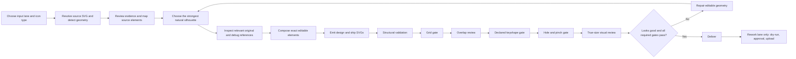

# Canonical Icon Pipeline

This document is the single operational sequence for making, checking, repairing,
and delivering Unlimited Shapes icons. The lane adapters link here and describe
only what changes for their input:

- [icon-execution-steps.md](icon-execution-steps.md) — one supplied SVG.
- [icon-batch-execution-steps.md](icon-batch-execution-steps.md) — a staged SVG batch.
- [Normal-icon rework](../icons/rework.md) — a local manifest pack or a symbol-library payload; remote upload is separately authorized.

## Authority

Use these documents in this order:

1. Start with the selected type's skill, local `rules.md`, and generated
   `profile.md`: [normal](../icons/SKILL.md), [sub](../sub-icons/SKILL.md), or
   [container](../container-icons/SKILL.md). They define that type's purpose,
   composition, and delivery. `core/icon_profiles.json` supplies exact geometry.
2. [icon-rules.md](icon-rules.md) defines the shared visual and geometry requirements.
3. [atomic-shapes.md](atomic-shapes.md) defines schema-version-2 geometry and
   on-demand Lucide reference use.
4. This page defines execution order and repair loops.
5. The selected lane adapter adds scope, staging, review, and delivery differences.

[icon-authoring-guide.md](icon-authoring-guide.md),
[qa-overlays-guide.md](qa-overlays-guide.md), and
[negative-space-repair-examples.md](negative-space-repair-examples.md) explain
technique and interpretation. They do not replace the three normative documents
above. An installed skill may help execute the work, but it does not override the
in-repository specification.

`core/icon_profiles.json` is the machine authority for canvas, stroke, center,
keyshape, distinct-part distance, inheritance, and container-slot values. The browser, emitter,
validators, generated profiles, and tests consume that source. Update the
affected type's `rules.md` when a profile change also alters its purpose or
delivery contract. [icon-types.md](icon-types.md) is the routing guide.

Check its generated browser and documentation mirrors with:

```bash
python3 core/generate_profile_assets.py --check
```

After an authorized profile edit, run the command without `--check` to regenerate
the mirrors, then run the check form.

See [scripts.md](scripts.md) for the exhaustive command, module, exit-behavior,
and type-support matrix.

## Profile support

Declare the type first. The canonical emitter and validators use the selected
profile throughout the pipeline.

| Type | Numeric profile | Automated path | Additional review and delivery |
| --- | --- | --- | --- |
| `normal` | [Normal profile](../icons/profile.md) | Profile-aware emission, structural, grid, overlap, keyshape, and hole/pinch QA | [Normal rules](../icons/rules.md) |
| `sub` | [Sub profile](../sub-icons/profile.md) | The same core path using the sub profile | [Sub rules](../sub-icons/rules.md) |
| `container` | [Container profile](../container-icons/profile.md) | The same outer gates plus declared slot and clearance validation | [Empty and filled review](../container-icons/rules.md#filled-preview) |

Each type is reviewed at its generated profile's true ship size. The container
guide defines the additional preview built from two independently authored icons.

## Workflow map



The required order is:

```text
route → resolve source → detect → map → inspect relevant references → compose exact elements → emit → structural
→ grid → overlap → keyshape → holes/pinches → true-size review → deliver
```

`validate_icon.py` includes some spacing and keyshape checks. Treat those as an
early structural baseline; the grid gate still blocks the later rendered overlap,
keyshape, and negative-space acceptance gates.

## Suggested artifact layout

Keep source evidence, editable composition, emitted output, and QA separate:

```text
work/<job>/
├── sources/
├── detection/
│   ├── <name>-shapes.json
│   └── <name>-preflight.png
├── editable/
│   └── <name>.json
├── output/
│   ├── <name>-design.svg
│   └── <name>.svg
└── qa/
    ├── grid/
    ├── overlap/
    ├── keyshape/
    ├── holes/
    └── previews/
```

Run commands from the repository root. Install the Python dependencies before
using the raster QA tools:

```bash
python3 -m pip install -r requirements.txt
```

## 0. Route the request

Choose exactly one input lane:

| Input | Adapter | Intake script |
| --- | --- | --- |
| Subject or short description without an SVG | Selected type's skill and the brief-only intake below | none |
| One selected SVG | [single-icon adapter](icon-execution-steps.md) | none |
| Explicit staged set of SVGs | [batch adapter](icon-batch-execution-steps.md) | none |
| Symbol rework JSON | [rework adapter](../icons/rework.md) | `core/fetch_rework_batch.py` |
| Local manifest-based rework pack | [local pack lane](../icons/rework.md#local-manifest-pack-lane) | `core/rework_pack.py inspect`, then `prepare` |

Then declare exactly one `iconType` per editable icon. Select its keyshape from
the local `profile.md` by visually inspecting the dominant whole-icon
silhouette at design size and true ship size. A small wheel, button, window,
badge, or inset does not choose the whole icon's keyshape.

### Brief-only intake

When the user supplies a subject without an SVG, record the description and its
required cues. Create a preliminary `sources/<name>.svg` on the selected design
profile to establish subject, part count, and arrangement. This is an authored
draft, not an external reference or final composition. Follow shared geometry
and paint conventions without adding details absent from the request.

Record `sourceOrigin: "brief"` and the user description under `sourceAnalysis`,
then detect and map the draft using the same stages below. For several requested
subjects, create one draft per subject and use the batch adapter after staging.
The symbol-library rework adapter adds its own brief-compliance and upload
contract only when the input is an actual rework payload.

## 1. Detect the source before composition

For one SVG:

```bash
python3 core/detect_svg_shapes.py <source.svg> \
  --output <detection>/<name>-shapes.json \
  --plot <detection>/<name>-preflight.png
```

For an authorized batch:

```bash
python3 core/batch_detect_svg_shapes.py <sources-folder> <detection-folder>
```

Use `--strict` for automated single-file preflight when manual review must produce
a nonzero status. Use `--overwrite` for batch detection only when a source or the
detector changed. Detection is evidence, not permission to trace or an automatic
geometry decision. Legacy suggested atoms are conveniences; ignore them whenever they would
weaken the natural silhouette, recognition, or visual quality.

The detector normalizes source analysis to its reference grid. Those coordinates
are evidence; compose on the selected type's design canvas from `profile.md`.
Detection does not convert a sub or container into a normal icon.

## 2. Review evidence and map the source

Inspect the source rendering, detection JSON, and preflight plot together. Review:

- `summary.readyForIconMaker` or the batch status.
- Every source element ID.
- `makerPreflight.suggestedAtoms` and `makerPreflight.manualReview`.
- Every `specIssues` warning or error.
- Foreground/background order, connections, openings, overlaps, and contour ends.

For every identity-bearing element or semantic group, record one mapping decision:

- `rebuild` into exact editable geometry
- `preserve` a source form that already fits the brief and current profile
- `simplify`
- `omit`
- `merge`
- `manual`

Carry the detector IDs and reasons into `sourceAnalysis.mappings`. Also record
`sourceAnalysis.relationships` for `connected`, `ordinary-distinct`,
`visual-opening`, and `intentional-overlap` pairs. Each identity-bearing opening
needs a `spacingChecks` entry with the measured centerline distance, painted
clearance, minimum, and pass/fail result.

Use stable element IDs in version-2 relationship pairs, including
`spacingChecks[].elements: ["element-a", "element-b"]`. The older
`instances` pair field is only for compatibility with legacy documents.

Do not compose while an essential feature or unresolved detector warning remains
unexplained. `sourceAnalysis.incomplete: true` is an explicit validation failure;
do not use it as a delivery waiver.

## 3. Select references and construction principles

Choose the cleanest recognizable form from the brief and source evidence.
Search for a relevant Lucide subject or construction family, then inspect the
original/debug pair and its exact geometry:

```bash
python3 core/lucide_reference.py search 'cloud' --limit 6
python3 core/lucide_reference.py inspect cloud --json
```

Record `sourceAnalysis.lucideReferences` entries with `name`, `reason` and
`principles`. Useful principles describe contour flow, corner construction,
relative proportions, gaps, or attachments—not merely “looks like Lucide.”
If there is no relevant match, say so and build from the semantic brief.

The original SVG is authoritative reference evidence. Debug segment boundaries
are generated analysis, not a required output structure or proof of design
intent. References cannot add features absent from the brief. Whole-unit grid
preferences and aggregate frequency summaries are guidance, not a strict angle,
radius, element-count or reuse quota. New geometry needs no registry extension
or shape-asset generation. See [the geometry guide](atomic-shapes.md).

## 4. Compose editable JSON

The schema-version-2 editable JSON is the source of truth for repair and re-emission. It
must declare at least:

- a stable kebab-case `name`;
- `iconType`, `canvas`, and `strokeWidth`;
- `keyfitCheck.targetToken` plus a short visual rationale;
- `schemaVersion: 2` and ordered `elements` with unique `id`, optional `role`,
  supported `tag`, and geometry-only `attrs`;
- `sourceAnalysis` mappings, relationships, and spacing checks;
- `containerSlot` for a container.

Render and inspect the composition on its declared design canvas and at true ship
size before finalizing the keyshape. Fit by recomposing editable coordinates.
Never globally scale or patch flattened output paths.

Exact edge/cardinal contact is the default keyfit mode. Intrinsically thin/sparse
subjects may declare `keyfitCheck.mode: "optical"`, a meaningful `rationale`, and
design-unit `paintedBounds: [left, top, right, bottom]`. Validate measured bounds
against that declaration and token containment; do not distort a natural glyph
or waive overflow to achieve fit. See shared R1 for this reviewed exception.

The browser editor supports all profiles and exports a canonical-schema editable
JSON scaffold marked `sourceAnalysis.incomplete: true`. Before validation,
complete that analysis with the source mapping, relationship, painted-clearance,
and visual-rationale evidence required by this pipeline.

## 5. Emit canonical outputs

For every profile:

```bash
python3 core/emit_icon.py <editable-icon.json> --out-dir <output-folder>
```

The emitter reads `iconType` from editable JSON and writes that profile's design
and exact half-scale ship pair. Omitted `iconType` means `normal` only for backward
compatibility; new sources declare it explicitly.

For a container's additional [filled preview](../container-icons/rules.md#filled-preview),
use the [preview manifest format](../container-icons/rules.md#preview-manifest)
to reference the separately authored container and sub sources:

```bash
python3 core/compose_container_preview.py <preview-manifest.json> \
  --out-dir <qa-folder>/previews
```

Do not replace the editable empty-container source with the combined preview.

## 6. Run structural validation

For every profile:

```bash
python3 core/validate_icon.py <editable-icon.json> --dir <output-folder>
```

Fix the editable JSON and re-emit when this fails. Never patch only one emitted
SVG. The validator infers `normal`, `sub`, or `container` from the editable source.
For a container it also requires the exact slot metadata and rejects container
paint whose stroke enters the protected region in its profile. Run that
gate on the empty production container, not the deliberately filled review
preview.

## 7. Pass the grid gate

Run the gate on design outputs only:

```bash
python3 core/check_svg_grid.py <design-svg-or-design-folder> \
  --icon-type <normal|sub|container> \
  --expected design \
  --output-dir <qa-folder>/grid
```

Do not point a design-only run at a folder that also contains ship SVGs. Stop on a
wrong canvas, wrong normalized stroke, unsafe geometry attributes, or unresolved
fractional-placement findings. Intentional cubics and non-default radii are
allowed; apply documented optical/grid exceptions where required. Correct the editable source,
re-emit, and rerun; do not blindly round flattened paths.

One invocation uses one profile. Separate mixed-type batches before running this
gate.

## 8. Review declared overlaps and spacing

For each editable icon with two-element spacing checks:

```bash
python3 core/render_overlap_audit.py \
  <editable-icon.json> <qa-folder>/overlap/<name>-overlap-audit.svg
```

Inspect every generated panel. The command visualizes transformed paths and
envelopes using dense centerline sampling plus stroke radius rather than an exact
Boolean stroke outline; it does not make the final visual decision for you. If the
source has no two-element spacing checks, “nothing to audit” is expected rather
than proof of a failure.

## 9. Validate the declared painted keyshape

For any ship SVG:

```bash
python3 core/check_keyfit.py <ship.svg> \
  --icon-type <normal|sub|container> \
  --expected-editable-dir <editable-folder> \
  --output-dir <qa-folder>/keyshape
```

`--expected-editable-dir` makes the declared token authoritative and prevents an
accidental fit to another token from self-assigning a pass. Inspect the overlays
and report, not only the process status.

When `--expected-editable-dir` is supplied, the checker can infer each file's
declared profile and token from its JSON. An explicit `--icon-type` is still useful
for a single-profile run. Container protected-region validation belongs to the
editable-source structural gate; inspect the filled preview here as a separate
combined-use artifact.

## 10. Pass the hole and pinch gate

For a clean ship SVG:

```bash
python3 core/qa_overlays.py <ship.svg> \
  --icon-type <normal|sub|container> \
  --output-dir <qa-folder>/holes \
  --min-radius-design-u 1 \
  --min-fill-depth-design-u 1
```

Read `hole-diameters.json`, the per-icon metrics, the overlay, and the HTML report.
The report status is the verdict; process exit status alone is not proof of a pass.
Use one declared profile per invocation so measurements normalize to the correct
design canvas.

## 11. Perform true-size visual review

Numeric success does not prove recognition, balance, or family consistency.
Inspect the design SVG and the exact ship size. For a flat family folder, create a
contact sheet with the appropriate true size:

```bash
python3 core/render_svg_contact_sheet.py <ship-folder> <contact-sheet.png> \
  --true-size <profile-ship-size> --preview-scale 3 --columns 10
```

Use the ship canvas size from the selected type's `profile.md`. Follow that
type's rules for additional review states, including a container's filled preview.

Reject an awkward, unnatural, or weakly recognizable silhouette even when every
numeric gate passes. Return to the semantic brief, reference evidence and exact
editable geometry when the construction caused the compromise. Do not increase
element count as a proxy for visual improvement.

## Repair loop

Any geometry change returns to editable JSON and then to emission. Work down the
R9 repair ladder:

1. Enlarge the opening.
2. Rebalance the composition so the crowded detail can carry legal space.
3. Remove a complete non-identity-bearing part and record the omission.

Never squeeze a hole shut, delete an arbitrary path fragment, clip the defect, or
change the declared keyshape to obtain a pass. After a repair, re-emit both SVGs
and rerun structural, grid, overlap, declared keyshape, hole/pinch, and true-size
checks. A local repair moves paint and can break a previously passing outer gate.

## Delivery gate

Deliver only when every required gate passes. The handoff includes:

- schema-version-2 editable JSON;
- type-appropriate design and exact half-scale ship SVGs;
- source detection JSON and preflight plot when a source SVG existed;
- mapping, relationship, spacing, and keyshape rationale metadata;
- grid, overlap, keyshape, negative-space, and true-size evidence;
- intentional simplifications, omissions, approved exceptions, and blocked gates;
- container slot metadata and filled preview when applicable;
- selected Lucide references and applied construction principles, or an explicit
  note that no useful match was found.

The trace must remain readable from brief/source element → maker decision → editable
element → emitted SVG → QA evidence. Rework uploads happen only after this gate
and the additional approval sequence in the rework adapter.

## Stop instead of guessing

Stop the affected icon and report the blocker when:

- source evidence and detection artifacts do not correspond;
- a required source, report, or output location is unavailable;
- an essential form cannot be represented safely by the supported geometry schema;
- a semantic decision would materially change the intended subject;
- a required checker or dependency is unavailable;
- the output cannot be traced back to editable geometry source.

For a batch, continue safe work on unaffected icons and list every omission with
its stopping step and reason.
