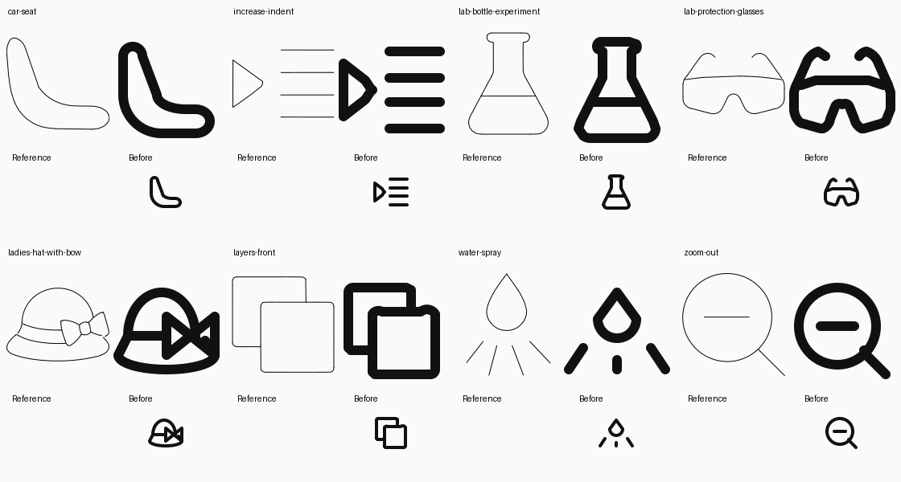
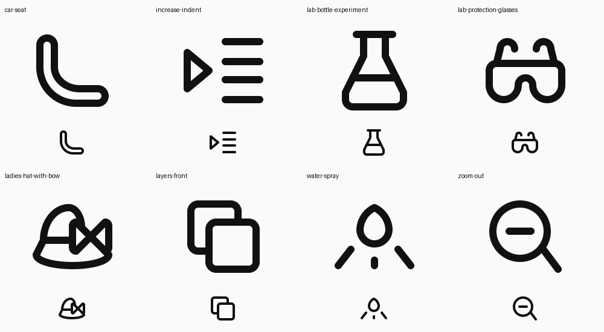
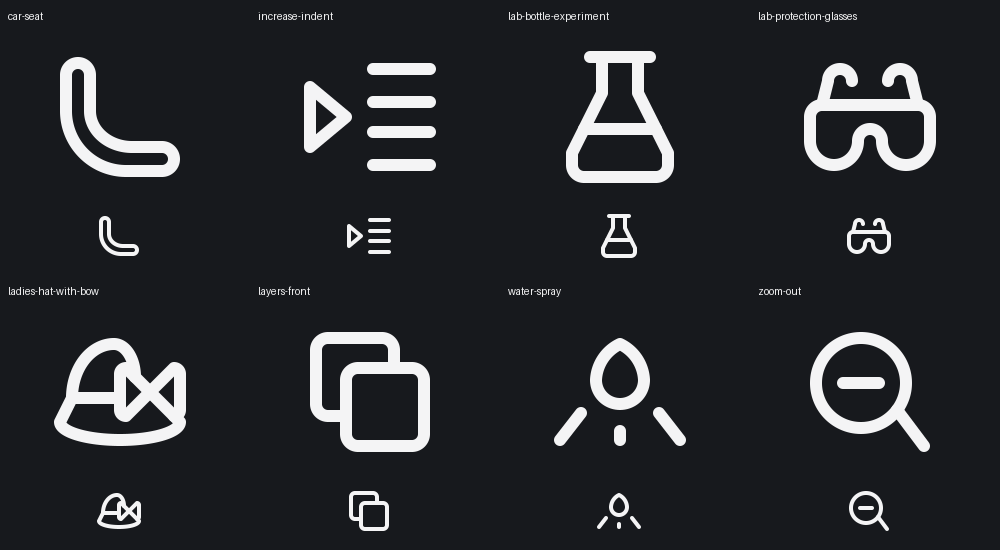

# Eight original icons repaired in place

The eight icons were identified from the live gallery’s Solo / Disapproved / Bad stroke drawn filter. Live feedback was checked for each icon; all eight entries say “Bad stroke drawn” without further notes or reference images.

The existing Python modules, source UUIDs, icon IDs and export paths were retained. No new variant was created. Geometry is authored by `gpt-6` on SOLO48: 48 × 48, stroke 4, integer coordinates, round caps and joins. All exports were generated from their Python models.

| Original icon | Keyshape and fit | Repair and reference |
| --- | --- | --- |
| car-seat | SQUARE; fits the upright back and long cushion | Rebuilt the seat as a continuous contour with tangent transitions and a round cushion nose. Straightened the inner back to remove its abrupt transition. Lucide `armchair` informed the upholstery contour. |
| increase-indent | HRECT_L; accommodates marker and text rows | Removed the fragmented marker tip; retained the triangular marker and four aligned rows, with mirrored integer spacing. Lucide `list-indent-increase` informed clear rules and directional construction. |
| lab-bottle-experiment | VRECT_L; preserves the tall flask | Rebuilt a symmetric neck and base with clean corners and exact liquid-line junctions. Replaced the crowded enclosed lip with one rim stroke. Lucide `flask-conical` informed the rim, continuous bottle and liquid line. |
| lab-protection-glasses | HRECT_L; fits the wide lens and arms | Replaced short irregular segments with a smooth protective lens, rounded nose recess and mirrored temple hooks. Lucide `glasses` informed paired arms and shared radii; the supplied reference retains the single safety lens. |
| ladies-hat-with-bow | HRECT_L; fits crown, wide brim and side bow | Removed crown strokes crossing the bow, rounded the loop corners and joined the band/brim at actual contacts. The side bow intentionally makes the hat asymmetric. Lucide `hat-glasses` informed the geometric crown/brim treatment; the original reference supplies the bow. |
| layers-front | SQUARE; fits two offset equal squares | Rebuilt equal rounded squares with a shared radius and clean occlusion contacts. Lucide `copy` informed coherent rounded contours. The offset is deliberately directional. |
| water-spray | HRECT_L; fits droplet and spreading rays | Replaced the triangular droplet shoulders with mirrored curves and preserved the existing three spray marks. Lucide `droplet` informed the pointed, curved silhouette. |
| zoom-out | SQUARE; balances circular lens and diagonal handle | Removed the kinked two-segment handle; rebuilt a circular lens, centered minus and one straight handle with an exact perimeter attachment. Lucide `zoom-out` informed this construction. The handle is intentionally asymmetric. |

Local Lucide originals and atomic-debug drawings were inspected alongside the eight supplied source SVGs. The emitted repairs were visually checked at native 48 px and enlarged in light and dark themes.

## Validation

- All eight `validate_icon()` reports are `valid`, with zero warnings.
- Final build QA passes for all eight, including spacing, symmetry and negative-space checks, with no errors or warnings.
- The targeted solo build exits 0; all eight original IDs are in `dist/solo48/manifest.json`.
- Every exported SVG matches its current Python model exactly.
- All 68 focused tests pass for primitives, profiles/keyshapes, parallel spacing, internal spacing and symmetry (`geometry-tests-unrestricted.log`).
- Full repository discovery was attempted with fail-fast: 16 tests ran before an unrelated existing avatar assertion failed for `bandana-pirate-beside-cutlass` (`test_all_avatars_export_at_48_with_touching_circular_faces`). That module was not edited. Details are in `tests-unrestricted.log`. The initial sandboxed attempt could not open the local server needed by integration tests; the rerun had server access.

These are local source and build changes. No remote deployment or review-status update was performed.

## Visual evidence

