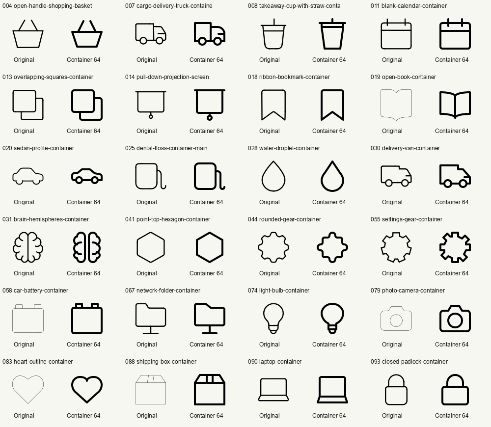
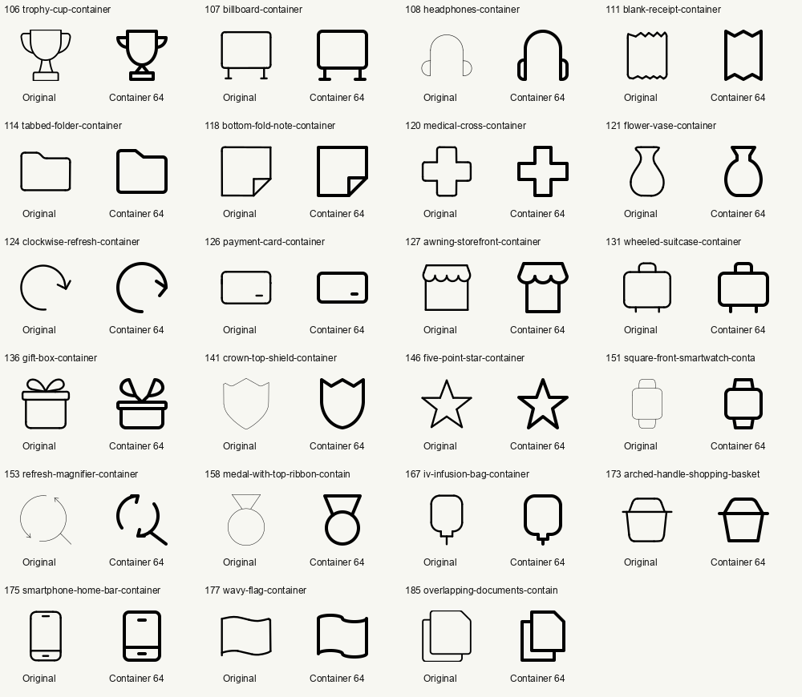

# Container main completion

The container progression view maps 193 source mains to 174 native container drawings: 47 newly authored drawings and 127 reused drawings. Two open-book references share one newly authored model. The source IDs and solo artwork are preserved; these mappings apply only to the main role in container combinations.

New artwork was reconstructed from rendered source references directly on CONTAINER64 (64×64, stroke 4, integer grid). Lucide originals and atomic-debug sheets informed the constructions. No solo geometry was scaled. The shared human reference was inspected; the only new anatomical subject is a brain, with no detached head/body gap. Existing teacher and hand drawings were reused.

All new drawings were reviewed at native size in light and dark themes. Subject features were retained while tiny teeth, irregular source contours, and narrow connections were simplified as described below. Directional objects retain intentional asymmetry. Keyshape extremes and measured hosting outcomes are recorded in each module.

## New artwork

| Container | Keyshape | Construction and reduction | Lucide | Hosting samples that pass |
|---|---|---|---|---|
| open-handle-shopping-basket | HRECT_XL | One trapezoid with two mirrored open handle strokes; omit basket lattice absent from source. | shopping-basket | check |
| cargo-delivery-truck-container | HRECT_L | Cargo rectangle and curved cab above two shared-radius wheel circles; deliberately directional. | truck | heart, check |
| takeaway-cup-with-straw-container | VRECT_XL | Tapered cup, broad rim band and centered straight straw; no invented liquid decoration. | cup-soda | plus |
| blank-calendar-container | SQUARE | Rounded page with two equal binding posts and a header rule; shared x positions. | calendar | check |
| overlapping-squares-container | SQUARE | Front rounded square occludes the rear outline; retain offset and equal proportions. | squares-exclude | plus, check |
| pull-down-projection-screen | SQUARE | A hanging rectangular screen with extended top rail and central pull ring. Calendar informs straight header construction. | calendar | None |
| ribbon-bookmark-container | VRECT_L | Single rounded-top vertical ribbon with centered V notch; mirrored corners. | bookmark | plus, check |
| open-book-container | HRECT_XL | Two mirrored bowed page leaves sharing a central spine; preserve open book without text. | book-open | plus, heart, check |
| sedan-profile-container | HRECT_S | Side-view cabin with sloping shoulders and two wheel arches; directional profile retained, Lucide informs wheel circles. | informs wheel circles.
Keyshape HRECT_S; extremes are the profile's exact keyshape bounds.
Reference: pictographic-primitives/transportation/car_1fdb13eb-bc4d-44a6-bca4-d87dd2adb768.svg.  | plus, heart, check |
| dental-floss-container-main | HRECT_XL | Rounded floss case plus a continuous trailing thread on the right; folder informs rounded casing only. | folder | plus, check |
| water-droplet-container | VRECT_L | Mirrored pointed drop with two broad tangent lower arcs; no internal symbol. | droplet | check |
| delivery-van-container | HRECT_L | One stepped roof silhouette and two shared-radius wheels. Cargo van keeps a unified body. | truck | None |
| brain-hemispheres-container | VRECT_XL | Two mirrored lobed hemispheres separated by a central fissure; four broad lobes per side, no detached head or body. | brain | heart, check |
| point-top-hexagon-container | VRECT_XL | One point-top hexagonal enclosure with mirror-derived vertices; keep source orientation. | container | plus, heart, check |
| rounded-gear-container | SQUARE | Eight repeated rounded teeth around a circular enclosure; one continuous outline, no hub absent from source. | cog | plus, heart |
| settings-gear-container | SQUARE | Eight square-ended teeth on a single rotational outline; omit hub absent from the reference. | cog | plus, heart, check |
| car-battery-container | SQUARE | Rectangular battery housing and two matching terminal tabs; no charge glyph. | battery-charging | plus, heart, check |
| network-folder-container | SQUARE | A tabbed folder stands on a centered network stem and foot; preserve the source support. | folder | plus |
| light-bulb-container | VRECT_L | Round globe flows into a narrow base with two bands; mirrored shoulders preserve the bulb. | lightbulb | plus |
| photo-camera-container | HRECT_XL | Rounded body, raised central top and circular lens; preserve the lens as intrinsic detail. | camera | None |
| heart-outline-container | HRECT_XL | Two circular lobes flow into broad lower shoulders and a central pointed base; symmetric enclosure. | heart | heart, check |
| shipping-box-container | SQUARE | Front box with shallow trapezoid top and two tape seams; the reference is frontal, not isometric. | package | plus |
| laptop-container | HRECT_XL | Rounded upright screen and flared base share the screen lower edge; no keyboard detail in source. | laptop | plus |
| closed-padlock-container | VRECT_XL | Rounded lock body and semicircular shackle, centered on a shared axis; no keyhole in source. | lock | check |
| trophy-cup-container | SQUARE | Symmetric deep cup, two loop handles, flared stem and plinth; preserve all trophy features. | trophy | plus, heart |
| billboard-container | SQUARE | A large rounded sign panel supported by two equal posts and feet. | calendar | None |
| headphones-container | SQUARE | One semicircular headband connects two rounded ear cups; bilateral symmetry. | headphones | plus, heart, check |
| blank-receipt-container | VRECT_L | Blank vertical receipt with repeating equal tear teeth at both ends; no currency text. | receipt | plus, heart, check |
| tabbed-folder-container | HRECT_XL | Single rounded folder silhouette with a raised left tab, no lower sleeve. | folder | check |
| bottom-fold-note-container | SQUARE | Square note with a folded lower-right corner; diagonal intentionally asymmetric. | file-stack | plus, check |
| medical-cross-container | SQUARE | Single equal-armed cross outline with arm width twenty; mirror both axes. | cross | plus, check |
| flower-vase-container | VRECT_L | Narrow open neck expands into a rounded pear-shaped vase; ellipse shoulders share an axis. | droplet | None |
| clockwise-refresh-container | CIRCLE | Circular clockwise arrow with a broad open lower-right gap; retain source direction. | refresh-cw | plus |
| payment-card-container | HRECT_M | Rounded horizontal payment card with one short lower-right mark; no magnetic band in source. | credit-card | check |
| awning-storefront-container | SQUARE | Tapered canopy with three equal scallops above a rectangular shop opening. | store | None |
| wheeled-suitcase-container | SQUARE | Rounded suitcase, centered handle and two matching short wheels. | luggage | check |
| gift-box-container | SQUARE | Two mirrored bow loops attach to a horizontal lid above a rounded box; no unrequested ribbons. | gift | heart, check |
| crown-top-shield-container | VRECT_XL | Crown-like upper edge joins one broad pointed shield bowl; keep the interior blank as in source. | cross | plus, heart, check |
| five-point-star-container | SQUARE | One five-point outline, mirrored about the vertical axis; no inner symbol. | star | check |
| square-front-smartwatch-container | VRECT_L | Front rounded-square watch face between equal strap ends; no hands absent from source. | watch | check |
| refresh-magnifier-container | SQUARE | A magnifying handle attaches to an open circular pair of refresh arrows; preserve the two directional heads. | refresh-cw | None |
| medal-with-top-ribbon-container | VRECT_L | Circular medal below a triangular folded neck ribbon; shared horizontal axis, no award glyph. | trophy | None |
| iv-infusion-bag-container | VRECT_L | Rounded bag shoulder and bottom outlet nozzle with a short delivery tube; no medical glyph. | battery-charging | plus, heart, check |
| arched-handle-shopping-basket | HRECT_XL | A tapered basket and one continuous arched handle over an extended rim; no lattice absent from source. | shopping-basket | plus, heart, check |
| smartphone-home-bar-container | VRECT_L | Rounded smartphone with bottom bezel, top earpiece and centered home bar; shared central axis. | smartphone | plus |
| wavy-flag-container | HRECT_XL | Two matching smooth wave edges joined by upright sides; no pole beyond the source flag. | flag | plus, heart, check |
| overlapping-documents-container | VRECT_XL | Front clipped-corner document with a partially hidden rear sheet; asymmetric overlap retained. | file-stack | plus, check |

The generation and remapping use AUTHOR `gpt-6`, already present in this repository.

## Verification

- Container build succeeded: all 209 container-family drawings exported, zero failures.
- Published mapping audit: 2,709 combinations, 193 source mains, 174 distinct container drawings, zero missing/wrong-family/unvalidated/broken-preview mappings.
- Browser verified the live page shows “Main · Container 64px” with the new and reused container artwork.
- Four focused catalog tests and the frontend family/progress regression checks pass.

See `build.log`, `validation-and-hosting.json`, `coverage-verification.json`, and `tests.log` for raw results. Targeted Python catalog tests and JavaScript family/progress tests pass. The full repository suite was attempted and stopped after repeated failures/errors in the wider suite; it did not complete and is not green. Its partial output is preserved in tests.log. The container export and focused remapping tests completed successfully.

## Native previews

Final integrity check: all 47 new published SVGs exactly match their current Python models. A focused wider-suite diagnostic reproduced `PermissionError: Operation not permitted` while binding a test HTTP server; see `test-environment-check.log`. The broader suite was not rerun or claimed to pass.
