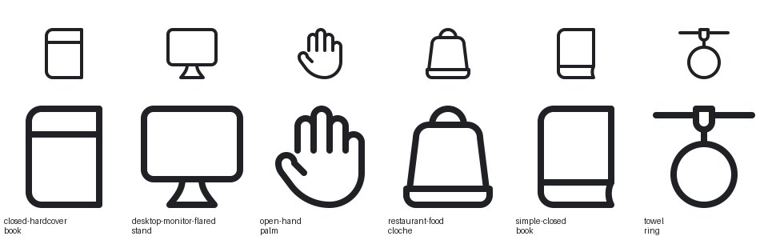
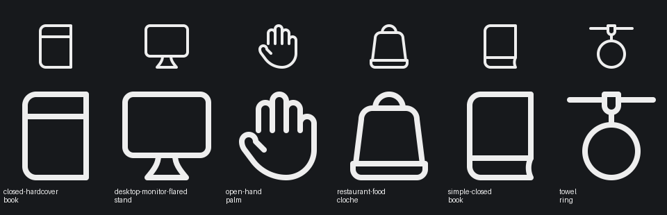

# Container repairs — 16 September 2026

Fixed the six icons supplied in `icon_set/dist/failed/container64/` directly in their existing Python modules. No validator, profile, tolerance or hand-written SVG changes.

| Icon | Keyshape | Repair | Lucide construction | Hosting that passes |
| --- | --- | --- | --- | --- |
| [closed-hardcover-book](../../model/icons/container/closed_hardcover_book.py) | VRECT_L | Removed the doubled inner spine curl; kept the rounded outer binding and top page band. | book | plus |
| [desktop-monitor-flared-stand](../../model/icons/container/desktop_monitor_flared_stand.py) | SQUARE | Kept mirrored flared curves and removed the pinched rolled foot lip. | monitor | plus |
| [open-hand-palm](../../model/icons/container/open_hand_palm.py) | VRECT_XL | Opened the thumb web while preserving all five digits and staggered finger heights. | hand | heart |
| [restaurant-food-cloche](../../model/icons/container/restaurant_food_cloche.py) | VRECT_XL | Removed the duplicate cover bottom; the tray rim supplies the shared edge once. | concierge-bell | heart, check |
| [simple-closed-book](../../model/icons/container/simple_closed_book.py) | VRECT_L | Simplified the overlapping inner binding curl into one junction; kept the recessed page edge. | book | check |
| [towel-ring](../../model/icons/container/towel_ring.py) | SQUARE | Lengthened the hanger and reduced the ring radius to separate it from the bracket. | circle | plus, heart |

The vertical keyshapes preserve the books, raised hand and tall cover proportions. The square keyshape fits the screen and pedestal together, and the wide towel bar above its ring. Books retain their asymmetric binding; the hand retains its natural thumb and finger asymmetry. Other paired shapes remain centered.

Each listed Lucide original was rendered and viewed, and its atomic-debug geometry was inspected. The supplied failed SVGs were also rendered and inspected. The shared full-body human reference was inspected for the hand; detached-head spacing does not apply to an isolated hand.

All six models validate with zero warnings. The container build succeeds and the failed container manifest is empty. Hosting was measured with `compose.py` for plus, heart and check; omitted symbols do not pass. Light and dark previews were reviewed at 64 pixels, with larger renders for curve inspection. The Python metadata now uses `AUTHOR = "gpt-6"`; the supplied manifest IDs and SVG paths are recorded.

Full repository test run: **435 tests; 21 failures, 36 errors, 1 skipped**. Failures include unrelated avatar exports, stale generated skills, missing reference files and build/QA fixtures. None of the six repaired IDs appears among the test failures. This is not a green full-suite result. See [test log](tests.log) and [successful container build log](build.log).
