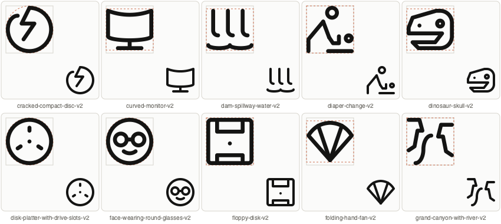
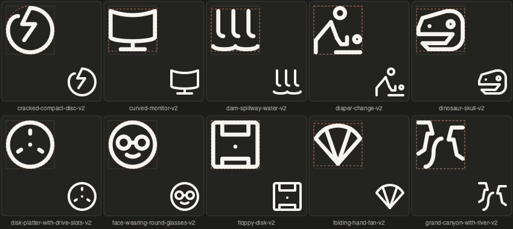

# Solo batch 03 revisions

All ten revisions pass validate_icon() with zero warnings and the build-time negative-space checks. Native-size light and dark previews were inspected. Author metadata: gpt-6. Parent modules and SVGs were verified byte-identical.

| Variant | Keyshape | Change | Construction reference |
|---|---|---|---|
| [cracked-compact-disc-v2](/Applications/Workspaces/pictographic/claude_skills/icon_set/model/icons/solo/cracked_compact_disc_v2_35902389_7674_5992_88ac_62b704c11f7f.py) | CIRCLE | Wider opening between rim and crack; retained asymmetric damage. | Lucide disc: circular rim. |
| [curved-monitor-v2](/Applications/Workspaces/pictographic/claude_skills/icon_set/model/icons/solo/curved_monitor_v2_588496c1_7ce3_521d_af0b_e0c4cec28e66.py) | HRECT_XL | Continuous bowed screen edges and a simpler central stand. | Lucide monitor: screen, stem and base. |
| [dam-spillway-water-v2](/Applications/Workspaces/pictographic/claude_skills/icon_set/model/icons/solo/dam_spillway_water_v2_6e9836ef_b3e3_41e7_819a_f79c721f25ec.py) | HRECT_XL | Reduced four falling streams to three. | No useful direct match; retained existing hook construction. |
| [diaper-change-v2](/Applications/Workspaces/pictographic/claude_skills/icon_set/model/icons/solo/diaper_change_v2_ca21559b_4869_40c1_bb54_eb0998bb59fb.py) | SQUARE | Removed the triangular hip detail and simplified the reaching arm; retained adult and baby. | No useful direct match; side-view pose stays asymmetric. |
| [dinosaur-skull-v2](/Applications/Workspaces/pictographic/claude_skills/icon_set/model/icons/solo/dinosaur_skull_v2_f8b2772e_1a7e_4a46_b432_a5aa1ea004a8.py) | HRECT_XL | Expanded the mouth opening and increased overall height to retain jaw thickness. | No useful direct match; left-facing anatomy stays asymmetric. |
| [disk-platter-with-drive-slots-v2](/Applications/Workspaces/pictographic/claude_skills/icon_set/model/icons/solo/disk_platter_with_drive_slots_v2_80af2806_9c69_5162_a492_892383b21556.py) | CIRCLE | Replaced the central ring with a dot. | Lucide disc: circular rim and centered hub. |
| [face-wearing-round-glasses-v2](/Applications/Workspaces/pictographic/claude_skills/icon_set/model/icons/solo/face_wearing_round_glasses_v2_44a429e7_b8bc_58df_94d2_a0236dce12a0.py) | CIRCLE | Enlarged both lens radii from 5 to 6 and lowered their centers by one unit. | Lucide glasses: matched circular lenses and bridge. |
| [floppy-disk-v2](/Applications/Workspaces/pictographic/claude_skills/icon_set/model/icons/solo/floppy_disk_v2_48975063_b353_533e_ada8_826f1f506264.py) | SQUARE | Replaced the central circle with a dot. | Preserved parent disk construction; no additional reference needed. |
| [folding-hand-fan-v2](/Applications/Workspaces/pictographic/claude_skills/icon_set/model/icons/solo/folding_hand_fan_v2_e42cbce0_9cff_57ad_9095_13c8d5b279a0.py) | HRECT_XL | Removed the center rib, retaining two inner ribs. | No useful direct match; retained the broad symmetric fan silhouette. |
| [grand-canyon-with-river-v2](/Applications/Workspaces/pictographic/claude_skills/icon_set/model/icons/solo/grand_canyon_with_river_v2_021a0b5f_bd2d_4f08_b36b_7afe509eb0fc.py) | SQUARE | Removed the sun and detached ridge; two stepped canyon walls frame a smooth winding river. | Lucide mountain: reduced landscape silhouette; asymmetric cliffs suit the canyon. |

Keyshapes preserve the parents’ circular, square or wide proportions, except the skull: HRECT_XL adds room for its wider mouth. These are independent variants with source UUIDs and parent links; no approval or parent review status was changed.

## Release verification

The full family build result is recorded separately. The first full suite run encountered repository-wide errors, sandbox socket restrictions, missing exports, and an intermediate canyon revision that has since been repaired. Final per-icon checks for this batch pass.

Variant-specific unit tests: 5 passed. Final individual batch validation: 10 valid, zero warnings.

Final release outcome: the family build reported 11 invalid icons in its loaded snapshot. One was the intermediate canyon revision, which was repaired and revalidated; the other ten belong to other batches. Examples: anteater-v2 has duplicate contour ownership of hind-leg-1; howling-wolf-v2 references unknown element neck; pelican-on-water-v2 has five undersized holes. The build was interrupted during subsequent diagnostics of unselected families, after it had already failed the solo release gate. No successful shared-manifest publication is claimed. See [build log](build.log) and [full test log](tests.log).

The ten SVGs alongside this report were generated directly from the individually validated final Python models for review. The new variants remain unapproved. Publication to the shared gallery / Ready listing remains blocked until the other family failures are resolved and a successful family build runs.
