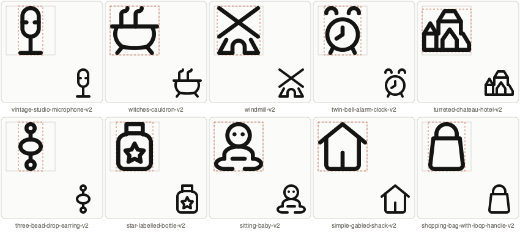
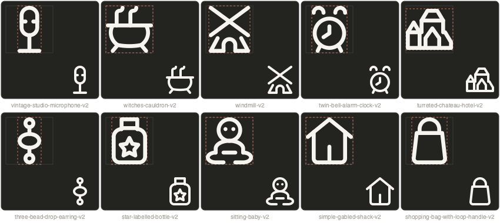

# Batch 06 revisions

Ten independent variants; parent files and exports preserved. Author: `gpt-6` (existing repository label).

| Variant | Keyshape | Change | Python |
|---|---|---|---|
| `vintage-studio-microphone-v2` | VRECT_S | Removed the upper and lower pairs of grille bars; retained the middle pair. | [Module](/Applications/Workspaces/pictographic/claude_skills/icon_set/model/icons/solo/vintage_studio_microphone_v2.py) |
| `witches-cauldron-v2` | SQUARE | Extended both steam strokes to shared endpoints on the pot rim. | [Module](/Applications/Workspaces/pictographic/claude_skills/icon_set/model/icons/solo/witches_cauldron_v2_0575da1b_6796_47d7_acc0_06fde95480bb.py) |
| `windmill-v2` | VRECT_XL | Moved outer pillars outward by 3 units on each side. | [Module](/Applications/Workspaces/pictographic/claude_skills/icon_set/model/icons/solo/windmill_v2_95c449a5_8e44_5a99_9486_caf1e3e38105.py) |
| `twin-bell-alarm-clock-v2` | VRECT_L | Moved bells inward and reduced their radius from 6 to 5 to preserve clearance. | [Module](/Applications/Workspaces/pictographic/claude_skills/icon_set/model/icons/solo/twin_bell_alarm_clock_v2_98b1d263_4f9a_58b5_896b_b1337e997d62.py) |
| `turreted-chateau-hotel-v2` | HRECT_XL | Aligned wing eaves, regularized roof rises, and removed the extra right-wing dividing line. Deliberate asymmetry preserves the chateau massing. | [Module](/Applications/Workspaces/pictographic/claude_skills/icon_set/model/icons/solo/turreted_chateau_hotel_v2_d4c1285a_03ff_4854_95de_453b55fedb44.py) |
| `three-bead-drop-earring-v2` | VRECT_S | Enlarged the end circles from radius 3 to 4; made the center bead oval to retain spacing. | [Module](/Applications/Workspaces/pictographic/claude_skills/icon_set/model/icons/solo/three_bead_drop_earring_v2_591f9997_10dd_5172_97f4_64f26187164d.py) |
| `star-labelled-bottle-v2` | VRECT_L | Increased the cap opening height from 6 to 9 units. | [Module](/Applications/Workspaces/pictographic/claude_skills/icon_set/model/icons/solo/star_labelled_bottle_v2_e0f7f6c1_f633_5b90_9f71_aac0f4ec1dce.py) |
| `sitting-baby-v2` | SQUARE | Simplified the seated body, removed closed foot loops and extra diaper curves, and added two eyes. | [Module](/Applications/Workspaces/pictographic/claude_skills/icon_set/model/icons/solo/sitting_baby_v2_10921a97_46e3_5bea_b3ba_ce5691a7278c.py) |
| `simple-gabled-shack-v2` | SQUARE | Replaced the rectangular doorway with one central vertical line. | [Module](/Applications/Workspaces/pictographic/claude_skills/icon_set/model/icons/solo/simple_gabled_shack_v2_cd9c0657_6aff_57d0_8690_7456cf464da0.py) |
| `shopping-bag-with-loop-handle-v2` | VRECT_L | Trimmed the handle strokes to end at the bag rim. | [Module](/Applications/Workspaces/pictographic/claude_skills/icon_set/model/icons/solo/shopping_bag_with_loop_handle_v2_e058f399_32d7_55f0_a75e_23168e8b2b79.py) |

Keyshapes preserve the original subject proportions; the alarm clock changes to VRECT_L because its bells now sit closer together.

Construction references inspected: Lucide cooking-pot (rim joins), alarm-clock (paired bells around a circular face), castle (clear architectural divisions), baby (minimal eyes in a large head), house (continuous walls), shopping-bag (simple handle), and mic-vocal (coherent rounded microphone contours). No useful exact Lucide match was needed for the windmill, earring, or decorative bottle; their parent silhouettes guided the targeted revisions.

Validation: all ten variants pass the complete per-icon QA (including enclosed holes and pinches) with zero errors or warnings. Both native-size themes reviewed. All 16 variant and review-workflow tests pass. Parent Python files and SVG exports verified byte-identical.

The full suite ran 276 tests: 109 failures, 17 errors, one skip. Findings include exports awaiting concurrent family builds, stale generated skill files, a missing original smartwatch reference, sandbox-blocked server tests, and two existing gallery test-fixture JSON errors. The relevant server tests pass when local server access is enabled. The requested full family build finished with one unrelated failure: `pelican-on-water-v2` has five undersized holes. A concurrent family build published all ten batch variants; every published SVG was checked byte-for-byte against its model and every manifest record is valid. Parent files and exports remain unchanged. No review statuses were modified; new variants use the gallery’s default Ready state.
