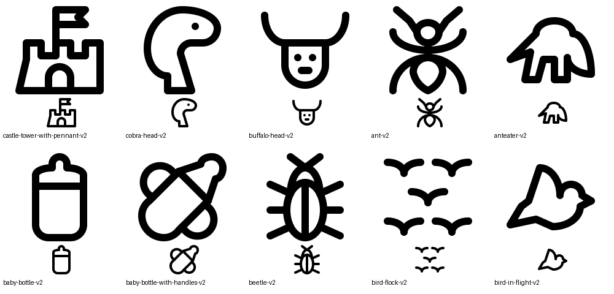
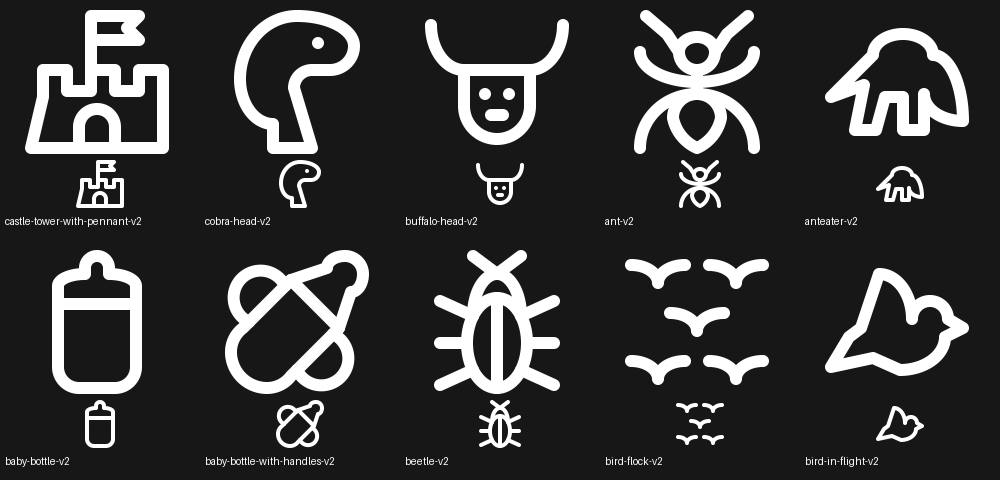

# Batch 08 feedback revisions

Ten independent solo variants; originals preserved. All use AUTHOR `gpt-6`, with the original source IDs and paths retained.

Each variant passed validation with no warnings and the additional build-time hole/pinch checks. Reviewed enlarged and at 48 pixels in light and dark themes.

## Revisions

### castle-tower-with-pennant-v2

Castle tower: vertical right wall and square base corner. SQUARE (2,2)-(46,46). Lucide castle informs rectilinear masonry. Original left batter and pennant retain asymmetry.

[Python module](/Applications/Workspaces/pictographic/claude_skills/icon_set/model/icons/solo/castle_tower_with_pennant_v2_033da33f_ea2d_58ce_a57c_5cffb7818dd9.py)

### cobra-head-v2

Side-facing cobra head with flared hood and a single eye. VRECT_XL (5,2)-(43,46). Removed coil and tail clutter. No useful exact Lucide match; intentional profile asymmetry.

[Python module](/Applications/Workspaces/pictographic/claude_skills/icon_set/model/icons/solo/cobra_head_v2_722cb33f_03cc_5935_ab1a_86a1ade0a234.py)

### buffalo-head-v2

Frontal buffalo: broad brow, rounded jaw, mirrored upturned horns, eyes and muzzle. HRECT_XL (2,5)-(46,43). Removed pinched chin. No useful exact Lucide match.

[Python module](/Applications/Workspaces/pictographic/claude_skills/icon_set/model/icons/solo/buffalo_head_v2_dfa6681e_c282_4464_9e3f_8da4256d4f83.py)

### ant-v2

Ant with the middle left and right leg lines removed as requested. VRECT_XL (5,2)-(43,46). Lucide bug informs mirrored attachments; retained parent antennae, head and abdomen.

[Python module](/Applications/Workspaces/pictographic/claude_skills/icon_set/model/icons/solo/ant_v2_4dc29185_dc5f_4ffe_94d4_dbda6690888c.py)

### anteater-v2

Side-view anteater with long pointed snout, two visible legs and bushy tail. HRECT_L (2,8)-(46,40). Removed anonymous dome silhouette and overlapping detail. No useful exact Lucide match; intentional profile asymmetry.

[Python module](/Applications/Workspaces/pictographic/claude_skills/icon_set/model/icons/solo/anteater_v2_b8e192b8_9278_5d94_943f_c50ada364cfe.py)

### baby-bottle-v2

Baby bottle with teat shoulders extended to both body sidewalls. VRECT_M (11,2)-(37,46). Mirrored elliptical shoulders preserve the nipple and rounded body; no detail omitted. No additional useful Lucide match.

[Python module](/Applications/Workspaces/pictographic/claude_skills/icon_set/model/icons/solo/baby_bottle_v2_017fdfd5_cc7b_55c1_97bd_dfe302867ff9.py)

### baby-bottle-with-handles-v2

Diagonal handled baby bottle: teat meets both body corners. SQUARE (2,2)-(46,46). Preserves handles, tilt and nipple; no detail omitted. No additional useful Lucide match.

[Python module](/Applications/Workspaces/pictographic/claude_skills/icon_set/model/icons/solo/baby_bottle_with_handles_v2_46fff59c_84bf_4526_bd9b_33201133c81c.py)

### beetle-v2

Beetle with true elliptical wing case and exact shared attachment points. VRECT_XL (5,2)-(43,46). Lucide bug informs bilateral legs and central seam; replaced straight body sides and pinched base.

[Python module](/Applications/Workspaces/pictographic/claude_skills/icon_set/model/icons/solo/beetle_v2_82fb3003_56b5_5594_a35c_f4552fbc42d8.py)

### bird-flock-v2

Five flying birds, each exactly two joined curved wings. HRECT_XL (2,5)-(46,43). Removed miniature heads, bellies and angular wing segments. Lucide bird informed reduction, but no useful exact flock match.

[Python module](/Applications/Workspaces/pictographic/claude_skills/icon_set/model/icons/solo/bird_flock_v2_b7c1e75f_5c89_447a_8fb6_cc3765f450b1.py)

### bird-in-flight-v2

Flying bird with raised wing, round head, short beak and broad tail. HRECT_L (2,8)-(46,40). Lucide bird informs a coherent body arc and clear beak; removed extra feather notches. Intentional flight-profile asymmetry.

[Python module](/Applications/Workspaces/pictographic/claude_skills/icon_set/model/icons/solo/bird_in_flight_v2_cc0d19d9_4136_5987_afa8_f2b8cb1ad36b.py)

## References

Reviewed supplied parent SVGs for all ten subjects, and local Lucide originals plus atomic-debug geometry for `castle`, `bug`, and `bird`. These informed masonry construction, insect attachments, and coherent bird contours. Cobra, buffalo, and anteater have no useful exact Lucide match.

## Verification

All ten parent Python modules and ten parent SVGs match their pre-edit SHA-256 hashes. No approval or parent review-status changes were made. New variants default to Ready.

Full repository tests: 276 run, 110 failures, 17 errors, 1 skipped. The run preceded the rebuild and includes missing variant exports from several simultaneous batches, blocked local-server bindings, stale generated skills, existing build-test fixture errors, and a missing smartwatch reference. Batch-specific validation passes.

Variant infrastructure tests: 5 passed.

Full solo build: **passed (exit 0), 680 icons exported**. All ten variants are present in the solo manifest, match their current model SVGs exactly, and carry valid status without warnings. All 20 parent files were rechecked after export and remain byte-identical.
