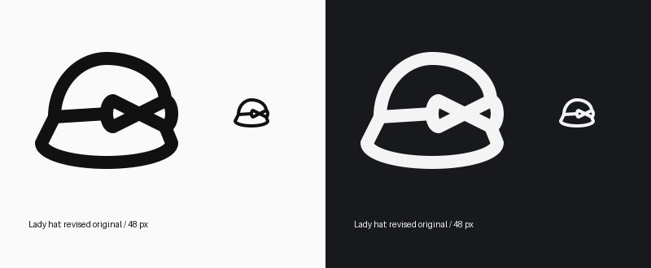

# Bow alignment correction

Revised the existing `ladies-hat-with-bow` module and ID in place. The bow’s upper-left and lower-right strokes are exactly collinear through their shared knot: (26,21) → (34,25) → (42,29). The mirrored diagonal follows the same construction. The outer loop ends retain their rounded elliptical arcs. Crown, brim, band, source metadata, keyshape and author are unchanged.

The original hat source and previously inspected Lucide hat construction remain the references. No features were removed; the side ribbon retains the intentional asymmetry. HRECT_L continues to accommodate the wide hat on SOLO48.

The revised icon is visually checked at native size in light and dark themes. `validate_icon()` is valid and per-icon build QA passes without errors or warnings. A direct cross-product and shared-endpoint check confirms exact collinearity. No new variant, remote deployment or review-state update.

