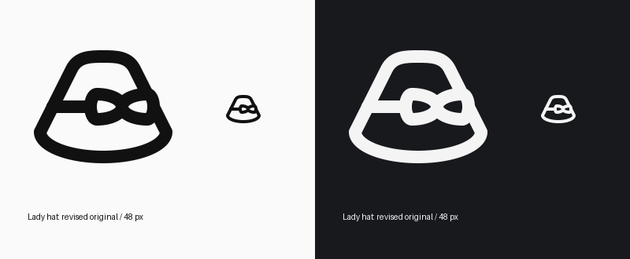

# Corrected hat outline

The requested collinearity applies to the hat body, not the bow. Restored the rounded bow from before the mistaken alignment edit, preserving all arc radii, sweep directions and relative coordinates. Translated it four units left and one unit upward to fit the corrected hat and maintain clearance above the brim.

The hat is constructed symmetrically about x=24. Its left side follows (14,12) → (8,24) → (4,32); the right side is the exact mirror. The ribbon hides a portion of the right side. The upper and lower visible segments remain exactly collinear. Mirrored crown curves meet those straight sides tangentially, and the lower brim consists of mirrored ellipse quadrants. The band is horizontal.

SOLO48, HRECT_L, centerline extrema (4,8)–(44,40), stroke 4. The original source's hat/brim/bow features and previously inspected Lucide construction reference are retained. No feature was dropped. Existing icon ID, Python module and source UUID remain unchanged; no variant was created.

Verified both side-line cross-products are zero, crown control points are exact mirrors, and every bow primitive matches the accepted rounded version after the stated translation. `validate_icon()` is valid with no warnings; full per-icon QA passes with no errors or warnings. Visually checked at native size in light and dark themes.

Local source and build changes only. No remote deployment or review-state change.

