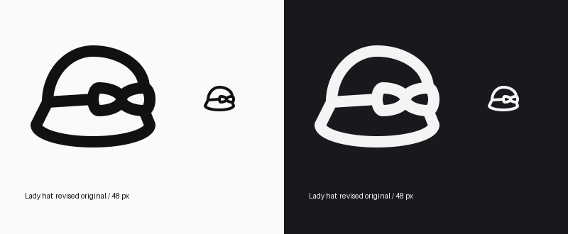

# Lady hat: second in-place repair

Preserved `ladies-hat-with-bow`, its original Python module, UUID and export path. No variant was created. Authorship remains `gpt-6`.

The previous narrow crown and large triangular bow were replaced by a broad crown and smaller rounded ribbon loops. Both loops derive from one mirrored elliptical construction. The hat band meets the loop edge, and the crown and brim end at actual bow contacts. The brim stays broad and curved. The asymmetric right crown is intentionally occluded by the side ribbon.

The original source provides the cloche silhouette, curved brim and side bow. The previously inspected Lucide `hat-glasses` reference informs simplified crown/brim construction. No identifying feature was removed. The retained HRECT_L envelope suits the wide hat: centerline bounds (4, 8)–(44, 40), on SOLO48 with stroke 4.

Compared compact and taller angular bows at native size; the rounded compact bow avoids both oversized triangular loops and the previous pinched crown. Reviewed the final drawing at 48 pixels and enlarged in light and dark themes.

Final `validate_icon()` is valid with zero warnings. Full per-icon build QA passes, including internal spacing and negative space, with zero errors or warnings. `qa.json` records the exact final SVG. The full repository suite was not repeated: the earlier run encountered an unrelated avatar assertion, while its 68 focused tests passed; this repair changes only this icon's geometry.

Local changes only; no remote deployment or review-status mutation.

