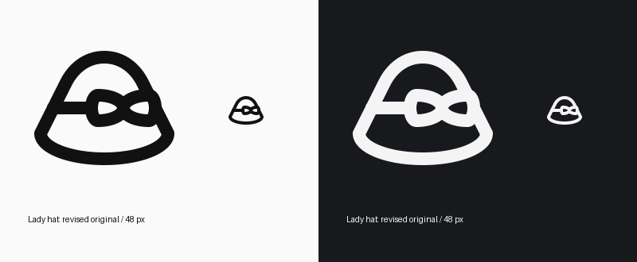

# Rounded crown refinement

Deepened the crown's mirrored curves to restore a soft, rounded cloche profile. The lower shoulder starts at (12,16), with control points (14,12) and (18,8) leading to the top at (24,8); the right curve is its exact reflection. The curve joins remain tangent to the straight sides, which continue collinearly into the brim.

The bow, brim and band geometry are unchanged from the previous accepted alignment revision. No new variant was created: the original module, icon ID, source UUID and HRECT_L keyshape remain in use. The wide hat still occupies SOLO48 with stroke 4 and centerline extremes (4,8)–(44,40).

The supplied original provides the rounded cloche silhouette and side bow; the previously inspected local Lucide hat reference remains the construction reference. No feature was omitted. The hat body is symmetrical, with intentional asymmetry only from its side bow and the boundary it hides.

Reviewed at native 48 px and enlarged in both light and dark themes. Validation and per-icon QA pass without errors or warnings. Direct checks confirm mirrored crown controls, collinear sides and unchanged bow/brim/band primitives. See `qa.json` and `build.log` for final evidence.

Local update only; no remote deployment or review-state mutation.

