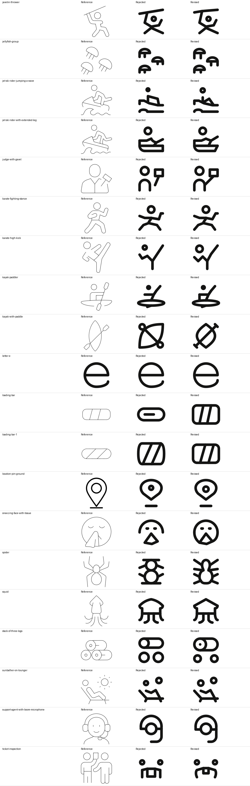

# Primitive fixes · 2026-09-27 · offset 40

All 20 icons were claimed by `thuan-mac-1`, finished as `done`, returned to `Ready`, and passed `validate_icon()` and the full build gate with zero warnings. The production records had no written reviewer feedback for any icon.

| Icon | Rejected drawing versus reference | Revision | Make-ray result and SVG |
| --- | --- | --- | --- |
| `solo/javelin-thrower` | The raised spear and gripping arm sat too low and read as a bar over a gymnast. | Raised the spear and straightened its gripping arm. | [RESULT_DIR](/Applications/Workspaces/pictographic/claude_skills/icon_set/work/primitive-make-ray/b1834755-7ac4-419d-9946-381d945149e1/20260927T101900Z-revision-thuan-mac-1) · [SVG](/Applications/Workspaces/pictographic/claude_skills/icon_set/work/primitive-make-ray/b1834755-7ac4-419d-9946-381d945149e1/20260927T101900Z-revision-thuan-mac-1/javelin-thrower.svg) |
| `solo/jellyfish-group` | The three bells had short, unevenly spaced tentacles. | Lengthened and respaced the tentacles under all three bells. | [RESULT_DIR](/Applications/Workspaces/pictographic/claude_skills/icon_set/work/primitive-make-ray/c9bdc48d-a72f-41ce-9b7a-6a465d1111ed/20260927T101900Z-revision-thuan-mac-1) · [SVG](/Applications/Workspaces/pictographic/claude_skills/icon_set/work/primitive-make-ray/c9bdc48d-a72f-41ce-9b7a-6a465d1111ed/20260927T101900Z-revision-thuan-mac-1/jellyfish-group.svg) |
| `solo/jet-ski-rider-jumping-a-wave` | The tiny rider head and rectangular leg made the rider hard to read. | Enlarged the head and drew a seated bent leg. | [RESULT_DIR](/Applications/Workspaces/pictographic/claude_skills/icon_set/work/primitive-make-ray/1f4f73c6-0617-4a56-8e0e-463dcef59a3a/20260927T101900Z-revision-thuan-mac-1) · [SVG](/Applications/Workspaces/pictographic/claude_skills/icon_set/work/primitive-make-ray/1f4f73c6-0617-4a56-8e0e-463dcef59a3a/20260927T101900Z-revision-thuan-mac-1/jet-ski-rider-jumping-a-wave.svg) |
| `solo/jet-ski-rider-with-extended-leg` | The torso and extended leg crowded the flat rectangular hull. | Lifted the torso and extended leg, then tapered the stern. | [RESULT_DIR](/Applications/Workspaces/pictographic/claude_skills/icon_set/work/primitive-make-ray/6b86716b-ec83-45ca-bdbc-587a83956fb4/20260927T101900Z-revision-thuan-mac-1) · [SVG](/Applications/Workspaces/pictographic/claude_skills/icon_set/work/primitive-make-ray/6b86716b-ec83-45ca-bdbc-587a83956fb4/20260927T101900Z-revision-thuan-mac-1/jet-ski-rider-with-extended-leg.svg) |
| `solo/judge-with-gavel` | The gavel floated beside the judge instead of being held. | Joined the gavel handle to the judge. | [RESULT_DIR](/Applications/Workspaces/pictographic/claude_skills/icon_set/work/primitive-make-ray/1a5b7cc4-9e67-503a-9bf6-f1cf9ac354ce/20260927T101900Z-revision-thuan-mac-1) · [SVG](/Applications/Workspaces/pictographic/claude_skills/icon_set/work/primitive-make-ray/1a5b7cc4-9e67-503a-9bf6-f1cf9ac354ce/20260927T101900Z-revision-thuan-mac-1/judge-with-gavel.svg) |
| `solo/karate-fighting-stance` | The raised guard arm was too flat for the bent defensive pose. | Bent the guard arm toward the source pose. | [RESULT_DIR](/Applications/Workspaces/pictographic/claude_skills/icon_set/work/primitive-make-ray/334bfd33-9625-567b-83fd-5ebd4bb19a97/20260927T101900Z-revision-thuan-mac-1) · [SVG](/Applications/Workspaces/pictographic/claude_skills/icon_set/work/primitive-make-ray/334bfd33-9625-567b-83fd-5ebd4bb19a97/20260927T101900Z-revision-thuan-mac-1/karate-fighting-stance.svg) |
| `solo/karate-high-kick` | The head was tiny and the high kick was one straight branch. | Enlarged the head and added a clear knee bend. | [RESULT_DIR](/Applications/Workspaces/pictographic/claude_skills/icon_set/work/primitive-make-ray/8ec365ec-24ce-4d98-9b7f-1d62e79035fa/20260927T101900Z-revision-thuan-mac-1) · [SVG](/Applications/Workspaces/pictographic/claude_skills/icon_set/work/primitive-make-ray/8ec365ec-24ce-4d98-9b7f-1d62e79035fa/20260927T101900Z-revision-thuan-mac-1/karate-high-kick.svg) |
| `solo/kayak-paddler` | The paddler lacked a visible back above the hull. | Added the paddler’s back above the hull. | [RESULT_DIR](/Applications/Workspaces/pictographic/claude_skills/icon_set/work/primitive-make-ray/c51cc00e-dd9f-440e-8ac5-4fa3309dcf54/20260927T101900Z-revision-thuan-mac-1) · [SVG](/Applications/Workspaces/pictographic/claude_skills/icon_set/work/primitive-make-ray/c51cc00e-dd9f-440e-8ac5-4fa3309dcf54/20260927T101900Z-revision-thuan-mac-1/kayak-paddler.svg) |
| `solo/kayak-with-paddle` | The diagonal loops resembled a propeller more than a boat and paddle. | Rebuilt a pointed hull crossed by a distinct paddle. | [RESULT_DIR](/Applications/Workspaces/pictographic/claude_skills/icon_set/work/primitive-make-ray/7a66c4e2-1e93-4712-9eb5-ab0c546777d9/20260927T101900Z-revision-thuan-mac-1) · [SVG](/Applications/Workspaces/pictographic/claude_skills/icon_set/work/primitive-make-ray/7a66c4e2-1e93-4712-9eb5-ab0c546777d9/20260927T101900Z-revision-thuan-mac-1/kayak-with-paddle.svg) |
| `solo/letter-e` | No original was available; the current e had a tight lower terminal. | Opened and smoothed the lower terminal. | [RESULT_DIR](/Applications/Workspaces/pictographic/claude_skills/icon_set/work/primitive-make-ray/f38bbf0d-ebf5-5541-8ba3-dacda870ad9a/20260927T101900Z-revision-thuan-mac-1) · [SVG](/Applications/Workspaces/pictographic/claude_skills/icon_set/work/primitive-make-ray/f38bbf0d-ebf5-5541-8ba3-dacda870ad9a/20260927T101900Z-revision-thuan-mac-1/letter-e.svg) |
| `solo/loading-bar` | The central dash lost the two slanted divisions of the source. | Restored two slanted track dividers. | [RESULT_DIR](/Applications/Workspaces/pictographic/claude_skills/icon_set/work/primitive-make-ray/a1357f44-093c-4bb6-93d6-7521033c44d2/20260927T101900Z-revision-thuan-mac-1) · [SVG](/Applications/Workspaces/pictographic/claude_skills/icon_set/work/primitive-make-ray/a1357f44-093c-4bb6-93d6-7521033c44d2/20260927T101900Z-revision-thuan-mac-1/loading-bar.svg) |
| `solo/loading-bar-1` | The loading track was too tall and its divisions were uneven. | Widened the track and evened its divisions. | [RESULT_DIR](/Applications/Workspaces/pictographic/claude_skills/icon_set/work/primitive-make-ray/a0e10581-e9da-4ad2-86ee-9fb92f7f28f3/20260927T101900Z-revision-thuan-mac-1) · [SVG](/Applications/Workspaces/pictographic/claude_skills/icon_set/work/primitive-make-ray/a0e10581-e9da-4ad2-86ee-9fb92f7f28f3/20260927T101900Z-revision-thuan-mac-1/loading-bar-1.svg) |
| `solo/location-pin-ground` | The locator ring had collapsed to a tiny dot. | Enlarged the locator ring. | [RESULT_DIR](/Applications/Workspaces/pictographic/claude_skills/icon_set/work/primitive-make-ray/632bbd50-870e-4274-87d8-51bc5834f214/20260927T101900Z-revision-thuan-mac-1) · [SVG](/Applications/Workspaces/pictographic/claude_skills/icon_set/work/primitive-make-ray/632bbd50-870e-4274-87d8-51bc5834f214/20260927T101900Z-revision-thuan-mac-1/location-pin-ground.svg) |
| `solo/sneezing-face-with-tissue` | The face stopped at the sides, leaving the tissue detached visually. | Extended the cheeks around the tissue. | [RESULT_DIR](/Applications/Workspaces/pictographic/claude_skills/icon_set/work/primitive-make-ray/c599cef4-d857-592c-9a9b-c8fc87fd39c3/20260927T101900Z-revision-thuan-mac-1) · [SVG](/Applications/Workspaces/pictographic/claude_skills/icon_set/work/primitive-make-ray/c599cef4-d857-592c-9a9b-c8fc87fd39c3/20260927T101900Z-revision-thuan-mac-1/sneezing-face-with-tissue.svg) |
| `solo/spider` | Two stacked circles and short horizontal legs obscured the spider silhouette. | Rebuilt a tapered body and eight separated legs. | [RESULT_DIR](/Applications/Workspaces/pictographic/claude_skills/icon_set/work/primitive-make-ray/593cce8b-28e5-4f6d-bd33-3d5365e5cf90/20260927T101900Z-revision-thuan-mac-1) · [SVG](/Applications/Workspaces/pictographic/claude_skills/icon_set/work/primitive-make-ray/593cce8b-28e5-4f6d-bd33-3d5365e5cf90/20260927T101900Z-revision-thuan-mac-1/spider.svg) |
| `solo/squid` | The mantle had a rounded crown instead of the source’s pointed head. | Replaced the rounded crown with a pointed mantle. | [RESULT_DIR](/Applications/Workspaces/pictographic/claude_skills/icon_set/work/primitive-make-ray/6b1b950d-cc96-5942-b04e-c7eb45776f56/20260927T101900Z-revision-thuan-mac-1) · [SVG](/Applications/Workspaces/pictographic/claude_skills/icon_set/work/primitive-make-ray/6b1b950d-cc96-5942-b04e-c7eb45776f56/20260927T101900Z-revision-thuan-mac-1/squid.svg) |
| `solo/stack-of-three-logs` | The three logs read as a capsule above two plain rings without end grain. | Enlarged the top cut end and added its grain center. | [RESULT_DIR](/Applications/Workspaces/pictographic/claude_skills/icon_set/work/primitive-make-ray/2995adf9-8064-48cb-b9c6-d3e24b36d24a/20260927T101900Z-revision-thuan-mac-1) · [SVG](/Applications/Workspaces/pictographic/claude_skills/icon_set/work/primitive-make-ray/2995adf9-8064-48cb-b9c6-d3e24b36d24a/20260927T101900Z-revision-thuan-mac-1/stack-of-three-logs.svg) |
| `solo/sunbather-on-lounger` | The reclining person’s head was too small beside the body and sun. | Enlarged the reclining person’s head. | [RESULT_DIR](/Applications/Workspaces/pictographic/claude_skills/icon_set/work/primitive-make-ray/839f7645-d246-443b-948f-0ee346ad3a52/20260927T101900Z-revision-thuan-mac-1) · [SVG](/Applications/Workspaces/pictographic/claude_skills/icon_set/work/primitive-make-ray/839f7645-d246-443b-948f-0ee346ad3a52/20260927T101900Z-revision-thuan-mac-1/sunbather-on-lounger.svg) |
| `solo/support-agent-with-boom-microphone` | The ear pads were shallow and the boom extended too far toward center. | Deepened the ear pads and shortened the boom. | [RESULT_DIR](/Applications/Workspaces/pictographic/claude_skills/icon_set/work/primitive-make-ray/a796c493-db7e-58ce-9455-493c17f8705a/20260927T101900Z-revision-thuan-mac-1) · [SVG](/Applications/Workspaces/pictographic/claude_skills/icon_set/work/primitive-make-ray/a796c493-db7e-58ce-9455-493c17f8705a/20260927T101900Z-revision-thuan-mac-1/support-agent-with-boom-microphone.svg) |
| `solo/ticket-inspection` | The oversized central ticket and straight body strokes hid the exchange. | Raised and reduced the ticket; curved both body strokes. | [RESULT_DIR](/Applications/Workspaces/pictographic/claude_skills/icon_set/work/primitive-make-ray/a05ca8c1-9275-486b-9a2b-748c570b118b/20260927T101900Z-revision-thuan-mac-1) · [SVG](/Applications/Workspaces/pictographic/claude_skills/icon_set/work/primitive-make-ray/a05ca8c1-9275-486b-9a2b-748c570b118b/20260927T101900Z-revision-thuan-mac-1/ticket-inspection.svg) |
