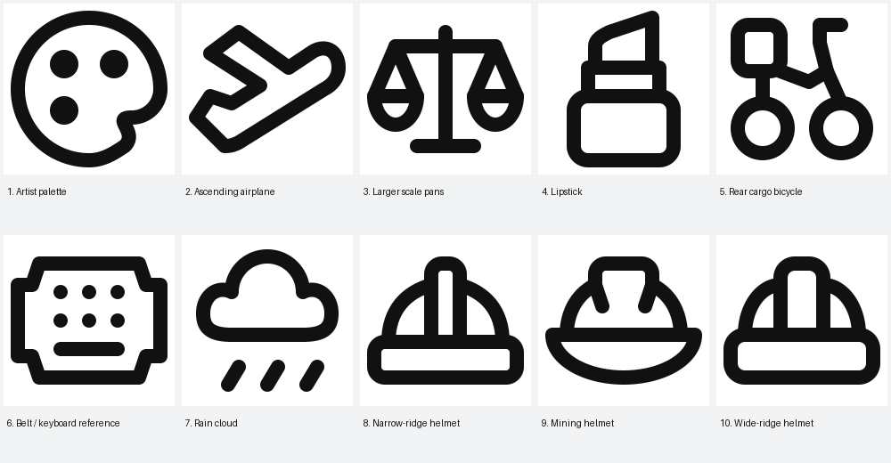
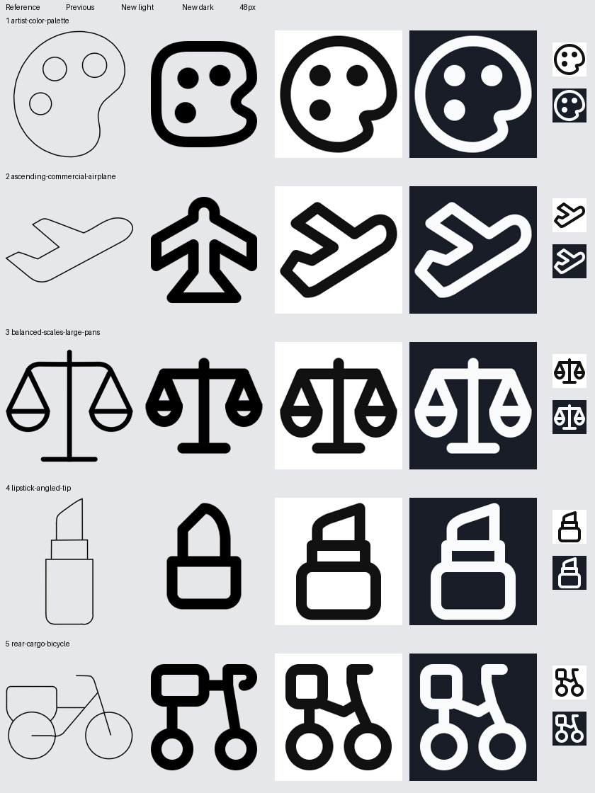
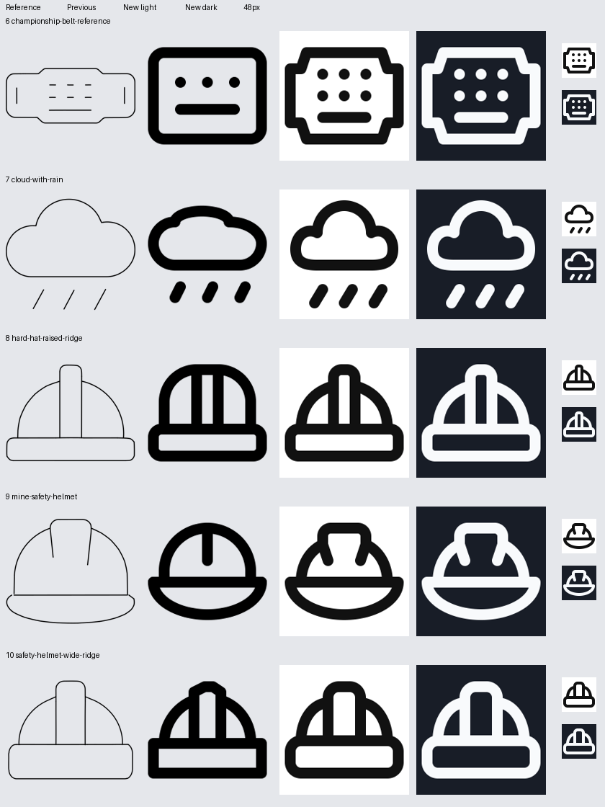

# Fresh icon batch

All ten drawings pass model validation and full QA with zero warnings. Every input was freshly authored.

## 1. Artist palette

Organic silhouette and three readable paint dots; deliberate thumb-side asymmetry. CIRCLE keeps the organic palette broad and round.

Omissions: Outlined wells reduced to small circular paint dots.

Reference construction: palette original and atomic-debug: circular outer contour and smooth inward thumb turn.

[Run folder](/Applications/Workspaces/pictographic/claude_skills/icon_set/work/primitive-make-ray/0a6ea07b-96af-593d-a5c6-dbc342111877/20260925T122032-fresh-dd1e5a) · [SVG](/Applications/Workspaces/pictographic/claude_skills/icon_set/work/primitive-make-ray/0a6ea07b-96af-593d-a5c6-dbc342111877/20260925T122032-fresh-dd1e5a/artist-color-palette.svg) · [Review](/Applications/Workspaces/pictographic/claude_skills/icon_set/work/primitive-make-ray/0a6ea07b-96af-593d-a5c6-dbc342111877/20260925T122032-fresh-dd1e5a/design-review.md)

## 2. Ascending airplane

Upward-right side view, broad rounded nose, angular wing and open V notch match the feedback. HRECT_L fits the diagonal fuselage and projecting wing.

Omissions: No defining features omitted; ground line is not in the supplied reference and is not added.

Reference construction: plane-takeoff original and atomic-debug: sloping fuselage, single visible wing and rear fin.

[Run folder](/Applications/Workspaces/pictographic/claude_skills/icon_set/work/primitive-make-ray/4a625cc1-8989-433b-89db-ddf1b6a98ffe/20260925T122032-fresh-dd1e5a) · [SVG](/Applications/Workspaces/pictographic/claude_skills/icon_set/work/primitive-make-ray/4a625cc1-8989-433b-89db-ddf1b6a98ffe/20260925T122032-fresh-dd1e5a/ascending-commercial-airplane.svg) · [Review](/Applications/Workspaces/pictographic/claude_skills/icon_set/work/primitive-make-ray/4a625cc1-8989-433b-89db-ddf1b6a98ffe/20260925T122032-fresh-dd1e5a/design-review.md)

## 3. Larger scale pans

Matched bowls are 20% wider and 33% deeper than the previous drawing. HRECT_L gives matching enlarged pans room on either side of the post.

Omissions: No omissions. Pan width increases from 10 to 12 and depth from 6 to 8 centerline units.

Reference construction: scale original and atomic-debug: matched suspended bowls and shared post.

[Run folder](/Applications/Workspaces/pictographic/claude_skills/icon_set/work/primitive-make-ray/098c5b62-8287-467b-95c6-c1b202763219/20260925T122032-fresh-dd1e5a) · [SVG](/Applications/Workspaces/pictographic/claude_skills/icon_set/work/primitive-make-ray/098c5b62-8287-467b-95c6-c1b202763219/20260925T122032-fresh-dd1e5a/balanced-scales-large-pans.svg) · [Review](/Applications/Workspaces/pictographic/claude_skills/icon_set/work/primitive-make-ray/098c5b62-8287-467b-95c6-c1b202763219/20260925T122032-fresh-dd1e5a/design-review.md)

## 4. Lipstick

Straight angled tip and both case steps restored; intentional asymmetric tip. VRECT_M supports the upright case, collar and angled tip.

Omissions: No defining features omitted.

Reference construction: No local Lucide lipstick match; supplied reference governs the angled tip and stepped case.

[Run folder](/Applications/Workspaces/pictographic/claude_skills/icon_set/work/primitive-make-ray/422fa961-4cef-5bf4-8415-0550aee83639/20260925T122032-fresh-dd1e5a) · [SVG](/Applications/Workspaces/pictographic/claude_skills/icon_set/work/primitive-make-ray/422fa961-4cef-5bf4-8415-0550aee83639/20260925T122032-fresh-dd1e5a/lipstick-angled-tip.svg) · [Review](/Applications/Workspaces/pictographic/claude_skills/icon_set/work/primitive-make-ray/422fa961-4cef-5bf4-8415-0550aee83639/20260925T122032-fresh-dd1e5a/design-review.md)

## 5. Rear cargo bicycle

Rear cargo, two equal wheels and forward handlebar read at native size. Frame simplified to a shallow step-through; wheel spokes and lower hub-level frame omitted to prevent crowding. SQUARE balances equal wheels below the rear cargo and handlebar.

Omissions: Lower hub-level frame, internal wheel spokes and fine pedal detail omitted to retain clear wheel openings; shallow step-through connection retained.

Reference construction: bike original: balanced equal wheels; supplied reference owns the rear carrier and step-through frame.

[Run folder](/Applications/Workspaces/pictographic/claude_skills/icon_set/work/primitive-make-ray/697554f1-3afd-5c1d-87a3-50b358ece127/20260925T122032-fresh-dd1e5a) · [SVG](/Applications/Workspaces/pictographic/claude_skills/icon_set/work/primitive-make-ray/697554f1-3afd-5c1d-87a3-50b358ece127/20260925T122032-fresh-dd1e5a/rear-cargo-bicycle.svg) · [Review](/Applications/Workspaces/pictographic/claude_skills/icon_set/work/primitive-make-ray/697554f1-3afd-5c1d-87a3-50b358ece127/20260925T122032-fresh-dd1e5a/design-review.md)

## 6. Belt / keyboard reference

Stepped enclosure restored. User title says belt while source filename says keyboard; retained the supplied marks without inventing a central emblem. HRECT_L preserves the wide stepped source enclosure and repeated marks.

Omissions: Two narrow end slots omitted. User title is Championship Winner Belt; source filename says keyboard. Supplied geometry is retained without inventing a medal or emblem.

Reference construction: keyboard original for repeated small marks; source image controls the stepped belt outline.

[Run folder](/Applications/Workspaces/pictographic/claude_skills/icon_set/work/primitive-make-ray/669aedc6-7742-41bf-85bd-47da4843ea6b/20260925T122032-fresh-dd1e5a) · [SVG](/Applications/Workspaces/pictographic/claude_skills/icon_set/work/primitive-make-ray/669aedc6-7742-41bf-85bd-47da4843ea6b/20260925T122032-fresh-dd1e5a/championship-belt-reference.svg) · [Review](/Applications/Workspaces/pictographic/claude_skills/icon_set/work/primitive-make-ray/669aedc6-7742-41bf-85bd-47da4843ea6b/20260925T122032-fresh-dd1e5a/design-review.md)

## 7. Rain cloud

Taller central dome with three equally spaced slanted drops. SQUARE balances a tall cloud dome above three rain strokes.

Omissions: No omissions.

Reference construction: cloud-rain original and atomic-debug: dominant cloud lobe and regular rain series.

[Run folder](/Applications/Workspaces/pictographic/claude_skills/icon_set/work/primitive-make-ray/1b0e7b77-0101-4ff8-b82d-4b17ff5d13e2/20260925T122032-fresh-dd1e5a) · [SVG](/Applications/Workspaces/pictographic/claude_skills/icon_set/work/primitive-make-ray/1b0e7b77-0101-4ff8-b82d-4b17ff5d13e2/20260925T122032-fresh-dd1e5a/cloud-with-rain.svg) · [Review](/Applications/Workspaces/pictographic/claude_skills/icon_set/work/primitive-make-ray/1b0e7b77-0101-4ff8-b82d-4b17ff5d13e2/20260925T122032-fresh-dd1e5a/design-review.md)

## 8. Narrow-ridge helmet

Symmetric shell with narrow rounded ridge raised above the shoulders. HRECT_L fits a raised narrow ridge above the broad brim.

Omissions: No omissions.

Reference construction: hard-hat original and atomic-debug: raised U-shaped ridge, curved side shell and rounded brim.

[Run folder](/Applications/Workspaces/pictographic/claude_skills/icon_set/work/primitive-make-ray/25ee09f6-fd7a-43d2-abe9-d8c92772aab7/20260925T122032-fresh-dd1e5a) · [SVG](/Applications/Workspaces/pictographic/claude_skills/icon_set/work/primitive-make-ray/25ee09f6-fd7a-43d2-abe9-d8c92772aab7/20260925T122032-fresh-dd1e5a/hard-hat-raised-ridge.svg) · [Review](/Applications/Workspaces/pictographic/claude_skills/icon_set/work/primitive-make-ray/25ee09f6-fd7a-43d2-abe9-d8c92772aab7/20260925T122032-fresh-dd1e5a/design-review.md)

## 9. Mining helmet

Tapered central ridge restored above the shell; curved brim deepened for clearance. HRECT_L balances the tapered ridge and curved brim.

Omissions: No defining features omitted.

Reference construction: hard-hat original and atomic-debug: raised ridge separated from dome shoulders.

[Run folder](/Applications/Workspaces/pictographic/claude_skills/icon_set/work/primitive-make-ray/cefdcc61-2ed2-5460-9530-e110178b2c81/20260925T122032-fresh-dd1e5a) · [SVG](/Applications/Workspaces/pictographic/claude_skills/icon_set/work/primitive-make-ray/cefdcc61-2ed2-5460-9530-e110178b2c81/20260925T122032-fresh-dd1e5a/mine-safety-helmet.svg) · [Review](/Applications/Workspaces/pictographic/claude_skills/icon_set/work/primitive-make-ray/cefdcc61-2ed2-5460-9530-e110178b2c81/20260925T122032-fresh-dd1e5a/design-review.md)

## 10. Wide-ridge helmet

Symmetric wide rounded ridge and deep rounded brim replace uneven crest. HRECT_L accommodates a wide raised ridge and deep rounded brim.

Omissions: No omissions.

Reference construction: hard-hat original and atomic-debug: raised ridge and symmetric rounded silhouette.

[Run folder](/Applications/Workspaces/pictographic/claude_skills/icon_set/work/primitive-make-ray/6b6d3305-8956-4ad4-a029-b8f48909ae94/20260925T122032-fresh-dd1e5a) · [SVG](/Applications/Workspaces/pictographic/claude_skills/icon_set/work/primitive-make-ray/6b6d3305-8956-4ad4-a029-b8f48909ae94/20260925T122032-fresh-dd1e5a/safety-helmet-wide-ridge.svg) · [Review](/Applications/Workspaces/pictographic/claude_skills/icon_set/work/primitive-make-ray/6b6d3305-8956-4ad4-a029-b8f48909ae94/20260925T122032-fresh-dd1e5a/design-review.md)

## Comparisons

