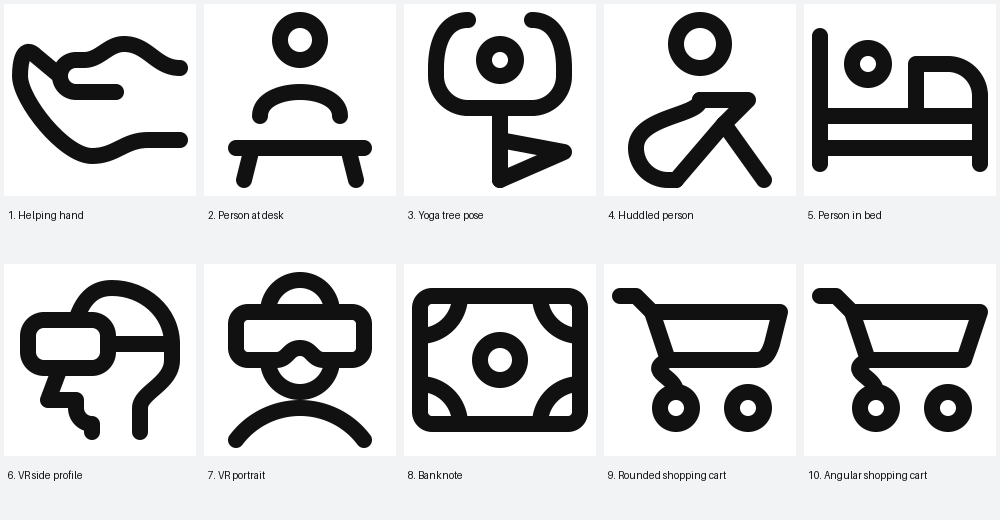
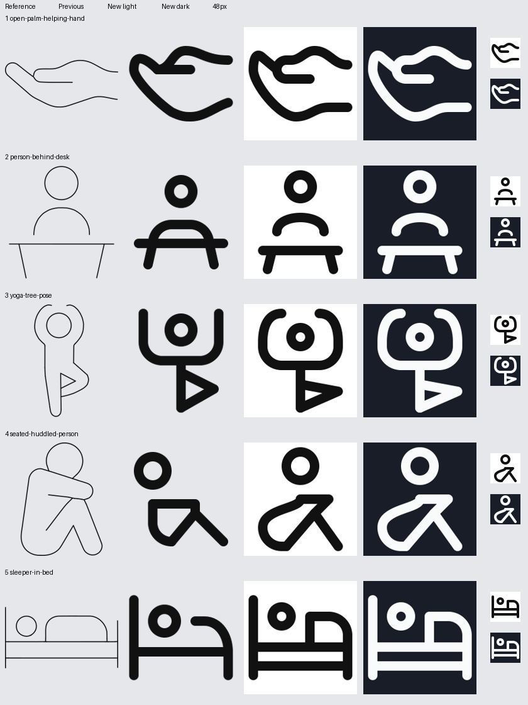
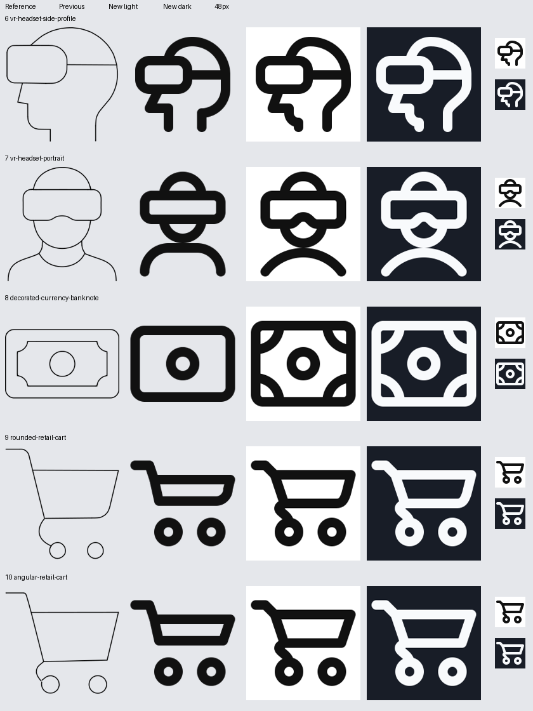

# Fresh icon batch

All ten inputs received a fresh standalone drawing. All ten pass model validation and full QA with zero errors or warnings. Previews reviewed in both themes at native and enlarged sizes.

## 1. Helping hand

Thumb now turns into a horizontal crease; palm and open wrist follow the upturned gesture. Deeper palm curvature fits the required keyshape. HRECT_M balances the horizontal open hand and its cupped palm.

Reductions: Fine finger divisions omitted; the source has one principal thumb crease.

Construction: Lucide hand-helping: smooth palm and crease construction; supplied gesture controls orientation.

[Run folder](/Applications/Workspaces/pictographic/claude_skills/icon_set/work/primitive-make-ray/21f148ad-8725-429c-aa23-cad9257d7f13/20260925T123821-fresh-9ebfc) · [SVG](/Applications/Workspaces/pictographic/claude_skills/icon_set/work/primitive-make-ray/21f148ad-8725-429c-aa23-cad9257d7f13/20260925T123821-fresh-9ebfc/open-palm-helping-hand.svg) · [Detailed review](/Applications/Workspaces/pictographic/claude_skills/icon_set/work/primitive-make-ray/21f148ad-8725-429c-aa23-cad9257d7f13/20260925T123821-fresh-9ebfc/design-review.md)

## 2. Person at desk

Shoulders are separated from the tabletop as in the reference; equal splayed legs and centered head. VRECT_L accommodates head, shoulders, table clearance and splayed legs.

Reductions: No defining parts omitted; shoulder mass reduced to an open arch.

Construction: human_ref/user.svg: circular head and arched shoulders; source desk separation.

[Run folder](/Applications/Workspaces/pictographic/claude_skills/icon_set/work/primitive-make-ray/1461f130-1461-5759-8ff2-8de25b9591b9/20260925T123821-fresh-9ebfc) · [SVG](/Applications/Workspaces/pictographic/claude_skills/icon_set/work/primitive-make-ray/1461f130-1461-5759-8ff2-8de25b9591b9/20260925T123821-fresh-9ebfc/person-behind-desk.svg) · [Detailed review](/Applications/Workspaces/pictographic/claude_skills/icon_set/work/primitive-make-ray/1461f130-1461-5759-8ff2-8de25b9591b9/20260925T123821-fresh-9ebfc/design-review.md)

## 3. Yoga tree pose

Curved overhead arms replace straight prongs. Clear torso leads to an outward folded knee. The folded foot rests low against the support leg as a compact pose reduction. VRECT_L gives the overhead arms and standing leg their vertical reach.

Reductions: Outlined body reduced to shared stick-figure vocabulary. Folded leg is lowered and compressed to preserve a clear torso and pass spacing.

Construction: human_ref/full_body_ref.png: outlined head and simple limbs; Lucide person-standing shared joints.

[Run folder](/Applications/Workspaces/pictographic/claude_skills/icon_set/work/primitive-make-ray/cd308a08-5d16-5ba7-ba3b-4c7cff751329/20260925T123821-fresh-9ebfc) · [SVG](/Applications/Workspaces/pictographic/claude_skills/icon_set/work/primitive-make-ray/cd308a08-5d16-5ba7-ba3b-4c7cff751329/20260925T123821-fresh-9ebfc/yoga-tree-pose.svg) · [Detailed review](/Applications/Workspaces/pictographic/claude_skills/icon_set/work/primitive-make-ray/cd308a08-5d16-5ba7-ba3b-4c7cff751329/20260925T123821-fresh-9ebfc/design-review.md)

## 4. Huddled person

Rounded hunched back and arms over the folded knees replace the box-like torso. Head follows the vertical tangent at the actual upper torso junction. VRECT_L gives a round head above the folded seated body.

Reductions: Outlined clothing/body mass reduced to the shared human line vocabulary; no fingers or facial detail.

Construction: human_ref/full_body_ref.png: seated pose and round-ended limbs; supplied huddled action.

[Run folder](/Applications/Workspaces/pictographic/claude_skills/icon_set/work/primitive-make-ray/2739b613-55fd-4f47-af97-f5cf90cb523d/20260925T123821-fresh-9ebfc) · [SVG](/Applications/Workspaces/pictographic/claude_skills/icon_set/work/primitive-make-ray/2739b613-55fd-4f47-af97-f5cf90cb523d/20260925T123821-fresh-9ebfc/seated-huddled-person.svg) · [Detailed review](/Applications/Workspaces/pictographic/claude_skills/icon_set/work/primitive-make-ray/2739b613-55fd-4f47-af97-f5cf90cb523d/20260925T123821-fresh-9ebfc/design-review.md)

## 5. Person in bed

Restored the blanket front edge and separate mattress band; head and blanket align horizontally. HRECT_L fits the horizontal sleeper, mattress band and bedposts.

Reductions: No defining components omitted; smooth blanket volume and two mattress rails retained.

Construction: human_ref/full_body_ref.png: circular head; Lucide bed-single: separate mattress rail and posts.

[Run folder](/Applications/Workspaces/pictographic/claude_skills/icon_set/work/primitive-make-ray/65881da4-e2b5-4025-8419-8ee364d9b2ba/20260925T123821-fresh-9ebfc) · [SVG](/Applications/Workspaces/pictographic/claude_skills/icon_set/work/primitive-make-ray/65881da4-e2b5-4025-8419-8ee364d9b2ba/20260925T123821-fresh-9ebfc/sleeper-in-bed.svg) · [Detailed review](/Applications/Workspaces/pictographic/claude_skills/icon_set/work/primitive-make-ray/65881da4-e2b5-4025-8419-8ee364d9b2ba/20260925T123821-fresh-9ebfc/design-review.md)

## 6. VR side profile

Continuous profile now includes a rounded chin below the nose; visor and strap retain their orientation. SQUARE gives the visor room beside the rounded skull and continuous neck.

Reductions: Small mouth/ear detail omitted; supplied continuous neck retained.

Construction: human_ref/user.svg: head proportion; source owns continuous side profile and visor.

[Run folder](/Applications/Workspaces/pictographic/claude_skills/icon_set/work/primitive-make-ray/019edb66-6728-4e28-ae42-b3dcaedeee84/20260925T123821-fresh-9ebfc) · [SVG](/Applications/Workspaces/pictographic/claude_skills/icon_set/work/primitive-make-ray/019edb66-6728-4e28-ae42-b3dcaedeee84/20260925T123821-fresh-9ebfc/vr-headset-side-profile.svg) · [Detailed review](/Applications/Workspaces/pictographic/claude_skills/icon_set/work/primitive-make-ray/019edb66-6728-4e28-ae42-b3dcaedeee84/20260925T123821-fresh-9ebfc/design-review.md)

## 7. VR portrait

Restored the central nose notch; circular jaw and curved shoulders meet at the required ink tangency. VRECT_L fits crown, broad visor, circular jaw and touching shoulders.

Reductions: Neck crease and garment neckline omitted to preserve the circular jaw and shoulder tangency.

Construction: human_ref/user.svg and Lucide user-round: circular jaw and broad shoulders; supplied visor notch.

[Run folder](/Applications/Workspaces/pictographic/claude_skills/icon_set/work/primitive-make-ray/1bc0a357-ae8c-5287-a849-d7b91c2e7aff/20260925T123821-fresh-9ebfc) · [SVG](/Applications/Workspaces/pictographic/claude_skills/icon_set/work/primitive-make-ray/1bc0a357-ae8c-5287-a849-d7b91c2e7aff/20260925T123821-fresh-9ebfc/vr-headset-portrait.svg) · [Detailed review](/Applications/Workspaces/pictographic/claude_skills/icon_set/work/primitive-make-ray/1bc0a357-ae8c-5287-a849-d7b91c2e7aff/20260925T123821-fresh-9ebfc/design-review.md)

## 8. Banknote

Central open medallion retained. Four concave corner ornaments restore currency detail without crowding a complete nested frame. HRECT_L keeps a wide currency frame and clear circular medallion.

Reductions: Continuous inset border reduced to four attached concave corner ornaments; central medallion stays open.

Construction: Lucide banknote: rounded outer border and central currency mark; supplied inset ornament.

[Run folder](/Applications/Workspaces/pictographic/claude_skills/icon_set/work/primitive-make-ray/b1e5658b-c303-4f04-bd4a-6e87cd1ca809/20260925T123821-fresh-9ebfc) · [SVG](/Applications/Workspaces/pictographic/claude_skills/icon_set/work/primitive-make-ray/b1e5658b-c303-4f04-bd4a-6e87cd1ca809/20260925T123821-fresh-9ebfc/decorated-currency-banknote.svg) · [Detailed review](/Applications/Workspaces/pictographic/claude_skills/icon_set/work/primitive-make-ray/b1e5658b-c303-4f04-bd4a-6e87cd1ca809/20260925T123821-fresh-9ebfc/design-review.md)

## 9. Rounded shopping cart

Deeper basket, rounded lower-right corner and a curled support reaching the rear wheel. Equal open wheel circles. HRECT_L balances the basket, handle and matching wheels.

Reductions: No defining parts omitted; the support curl is compacted to clear the wheel opening.

Construction: Lucide shopping-cart: basket, curled undercarriage and circular wheels.

[Run folder](/Applications/Workspaces/pictographic/claude_skills/icon_set/work/primitive-make-ray/09afbc31-5487-4884-b5bb-9534c9f636f2/20260925T123821-fresh-9ebfc) · [SVG](/Applications/Workspaces/pictographic/claude_skills/icon_set/work/primitive-make-ray/09afbc31-5487-4884-b5bb-9534c9f636f2/20260925T123821-fresh-9ebfc/rounded-retail-cart.svg) · [Detailed review](/Applications/Workspaces/pictographic/claude_skills/icon_set/work/primitive-make-ray/09afbc31-5487-4884-b5bb-9534c9f636f2/20260925T123821-fresh-9ebfc/design-review.md)

## 10. Angular shopping cart

Deeper angular basket and a curled support reaching the rear wheel distinguish this from the rounded version. HRECT_L balances the basket, handle and matching wheels.

Reductions: No defining parts omitted; the support curl is compacted to clear the wheel opening.

Construction: Lucide shopping-cart: basket, curled undercarriage and circular wheels.

[Run folder](/Applications/Workspaces/pictographic/claude_skills/icon_set/work/primitive-make-ray/3352f8c5-b764-483d-b1b4-cbbf08da871f/20260925T123821-fresh-9ebfc) · [SVG](/Applications/Workspaces/pictographic/claude_skills/icon_set/work/primitive-make-ray/3352f8c5-b764-483d-b1b4-cbbf08da871f/20260925T123821-fresh-9ebfc/angular-retail-cart.svg) · [Detailed review](/Applications/Workspaces/pictographic/claude_skills/icon_set/work/primitive-make-ray/3352f8c5-b764-483d-b1b4-cbbf08da871f/20260925T123821-fresh-9ebfc/design-review.md)

## Comparisons

