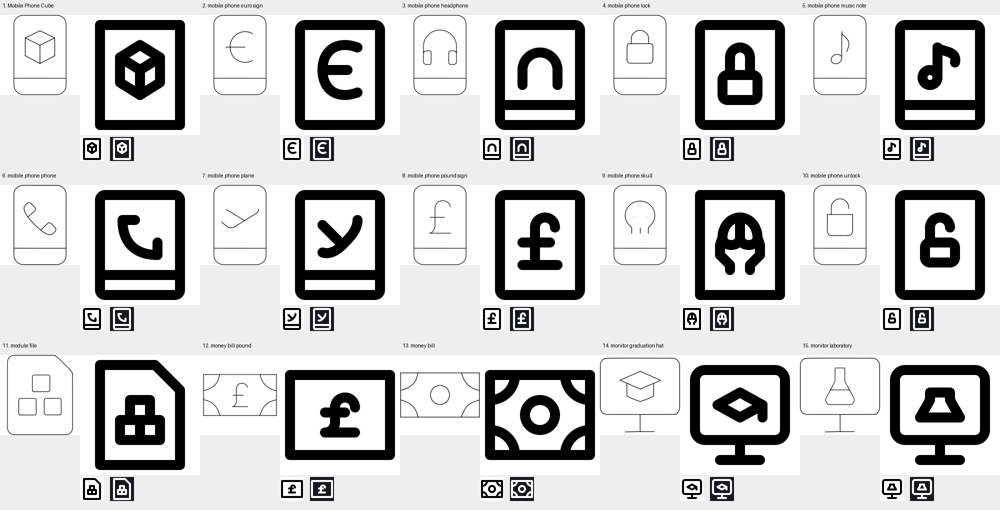

# Batch 15 repair results

15 pass; 0 blocked. Each final module passes model validation and the full build gate with zero errors and zero warnings. All files remain standalone.

Each tile shows the source, enlarged repair, and native light/dark previews.

| # | Icon | Status | Drawing | Run folder |
|---|---|---|---|---|
| 1 | Mobile Phone Cube | Pass | [SVG](</Applications/Workspaces/pictographic/claude_skills/icon_set/work/primitive-make-ray/23b1ca2a-c99d-4a4c-89e3-6ce9e447d5be/20260924T115848Z-batch15-repair/mobile-phone-cube.svg>) | [Files](</Applications/Workspaces/pictographic/claude_skills/icon_set/work/primitive-make-ray/23b1ca2a-c99d-4a4c-89e3-6ce9e447d5be/20260924T115848Z-batch15-repair>) |
| 2 | mobile phone euro sign | Pass | [SVG](</Applications/Workspaces/pictographic/claude_skills/icon_set/work/primitive-make-ray/1c0f91c5-ddcd-4057-9258-33ab46aaac34/20260924T115848Z-batch15-repair/mobile-phone-euro-sign.svg>) | [Files](</Applications/Workspaces/pictographic/claude_skills/icon_set/work/primitive-make-ray/1c0f91c5-ddcd-4057-9258-33ab46aaac34/20260924T115848Z-batch15-repair>) |
| 3 | mobile phone headphone | Pass | [SVG](</Applications/Workspaces/pictographic/claude_skills/icon_set/work/primitive-make-ray/e65c555e-8915-44b9-98b2-344d81aac941/20260924T115848Z-batch15-repair/mobile-phone-headphone.svg>) | [Files](</Applications/Workspaces/pictographic/claude_skills/icon_set/work/primitive-make-ray/e65c555e-8915-44b9-98b2-344d81aac941/20260924T115848Z-batch15-repair>) |
| 4 | mobile phone lock | Pass | [SVG](</Applications/Workspaces/pictographic/claude_skills/icon_set/work/primitive-make-ray/26319804-c7ff-498f-a76f-62441d482fc8/20260924T115848Z-batch15-repair/mobile-phone-lock.svg>) | [Files](</Applications/Workspaces/pictographic/claude_skills/icon_set/work/primitive-make-ray/26319804-c7ff-498f-a76f-62441d482fc8/20260924T115848Z-batch15-repair>) |
| 5 | mobile phone music note | Pass | [SVG](</Applications/Workspaces/pictographic/claude_skills/icon_set/work/primitive-make-ray/9541eb00-a034-4794-a052-1575ee33b845/20260924T115848Z-batch15-repair/mobile-phone-music-note.svg>) | [Files](</Applications/Workspaces/pictographic/claude_skills/icon_set/work/primitive-make-ray/9541eb00-a034-4794-a052-1575ee33b845/20260924T115848Z-batch15-repair>) |
| 6 | mobile phone phone | Pass | [SVG](</Applications/Workspaces/pictographic/claude_skills/icon_set/work/primitive-make-ray/13ea825f-ae04-4150-a4b6-56b3bed9dc5d/20260924T115848Z-batch15-repair/mobile-phone-phone.svg>) | [Files](</Applications/Workspaces/pictographic/claude_skills/icon_set/work/primitive-make-ray/13ea825f-ae04-4150-a4b6-56b3bed9dc5d/20260924T115848Z-batch15-repair>) |
| 7 | mobile phone plane | Pass | [SVG](</Applications/Workspaces/pictographic/claude_skills/icon_set/work/primitive-make-ray/0a850f90-2953-422f-b95d-65062508b5a1/20260924T115848Z-batch15-repair/mobile-phone-plane.svg>) | [Files](</Applications/Workspaces/pictographic/claude_skills/icon_set/work/primitive-make-ray/0a850f90-2953-422f-b95d-65062508b5a1/20260924T115848Z-batch15-repair>) |
| 8 | mobile phone pound sign | Pass | [SVG](</Applications/Workspaces/pictographic/claude_skills/icon_set/work/primitive-make-ray/a70db137-a446-4f4c-b656-4fea14660981/20260924T115848Z-batch15-repair/mobile-phone-pound-sign.svg>) | [Files](</Applications/Workspaces/pictographic/claude_skills/icon_set/work/primitive-make-ray/a70db137-a446-4f4c-b656-4fea14660981/20260924T115848Z-batch15-repair>) |
| 9 | mobile phone skull | Pass | [SVG](</Applications/Workspaces/pictographic/claude_skills/icon_set/work/primitive-make-ray/079086c7-cfbe-4c2b-a1d3-438ec4146466/20260924T115848Z-batch15-repair/mobile-phone-skull.svg>) | [Files](</Applications/Workspaces/pictographic/claude_skills/icon_set/work/primitive-make-ray/079086c7-cfbe-4c2b-a1d3-438ec4146466/20260924T115848Z-batch15-repair>) |
| 10 | mobile phone unlock | Pass | [SVG](</Applications/Workspaces/pictographic/claude_skills/icon_set/work/primitive-make-ray/b0d42cd4-6acc-4018-ae89-490f3eb333a9/20260924T115848Z-batch15-repair/mobile-phone-unlock.svg>) | [Files](</Applications/Workspaces/pictographic/claude_skills/icon_set/work/primitive-make-ray/b0d42cd4-6acc-4018-ae89-490f3eb333a9/20260924T115848Z-batch15-repair>) |
| 11 | module file | Pass | [SVG](</Applications/Workspaces/pictographic/claude_skills/icon_set/work/primitive-make-ray/e715b082-2f7d-4370-a969-0707c7e743f2/20260924T115848Z-batch15-repair/module-file.svg>) | [Files](</Applications/Workspaces/pictographic/claude_skills/icon_set/work/primitive-make-ray/e715b082-2f7d-4370-a969-0707c7e743f2/20260924T115848Z-batch15-repair>) |
| 12 | money bill pound | Pass | [SVG](</Applications/Workspaces/pictographic/claude_skills/icon_set/work/primitive-make-ray/a2425a69-d3ed-4c10-8e19-41a99038d49e/20260924T115848Z-batch15-repair/money-bill-pound.svg>) | [Files](</Applications/Workspaces/pictographic/claude_skills/icon_set/work/primitive-make-ray/a2425a69-d3ed-4c10-8e19-41a99038d49e/20260924T115848Z-batch15-repair>) |
| 13 | money bill | Pass | [SVG](</Applications/Workspaces/pictographic/claude_skills/icon_set/work/primitive-make-ray/57a71ef9-0c30-4a25-a290-84a6666d4f6e/20260924T115848Z-batch15-repair/money-bill.svg>) | [Files](</Applications/Workspaces/pictographic/claude_skills/icon_set/work/primitive-make-ray/57a71ef9-0c30-4a25-a290-84a6666d4f6e/20260924T115848Z-batch15-repair>) |
| 14 | monitor graduation hat | Pass | [SVG](</Applications/Workspaces/pictographic/claude_skills/icon_set/work/primitive-make-ray/25a4cb19-9e79-49d4-b5af-74c85495cf76/20260924T115848Z-batch15-repair/monitor-graduation-hat.svg>) | [Files](</Applications/Workspaces/pictographic/claude_skills/icon_set/work/primitive-make-ray/25a4cb19-9e79-49d4-b5af-74c85495cf76/20260924T115848Z-batch15-repair>) |
| 15 | monitor laboratory | Pass | [SVG](</Applications/Workspaces/pictographic/claude_skills/icon_set/work/primitive-make-ray/6ac9826c-356d-4f89-843e-a1caf6908626/20260924T115848Z-batch15-repair/monitor-laboratory.svg>) | [Files](</Applications/Workspaces/pictographic/claude_skills/icon_set/work/primitive-make-ray/6ac9826c-356d-4f89-843e-a1caf6908626/20260924T115848Z-batch15-repair>) |

## Reductions and construction notes

### 1. Mobile Phone Cube

Enlarged all three cube faces and retained the perspective seams. Removed the lower phone divider and used a square-cornered phone outline to preserve eight-unit clearance.
Keyshape: VRECT_L. Lucide reference: `box` original and atomic-debug. Detailed validation and repair attempts are saved in the run folder.

### 2. mobile phone euro sign

Opened the euro curve and joined its crossbar at an explicit curve endpoint. Removed the lower phone divider.
Keyshape: VRECT_L. Lucide reference: `euro` original and atomic-debug. Detailed validation and repair attempts are saved in the run folder.

### 3. mobile phone headphone

Retained the arched headband and two downward ear ends; replaced the tiny outlined ear cushions with open stroke terminals.
Keyshape: VRECT_L. Lucide reference: `headphones` original and atomic-debug. Detailed validation and repair attempts are saved in the run folder.

### 4. mobile phone lock

Enlarged the lock body and shackle opening. Removed the lower phone divider.
Keyshape: VRECT_L. Lucide reference: `lock` original and atomic-debug. Detailed validation and repair attempts are saved in the run folder.

### 5. mobile phone music note

Retained the round note head, upright stem and single flag; shortened the flag to clear the head.
Keyshape: VRECT_L. Lucide reference: `music` original and atomic-debug. Detailed validation and repair attempts are saved in the run folder.

### 6. mobile phone phone

Retained the curved telephone receiver with two turned terminals; reduced its crowded double outline to an open receiver stroke.
Keyshape: VRECT_L. Lucide reference: `phone` original and atomic-debug. Detailed validation and repair attempts are saved in the run folder.

### 7. mobile phone plane

Retained the diagonal side-profile aircraft, with a swept fuselage and prominent wing joined at an exact shared node.
Keyshape: VRECT_L. Lucide reference: `plane` original and atomic-debug. Detailed validation and repair attempts are saved in the run folder.

### 8. mobile phone pound sign

Rebuilt the sterling sign with a round hook, explicit crossbar junction and level baseline. Removed the lower phone divider.
Keyshape: VRECT_L. Lucide reference: `pound-sterling` original and atomic-debug. Detailed validation and repair attempts are saved in the run folder.

### 9. mobile phone skull

Retained a frontal skull with rounded cranium, paired eye sockets and open lower jaw. Enlarged the sockets and merged their outlines into the cranium; removed the middle tooth and phone divider.
Keyshape: VRECT_L. Lucide reference: `skull` original and atomic-debug. Detailed validation and repair attempts are saved in the run folder.

### 10. mobile phone unlock

Kept the lock body and visibly open shackle; lowered the shackle arc and removed the phone divider.
Keyshape: VRECT_L. Lucide reference: `lock-open` original and atomic-debug. Detailed validation and repair attempts are saved in the run folder.

### 11. module file

Retained the clipped document corner and three square modules. Joined the modules along common edges instead of squeezing three separate outlines.
Keyshape: VRECT_L. Lucide reference: `file-box` original and atomic-debug. Detailed validation and repair attempts are saved in the run folder.

### 12. money bill pound

Kept the banknote enclosure and sterling denomination; removed four decorative corner loops to reserve room for the currency sign.
Keyshape: HRECT_L. Lucide reference: `pound-sterling` original and atomic-debug. Detailed validation and repair attempts are saved in the run folder.

### 13. money bill

Kept all four banknote corner ornaments and the central medallion; enlarged corner radii from eight to ten.
Keyshape: HRECT_L. Lucide reference: `banknote` original and atomic-debug. Detailed validation and repair attempts are saved in the run folder.

### 14. monitor graduation hat

Kept the monitor, stand and mortarboard silhouette. Simplified the shallow crown into a mortarboard with a short tassel.
Keyshape: SQUARE. Lucide reference: `graduation-cap` original and atomic-debug. Detailed validation and repair attempts are saved in the run folder.

### 15. monitor laboratory

Kept the monitor, stand, flask neck and flared flask body. Removed the crowded liquid-level line.
Keyshape: SQUARE. Lucide reference: `flask-conical` original and atomic-debug. Detailed validation and repair attempts are saved in the run folder.
