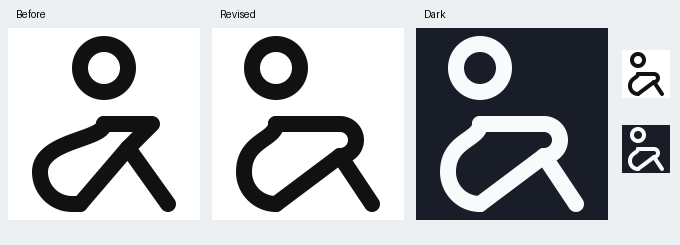

# Huddled person revision

Brought the head and upper back left to make the seated body compact. Replaced the pointed arm-to-knee join with a rounded forearm wrapping over the raised knee.

VRECT_L keeps the seated pose within (8,4)-(40,44) centerline extremes. The supplied pose and human_ref/full_body_ref.png inform the figure. Clothing outline is reduced to shared human strokes; no facial or finger detail.

Head center (16,10), radius6; actual upper torso junction (16,24) has a vertical tangent toward the head. Exact centerline gap8, visible gap4.

Reviewed light and dark at48px and192px. Model valid, full QA pass, no warnings.

