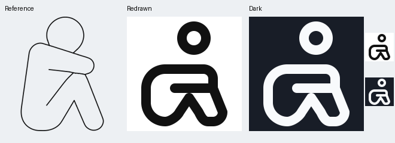

# Huddled person: full redraw

Replaced the stick-like body with the supplied rounded clothed outline. The forearm rests across the raised knees; the head sits forward above them. Both legs are enclosed rather than drawn as diagonal sticks.

VRECT_L preserves the vertical seated silhouette within (8,4)-(40,44) centerline extremes. Supplied reference governs pose and outline; shared human_ref/full_body_ref.png governs circular head and round-ended details. No useful Lucide seated-huddle match was found.

Head center (28,9), radius5: head bottom14, upper body22, centerline gap8, visible ink gap4. This is an outlined figure with the reference-supported forward head offset.

Interior thigh crease was tested and omitted because it merges with the folded leg. The unsuccessful attempt is preserved.

Native and enlarged previews reviewed in light and dark. Model valid, full QA pass, no warnings.

