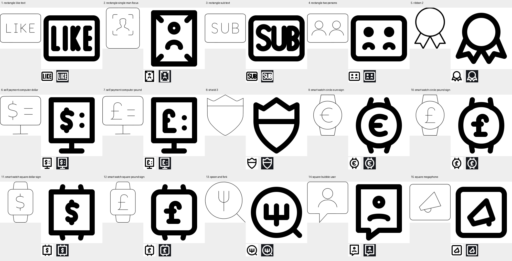

# Batch 17 repair results

13 pass; 2 blocked. Passing icons have valid model reports and full build gates with zero errors and zero warnings. LIKE and SUB remain blocked after more than five repair rounds each. No validation rule was weakened.

| # | Input | Status | SVG | Run folder |
|---|---|---|---|---|
| 1 | rectangle like text | Blocked | [SVG](</Applications/Workspaces/pictographic/claude_skills/icon_set/work/primitive-make-ray/3d250c41-6017-4d1f-9278-42fadf1fc93d/20260924T142559Z-batch17-repair/rectangle-like-text.svg>) | [Files](</Applications/Workspaces/pictographic/claude_skills/icon_set/work/primitive-make-ray/3d250c41-6017-4d1f-9278-42fadf1fc93d/20260924T142559Z-batch17-repair>) |
| 2 | rectangle single man focus | Pass | [SVG](</Applications/Workspaces/pictographic/claude_skills/icon_set/work/primitive-make-ray/748d6e5f-8942-4061-a602-5b499075202e/20260924T142559Z-batch17-repair/rectangle-single-man-focus.svg>) | [Files](</Applications/Workspaces/pictographic/claude_skills/icon_set/work/primitive-make-ray/748d6e5f-8942-4061-a602-5b499075202e/20260924T142559Z-batch17-repair>) |
| 3 | rectangle sub text | Blocked | [SVG](</Applications/Workspaces/pictographic/claude_skills/icon_set/work/primitive-make-ray/dd1e6365-7d94-41e2-84d6-66c8ad75ede1/20260924T142559Z-batch17-repair/rectangle-sub-text.svg>) | [Files](</Applications/Workspaces/pictographic/claude_skills/icon_set/work/primitive-make-ray/dd1e6365-7d94-41e2-84d6-66c8ad75ede1/20260924T142559Z-batch17-repair>) |
| 4 | rectangle two persons | Pass | [SVG](</Applications/Workspaces/pictographic/claude_skills/icon_set/work/primitive-make-ray/d96343a5-e841-44ec-86db-6217d2856341/20260924T142559Z-batch17-repair/rectangle-two-persons.svg>) | [Files](</Applications/Workspaces/pictographic/claude_skills/icon_set/work/primitive-make-ray/d96343a5-e841-44ec-86db-6217d2856341/20260924T142559Z-batch17-repair>) |
| 5 | ribbon 2 | Pass | [SVG](</Applications/Workspaces/pictographic/claude_skills/icon_set/work/primitive-make-ray/0c3535ed-6772-4bdc-aea7-fb01cc99793c/20260924T142559Z-batch17-repair/ribbon-2.svg>) | [Files](</Applications/Workspaces/pictographic/claude_skills/icon_set/work/primitive-make-ray/0c3535ed-6772-4bdc-aea7-fb01cc99793c/20260924T142559Z-batch17-repair>) |
| 6 | self payment computer dollar | Pass | [SVG](</Applications/Workspaces/pictographic/claude_skills/icon_set/work/primitive-make-ray/2c2ce02e-d93f-4086-969c-7135c5b08d1b/20260924T142559Z-batch17-repair/self-payment-computer-dollar.svg>) | [Files](</Applications/Workspaces/pictographic/claude_skills/icon_set/work/primitive-make-ray/2c2ce02e-d93f-4086-969c-7135c5b08d1b/20260924T142559Z-batch17-repair>) |
| 7 | self payment computer pound | Pass | [SVG](</Applications/Workspaces/pictographic/claude_skills/icon_set/work/primitive-make-ray/1e1fac7c-54c5-4468-baea-d2c722f0520d/20260924T142559Z-batch17-repair/self-payment-computer-pound.svg>) | [Files](</Applications/Workspaces/pictographic/claude_skills/icon_set/work/primitive-make-ray/1e1fac7c-54c5-4468-baea-d2c722f0520d/20260924T142559Z-batch17-repair>) |
| 8 | shield 3 | Pass | [SVG](</Applications/Workspaces/pictographic/claude_skills/icon_set/work/primitive-make-ray/500267df-8bce-44e8-a3f7-89f2ab1be4c0/20260924T142559Z-batch17-repair/shield-3.svg>) | [Files](</Applications/Workspaces/pictographic/claude_skills/icon_set/work/primitive-make-ray/500267df-8bce-44e8-a3f7-89f2ab1be4c0/20260924T142559Z-batch17-repair>) |
| 9 | smart watch circle euro sign | Pass | [SVG](</Applications/Workspaces/pictographic/claude_skills/icon_set/work/primitive-make-ray/73571a2b-4ed5-4ead-96e1-495841cb43da/20260924T142559Z-batch17-repair/smart-watch-circle-euro-sign.svg>) | [Files](</Applications/Workspaces/pictographic/claude_skills/icon_set/work/primitive-make-ray/73571a2b-4ed5-4ead-96e1-495841cb43da/20260924T142559Z-batch17-repair>) |
| 10 | smart watch circle pound sign | Pass | [SVG](</Applications/Workspaces/pictographic/claude_skills/icon_set/work/primitive-make-ray/f2d45871-ff3d-44d5-84a8-774df3bd6ba3/20260924T142559Z-batch17-repair/smartwatch-pound-symbol.svg>) | [Files](</Applications/Workspaces/pictographic/claude_skills/icon_set/work/primitive-make-ray/f2d45871-ff3d-44d5-84a8-774df3bd6ba3/20260924T142559Z-batch17-repair>) |
| 11 | smart watch square dollar sign | Pass | [SVG](</Applications/Workspaces/pictographic/claude_skills/icon_set/work/primitive-make-ray/22b0de95-e0f5-450b-9f1f-9e0284263be7/20260924T142559Z-batch17-repair/smart-watch-square-dollar-sign.svg>) | [Files](</Applications/Workspaces/pictographic/claude_skills/icon_set/work/primitive-make-ray/22b0de95-e0f5-450b-9f1f-9e0284263be7/20260924T142559Z-batch17-repair>) |
| 12 | smart watch square pound sign | Pass | [SVG](</Applications/Workspaces/pictographic/claude_skills/icon_set/work/primitive-make-ray/2c0ac7cd-8681-4e21-803e-6437b35eb4a2/20260924T142559Z-batch17-repair/smart-watch-square-pound-sign.svg>) | [Files](</Applications/Workspaces/pictographic/claude_skills/icon_set/work/primitive-make-ray/2c0ac7cd-8681-4e21-803e-6437b35eb4a2/20260924T142559Z-batch17-repair>) |
| 13 | spoon and fork | Pass | [SVG](</Applications/Workspaces/pictographic/claude_skills/icon_set/work/primitive-make-ray/dd96595d-042a-465f-9681-d8c23c641754/20260924T142559Z-batch17-repair/spoon-and-fork.svg>) | [Files](</Applications/Workspaces/pictographic/claude_skills/icon_set/work/primitive-make-ray/dd96595d-042a-465f-9681-d8c23c641754/20260924T142559Z-batch17-repair>) |
| 14 | square bubble user | Pass | [SVG](</Applications/Workspaces/pictographic/claude_skills/icon_set/work/primitive-make-ray/262dd529-82e6-4744-ac57-ec46c428f624/20260924T142559Z-batch17-repair/square-bubble-user.svg>) | [Files](</Applications/Workspaces/pictographic/claude_skills/icon_set/work/primitive-make-ray/262dd529-82e6-4744-ac57-ec46c428f624/20260924T142559Z-batch17-repair>) |
| 15 | square megaphone | Pass | [SVG](</Applications/Workspaces/pictographic/claude_skills/icon_set/work/primitive-make-ray/84596dd2-069a-450e-b70c-08a8dc22159b/20260924T142559Z-batch17-repair/square-megaphone.svg>) | [Files](</Applications/Workspaces/pictographic/claude_skills/icon_set/work/primitive-make-ray/84596dd2-069a-450e-b70c-08a8dc22159b/20260924T142559Z-batch17-repair>) |

## Per-icon construction and reductions

### 1. rectangle like text

All four LIKE letters and the rectangular border retained. Enlarged E spacing, redistributed glyphs and compared three keyshapes. Blocked: frame/letter and letter/letter clearances remain six units; I/K parallel stems are also six units apart.
Keyshape: HRECT_L. Construction reference: Lucide `rectangle-ellipsis` original and atomic-debug. See the run notes and gate evidence for details.

### 2. rectangle single man focus

Retained the portrait and full rectangular panel. Merged the four focus indicators into diagonal corner ticks on the panel to avoid a second nested frame. Human head center (24,16), radius 3; shoulder apex (24,27), exact four-unit visible detached gap.
Keyshape: VRECT_L. Construction reference: Lucide `scan-face` original and atomic-debug. See the run notes and gate evidence for details.

### 3. rectangle sub text

All three SUB letters and the rounded panel retained. Widened U and compared rectangular and square layouts and B constructions. Blocked: S/frame, B/frame and adjacent-letter spacing; B bowl internal clearance and an undersized hole.
Keyshape: HRECT_L. Construction reference: Lucide `rectangle-ellipsis` original and atomic-debug. See the run notes and gate evidence for details.

### 4. rectangle two persons

Retained two equal people and the panel. Reduced both heads and shoulder arches together. Head centers (16,19) and (32,19), radius 2; shoulder apex y29, exactly four units of visible detached clearance.
Keyshape: HRECT_L. Construction reference: Lucide `users` original and atomic-debug. See the run notes and gate evidence for details.

### 5. ribbon 2

Retained the circular medal and both forked ribbon tails. Used a smaller medal and lower attachment points to enlarge the tail openings; mirrored all paired geometry.
Keyshape: SQUARE. Construction reference: Lucide `award` original and atomic-debug. See the run notes and gate evidence for details.

### 6. self payment computer dollar

Retained the payment screen, stand, dollar sign and two menu marks. Replaced the continuous dollar stem with connected top/bottom extensions to eliminate tiny enclosed pockets; reduced menu rules to dots.
Keyshape: VRECT_L. Construction reference: Lucide `dollar-sign` original and atomic-debug. See the run notes and gate evidence for details.

### 7. self payment computer pound

Retained the payment screen, stand, pound sign and two menu marks. Taller screen, shorter hook and crossbar; reduced menu rules to dots.
Keyshape: VRECT_L. Construction reference: Lucide `pound-sterling` original and atomic-debug. See the run notes and gate evidence for details.

### 8. shield 3

Retained the crowned shield, horizontal band and pointed lower body. Lowered the band to open the space beneath the crown valleys.
Keyshape: VRECT_L. Construction reference: Lucide `shield` original and atomic-debug. See the run notes and gate evidence for details.

### 9. smart watch circle euro sign

Retained the circular watch case, paired straps and euro mark. Removed the short strap end caps to eliminate tiny enclosed strap pockets; opened the euro curve and shortened its crossbar.
Keyshape: VRECT_L. Construction reference: Lucide `watch` original and atomic-debug. See the run notes and gate evidence for details.

### 10. smart watch circle pound sign

Retained the circular watch case, paired straps and pound mark. Open strap ends, rebuilt sterling hook, shorter crossbar and eight-unit baseline spacing.
Keyshape: VRECT_L. Construction reference: Lucide `pound-sterling` original and atomic-debug. See the run notes and gate evidence for details.

### 11. smart watch square dollar sign

Retained the square watch case, paired straps and dollar mark. Square-cornered case, open strap ends and separated top/bottom dollar extensions remove small holes.
Keyshape: VRECT_L. Construction reference: Lucide `dollar-sign` original and atomic-debug. See the run notes and gate evidence for details.

### 12. smart watch square pound sign

Retained the rounded square watch case, paired straps and pound mark. Open strap ends and a compact hook with an eight-unit bar-to-baseline gap.
Keyshape: VRECT_L. Construction reference: Lucide `pound-sterling` original and atomic-debug. See the run notes and gate evidence for details.

### 13. spoon and fork

Retained the round plate, three-tined fork and diagonal outer handle visible in the supplied source. Squared the fork bowl and split it at the actual center-tine junction. Redrew the plate outline through the exact handle attachment.
Keyshape: SQUARE. Construction reference: Lucide `utensils` original and atomic-debug. See the run notes and gate evidence for details.

### 14. square bubble user

Retained the speech bubble, lower-left tail and person. Changed to an upright keyshape and a shallow shoulder arch. Head center (24,16), radius 3; shoulder apex (24,27), exactly four units of visible detached clearance.
Keyshape: VRECT_L. Construction reference: Lucide `message-square` original and atomic-debug. See the run notes and gate evidence for details.

### 15. square megaphone

Retained the diagonal megaphone cone and square enclosure. Replaced the crowded enclosed handle loop with a short open grip and moved the mouth edge inward.
Keyshape: SQUARE. Construction reference: Lucide `megaphone` original and atomic-debug. See the run notes and gate evidence for details.
