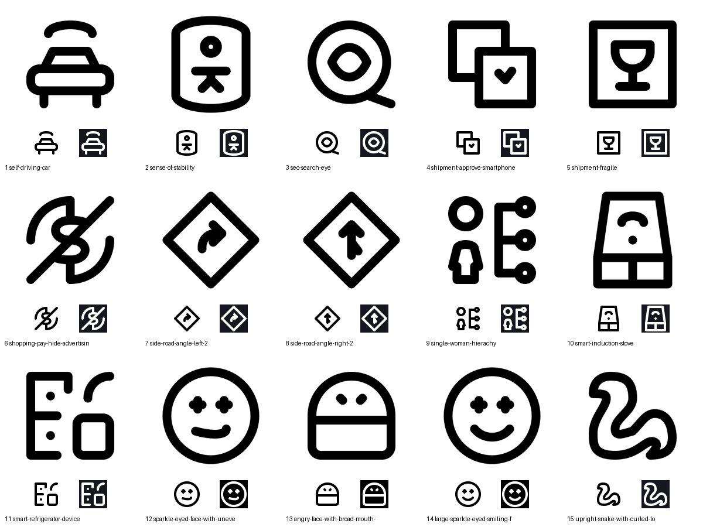

# Batch 10 repair results

15 pass, 0 blocked. Twelve fresh revisions; three existing smiley revisions rechecked and retained. All pass the model and full build gate with zero errors and warnings.

| # | Reference | Result | Keyshape | Outputs |
|---|---|---|---|---|
| 1 | self driving car | pass (repaired) | SQUARE | [folder](/Applications/Workspaces/pictographic/claude_skills/icon_set/work/primitive-make-ray/7a8b5b6b-d72f-42df-9379-3389fd1e33fd/20260924-batch10-repair) · [SVG](/Applications/Workspaces/pictographic/claude_skills/icon_set/work/primitive-make-ray/7a8b5b6b-d72f-42df-9379-3389fd1e33fd/20260924-batch10-repair/self-driving-car.svg) |
| 2 | sense of stability | pass (repaired) | VRECT_L | [folder](/Applications/Workspaces/pictographic/claude_skills/icon_set/work/primitive-make-ray/0257fd69-7a18-40fc-a7d2-903d1b421449/20260924-batch10-repair) · [SVG](/Applications/Workspaces/pictographic/claude_skills/icon_set/work/primitive-make-ray/0257fd69-7a18-40fc-a7d2-903d1b421449/20260924-batch10-repair/sense-of-stability.svg) |
| 3 | seo search eye | pass (repaired) | SQUARE | [folder](/Applications/Workspaces/pictographic/claude_skills/icon_set/work/primitive-make-ray/4bd2f046-d00e-4c3d-99dd-153eae347474/20260924-batch10-repair) · [SVG](/Applications/Workspaces/pictographic/claude_skills/icon_set/work/primitive-make-ray/4bd2f046-d00e-4c3d-99dd-153eae347474/20260924-batch10-repair/seo-search-eye.svg) |
| 4 | shipment approve smartphone | pass (repaired) | SQUARE | [folder](/Applications/Workspaces/pictographic/claude_skills/icon_set/work/primitive-make-ray/59f997a9-32d8-436a-ae34-06535681b16e/20260924-batch10-repair) · [SVG](/Applications/Workspaces/pictographic/claude_skills/icon_set/work/primitive-make-ray/59f997a9-32d8-436a-ae34-06535681b16e/20260924-batch10-repair/shipment-approve-smartphone.svg) |
| 5 | shipment fragile | pass (repaired) | SQUARE | [folder](/Applications/Workspaces/pictographic/claude_skills/icon_set/work/primitive-make-ray/6fb1e1e2-8daf-44eb-99ef-5f74d171ee0f/20260924-batch10-repair) · [SVG](/Applications/Workspaces/pictographic/claude_skills/icon_set/work/primitive-make-ray/6fb1e1e2-8daf-44eb-99ef-5f74d171ee0f/20260924-batch10-repair/shipment-fragile.svg) |
| 6 | shopping pay hide advertising | pass (repaired) | SQUARE | [folder](/Applications/Workspaces/pictographic/claude_skills/icon_set/work/primitive-make-ray/59b04c40-2006-4e31-a230-a6be869385d4/20260924-batch10-repair) · [SVG](/Applications/Workspaces/pictographic/claude_skills/icon_set/work/primitive-make-ray/59b04c40-2006-4e31-a230-a6be869385d4/20260924-batch10-repair/shopping-pay-hide-advertising.svg) |
| 7 | side road angle left 2 | pass (repaired) | CIRCLE | [folder](/Applications/Workspaces/pictographic/claude_skills/icon_set/work/primitive-make-ray/d0d6406a-6c7c-431f-a9b8-ee87990c2cf2/20260924-batch10-repair) · [SVG](/Applications/Workspaces/pictographic/claude_skills/icon_set/work/primitive-make-ray/d0d6406a-6c7c-431f-a9b8-ee87990c2cf2/20260924-batch10-repair/side-road-angle-left-2.svg) |
| 8 | side road angle right 2 | pass (repaired) | CIRCLE | [folder](/Applications/Workspaces/pictographic/claude_skills/icon_set/work/primitive-make-ray/d19fe7af-bf3f-4193-8210-2e69b664727e/20260924-batch10-repair) · [SVG](/Applications/Workspaces/pictographic/claude_skills/icon_set/work/primitive-make-ray/d19fe7af-bf3f-4193-8210-2e69b664727e/20260924-batch10-repair/side-road-angle-right-2.svg) |
| 9 | single woman hierachy | pass (repaired) | SQUARE | [folder](/Applications/Workspaces/pictographic/claude_skills/icon_set/work/primitive-make-ray/868652f3-4bc5-4fe0-96a0-1bc2494937b3/20260924-batch10-repair) · [SVG](/Applications/Workspaces/pictographic/claude_skills/icon_set/work/primitive-make-ray/868652f3-4bc5-4fe0-96a0-1bc2494937b3/20260924-batch10-repair/single-woman-hierachy.svg) |
| 10 | smart induction stove | pass (repaired) | VRECT_L | [folder](/Applications/Workspaces/pictographic/claude_skills/icon_set/work/primitive-make-ray/cc0f870e-e6f6-426d-9d3f-73d669be714f/20260924-batch10-repair) · [SVG](/Applications/Workspaces/pictographic/claude_skills/icon_set/work/primitive-make-ray/cc0f870e-e6f6-426d-9d3f-73d669be714f/20260924-batch10-repair/smart-induction-stove.svg) |
| 11 | smart refrigerator device | pass (repaired) | SQUARE | [folder](/Applications/Workspaces/pictographic/claude_skills/icon_set/work/primitive-make-ray/30cd9303-dbd1-4ff5-9b6d-c3de44b1a7e4/20260924-batch10-repair) · [SVG](/Applications/Workspaces/pictographic/claude_skills/icon_set/work/primitive-make-ray/30cd9303-dbd1-4ff5-9b6d-c3de44b1a7e4/20260924-batch10-repair/smart-refrigerator-device.svg) |
| 12 | smiley bright | pass (already-done) | CIRCLE | [folder](/Applications/Workspaces/pictographic/claude_skills/icon_set/work/primitive-make-ray/d25557be-d198-406c-ac40-686ab3f61c2a/20260924-spacing-batch5-gpt6) · [SVG](/Applications/Workspaces/pictographic/claude_skills/icon_set/work/primitive-make-ray/d25557be-d198-406c-ac40-686ab3f61c2a/20260924-spacing-batch5-gpt6/smiley-bright.svg) |
| 13 | smiley decode | pass (already-done) | SQUARE | [folder](/Applications/Workspaces/pictographic/claude_skills/icon_set/work/primitive-make-ray/2421c5d7-2ff1-480c-8526-9252cbdd43cf/20260924-spacing-batch5-gpt6) · [SVG](/Applications/Workspaces/pictographic/claude_skills/icon_set/work/primitive-make-ray/2421c5d7-2ff1-480c-8526-9252cbdd43cf/20260924-spacing-batch5-gpt6/smiley-decode.svg) |
| 14 | smiley shine big eyes | pass (already-done) | CIRCLE | [folder](/Applications/Workspaces/pictographic/claude_skills/icon_set/work/primitive-make-ray/58fdbda2-95d4-42f4-b93e-df89f627bc82/20260924-spacing-batch5-gpt6) · [SVG](/Applications/Workspaces/pictographic/claude_skills/icon_set/work/primitive-make-ray/58fdbda2-95d4-42f4-b93e-df89f627bc82/20260924-spacing-batch5-gpt6/smiley-shine-big-eyes.svg) |
| 15 | snake | pass (repaired) | SQUARE | [folder](/Applications/Workspaces/pictographic/claude_skills/icon_set/work/primitive-make-ray/793e902f-88a8-4473-bf76-f80306c7a173/20260924-batch10-repair) · [SVG](/Applications/Workspaces/pictographic/claude_skills/icon_set/work/primitive-make-ray/793e902f-88a8-4473-bf76-f80306c7a173/20260924-batch10-repair/upright-snake-with-curled-lower-body.svg) |

## Construction and reductions

### 1. self driving car

Front car retains roof, fascia and wheels; simplify radio to one broad arc and omit crowded headlights. Mirrored about x24; Lucide car-front joined construction. SQUARE extremes6,6–42,42.
Headlights and second wireless arc omitted.

### 2. sense of stability

Cylinder with outstretched human. VRECT_L extremes8,4–40,44 add feet clearance; inner wall strips and bands omitted. Shared human full_body_ref: radius3 head bottom19 to torso27 gives exact8 centerline/4 ink gap, longer torso and balanced limbs.
Inner wall strips and horizontal enclosure bands omitted.

### 3. seo search eye

Wider horizontal eye inside circular magnifier; exact8-15-17 handle attachment. Iris omitted for an open eye interior. SQUARE6,6–42,42. Lucide eye symmetry and round lens, directional handle.
Iris omitted; horizontal eye outline retained.

### 4. shipment approve smartphone

Large parcel behind overlapping approval phone. Front-on carton replaces tiny perspective seams; hidden edges genuinely terminate at phone. SQUARE6,6–42,42. Phone footer omitted; preserve check and overlapping composition.
Perspective cube seams and phone footer omitted; carton shown front-on behind phone.

### 5. shipment fragile

Fragile parcel with glass, shared axis24 radius8; omit packing ribbon and redundant arrow for spacing. SQUARE6,6–42,42.
Packing tape and upward arrow omitted; wine-glass symbol retained.

### 6. shopping pay hide advertising

Dollar coin suppression. Open circular boundary around slash; real stem joins at ring extrema and dollar knots. SQUARE6,6–42,42. Preserve full dollar and slash; manual-review candidate if gate fails.
Circular coin interrupted around slash; stems join ring endpoints.

### 7. side road angle left 2

Complete diamond sign and curved rightward arrow follow reference direction despite filename. Radial CIRCLE envelope reaches20 at four vertices. Rebalanced arrow; no defining parts omitted.
No defining part omitted; arrow shortened within diamond.

### 8. side road angle right 2

Diamond sign with upward road arrow and lower right branch. Radial CIRCLE envelope20; shared true branch node24,25. Shorter branch keeps full source arrangement.
No defining part omitted; branch shortened within diamond.

### 9. single woman hierachy

Woman plus three-node hierarchy. Human reference full_body_ref dress silhouette, head radius6 bottom18 to shoulder26 gives4 ink gap. Narrower body opens9-unit space beside spine and circle nodes. SQUARE6,6–42,42; Lucide network shared branch knots.
No defining part omitted; woman and hierarchy rebalanced.

### 10. smart induction stove

Smart hob retains perspective top, wireless mark and front controls. VRECT_L8,4–40,44 adds depth; secondary base lip omitted and three panels reduced to two. Lucide wifi concentric construction simplified to one arch and dot.
Base lip omitted, three front panels reduced to two, inner wireless arc reduced to dot.

### 11. smart refrigerator device

Fridge behind smartphone and wireless arc. SQUARE6,6–42,42. Lucide refrigerator door division and wifi arch inform construction; handles reduced to dots, phone footer and inner radio arc omitted.
Phone footer and inner wireless arc omitted; handles reduced to dots.

### 12. smiley bright

Sparkle-eyed face with deliberately uneven smile. Closed tiny sparkle eyes become open four-ray sparkles, keeping their identity without pinched holes. No useful exact Lucide match.
Plan: shared dimensions and attachment nodes; exact CIRCLE envelope.

### 13. smiley decode

Angry face and broad mouth cover. Lower chin arc omitted to give the cover a full-height clear opening. Circular upper face and symmetric angry eyes. No useful exact Lucide match.
Plan: shared dimensions and attachment nodes; exact SQUARE envelope.

### 14. smiley shine big eyes

Sparkle-eyed smiling face with symmetric broad smile. Open four-ray eyes replace tiny pinched closed sparkles. No useful exact Lucide match.
Plan: shared dimensions and attachment nodes; exact CIRCLE envelope.

### 15. snake

Repair4 widens neck from both edges and raises coil crest to increase body thickness; retain full snake outline and exact SQUARE extrema.
No defining part omitted; neck and tail proportions rebalanced.

Registered originals, published outputs, galleries and queues were not modified. No validation exceptions were applied.
