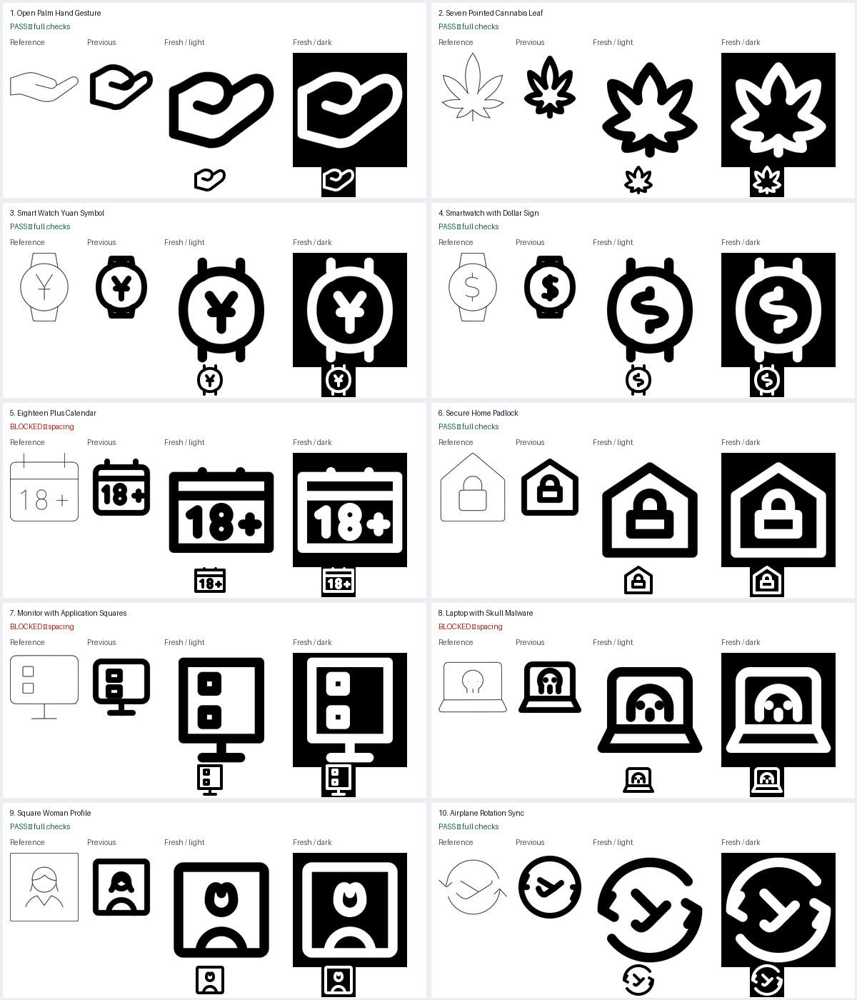

# Fresh primitive repairs — 25 September 2026

All ten requested inputs received a fresh standalone run. Seven pass the full model, holes/pinches, symmetry and internal-spacing checks with no warnings. Three are saved as cannot-fix attempts, not passing icons.

The registered originals, earlier runs, published output, catalogs and queues were not modified. Author metadata uses `gpt-6`, the model identity provided in this session.

| Icon | Result | Files | SVG |
|---|---|---|---|
| 1. Open Palm Hand Gesture | Pass | [run](/Applications/Workspaces/pictographic/claude_skills/icon_set/work/primitive-make-ray/a322931e-aa9b-59e9-8a03-20657747f732/20260925-fresh-c5fdae55) | [SVG](/Applications/Workspaces/pictographic/claude_skills/icon_set/work/primitive-make-ray/a322931e-aa9b-59e9-8a03-20657747f732/20260925-fresh-c5fdae55/open-palm-hand-gesture-solo-b002-11.svg) |
| 2. Seven Pointed Cannabis Leaf | Pass | [run](/Applications/Workspaces/pictographic/claude_skills/icon_set/work/primitive-make-ray/487f3a05-de28-44cf-9e49-3130e24b6363/20260925-fresh-c5fdae55) | [SVG](/Applications/Workspaces/pictographic/claude_skills/icon_set/work/primitive-make-ray/487f3a05-de28-44cf-9e49-3130e24b6363/20260925-fresh-c5fdae55/seven-lobed-cannabis-leaf.svg) |
| 3. Smart Watch Yuan Symbol | Pass | [run](/Applications/Workspaces/pictographic/claude_skills/icon_set/work/primitive-make-ray/b1f2ce85-d591-4522-b2a6-64d3fc5c75f6/20260925-fresh-c5fdae55) | [SVG](/Applications/Workspaces/pictographic/claude_skills/icon_set/work/primitive-make-ray/b1f2ce85-d591-4522-b2a6-64d3fc5c75f6/20260925-fresh-c5fdae55/smart-watch-yuan-symbol.svg) |
| 4. Smartwatch with Dollar Sign | Pass | [run](/Applications/Workspaces/pictographic/claude_skills/icon_set/work/primitive-make-ray/6b9fab53-d945-4f18-86b9-fcc5bd5840ce/20260925-fresh-c5fdae55) | [SVG](/Applications/Workspaces/pictographic/claude_skills/icon_set/work/primitive-make-ray/6b9fab53-d945-4f18-86b9-fcc5bd5840ce/20260925-fresh-c5fdae55/smartwatch-dollar-sign.svg) |
| 5. Eighteen Plus Calendar | Cannot fix | [run](/Applications/Workspaces/pictographic/claude_skills/icon_set/work/primitive-make-ray/fc5ffdff-80e9-4119-bf62-fb7c515c5aad/20260925-fresh-c5fdae55) | [SVG](/Applications/Workspaces/pictographic/claude_skills/icon_set/work/primitive-make-ray/fc5ffdff-80e9-4119-bf62-fb7c515c5aad/20260925-fresh-c5fdae55/browser-with-18-plus-text.svg) |
| 6. Secure Home Padlock | Pass | [run](/Applications/Workspaces/pictographic/claude_skills/icon_set/work/primitive-make-ray/a7f1734e-4fae-4c0a-9d33-80bf4a3da78f/20260925-fresh-c5fdae55) | [SVG](/Applications/Workspaces/pictographic/claude_skills/icon_set/work/primitive-make-ray/a7f1734e-4fae-4c0a-9d33-80bf4a3da78f/20260925-fresh-c5fdae55/house-lock.svg) |
| 7. Monitor with Application Squares | Cannot fix | [run](/Applications/Workspaces/pictographic/claude_skills/icon_set/work/primitive-make-ray/1aef3c2a-6d0d-43a2-9616-698d70dc5298/20260925-fresh-c5fdae55) | [SVG](/Applications/Workspaces/pictographic/claude_skills/icon_set/work/primitive-make-ray/1aef3c2a-6d0d-43a2-9616-698d70dc5298/20260925-fresh-c5fdae55/monitor-small-squares.svg) |
| 8. Laptop with Skull Malware | Cannot fix | [run](/Applications/Workspaces/pictographic/claude_skills/icon_set/work/primitive-make-ray/44a8272b-04c4-4a7c-b200-ee122a35ef32/20260925-fresh-c5fdae55) | [SVG](/Applications/Workspaces/pictographic/claude_skills/icon_set/work/primitive-make-ray/44a8272b-04c4-4a7c-b200-ee122a35ef32/20260925-fresh-c5fdae55/laptop-skull.svg) |
| 9. Square Woman Profile | Pass | [run](/Applications/Workspaces/pictographic/claude_skills/icon_set/work/primitive-make-ray/7f5b5d3c-bed1-4393-a918-ca1a7b2fc9f1/20260925-fresh-c5fdae55) | [SVG](/Applications/Workspaces/pictographic/claude_skills/icon_set/work/primitive-make-ray/7f5b5d3c-bed1-4393-a918-ca1a7b2fc9f1/20260925-fresh-c5fdae55/square-woman.svg) |
| 10. Airplane Rotation Sync | Pass | [run](/Applications/Workspaces/pictographic/claude_skills/icon_set/work/primitive-make-ray/44d3d80b-4240-42cf-9ac4-2237f7c5d0aa/20260925-fresh-c5fdae55) | [SVG](/Applications/Workspaces/pictographic/claude_skills/icon_set/work/primitive-make-ray/44d3d80b-4240-42cf-9ac4-2237f7c5d0aa/20260925-fresh-c5fdae55/plane-1-solo.svg) |

## 1. Open Palm Hand Gesture

HRECT_M follows the horizontal open-palm gesture.

Construction: Lucide hand-helping: coherent thumb and finger contour; shared human_ref/full_body_ref.png informs simple round-ended anatomy (no head/body gap applies to a detached hand).

Changes and omissions: No defining feature omitted; finger separation follows the source’s single outline.

Thumb joins the finger outline at a shared point without the old enclosed sliver; rounded palm remains readable in both themes.

Full checks: pass, no warnings.

## 2. Seven Pointed Cannabis Leaf

SQUARE gives all seven lobes space while preserving the upright centre leaflet.

Construction: Lucide cannabis: mirrored coherent pointed lobes and short stem.

Changes and omissions: No lobes omitted; the central leaflet is shorter and side lobes broader to clear neighboring edges.

Seven pointed lobes, balanced valleys and short stem remain distinct at 48px.

Full checks: pass, no warnings.

## 3. Smart Watch Yuan Symbol

VRECT_L preserves the upright watch and broad round dial.

Construction: Lucide watch: a round dial and paired strap attachments.

Changes and omissions: Transverse strap end seams omitted; the two strap rails above and below the dial remain. Closing the seams at this dial size produced undersized pockets.

Yuan forks, bar and long stem remain visible in the round dial. Open strap rails are a deliberate simplification.

Full checks: pass, no warnings.

## 4. Smartwatch with Dollar Sign

VRECT_L preserves the upright watch and broad round dial.

Construction: Lucide watch: a round dial and paired strap attachments.

Changes and omissions: Transverse strap end seams and the small S terminal overhangs omitted; the S curve and two currency ticks remain. The compact closed-strap attempt was rejected because its symbol became a blob.

The S and terminal currency ticks read at 48px; retained larger dial is preferable to the rejected compact blob. Open strap rails are a deliberate simplification.

Full checks: pass, no warnings.

## 5. Eighteen Plus Calendar

HRECT_L maximizes the width available to the horizontal 18+ label.

Construction: Lucide calendar: repeated bindings and an enclosed header.

Changes and omissions: No defining feature omitted in the final failed candidate; enlarged-counter attempt is retained separately.

The 18+ remains recognizable, but the header, numeral spacing and right frame remain crowded. Not approved.

MIC: calendar versus one/eight/plus, header versus eight-top, and character-to-character gaps. Enlarging the 8 counters crowds the frame; the full retained horizontal label did not fit at 4-unit ink clearance.

## 6. Secure Home Padlock

SQUARE follows the house enclosure and centered lock.

Construction: Lucide house and lock: a coherent roof/wall outline with symmetric shackle.

Changes and omissions: Minor lower house corner fillets omitted to certify exact floor clearance.

The shackle opening and rectangular lock body remain distinct with balanced house margins.

Full checks: pass, no warnings.

## 7. Monitor with Application Squares

VRECT_L maximizes the available height for two vertically stacked tiles and the stand.

Construction: Lucide monitor: framed screen, centered stand and repeated squares.

Changes and omissions: No tile omitted or rearranged. The final failed candidate uses readable 6-unit squares; the larger 8-unit counter attempt is saved and fails against the screen floor.

Both square tiles are readable, but their inner openings and top/bottom margins fail. Not approved.

MIC: square-0 and square-1 internal edges and screen margins. Two 8-unit square centerline heights, an 8-unit gap and 8-unit top/bottom margins require 40 units for the screen alone; an 8-unit stand needs more than any SOLO48 rectangle height.

## 8. Laptop with Skull Malware

HRECT_L preserves the wide laptop and flared keyboard base.

Construction: Lucide skull: a cranium, eye sockets and short jaw markers.

Changes and omissions: No defining feature omitted in the final failed candidate. The tooth-free larger-screen attempt is also saved.

The flared base and skull remain recognizable, but eyes, tooth and jaw are crowded. Not approved.

MIC: screen versus jaw/tooth; cranium versus eye-20/eye-28; eyes versus tooth. Enlarging the head or moving the jaw trades one failed clearance for another inside the retained laptop.

## 9. Square Woman Profile

SQUARE preserves the portrait frame.

Construction: Lucide square-user-round plus human_ref/user.svg: circular jaw and broad smooth shoulders.

Changes and omissions: Separate fringe loop and lateral hair flicks omitted; the crown is a simplified parted outline, with a circular jaw and cropped shoulder arch.

The framed portrait is readable, with a simplified parted hairstyle. Circular jaw radius 5 about (24,20) ends at y=25; shoulder top y=33 gives exactly 8 centerline / 4 visible units of detached head/body clearance.

Full checks: pass, no warnings.

## 10. Airplane Rotation Sync

CIRCLE follows the two circular motion arrows.

Construction: Lucide plane: diagonal swept-wing construction; the supplied reference owns the two circular arrows and open airplane gesture.

Changes and omissions: No defining feature omitted; open orbit gaps restored, tail shortened and wing rebalanced.

Open opposing arrows and swept-wing airplane read clearly; diagonal plane direction and tail are intentionally asymmetric.

Full checks: pass, no warnings.
