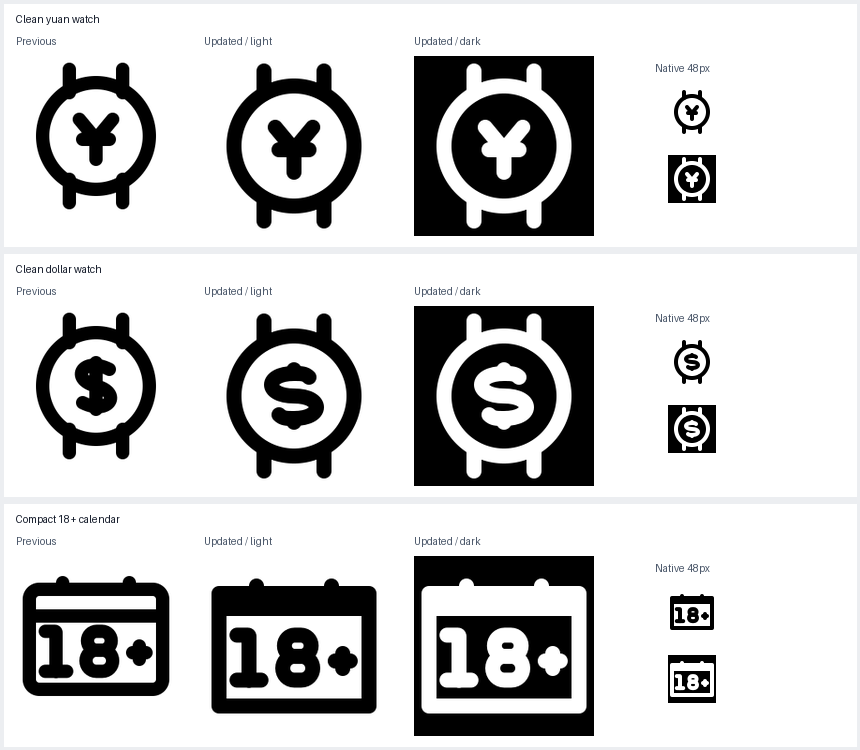

# Watch cleanup and compact calendar

Both watch outlines are clean. The calendar uses the requested 4-unit centerline top spacing and a more balanced text position. Earlier runs are preserved.

| Icon | Result | Folder | SVG |
|---|---|---|---|
| Clean yuan watch | pass | [folder](/Applications/Workspaces/pictographic/claude_skills/icon_set/work/primitive-make-ray/b1f2ce85-d591-4522-b2a6-64d3fc5c75f6/20260925-clean-c15034e0) | [SVG](/Applications/Workspaces/pictographic/claude_skills/icon_set/work/primitive-make-ray/b1f2ce85-d591-4522-b2a6-64d3fc5c75f6/20260925-clean-c15034e0/smart-watch-yuan-symbol.svg) |
| Clean dollar watch | accepted-user-spacing-exception | [folder](/Applications/Workspaces/pictographic/claude_skills/icon_set/work/primitive-make-ray/6b9fab53-d945-4f18-86b9-fcc5bd5840ce/20260925-clean-c15034e0) | [SVG](/Applications/Workspaces/pictographic/claude_skills/icon_set/work/primitive-make-ray/6b9fab53-d945-4f18-86b9-fcc5bd5840ce/20260925-clean-c15034e0/smartwatch-dollar-sign.svg) |
| Compact 18+ calendar | text-validation-pending | [folder](/Applications/Workspaces/pictographic/claude_skills/icon_set/work/primitive-make-ray/fc5ffdff-80e9-4119-bf62-fb7c515c5aad/20260925-clean-c15034e0) | [SVG](/Applications/Workspaces/pictographic/claude_skills/icon_set/work/primitive-make-ray/fc5ffdff-80e9-4119-bf62-fb7c515c5aad/20260925-clean-c15034e0/browser-with-18-plus-text.svg) |

## Clean yuan watch

Stopped all four strap rails inside the bezel ink. Exact circular dial retained, with no small rail tips extending inside.

## Clean dollar watch

Cleaned the four strap joins and replaced the through-stem with terminal dollar ticks matching the original reference. This removes both tiny enclosed slivers while retaining a recognizable dollar. Previously approved tight internal S spacing is retained.

## Compact 18+ calendar

Reduced the top rim-to-divider centerline spacing from 8 to the requested 4 units (y=10 to y=14). Squared the compact top corners to remove corner pockets. Recentered typeface-v2 digits upward by 1.5 units and the plus by 1 unit, giving approximately 3 units of visible space above and below the digits. Typeface outlines and 4-unit stroke are retained.

The yuan watch passes full validation. The dollar has no holes or pinches; its remaining sampled spacing findings are covered by the existing dollar-only approval. The calendar retains text/grid validation findings; the new top-spacing approval is scoped to the header.
