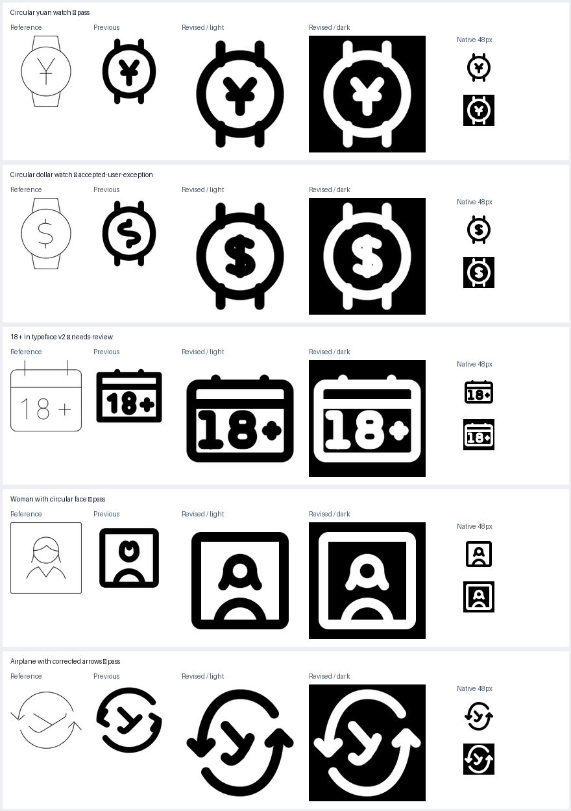

# Feedback revisions

Five fresh runs, preserving all earlier results. Three pass full checks, the dollar is accepted under the user’s scoped spacing exception, and the typeface-v2 calendar remains flagged by strict checks.

| Revision | Status | Source folder | SVG |
|---|---|---|---|
| Circular yuan watch | pass | [folder](/Applications/Workspaces/pictographic/claude_skills/icon_set/work/primitive-make-ray/b1f2ce85-d591-4522-b2a6-64d3fc5c75f6/20260925-feedback-fed4a5e4) | [SVG](/Applications/Workspaces/pictographic/claude_skills/icon_set/work/primitive-make-ray/b1f2ce85-d591-4522-b2a6-64d3fc5c75f6/20260925-feedback-fed4a5e4/smart-watch-yuan-symbol.svg) |
| Circular dollar watch | accepted-user-exception | [folder](/Applications/Workspaces/pictographic/claude_skills/icon_set/work/primitive-make-ray/6b9fab53-d945-4f18-86b9-fcc5bd5840ce/20260925-feedback-fed4a5e4) | [SVG](/Applications/Workspaces/pictographic/claude_skills/icon_set/work/primitive-make-ray/6b9fab53-d945-4f18-86b9-fcc5bd5840ce/20260925-feedback-fed4a5e4/smartwatch-dollar-sign.svg) |
| 18+ in typeface v2 | needs-review | [folder](/Applications/Workspaces/pictographic/claude_skills/icon_set/work/primitive-make-ray/fc5ffdff-80e9-4119-bf62-fb7c515c5aad/20260925-feedback-fed4a5e4) | [SVG](/Applications/Workspaces/pictographic/claude_skills/icon_set/work/primitive-make-ray/fc5ffdff-80e9-4119-bf62-fb7c515c5aad/20260925-feedback-fed4a5e4/browser-with-18-plus-text.svg) |
| Woman with circular face | pass | [folder](/Applications/Workspaces/pictographic/claude_skills/icon_set/work/primitive-make-ray/7f5b5d3c-bed1-4393-a918-ca1a7b2fc9f1/20260925-feedback-fed4a5e4) | [SVG](/Applications/Workspaces/pictographic/claude_skills/icon_set/work/primitive-make-ray/7f5b5d3c-bed1-4393-a918-ca1a7b2fc9f1/20260925-feedback-fed4a5e4/square-woman.svg) |
| Airplane with corrected arrows | pass | [folder](/Applications/Workspaces/pictographic/claude_skills/icon_set/work/primitive-make-ray/44d3d80b-4240-42cf-9ac4-2237f7c5d0aa/20260925-feedback-fed4a5e4) | [SVG](/Applications/Workspaces/pictographic/claude_skills/icon_set/work/primitive-make-ray/44d3d80b-4240-42cf-9ac4-2237f7c5d0aa/20260925-feedback-fed4a5e4/plane-1-solo.svg) |

## Circular yuan watch

Replaced the six-cubic dial with an exact circle, center (24,24), radius 16. Strap rails overlap the bezel at genuine intersections. Yuan stems and forks retain integer geometry.

Lucide watch: round dial and strap construction.

## Circular dollar watch

Exact circular dial, recognizable S and vertical dollar stem. The user explicitly permitted dollar spacing below 4 units; all remaining negative-space findings are within this symbol.

Lucide watch and the supplied dollar reference. Dollar spacing exception is user-authorized, not an automatic geometric pass.

## 18+ in typeface v2

Reused digit-1 and digit-8 outlines from icon_set/typeface/glyphs-v2.json at 80% coordinate size with the required 4-unit stroke. No replacement digit shapes were authored. Typeface v2 has no plus glyph, so the geometric plus remains. The full native-size attempt is preserved in native-size-attempt/.

Typeface v2 glyph IDs digit-1 and digit-8; Lucide calendar enclosure.

## Woman with circular face

Replaced the M-shaped outline with a circular head of radius 5 centered at (24,20), with two hair tails and a smooth shoulder arch. Head bottom 25 and shoulder top 33 preserve exactly 4 units of visible separation.

Shared human_ref/user.svg, Lucide square-user-round, and supplied square woman reference.

## Airplane with corrected arrows

Rebuilt two V-shaped arrowheads: left points down, right points up. Their terminal directions follow the orbit strokes. Both arrowheads use equal four-unit arms; open orbit gaps preserve the source arrangement.

Supplied airplane/orbit reference and Lucide plane construction inspected earlier.
