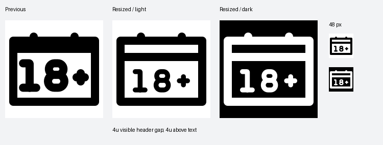

# Resized 18+ calendar

Typeface v2 is now at 60% proportional size, including 2.4-unit text strokes. The calendar outline remains 4 units thick. Both the header opening and the space from the divider to the text are exactly **4 visible units**, verified from the emitted SVG ink bounds.

[SVG](/Applications/Workspaces/pictographic/claude_skills/icon_set/work/primitive-make-ray/fc5ffdff-80e9-4119-bf62-fb7c515c5aad/20260925-text-resize-d586e92a/browser-with-18-plus-text.svg) · [Python](/Applications/Workspaces/pictographic/claude_skills/icon_set/work/primitive-make-ray/fc5ffdff-80e9-4119-bf62-fb7c515c5aad/20260925-text-resize-d586e92a/browser_with_18_plus_text_fc5ffdff_80e9_4119_bf62_fb7c515c5aad.py) · [Measurements](/Applications/Workspaces/pictographic/claude_skills/icon_set/work/primitive-make-ray/fc5ffdff-80e9-4119-bf62-fb7c515c5aad/20260925-text-resize-d586e92a/measurements.json)

The full automatic checker still reports findings because this uses resized typeface geometry and text strokes rather than uniform SOLO48 icon primitives. Its unchanged raw findings remain in release-validation.json; this result is not labelled a strict automatic pass. No validators, earlier runs or registered icons were changed.
