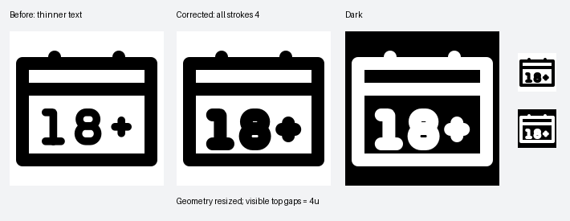

# Calendar text dimensions corrected

Only the typeface-v2 geometry is resized to 60%. **Every emitted stroke is 4 units**, including the digits and plus. There are no per-path stroke overrides.

The header opening and the divider-to-text opening are each **4 visible units**, verified from the SVG ink bounds.

[SVG](/Applications/Workspaces/pictographic/claude_skills/icon_set/work/primitive-make-ray/fc5ffdff-80e9-4119-bf62-fb7c515c5aad/20260925-text-stroke4-e0f23c6d/browser-with-18-plus-text.svg) · [Python](/Applications/Workspaces/pictographic/claude_skills/icon_set/work/primitive-make-ray/fc5ffdff-80e9-4119-bf62-fb7c515c5aad/20260925-text-stroke4-e0f23c6d/browser_with_18_plus_text_fc5ffdff_80e9_4119_bf62_fb7c515c5aad.py) · [Measurements](/Applications/Workspaces/pictographic/claude_skills/icon_set/work/primitive-make-ray/fc5ffdff-80e9-4119-bf62-fb7c515c5aad/20260925-text-stroke4-e0f23c6d/measurements.json)

The smaller 8 has tight counters with the restored stroke weight. Full automatic findings are retained in release-validation.json; this is not labelled a strict validation pass. Earlier versions are preserved.
