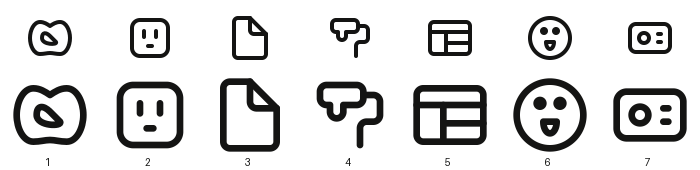
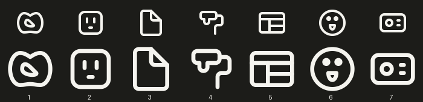

# Solo queue offset 30 — 10 references

Seven standalone icons generated; one container combination saved and verified; two references unresolved. No changed-status skips and no saving failures. No component generation jobs started. Existing drafts and unrelated working changes preserved.

All seven exports are present in `published/solo48/manifest.json`, with valid status, zero warnings, zero errors and matching SVG hashes. Actual exported SVGs were inspected at native 48px and enlarged size in both light and dark themes. Author metadata: `gpt-6`. Shared build-lock conflicts were retried successfully.

## 1. 68369691-77d6-4ea8-94e8-beffbe094ced

**looped-soft-pretzel — generated, valid, zero warnings.**

HRECT_L preserves the wide lobed silhouette. No matching Lucide pretzel found.

Broad lobes and diagonal opening remain recognizable against the stylized source. Tiny end seams omitted.

- Python: [looped_soft_pretzel_68369691_77d6_4ea8_94e8_beffbe094ced.py](/Applications/Workspaces/pictographic/claude_skills/icon_set/model/icons/solo/looped_soft_pretzel_68369691_77d6_4ea8_94e8_beffbe094ced.py)
- SVG: [looped-soft-pretzel.svg](/Applications/Workspaces/pictographic/claude_skills/published/solo48/looped-soft-pretzel.svg)
- Original reference: `pictographic-primitives/_uncategorized_29/outdoors bird_68369691-77d6-4ea8-94e8-beffbe094ced.svg`

## 2. 176149f5-709e-4aea-827c-9e372966aa1a

**Verified container combination:** Open sloping-roof dog shelter (`container`) + Standing right-facing dog (`sub`).

Saved skip/container status, review note, both concept-specific briefs, and amended reference family/brief through the gallery API. Readback matched intended fields; the server only trimmed the reference brief’s final newline. Original source UUID/path and editorial description retained. No artwork changed.

[Payloads](02-payloads.json) · [Readback](02-current.json) · [Verification](02-verified.json)

## 3. af64bf2f-9861-47e0-9d9c-296a8223559a

**rounded-electrical-wall-outlet — generated, valid, zero warnings.**

SQUARE preserves the wall plate; Lucide plug informed rounded housing and paired terminals.

Paired slots and grounding mark remain clear in both themes. Redundant inner border omitted.

- Python: [rounded_electrical_wall_outlet_af64bf2f_9861_47e0_9d9c_296a8223559a.py](/Applications/Workspaces/pictographic/claude_skills/icon_set/model/icons/solo/rounded_electrical_wall_outlet_af64bf2f_9861_47e0_9d9c_296a8223559a.py)
- SVG: [rounded-electrical-wall-outlet.svg](/Applications/Workspaces/pictographic/claude_skills/published/solo48/rounded-electrical-wall-outlet.svg)
- Original reference: `pictographic-primitives/_uncategorized_29/outlet_af64bf2f-9861-47e0-9d9c-296a8223559a.svg`

## 4. 6d047f85-afa5-429d-afe6-932e1b6b7978

**blank-page-triangular-fold — generated, valid, zero warnings.**

VRECT_L preserves upright page proportions; Lucide file informed connected fold construction.

Fold reads clearly with a blank page interior; no detail omitted.

- Python: [blank_page_triangular_fold_6d047f85_afa5_429d_afe6_932e1b6b7978.py](/Applications/Workspaces/pictographic/claude_skills/icon_set/model/icons/solo/blank_page_triangular_fold_6d047f85_afa5_429d_afe6_932e1b6b7978.py)
- SVG: [blank-page-triangular-fold.svg](/Applications/Workspaces/pictographic/claude_skills/published/solo48/blank-page-triangular-fold.svg)
- Original reference: `pictographic-primitives/_uncategorized_29/page_6d047f85-afa5-429d-afe6-932e1b6b7978.svg`

## 5. 8ec4dcf1-6b9f-4a7f-8ed3-76e17d8dfc79

**paint-roller-with-drips — generated, valid, zero warnings.**

SQUARE balances roller and handle; Lucide paint-roller informed their construction.

Integrated paint drip and bent handle read clearly. Secondary drips and handle double outline omitted.

- Python: [paint_roller_with_drips_8ec4dcf1_6b9f_4a7f_8ed3_76e17d8dfc79.py](/Applications/Workspaces/pictographic/claude_skills/icon_set/model/icons/solo/paint_roller_with_drips_8ec4dcf1_6b9f_4a7f_8ed3_76e17d8dfc79.py)
- SVG: [paint-roller-with-drips.svg](/Applications/Workspaces/pictographic/claude_skills/published/solo48/paint-roller-with-drips.svg)
- Original reference: `pictographic-primitives/_uncategorized_29/paint roller_8ec4dcf1-6b9f-4a7f-8ed3-76e17d8dfc79.svg`

## 6. ccb75c3d-d503-467f-95c7-2c3351e3080c

**four-panel-dashboard-layout — generated, valid, zero warnings.**

HRECT_L provides clear panel spacing; Lucide panels-top-left informed shared dividers.

All four panels remain distinct, with intentional joined dividers. No content removed.

- Python: [four_panel_dashboard_layout_ccb75c3d_d503_467f_95c7_2c3351e3080c.py](/Applications/Workspaces/pictographic/claude_skills/icon_set/model/icons/solo/four_panel_dashboard_layout_ccb75c3d_d503_467f_95c7_2c3351e3080c.py)
- SVG: [four-panel-dashboard-layout.svg](/Applications/Workspaces/pictographic/claude_skills/published/solo48/four-panel-dashboard-layout.svg)
- Original reference: `pictographic-primitives/_uncategorized_29/panel_ccb75c3d-d503-467f-95c7-2c3351e3080c.svg`

## 7. f422872b-42cf-4b74-aa1f-bf870f557d7a

**Unresolved; not counted as generated.**

Original draft fails keyshape and leg-to-leg clearance (3.83 and 3.85 versus required 8). Wider VRECT_L trial still fails clearance (5.34 and 7.07) and has an undeclared crossing. Neither is exported; original draft preserved. See 07-existing-draft-validation.txt and 07-revised-validation.txt.

## 8. b7b88464-3cc0-499b-ab8a-f9847d3456ba

**three-hole-round-power-socket — generated, valid, zero warnings.**

CIRCLE prioritizes the socket face; source supplies the grounding shape and plug reference informs paired terminals.

Paired pin holes and flat-topped ground remain distinct. Outer square wall plate omitted to keep the circular socket face readable.

- Python: [three_hole_round_power_socket_b7b88464_3cc0_499b_ab8a_f9847d3456ba.py](/Applications/Workspaces/pictographic/claude_skills/icon_set/model/icons/solo/three_hole_round_power_socket_b7b88464_3cc0_499b_ab8a_f9847d3456ba.py)
- SVG: [three-hole-round-power-socket.svg](/Applications/Workspaces/pictographic/claude_skills/published/solo48/three-hole-round-power-socket.svg)
- Original reference: `pictographic-primitives/_uncategorized_31/power outlet type k_b7b88464-3cc0-499b-ab8a-f9847d3456ba.svg`

## 9. d1642925-c41a-4fac-91c9-42439f1cbb77

**wide-multimedia-projector — generated, valid, zero warnings.**

HRECT_M is the shallow broad envelope; Lucide projector informed lens and vents.

Circular lens and paired vents remain distinct in the broad housing. No source features removed.

- Python: [wide_multimedia_projector_d1642925_c41a_4fac_91c9_42439f1cbb77.py](/Applications/Workspaces/pictographic/claude_skills/icon_set/model/icons/solo/wide_multimedia_projector_d1642925_c41a_4fac_91c9_42439f1cbb77.py)
- SVG: [wide-multimedia-projector.svg](/Applications/Workspaces/pictographic/claude_skills/published/solo48/wide-multimedia-projector.svg)
- Original reference: `pictographic-primitives/_uncategorized_31/projector_d1642925-c41a-4fac-91c9-42439f1cbb77.svg`

## 10. 947154d2-ba94-40d8-86da-58585ad61c10

**Unresolved; not counted as generated.**

Existing draft passes numerical validation but joins the two window corners directly into the doorway, creating a grid-like merged opening at 48px. It also lacks split receiver nodes on the floor. Paired square windows plus separated doorway and roof exceed the useful spacing budget in this layout. Draft preserved, not exported as complete.
