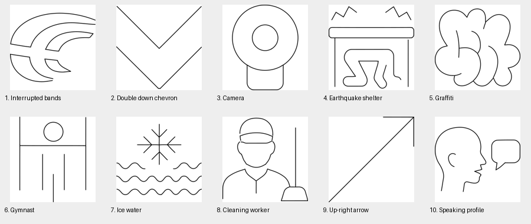
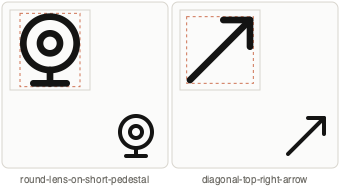
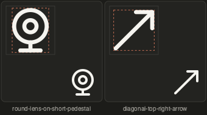

# Solo queue — offset 10

Fixed returned page: 10 references, processed in returned order. Status and saved brief were read immediately before each item from http://localhost:8000. Source renders and readback snapshots are beside this report. No replacement page was fetched.

Two Python originals authored and visually reviewed; export verification recorded below. One item deferred to its existing sub family; seven remain unresolved. No combinations were definitively classified, so no gallery writes or component preparation claims were made.

## 1. Triple Curved Arcs Symbol

UUID: `e89d9bcb-0e93-4a07-abd4-7740608fbbd7`

Source: `pictographic-primitives/_uncategorized_13/crowdin logo_e89d9bcb-0e93-4a07-abd4-7740608fbbd7.svg`

Unresolved reference: upper band contours reach the right crop edge without establishing their complete endings. The broad tapered, interrupted bands cannot be confidently reconstructed as a complete mark from this crop. Inspected the actual SVG render; no original drawn. Lucide rss was inspected as a nested-arc construction reference but does not resolve the missing logo contour.

## 2. Double Downward Chevron

UUID: `566c0e57-a142-4e0c-b0fc-b66d54d9dee7`

Source: `pictographic-primitives/_uncategorized_15/down 2_566c0e57-a142-4e0c-b0fc-b66d54d9dee7.svg`

Skipped for current family: saved brief assigns sub and explicitly defers to icon-sub on SUB32. Preserved this newer user classification; no SOLO48 drawing or gallery change.

## 3. Digital Web Camera

UUID: `bacf81f7-d345-4811-883f-80c90e127362`

Source: `pictographic-primitives/_uncategorized_16/eardrum_bacf81f7-d345-4811-883f-80c90e127362.svg`

Authored round-lens-on-short-pedestal. Validation valid with zero errors/warnings. Light and dark native 48px renders inspected: concentric lens is open, centered, and recognizable as a camera; stem and foot are legible. VRECT_L fits the upright circular housing and pedestal. Broad rounded source foot simplified to a T pedestal; Lucide webcam supplies the shared stem/base construction.

## 4. Earthquake Shelter Under Table

UUID: `8d2595e2-135f-48bd-8886-08c5da475869`

Source: `pictographic-primitives/_uncategorized_16/earthquake hiding proof table_8d2595e2-135f-48bd-8886-08c5da475869.svg`

Unresolved reference: table and vibration lines are clear, but the person contour has no visible head and an open end near the right foot. A precise head/neck axis and crouching limb assignment cannot be established confidently. Inspected full_body_ref.png; kept the source unchanged and did not invent missing anatomy.

## 5. Stylized Graffiti Cloud

UUID: `c6d7f6d7-a700-4894-830b-9788ba0a2a17`

Source: `pictographic-primitives/_uncategorized_21/graffiti_c6d7f6d7-a700-4894-830b-9788ba0a2a17.svg`

Existing review hold retained. Rounded interlocking strokes can be abstract graffiti or stylized lettering; no reliable text reading is established by the rendered source. No glyphs invented.

## 6. Gymnast on Horizontal Bar

UUID: `3e406d94-3472-495a-b48a-7dc0d21a13ed`

Source: `pictographic-primitives/_uncategorized_21/gymnastics acrobatic hanging person_3e406d94-3472-495a-b48a-7dc0d21a13ed.svg`

Existing review hold retained. Circular head and apparatus bar are clear; three disconnected vertical lower strokes do not establish the torso/arms/legs or whether the figure hangs or supports itself. No pose invented.

## 7. Snowflake and Water Waves

UUID: `757a7e35-7ab6-4777-857e-44cd9f41831d`

Source: `pictographic-primitives/_uncategorized_23/ice water_757a7e35-7ab6-4777-857e-44cd9f41831d.svg`

Existing review hold retained. Snowflake above waves can read as a cold-water modifier or a snow-and-water scene. Saved independent draft descriptions preserved; no definitive split or component job initiated.

## 8. Cleaning Worker with Broom

UUID: `9c89e718-df3d-451b-808f-bb9daab2e5b2`

Source: `pictographic-primitives/_uncategorized_23/janitor_9c89e718-df3d-451b-808f-bb9daab2e5b2.svg`

Existing review hold retained. Capped portrait and broom overlap without a visible gripping hand; occupational portrait versus separate equipment modifier remains unconfirmed. No reclassification or generation.

## 9. Diagonal Top Right Arrow

UUID: `e7e9a99a-f549-4a65-b8f6-bb7790c0aab4`

Source: `pictographic-primitives/_uncategorized_24/keyboard arrow top right_e7e9a99a-f549-4a65-b8f6-bb7790c0aab4.svg`

Authored diagonal-top-right-arrow on SOLO48 as the saved brief requests. Validation valid with zero errors/warnings. SQUARE keeps equal horizontal/vertical travel. Source long shaft and short equal head arms retained; Lucide arrow-up-right contributes the continuous head contour and shared tip. Light/dark native 48px review: clear direction, balanced head, clean junction, no omitted subject features.

## 10. Speaking Person with Speech Bubble

UUID: `d3d86e97-b873-48ff-bd6b-fc4456184a6e`

Source: `pictographic-primitives/_uncategorized_25/linguist_d3d86e97-b873-48ff-bd6b-fc4456184a6e.svg`

Existing review hold retained. Empty bubble and speaking profile can be a natural speech scene or an independent communication modifier. Existing component drafts preserved; no definitive split or generation.

## Completion gate

The icon-solo-queue skill says: “If the reference cannot be inspected or its interpretation remains ambiguous, report that limitation and skip drawing this item.” This was applied to the seven unresolved references. Their gallery records were preserved. No save failed; no save was attempted.

Author metadata: gpt-6. No commits, metadata seeding, full-library build, or source artwork edits.

## Output paths

- Python: `icon_set/model/icons/solo/round_lens_on_short_pedestal_bacf81f7_d345_4811_883f_80c90e127362.py`
- SVG: `published/solo48/round-lens-on-short-pedestal.svg`
- Python: `icon_set/model/icons/solo/arrow_up_right_e7e9a99a_f549_4a65_b8f6_bb7790c0aab4.py`
- SVG: `published/solo48/diagonal-top-right-arrow.svg`
- Manifest: `published/solo48/manifest.json`
- Validation details: `validation.json`
- Full per-source saved brief/status snapshots and outcomes: `batch-record.json`

## Verified export result

Both targeted builds succeeded. Each checked only its requested original and reused other icons. Both entries are present in the solo manifest with valid status, zero errors and zero warnings; file hashes match the manifest. Actual exported SVGs were inspected at native 48 pixels in light and dark themes. Build-lock contention was resolved by waiting; no other build was interrupted.
