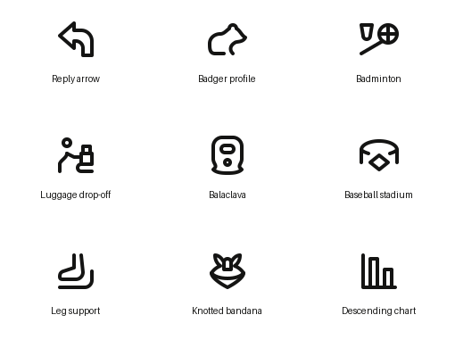
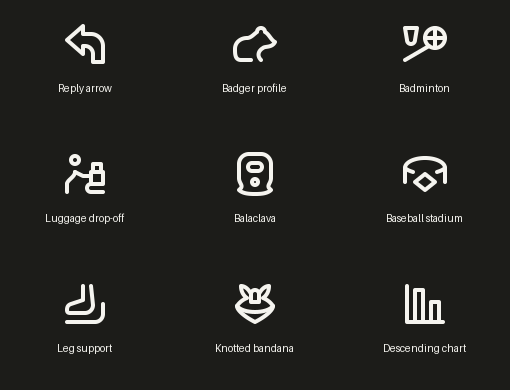

# Solo queue offset 20 — 2026-09-21

Requested offset: **20**. Returned item count: **10**. Fixed worklist; no replacement fetches.

Nine standalone originals validate **valid, zero warnings** and have been visually inspected at native48px in light and dark themes. All nine SVG exports are present in `published/solo48/manifest.json`, with valid status, zero warnings, and matching SHA-256 hashes. One side combination was saved and verified; no component generation was started.

No item was skipped because its status changed. Current gallery status and reference brief were read immediately before each item.

## Preview of actual exported SVGs

## Standalone originals

### broad-bent-reply-arrow

- Source UUID: `6d29648f-c9a8-4dec-bbe0-57e28586a4d0`
- Reference: `pictographic-primitives/_uncategorized_05/backward_6d29648f-c9a8-4dec-bbe0-57e28586a4d0.svg`
- Original: `icon_set/model/icons/solo/broad_bent_reply_arrow_6d29648f_c9a8_4dec_bbe0_57e28586a4d0.py`
- Verified export: `published/solo48/broad-bent-reply-arrow.svg`
- Keyshape: `SQUARE`. The square envelope supports the broad left head and upright lower stem.
- Simplification: Preserved the outline arrow and tangent bend; omitted tiny corner rounds.
- References and visual findings: Source SVG and Lucide corner-up-left; one continuous contour stays readable in both themes.
- Validation and export: valid, zero warnings; SVG file and manifest hash verified.

### seated-badger-in-right-profile

- Source UUID: `5bb2d73b-f3a4-43fd-add6-fac9786654ae`
- Reference: `pictographic-primitives/_uncategorized_05/badger_5bb2d73b-f3a4-43fd-add6-fac9786654ae.svg`
- Original: `icon_set/model/icons/solo/seated_badger_in_right_profile_5bb2d73b_f3a4_43fd_add6_fac9786654ae.py`
- Verified export: `published/solo48/seated-badger-in-right-profile.svg`
- Keyshape: `HRECT_L`. The wide envelope retains the seated animal’s low back and projecting muzzle.
- Simplification: Omitted the tiny eye and rear-foot crease.
- References and visual findings: Source SVG; no Lucide badger match. The seated animal silhouette is clear; species specificity is limited by the original reference.
- Validation and export: valid, zero warnings; SVG file and manifest hash verified.

### badminton-racket-beside-a-shuttlecock

- Source UUID: `de6f8f15-e075-4e2c-853a-cbcc18e0b3cc`
- Reference: `pictographic-primitives/_uncategorized_05/badminton shuttlecock racquet_de6f8f15-e075-4e2c-853a-cbcc18e0b3cc.svg`
- Original: `icon_set/model/icons/solo/badminton_racket_beside_a_shuttlecock_de6f8f15_e075_4e2c_853a_cbcc18e0b3cc.py`
- Verified export: `published/solo48/badminton-racket-beside-a-shuttlecock.svg`
- Keyshape: `HRECT_L`. The wide envelope separates the diagonal racket and upper-left shuttlecock while keeping a measurable feather opening.
- Simplification: Reduced dense strings to a cross, simplified grip to one stroke, and retained a tapered shuttle silhouette.
- References and visual findings: Source SVG; no Lucide racket match. Equipment pair remains separate and legible in both themes.
- Validation and export: valid, zero warnings; SVG file and manifest hash verified.

### traveler-reaching-toward-a-conveyor-bag

- Source UUID: `628e2485-fa55-4e32-b7c2-f281f700d7b3`
- Reference: `pictographic-primitives/_uncategorized_05/baggage leave_628e2485-fa55-4e32-b7c2-f281f700d7b3.svg`
- Original: `icon_set/model/icons/solo/traveler_reaching_toward_a_conveyor_bag_628e2485_fa55_4e32_b7c2_f281f700d7b3.py`
- Verified export: `published/solo48/traveler-reaching-toward-a-conveyor-bag.svg`
- Keyshape: `SQUARE`. The square envelope fits the person beside the handled bag and conveyor.
- Simplification: Unified the torso, retained one source-backed leg, and kept the handle and lower conveyor.
- References and visual findings: Source SVG and human_ref/full_body_ref.png. Circular head at (14,10), radius4; torso begins (14,22), yielding exactly4 ink clearance on the upper torso axis.
- Validation and export: valid, zero warnings; SVG file and manifest hash verified.

### balaclava-with-eye-and-mouth-openings

- Source UUID: `ae1218cb-59f4-4df2-984f-467a5018de64`
- Reference: `pictographic-primitives/_uncategorized_05/balaclava_ae1218cb-59f4-4df2-984f-467a5018de64.svg`
- Original: `icon_set/model/icons/solo/balaclava_with_eye_and_mouth_openings_ae1218cb_59f4_4df2_984f_467a5018de64.py`
- Verified export: `published/solo48/balaclava-with-eye-and-mouth-openings.svg`
- Keyshape: `VRECT_L`. The tall envelope supports the crown, narrow neck and flared garment hem.
- Simplification: Simplified the pinched eye opening to a capsule and oval mouth to a small circle.
- References and visual findings: Source SVG; no Lucide balaclava match. Openings remain visible, and the neck/hem distinguishes the garment.
- Validation and export: valid, zero warnings; SVG file and manifest hash verified.

### open-baseball-stadium-with-diamond

- Source UUID: `776dc545-fddf-46d7-8da8-cdfbb77f205c`
- Reference: `pictographic-primitives/_uncategorized_05/ballpark_776dc545-fddf-46d7-8da8-cdfbb77f205c.svg`
- Original: `icon_set/model/icons/solo/open_baseball_stadium_with_diamond_776dc545_fddf_46d7_8da8_cdfbb77f205c.py`
- Verified export: `published/solo48/open-baseball-stadium-with-diamond.svg`
- Keyshape: `HRECT_L`. The wide envelope retains the curved stadium wall around the diamond.
- Simplification: Omitted seating ticks, mound, and central lower wall; retained front-rim depth cues.
- References and visual findings: Source SVG; no Lucide stadium match. The infield is intrinsic to the scene, not an independent modifier.
- Validation and export: valid, zero warnings; SVG file and manifest hash verified.

### lower-leg-resting-in-a-support

- Source UUID: `198be850-92b5-4683-964e-34fac5eeb9e9`
- Reference: `pictographic-primitives/_uncategorized_05/bandage leg hanging_198be850-92b5-4683-964e-34fac5eeb9e9.svg`
- Original: `icon_set/model/icons/solo/lower_leg_resting_in_a_support_198be850_92b5_4683_964e_34fac5eeb9e9.py`
- Verified export: `published/solo48/lower-leg-resting-in-a-support.svg`
- Keyshape: `SQUARE`. The square envelope leaves room for the foot and upturned support rail.
- Simplification: Unified the leg and foot outline, widened the instep-to-sole opening, and omitted the upper rail to preserve clearance.
- References and visual findings: Source SVG; no Lucide foot match. The cropped limb and supporting cradle remain distinct in both themes.
- Validation and export: valid, zero warnings; SVG file and manifest hash verified.

### knotted-triangular-neck-bandana

- Source UUID: `da69e025-ec35-4e8e-b0d5-492782d18d44`
- Reference: `pictographic-primitives/_uncategorized_05/bandana_da69e025-ec35-4e8e-b0d5-492782d18d44.svg`
- Original: `icon_set/model/icons/solo/knotted_triangular_neck_bandana_da69e025_ec35_4e8e_b0d5_492782d18d44.py`
- Verified export: `published/solo48/knotted-triangular-neck-bandana.svg`
- Keyshape: `SQUARE`. The square envelope balances two mirrored tied ends above the triangular cloth.
- Simplification: Omitted inner neck seam arcs; retained central knot and broad curved fold.
- References and visual findings: Source SVG; no Lucide scarf match. Shared mirrored curve definitions preserve symmetry and readable fabric openings.
- Validation and export: valid, zero warnings; SVG file and manifest hash verified.

### two-descending-columns-on-axes

- Source UUID: `af5465db-c598-4951-abe8-0254bea610c7`
- Reference: `pictographic-primitives/_uncategorized_05/bar step_af5465db-c598-4951-abe8-0254bea610c7.svg`
- Original: `icon_set/model/icons/solo/two_descending_columns_on_axes_af5465db_c598_4951_abe8_0254bea610c7.py`
- Verified export: `published/solo48/two-descending-columns-on-axes.svg`
- Keyshape: `SQUARE`. The square envelope holds a full-height left axis with two descending bars.
- Simplification: No essential components omitted. Both bars share width8, step16 and baseline42.
- References and visual findings: Source SVG and Lucide chart-no-axes-column-decreasing; preserve two outlined bars, not Lucide’s three solid marks.
- Validation and export: valid, zero warnings; SVG file and manifest hash verified.

## Verified deferred side combination

- Source UUID: `ee2a071e-6904-4d7d-a879-a7315aec3bd6`
- Source: `pictographic-primitives/_uncategorized_05/baggage weight_ee2a071e-6904-4d7d-a879-a7315aec3bd6.svg`
- Classification: `status=skip`, `reason=combination`, `sub_position=top`.
- Main: **Suitcase on a baseline** (`solo`).
- Sub: **Round weight gauge** (`sub`).
- Saved reference family: `solo`. Reference brief amended to defer both components and prohibit generation as a single solo.
- Both API endpoints were read back. Classification, position, note, both component briefs, family and full reference brief matched the intended payloads after the server’s normal whitespace trimming.
- No saving failures. Payload evidence: [combination-verified.json](combination-verified.json).
- Existing combined suitcase draft was preserved unchanged.

## Scope

Source attribution and editorial tags retained. Author: `gpt-6` (an existing workspace author value). Three earlier drafts were repaired in place and promoted from `_draft_` filenames. No commit or full-library build requested. Unrelated working changes preserved.

## Final verification

All nine actual exported SVGs were rendered and inspected at 48px in both themes. Manifest status is valid with zero warnings for every icon, and each file hash matches its manifest record. Evidence: [exports-verified.json](exports-verified.json). Larger QA views: [light](light.png), [dark](dark.png).

The first build identified two internal-spacing failures (shuttle feather opening and foot instep-to-sole opening). Both were widened, passed export-level inspection, rebuilt successfully, and visually rechecked. No unresolved icons or saving failures remain. Shared build contention was handled through the same exclusive output lock; no workspace build or validation rules were changed.
