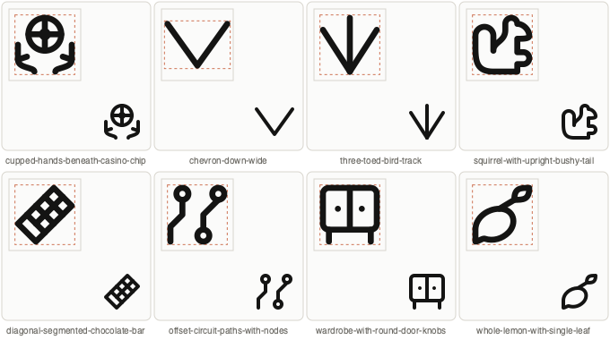
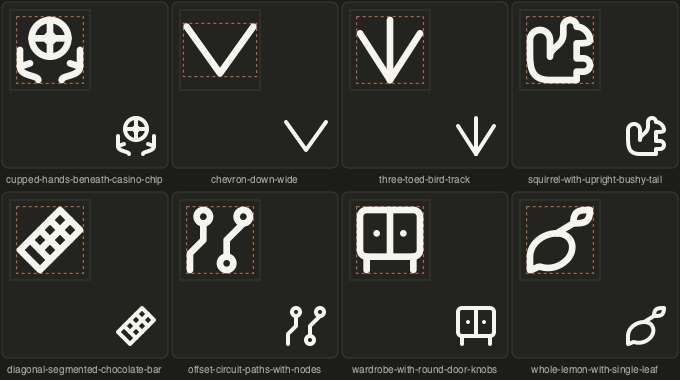

# Solo queue offset 20 — 2026-09-21

Requested offset: **20**. Returned item count: **10**, frozen in the original order below. Server: `http://localhost:8000`. No replacement page fetched. Every current status and saved brief was read immediately before processing; those snapshots are retained beside this report. All references were rendered and inspected. All are standalone subjects; no container or side combinations were identified, and no combination save operations were needed.

Author value used: `gpt-6-astra`. Existing unrelated work was preserved. No commit or full-library build was performed.

Completed: **8 generated**, **2 unresolved drafts**, **0 combinations**, **0 status-change skips**, **0 saving failures**.

## Results

| Source UUID | Subject / result |
|---|---|
| b647b3b3-c8a0-417f-8596-b2a79f452496 | cupped-hands-beneath-casino-chip — generated — valid with zero warnings; targeted build succeeded; solo manifest entry and SVG hash verified. |
| e6e7ff28-6ade-4296-95f7-4a6c7bd1ce2a | Litter tray with slotted scoop — unresolved visual review. Existing and revised upright scoop constructions pass model validation but read as a cup/straw instead of a slotted scoop. Earlier diagonal draft notes record envelope/slot-clearance failures. Retained as an excluded `_draft_` original; no export claimed. |
| 8abc756f-c377-4696-aa20-1e5c7798f4f4 | chevron-down-wide — generated — valid with zero warnings; targeted build succeeded; solo manifest entry and SVG hash verified. |
| ad358c09-b960-43ca-954d-80c6af3ca0cb | three-toed-bird-track — generated — valid with zero warnings; targeted build succeeded; solo manifest entry and SVG hash verified. |
| a51deaea-200e-4079-8de8-824f2bcd9803 | squirrel-with-upright-bushy-tail — generated — valid with zero warnings; targeted build succeeded; solo manifest entry and SVG hash verified. |
| 90727e4f-6950-41e8-a557-dfe10340c106 | diagonal-segmented-chocolate-bar — generated — valid with zero warnings; targeted build succeeded; solo manifest entry and SVG hash verified. |
| b003cefb-7628-4518-a203-95ce607f5b82 | offset-circuit-paths-with-nodes — generated — valid with zero warnings; targeted build succeeded; solo manifest entry and SVG hash verified. |
| 2ce6dd5a-e886-4158-9462-4ec687e19a2f | whole-lemon-with-single-leaf — generated — valid with zero warnings; targeted build succeeded; solo manifest entry and SVG hash verified. |
| a31f3f41-e636-492d-ad83-a82ed5593583 | Open-front hooded cloak — unresolved visual review. Existing VRECT_L draft passes model validation but reads as a badge. Smaller hood attempt had a 7.9994-unit curved clearance warning and poor recognition. Restored the pre-existing draft; no export claimed. |
| 4fb857a1-bc4b-44f0-99c2-01a3ea3cbb39 | wardrobe-with-round-door-knobs — generated — valid with zero warnings; targeted build succeeded; solo manifest entry and SVG hash verified. |

## Visual and construction evidence

Light and dark sheets show native 48-pixel renders alongside enlarged views. All accepted drawings retain recognizable silhouettes, intentional symmetry or asymmetry and open negative spaces.

Each original records its keyshape rationale, source attribution, reference contribution and omitted details. The hands use inspected Lucide hand construction; the chevron uses chevron-down; the squirrel uses squirrel; the circuit uses circuit-board; the wardrobe uses panels-top-left; the lemon uses leaf. No useful exact Lucide match was found for the bird footprint or chocolate bar.

The squirrel initially failed the publication-only internal-spacing check at its muzzle/paw gap. The gap was enlarged and full library QA now passes. The lemon draft originally used a false leaf/body contact; a real stem with shared endpoints replaces it, and full library QA passes.

## Files

- cupped-hands-beneath-casino-chip: [cupped_hands_beneath_casino_chip_b647b3b3_c8a0_417f_8596_b2a79f452496.py](/Applications/Workspaces/pictographic/claude_skills/icon_set/model/icons/solo/cupped_hands_beneath_casino_chip_b647b3b3_c8a0_417f_8596_b2a79f452496.py); [SVG](/Applications/Workspaces/pictographic/claude_skills/published/solo48/cupped-hands-beneath-casino-chip.svg).
- chevron-down-wide: [chevron_down_wide_8abc756f_c377_4696_aa20_1e5c7798f4f4.py](/Applications/Workspaces/pictographic/claude_skills/icon_set/model/icons/solo/chevron_down_wide_8abc756f_c377_4696_aa20_1e5c7798f4f4.py); [SVG](/Applications/Workspaces/pictographic/claude_skills/published/solo48/chevron-down-wide.svg).
- three-toed-bird-track: [three_toed_bird_track_ad358c09_b960_43ca_954d_80c6af3ca0cb.py](/Applications/Workspaces/pictographic/claude_skills/icon_set/model/icons/solo/three_toed_bird_track_ad358c09_b960_43ca_954d_80c6af3ca0cb.py); [SVG](/Applications/Workspaces/pictographic/claude_skills/published/solo48/three-toed-bird-track.svg).
- squirrel-with-upright-bushy-tail: [squirrel_with_upright_bushy_tail_a51deaea_200e_4079_8de8_824f2bcd9803.py](/Applications/Workspaces/pictographic/claude_skills/icon_set/model/icons/solo/squirrel_with_upright_bushy_tail_a51deaea_200e_4079_8de8_824f2bcd9803.py); [SVG](/Applications/Workspaces/pictographic/claude_skills/published/solo48/squirrel-with-upright-bushy-tail.svg).
- diagonal-segmented-chocolate-bar: [diagonal_segmented_chocolate_bar_90727e4f_6950_41e8_a557_dfe10340c106.py](/Applications/Workspaces/pictographic/claude_skills/icon_set/model/icons/solo/diagonal_segmented_chocolate_bar_90727e4f_6950_41e8_a557_dfe10340c106.py); [SVG](/Applications/Workspaces/pictographic/claude_skills/published/solo48/diagonal-segmented-chocolate-bar.svg).
- offset-circuit-paths-with-nodes: [offset_circuit_paths_with_nodes_b003cefb_7628_4518_a203_95ce607f5b82.py](/Applications/Workspaces/pictographic/claude_skills/icon_set/model/icons/solo/offset_circuit_paths_with_nodes_b003cefb_7628_4518_a203_95ce607f5b82.py); [SVG](/Applications/Workspaces/pictographic/claude_skills/published/solo48/offset-circuit-paths-with-nodes.svg).
- whole-lemon-with-single-leaf: [whole_lemon_with_single_leaf_2ce6dd5a_e886_4158_9462_4ec687e19a2f.py](/Applications/Workspaces/pictographic/claude_skills/icon_set/model/icons/solo/whole_lemon_with_single_leaf_2ce6dd5a_e886_4158_9462_4ec687e19a2f.py); [SVG](/Applications/Workspaces/pictographic/claude_skills/published/solo48/whole-lemon-with-single-leaf.svg).
- wardrobe-with-round-door-knobs: [wardrobe_with_round_door_knobs_4fb857a1_bc4b_44f0_99c2_01a3ea3cbb39.py](/Applications/Workspaces/pictographic/claude_skills/icon_set/model/icons/solo/wardrobe_with_round_door_knobs_4fb857a1_bc4b_44f0_99c2_01a3ea3cbb39.py); [SVG](/Applications/Workspaces/pictographic/claude_skills/published/solo48/wardrobe-with-round-door-knobs.svg).
