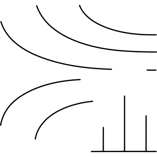
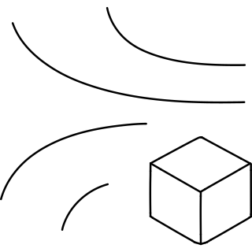
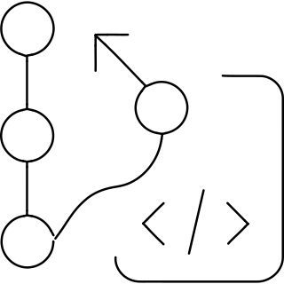
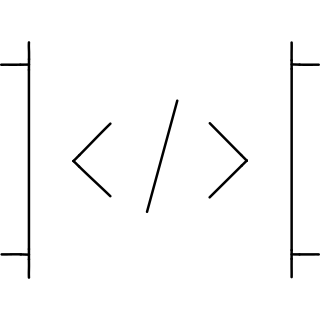
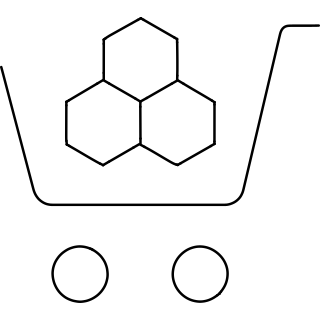

# Reconstruction worklist

105 icons from `icon_set/work/todo-solo-briefs-100-20260919/sources`.

Triage on the contact sheets in `sheets/`, then take one icon at a time:
read its brief, look at its render, and author it through
`icon_set/skills/icon-design/SKILL.md`.

| # | concept | brief | render |
|--:|---|---|---|
| 1 | air purifier 5_e1f5e900-261d-4886-9c63-8beef0eb6820 | [brief](briefs/air purifier 5_e1f5e900-261d-4886-9c63-8beef0eb6820.md) |  |
| 2 | align middle move vertical_29e16b26-9907-4b01-8d8d-32e83b655134 | [brief](briefs/align middle move vertical_29e16b26-9907-4b01-8d8d-32e83b655134.md) |  |
| 3 | align middle_8b9d4e0a-359e-4379-9775-672440b20630 | [brief](briefs/align middle_8b9d4e0a-359e-4379-9775-672440b20630.md) |  |
| 4 | align right move_bc08c07e-fd43-4866-85c6-472f38121c0c | [brief](briefs/align right move_bc08c07e-fd43-4866-85c6-472f38121c0c.md) |  |
| 5 | align stroke to outside_7107d06c-ba98-49e7-a8be-028e6362fd8c | [brief](briefs/align stroke to outside_7107d06c-ba98-49e7-a8be-028e6362fd8c.md) |  |
| 6 | align text middle_8778e35a-1425-48e5-aefe-135349acb68d | [brief](briefs/align text middle_8778e35a-1425-48e5-aefe-135349acb68d.md) |  |
| 7 | align top bottom_f31f1d33-4050-4371-af56-548e54cec150 | [brief](briefs/align top bottom_f31f1d33-4050-4371-af56-548e54cec150.md) |  |
| 8 | align top move_c7665d4b-d589-4003-8834-958ea7cbf3a9 | [brief](briefs/align top move_c7665d4b-d589-4003-8834-958ea7cbf3a9.md) |  |
| 9 | align top_0e57ad5a-8f5d-479b-82df-dfaa1196dc37 | [brief](briefs/align top_0e57ad5a-8f5d-479b-82df-dfaa1196dc37.md) |  |
| 10 | allen key_02e18eee-8360-4fff-999e-491c8a528850 | [brief](briefs/allen key_02e18eee-8360-4fff-999e-491c8a528850.md) |  |
| 11 | allergist_7b100d26-07ec-44b1-9174-2936180175ea | [brief](briefs/allergist_7b100d26-07ec-44b1-9174-2936180175ea.md) |  |
| 12 | alley_d5bb13bd-9b95-45b9-8d6f-dd703b261911 | [brief](briefs/alley_d5bb13bd-9b95-45b9-8d6f-dd703b261911.md) |  |
| 13 | alligator_033c9d4f-a0ab-42dc-80b5-4f148935d09a | [brief](briefs/alligator_033c9d4f-a0ab-42dc-80b5-4f148935d09a.md) |  |
| 14 | allowances silence_a820dc57-f149-4286-95b2-5cae2b1c62e9 | [brief](briefs/allowances silence_a820dc57-f149-4286-95b2-5cae2b1c62e9.md) |  |
| 15 | almond_21cf2891-95c7-45ad-8e85-cab9a6e17c04 | [brief](briefs/almond_21cf2891-95c7-45ad-8e85-cab9a6e17c04.md) |  |
| 16 | alpaca_09625729-d47a-4fde-a9a2-61e0c7cfe86e | [brief](briefs/alpaca_09625729-d47a-4fde-a9a2-61e0c7cfe86e.md) |  |
| 17 | alpine linux logo_3930ed08-5c2f-42dc-b402-bd089794a1c4 | [brief](briefs/alpine linux logo_3930ed08-5c2f-42dc-b402-bd089794a1c4.md) |  |
| 18 | altar_aab703f2-f6b1-439b-ab60-34abe9968c63 | [brief](briefs/altar_aab703f2-f6b1-439b-ab60-34abe9968c63.md) |  |
| 19 | amazon appstream_ed207444-3fbc-43de-9ecc-94bbc442aafd | [brief](briefs/amazon appstream_ed207444-3fbc-43de-9ecc-94bbc442aafd.md) |  |
| 20 | amazon cloud front_cbf3248e-fe43-4bf1-8fb9-d1782a5c38d5 | [brief](briefs/amazon cloud front_cbf3248e-fe43-4bf1-8fb9-d1782a5c38d5.md) |  |
| 21 | amazon cloudtrail 2_82e20514-2e9d-4042-9d83-eb5a4bf55bad | [brief](briefs/amazon cloudtrail 2_82e20514-2e9d-4042-9d83-eb5a4bf55bad.md) |  |
| 22 | amazon corretto_21a74246-6bc9-4eeb-abee-faaebe33d167 | [brief](briefs/amazon corretto_21a74246-6bc9-4eeb-abee-faaebe33d167.md) |  |
| 23 | amazon elastic container registry_b0243a57-ed91-4e54-aa5f-ad0799040a66 | [brief](briefs/amazon elastic container registry_b0243a57-ed91-4e54-aa5f-ad0799040a66.md) |  |
| 24 | amazon elastic map module_65b1bbd8-259d-49c2-8d59-3e96b1f67bed | [brief](briefs/amazon elastic map module_65b1bbd8-259d-49c2-8d59-3e96b1f67bed.md) |  |
| 25 | amazon emr_f542e864-60e7-4015-8097-2c14a14c8f14 | [brief](briefs/amazon emr_f542e864-60e7-4015-8097-2c14a14c8f14.md) |  |
| 26 | amazon eventbridge_34f87da9-e584-47f7-8fe0-ca66e9aa7da9 | [brief](briefs/amazon eventbridge_34f87da9-e584-47f7-8fe0-ca66e9aa7da9.md) |  |
| 27 | amazon kinesis data analytics_8a60c977-db4f-4a2b-852f-9198df1fc339 | [brief](briefs/amazon kinesis data analytics_8a60c977-db4f-4a2b-852f-9198df1fc339.md) |  |
| 28 | amazon kinesis data stream_8ea46fb3-7a36-440c-ba27-7abf8a868086 | [brief](briefs/amazon kinesis data stream_8ea46fb3-7a36-440c-ba27-7abf8a868086.md) |  |
| 29 | amazon kinesis real time analytics_13b62964-c7a2-4a7d-95ca-bf8b24156d5d | [brief](briefs/amazon kinesis real time analytics_13b62964-c7a2-4a7d-95ca-bf8b24156d5d.md) |  |
| 30 | amazon machine learning_44f40166-b9f7-4a75-82d7-c5e380bf51f8 | [brief](briefs/amazon machine learning_44f40166-b9f7-4a75-82d7-c5e380bf51f8.md) |  |
| 31 | amazon macie_f1e06b31-550b-4e11-afb7-adf754dc4bdb | [brief](briefs/amazon macie_f1e06b31-550b-4e11-afb7-adf754dc4bdb.md) |  |
| 32 | amazon manage service for prometeus_236c0701-e3a5-4c70-9c4c-12497dcf1f41 | [brief](briefs/amazon manage service for prometeus_236c0701-e3a5-4c70-9c4c-12497dcf1f41.md) |  |
| 33 | amazon managed workflows for apache airflow_c9e92bbd-3545-4f1c-bcd5-2c196e69394d | [brief](briefs/amazon managed workflows for apache airflow_c9e92bbd-3545-4f1c-bcd5-2c196e69394d.md) |  |
| 34 | amazon mq_14a3a91e-9beb-47ca-9999-bd7a4d5e5429 | [brief](briefs/amazon mq_14a3a91e-9beb-47ca-9999-bd7a4d5e5429.md) |  |
| 35 | amazon pin location_74a50d15-5697-4fb8-b3c9-0aab60908f07 | [brief](briefs/amazon pin location_74a50d15-5697-4fb8-b3c9-0aab60908f07.md) |  |
| 36 | amazon pin_fbe8dc85-5efc-4ec7-a216-f48d0a967055 | [brief](briefs/amazon pin_fbe8dc85-5efc-4ec7-a216-f48d0a967055.md) |  |
| 37 | amazon pinpoint_d321f776-980c-4e55-b2e7-2e57e2620592 | [brief](briefs/amazon pinpoint_d321f776-980c-4e55-b2e7-2e57e2620592.md) |  |
| 38 | amazon s3 storage_7e0973fe-db20-429c-947b-12211c874777 | [brief](briefs/amazon s3 storage_7e0973fe-db20-429c-947b-12211c874777.md) |  |
| 39 | amazon s3 tiering access pattern_e7212277-1195-4f90-a385-78a39c6d9fa9 | [brief](briefs/amazon s3 tiering access pattern_e7212277-1195-4f90-a385-78a39c6d9fa9.md) |  |
| 40 | amazon sns filtered notification_5b7d69bd-8caa-4c24-8a98-8203b4634aff | [brief](briefs/amazon sns filtered notification_5b7d69bd-8caa-4c24-8a98-8203b4634aff.md) |  |
| 41 | amazon web service batch_2e26a4f4-095f-4d57-81a8-24d0a087aefc | [brief](briefs/amazon web service batch_2e26a4f4-095f-4d57-81a8-24d0a087aefc.md) |  |
| 42 | amazon web service code commit_e3ffb6e8-3bc2-43d5-82fe-ae251b7b7f41 | [brief](briefs/amazon web service code commit_e3ffb6e8-3bc2-43d5-82fe-ae251b7b7f41.md) |  |
| 43 | amazon web service codepipeline 1_12be411f-98cd-4c43-b650-b16b090dc516 | [brief](briefs/amazon web service codepipeline 1_12be411f-98cd-4c43-b650-b16b090dc516.md) |  |
| 44 | amazon web service direct connect_825b8945-11e9-428c-b6e8-1d38a40f575a | [brief](briefs/amazon web service direct connect_825b8945-11e9-428c-b6e8-1d38a40f575a.md) |  |
| 45 | amazon web service elemental medialive_c4945396-13ec-470f-9338-45638fe16eb2 | [brief](briefs/amazon web service elemental medialive_c4945396-13ec-470f-9338-45638fe16eb2.md) |  |
| 46 | amazon web service fargate_e8136539-3140-4d39-a463-40b66077950c | [brief](briefs/amazon web service fargate_e8136539-3140-4d39-a463-40b66077950c.md) |  |
| 47 | amazon web service global network antennas_e1c164fb-4742-4765-a109-02303168257e | [brief](briefs/amazon web service global network antennas_e1c164fb-4742-4765-a109-02303168257e.md) |  |
| 48 | amazon web service glue data brew visual data preparation_d1e42083-a36c-4e25-bb45-512c8c5a0866 | [brief](briefs/amazon web service glue data brew visual data preparation_d1e42083-a36c-4e25-bb45-512c8c5a0866.md) |  |
| 49 | amazon web service internet of thing event_d0f6df7c-0039-4ae0-af51-2226c8c2154d | [brief](briefs/amazon web service internet of thing event_d0f6df7c-0039-4ae0-af51-2226c8c2154d.md) |  |
| 50 | amazon web service marketplaces cart_b98df773-88b9-4b59-bf8f-31bdee2160b2 | [brief](briefs/amazon web service marketplaces cart_b98df773-88b9-4b59-bf8f-31bdee2160b2.md) |  |
| 51 | amazon web service zone pin_de02f157-58a2-41a7-8674-d56a2cf782c6 | [brief](briefs/amazon web service zone pin_de02f157-58a2-41a7-8674-d56a2cf782c6.md) |  |
| 52 | amber_3ccf997d-67a6-4970-9541-a4835906cdba | [brief](briefs/amber_3ccf997d-67a6-4970-9541-a4835906cdba.md) |  |
| 53 | amd logo_9f647b67-6b3a-41c4-b32b-be8079ad7255 | [brief](briefs/amd logo_9f647b67-6b3a-41c4-b32b-be8079ad7255.md) |  |
| 54 | american football ball 1_a9f0b51b-1232-4e6f-922b-648cbe4c0f54 | [brief](briefs/american football ball 1_a9f0b51b-1232-4e6f-922b-648cbe4c0f54.md) |  |
| 55 | american football score_47149a22-d0ce-4e36-93a9-5d52a967e3c3 | [brief](briefs/american football score_47149a22-d0ce-4e36-93a9-5d52a967e3c3.md) |  |
| 56 | american shorthair_7d8bcf12-5d32-4759-a9e5-c0d1adf4571b | [brief](briefs/american shorthair_7d8bcf12-5d32-4759-a9e5-c0d1adf4571b.md) |  |
| 57 | amfitheater in delphi_8a4178c7-eedb-4a97-930f-a81a357d0119 | [brief](briefs/amfitheater in delphi_8a4178c7-eedb-4a97-930f-a81a357d0119.md) |  |
| 58 | ammunition_7db2d7b5-d033-4d27-9946-8454fc7d5e75 | [brief](briefs/ammunition_7db2d7b5-d033-4d27-9946-8454fc7d5e75.md) |  |
| 59 | amphibian foot_00dc6ad7-f7b2-42ee-932f-752c1b0c76cd | [brief](briefs/amphibian foot_00dc6ad7-f7b2-42ee-932f-752c1b0c76cd.md) |  |
| 60 | amphibian frog body_b274b037-6061-4c72-b6f8-f750487d883c | [brief](briefs/amphibian frog body_b274b037-6061-4c72-b6f8-f750487d883c.md) |  |
| 61 | amulet_6da45d5c-e173-48d2-b3a9-55d622031360 | [brief](briefs/amulet_6da45d5c-e173-48d2-b3a9-55d622031360.md) |  |
| 62 | amusement park castle_f3c19f77-a991-4b79-b14f-5d47ca735c7a | [brief](briefs/amusement park castle_f3c19f77-a991-4b79-b14f-5d47ca735c7a.md) |  |
| 63 | amusement park ferris wheel 1_504a0510-ec03-4633-a8b4-a32a2b49ce54 | [brief](briefs/amusement park ferris wheel 1_504a0510-ec03-4633-a8b4-a32a2b49ce54.md) |  |
| 64 | amusement park ferris wheel person_2b9eae9d-fe2c-4ba8-8741-be1b46787fa6 | [brief](briefs/amusement park ferris wheel person_2b9eae9d-fe2c-4ba8-8741-be1b46787fa6.md) |  |
| 65 | amusement park ferris wheel_862d566f-b8d1-4d08-afa2-6b79ee64eecc | [brief](briefs/amusement park ferris wheel_862d566f-b8d1-4d08-afa2-6b79ee64eecc.md) |  |
| 66 | amusement park rides_fca3e902-bfef-4a53-9e7b-f8aed479be76 | [brief](briefs/amusement park rides_fca3e902-bfef-4a53-9e7b-f8aed479be76.md) |  |
| 67 | amusement park speed machine_890ab1b0-4d7a-405a-9ae0-07f31347efb6 | [brief](briefs/amusement park speed machine_890ab1b0-4d7a-405a-9ae0-07f31347efb6.md) |  |
| 68 | amusement park_d473ee00-6198-4285-ab1a-64b68f5f176e | [brief](briefs/amusement park_d473ee00-6198-4285-ab1a-64b68f5f176e.md) |  |
| 69 | anaconda_22672d31-d164-4dfa-a6e8-c5a29193cea8 | [brief](briefs/anaconda_22672d31-d164-4dfa-a6e8-c5a29193cea8.md) |  |
| 70 | analogue logo_aa3d7e5e-8e13-49ef-b4c2-760561eff3ec | [brief](briefs/analogue logo_aa3d7e5e-8e13-49ef-b4c2-760561eff3ec.md) |  |
| 71 | analytics bars horizontal_76adcedb-ecfa-4553-a17d-00516beb7881 | [brief](briefs/analytics bars horizontal_76adcedb-ecfa-4553-a17d-00516beb7881.md) |  |
| 72 | analytics graph bars stacked_9fc8cd79-b7c3-4758-ab65-6c1f725a806d | [brief](briefs/analytics graph bars stacked_9fc8cd79-b7c3-4758-ab65-6c1f725a806d.md) |  |
| 73 | anchovy_d9eb1be5-4fde-486e-a74d-a5906997b2f2 | [brief](briefs/anchovy_d9eb1be5-4fde-486e-a74d-a5906997b2f2.md) |  |
| 74 | angel of independence mexico_b8975bc1-4fe4-47c7-82bd-a46a322d6fc6 | [brief](briefs/angel of independence mexico_b8975bc1-4fe4-47c7-82bd-a46a322d6fc6.md) |  |
| 75 | angle grinder_cc23865f-8547-41b4-8f75-a5c63eaed62f | [brief](briefs/angle grinder_cc23865f-8547-41b4-8f75-a5c63eaed62f.md) |  |
| 76 | angles down_6ff48b11-01dd-493a-b53d-b03042d38b5f | [brief](briefs/angles down_6ff48b11-01dd-493a-b53d-b03042d38b5f.md) |  |
| 77 | angora_d5818173-9e4d-4a56-bb71-81a4a391a0f4 | [brief](briefs/angora_d5818173-9e4d-4a56-bb71-81a4a391a0f4.md) |  |
| 78 | animal print bird 1_6107dfed-38bb-4868-8bec-237b30cef327 | [brief](briefs/animal print bird 1_6107dfed-38bb-4868-8bec-237b30cef327.md) |  |
| 79 | animal print bird 2_95265ca4-ddcd-4898-979c-468dc73f3582 | [brief](briefs/animal print bird 2_95265ca4-ddcd-4898-979c-468dc73f3582.md) |  |
| 80 | animal print bird 3_df7e9074-ca4f-492a-bdf8-3c352dd2ef71 | [brief](briefs/animal print bird 3_df7e9074-ca4f-492a-bdf8-3c352dd2ef71.md) |  |
| 81 | animal print two fingers_f2f4e802-1157-4a3d-8764-11a7b6e6d6fd | [brief](briefs/animal print two fingers_f2f4e802-1157-4a3d-8764-11a7b6e6d6fd.md) |  |
| 82 | ankle tracker_09ba7447-8f77-4033-ba06-5bf4e4d39449 | [brief](briefs/ankle tracker_09ba7447-8f77-4033-ba06-5bf4e4d39449.md) |  |
| 83 | ankle_10021448-ed80-4f12-9276-b177ab62f869 | [brief](briefs/ankle_10021448-ed80-4f12-9276-b177ab62f869.md) |  |
| 84 | answer machine paper_4ccbc89d-f370-4d34-8f44-d0cfa8369fa7 | [brief](briefs/answer machine paper_4ccbc89d-f370-4d34-8f44-d0cfa8369fa7.md) |  |
| 85 | antechamber_bca7d5ac-03d8-4e37-bed2-cafa3920dbbc | [brief](briefs/antechamber_bca7d5ac-03d8-4e37-bed2-cafa3920dbbc.md) |  |
| 86 | antenna 1_ff0c5fdb-1159-4e0b-9e80-1a4fa4f96e73 | [brief](briefs/antenna 1_ff0c5fdb-1159-4e0b-9e80-1a4fa4f96e73.md) |  |
| 87 | antenna house connect_b09ea8cd-dd09-438f-a30a-a49249a5dfc7 | [brief](briefs/antenna house connect_b09ea8cd-dd09-438f-a30a-a49249a5dfc7.md) |  |
| 88 | antennae_d52ef05a-9efa-4acd-b331-27a67a8c21f8 | [brief](briefs/antennae_d52ef05a-9efa-4acd-b331-27a67a8c21f8.md) |  |
| 89 | anti snorting device_daac8d7c-b6f2-41d2-a661-6c4a0fb6210d | [brief](briefs/anti snorting device_daac8d7c-b6f2-41d2-a661-6c4a0fb6210d.md) |  |
| 90 | antique shuriken_34a0e45f-101b-49ec-be4c-d97a89128d37 | [brief](briefs/antique shuriken_34a0e45f-101b-49ec-be4c-d97a89128d37.md) |  |
| 91 | antique swords_52eb993c-4cd6-435c-8e9c-713a9058976f | [brief](briefs/antique swords_52eb993c-4cd6-435c-8e9c-713a9058976f.md) |  |
| 92 | aov rov logo 3 game aov rov logo_9d2743b4-f0a1-4633-9117-59361747aea1 | [brief](briefs/aov rov logo 3 game aov rov logo_9d2743b4-f0a1-4633-9117-59361747aea1.md) |  |
| 93 | apartment balcony man_327d5345-c195-44af-91bd-d09aeb8a2563 | [brief](briefs/apartment balcony man_327d5345-c195-44af-91bd-d09aeb8a2563.md) |  |
| 94 | apartment_8600fbaf-53f0-4953-a198-299f02e70c9e | [brief](briefs/apartment_8600fbaf-53f0-4953-a198-299f02e70c9e.md) |  |
| 95 | apparel_f08146a9-794d-4857-8533-8d73e32d7f26 | [brief](briefs/apparel_f08146a9-794d-4857-8533-8d73e32d7f26.md) |  |
| 96 | appendix_4d8aa95d-8ec0-44c5-b701-497b007b01dd | [brief](briefs/appendix_4d8aa95d-8ec0-44c5-b701-497b007b01dd.md) |  |
| 97 | appetiser_b426a11d-9817-4dc4-b46f-d72c03eb3ff1 | [brief](briefs/appetiser_b426a11d-9817-4dc4-b46f-d72c03eb3ff1.md) |  |
| 98 | appetizer_96c9812c-13cb-4856-884d-c1360a6bd316 | [brief](briefs/appetizer_96c9812c-13cb-4856-884d-c1360a6bd316.md) |  |
| 99 | apple core_50bebec4-c860-42c8-a7d2-78ac2ddb5a90 | [brief](briefs/apple core_50bebec4-c860-42c8-a7d2-78ac2ddb5a90.md) |  |
| 100 | apple logo_1da8830f-8f47-4740-95c5-b3e0c19b2899 | [brief](briefs/apple logo_1da8830f-8f47-4740-95c5-b3e0c19b2899.md) |  |
| 101 | apple podcast logo_4b3931b1-7ea5-41ce-812e-586577765e74 | [brief](briefs/apple podcast logo_4b3931b1-7ea5-41ce-812e-586577765e74.md) |  |
| 102 | applewood_4afbc7ca-ef1a-4768-83d4-6192d5f68847 | [brief](briefs/applewood_4afbc7ca-ef1a-4768-83d4-6192d5f68847.md) |  |
| 103 | apron_00f1c409-b78d-4ab6-a497-74b3719db0b8 | [brief](briefs/apron_00f1c409-b78d-4ab6-a497-74b3719db0b8.md) |  |
| 104 | aquarium_4fb53005-bb60-46fd-bc0e-7ea549f599e9 | [brief](briefs/aquarium_4fb53005-bb60-46fd-bc0e-7ea549f599e9.md) |  |
| 105 | aquascaping plant_e6d7e2d5-6eab-4182-9a4c-2d666181696c | [brief](briefs/aquascaping plant_e6d7e2d5-6eab-4182-9a4c-2d666181696c.md) |  |
