# Reconstruction worklist

135 icons from `icon_set/work/todo-solo-briefs-100-20260920-batch15/sources`.

Triage on the contact sheets in `sheets/`, then take one icon at a time:
read its brief, look at its render, and author it through
`icon_set/skills/icon-design/SKILL.md`.

| # | concept | brief | render |
|--:|---|---|---|
| 1 | pinworm_12ed033b-94af-439b-9775-23fdba88d590 | [brief](briefs/pinworm_12ed033b-94af-439b-9775-23fdba88d590.md) |  |
| 2 | pipe smoking_4206317d-c866-490a-ae80-17ed2d1a8d6f | [brief](briefs/pipe smoking_4206317d-c866-490a-ae80-17ed2d1a8d6f.md) |  |
| 3 | plane trip person_5ba1d1e1-9400-4baf-a55c-e0c11aabf158 | [brief](briefs/plane trip person_5ba1d1e1-9400-4baf-a55c-e0c11aabf158.md) |  |
| 4 | plane trip return 1_65a5a6e1-294b-4331-96f2-81c10b25fa5a | [brief](briefs/plane trip return 1_65a5a6e1-294b-4331-96f2-81c10b25fa5a.md) |  |
| 5 | plane trip return_5c99c76c-2246-4e49-81d2-870738acb779 | [brief](briefs/plane trip return_5c99c76c-2246-4e49-81d2-870738acb779.md) |  |
| 6 | planet moon_d3646799-f66e-407c-a95b-489017da32b1 | [brief](briefs/planet moon_d3646799-f66e-407c-a95b-489017da32b1.md) |  |
| 7 | planet ringed_6202dcbb-4f20-480e-8b1f-ebc5b4ef0324 | [brief](briefs/planet ringed_6202dcbb-4f20-480e-8b1f-ebc5b4ef0324.md) |  |
| 8 | planula_2173c4aa-7835-47b0-869a-416898094055 | [brief](briefs/planula_2173c4aa-7835-47b0-869a-416898094055.md) |  |
| 9 | pleat_c4cfaec4-0a7c-4ed6-ba37-e14b31c5b879 | [brief](briefs/pleat_c4cfaec4-0a7c-4ed6-ba37-e14b31c5b879.md) |  |
| 10 | plover_97e41960-6ce8-41c3-8079-4ffcd2a54d73 | [brief](briefs/plover_97e41960-6ce8-41c3-8079-4ffcd2a54d73.md) |  |
| 11 | plum_51517e30-92c6-48bf-9956-61417bff43a1 | [brief](briefs/plum_51517e30-92c6-48bf-9956-61417bff43a1.md) |  |
| 12 | plumb bob_523d9f36-7df4-4984-ba49-131ea9ca612c | [brief](briefs/plumb bob_523d9f36-7df4-4984-ba49-131ea9ca612c.md) |  |
| 13 | plume_bfe29c74-cefc-4213-a209-87416455983b | [brief](briefs/plume_bfe29c74-cefc-4213-a209-87416455983b.md) |  |
| 14 | plus large_f1449e0a-c5a1-4ede-806c-ca36de940e2c | [brief](briefs/plus large_f1449e0a-c5a1-4ede-806c-ca36de940e2c.md) |  |
| 15 | plywood_961392d7-5333-48b5-8a42-aac09d517a4f | [brief](briefs/plywood_961392d7-5333-48b5-8a42-aac09d517a4f.md) |  |
| 16 | pocket_3b3f6113-32ef-4e17-ae21-b2d5fa7c427b | [brief](briefs/pocket_3b3f6113-32ef-4e17-ae21-b2d5fa7c427b.md) |  |
| 17 | podium star_e768495f-4a83-4777-ba0c-6d66e88b98d4 | [brief](briefs/podium star_e768495f-4a83-4777-ba0c-6d66e88b98d4.md) |  |
| 18 | podium_0c8e9f19-5d7e-4cc6-a3c7-9648b020f8c3 | [brief](briefs/podium_0c8e9f19-5d7e-4cc6-a3c7-9648b020f8c3.md) |  |
| 19 | pole_f23fff9b-4640-4d89-a4ba-361f86599aa6 | [brief](briefs/pole_f23fff9b-4640-4d89-a4ba-361f86599aa6.md) |  |
| 20 | police car_f3d46c46-b2b9-4444-8f99-689514e24ae4 | [brief](briefs/police car_f3d46c46-b2b9-4444-8f99-689514e24ae4.md) |  |
| 21 | policeman_ed60c884-6e26-4a90-9170-23473b0ad667 | [brief](briefs/policeman_ed60c884-6e26-4a90-9170-23473b0ad667.md) |  |
| 22 | polliwog_2dd2c3fe-0eea-41e2-94df-00b1d9d02c4b | [brief](briefs/polliwog_2dd2c3fe-0eea-41e2-94df-00b1d9d02c4b.md) |  |
| 23 | polo_f4085c65-5d26-457d-abec-225030beca47 | [brief](briefs/polo_f4085c65-5d26-457d-abec-225030beca47.md) |  |
| 24 | pomelo_f3960946-7472-4368-97d7-b7f1d979eed7 | [brief](briefs/pomelo_f3960946-7472-4368-97d7-b7f1d979eed7.md) |  |
| 25 | pond_28cbf705-e201-4181-b017-6c0198a22483 | [brief](briefs/pond_28cbf705-e201-4181-b017-6c0198a22483.md) |  |
| 26 | pony_c3156660-e1a8-4582-b042-e5dd4dda0a9a | [brief](briefs/pony_c3156660-e1a8-4582-b042-e5dd4dda0a9a.md) |  |
| 27 | poppy_f5580be8-f678-427f-889e-270f12d6dee5 | [brief](briefs/poppy_f5580be8-f678-427f-889e-270f12d6dee5.md) |  |
| 28 | poster_7c88bbee-f426-473e-938c-923d813a4e83 | [brief](briefs/poster_7c88bbee-f426-473e-938c-923d813a4e83.md) |  |
| 29 | powder_05ec6a05-5792-40e2-930e-254cb25d815c | [brief](briefs/powder_05ec6a05-5792-40e2-930e-254cb25d815c.md) |  |
| 30 | power outlet type j_6a29f7be-5f66-47a5-af04-831b2b22386d | [brief](briefs/power outlet type j_6a29f7be-5f66-47a5-af04-831b2b22386d.md) |  |
| 31 | power outlet type k_b7b88464-3cc0-499b-ab8a-f9847d3456ba | [brief](briefs/power outlet type k_b7b88464-3cc0-499b-ab8a-f9847d3456ba.md) |  |
| 32 | primitive symbols bull_14947e0c-fbe9-4a62-8be2-bfa1ad2a4321 | [brief](briefs/primitive symbols bull_14947e0c-fbe9-4a62-8be2-bfa1ad2a4321.md) |  |
| 33 | print picture_10d4eaf0-8dab-453f-8323-69b653a26f20 | [brief](briefs/print picture_10d4eaf0-8dab-453f-8323-69b653a26f20.md) |  |
| 34 | prison_7549a21e-0620-4d58-950e-6ce2b3c4e803 | [brief](briefs/prison_7549a21e-0620-4d58-950e-6ce2b3c4e803.md) |  |
| 35 | probe_b541f39b-c423-4343-a747-31789b19ccb1 | [brief](briefs/probe_b541f39b-c423-4343-a747-31789b19ccb1.md) |  |
| 36 | product helmet_8256681c-9841-4460-b2bb-7c6258a0835b | [brief](briefs/product helmet_8256681c-9841-4460-b2bb-7c6258a0835b.md) |  |
| 37 | prospect_c391bbcf-577c-45a9-b477-e58680e4b14d | [brief](briefs/prospect_c391bbcf-577c-45a9-b477-e58680e4b14d.md) | 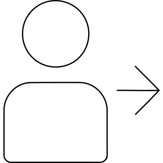 |
| 38 | purescript logo_423ee93e-e3bf-4a17-8d43-6193ba22aba2 | [brief](briefs/purescript logo_423ee93e-e3bf-4a17-8d43-6193ba22aba2.md) |  |
| 39 | purse_20355782-bf90-4598-ad41-30caf7f08c59 | [brief](briefs/purse_20355782-bf90-4598-ad41-30caf7f08c59.md) |  |
| 40 | putty knife_7f4d1570-9de8-4a19-90c3-57287c2ac40b | [brief](briefs/putty knife_7f4d1570-9de8-4a19-90c3-57287c2ac40b.md) |  |
| 41 | puzzle piece simple_ccea7972-514f-4c14-9a2e-3c6dba90adca | [brief](briefs/puzzle piece simple_ccea7972-514f-4c14-9a2e-3c6dba90adca.md) |  |
| 42 | puzzle piece_c39ca51e-ed86-49ac-ae9e-00f78f81fbba | [brief](briefs/puzzle piece_c39ca51e-ed86-49ac-ae9e-00f78f81fbba.md) |  |
| 43 | quail_f16c7aac-6428-480f-9ba6-4d2eab0942e5 | [brief](briefs/quail_f16c7aac-6428-480f-9ba6-4d2eab0942e5.md) |  |
| 44 | qualcomm logo_dd388978-26f3-4317-9a4f-7e9381f85924 | [brief](briefs/qualcomm logo_dd388978-26f3-4317-9a4f-7e9381f85924.md) | 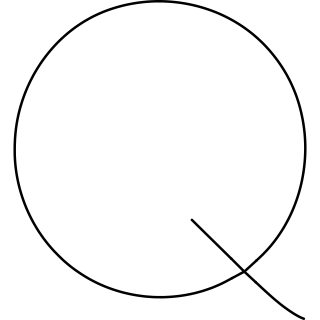 |
| 45 | quart_a3b9b46b-c8c2-493e-b79f-f1fef5bd2b56 | [brief](briefs/quart_a3b9b46b-c8c2-493e-b79f-f1fef5bd2b56.md) |  |
| 46 | quarter_6e169816-2d8c-4d8a-bac5-9750a263a913 | [brief](briefs/quarter_6e169816-2d8c-4d8a-bac5-9750a263a913.md) |  |
| 47 | quilt_343c4f47-d44e-4c96-b347-e1f2bda8a1e2 | [brief](briefs/quilt_343c4f47-d44e-4c96-b347-e1f2bda8a1e2.md) |  |
| 48 | quora logo_f981472d-58a5-426f-af27-b5c6ffb235d4 | [brief](briefs/quora logo_f981472d-58a5-426f-af27-b5c6ffb235d4.md) |  |
| 49 | quote left_bbf400c0-4ed9-481e-8643-979aa728bc9d | [brief](briefs/quote left_bbf400c0-4ed9-481e-8643-979aa728bc9d.md) |  |
| 50 | quote right_a669591d-8405-49c2-be0a-5d69af49a20c | [brief](briefs/quote right_a669591d-8405-49c2-be0a-5d69af49a20c.md) |  |
| 51 | quotes_d8e178df-75a7-436c-99cf-7f7c90cf866a | [brief](briefs/quotes_d8e178df-75a7-436c-99cf-7f7c90cf866a.md) |  |
| 52 | rack_30ab66d4-98e1-405f-9c76-67b42a0c39d9 | [brief](briefs/rack_30ab66d4-98e1-405f-9c76-67b42a0c39d9.md) |  |
| 53 | radiator_0721cab9-ab1e-41f7-88a0-4ece5a88f424 | [brief](briefs/radiator_0721cab9-ab1e-41f7-88a0-4ece5a88f424.md) |  |
| 54 | radio_1cbb9047-d282-4f34-af69-1f0fe7048535 | [brief](briefs/radio_1cbb9047-d282-4f34-af69-1f0fe7048535.md) |  |
| 55 | radiosonde_d34f9e05-1d1c-4193-a52e-0ad65fcf7005 | [brief](briefs/radiosonde_d34f9e05-1d1c-4193-a52e-0ad65fcf7005.md) |  |
| 56 | radish_11c3cf6e-f15d-4721-b744-60dc03b5f380 | [brief](briefs/radish_11c3cf6e-f15d-4721-b744-60dc03b5f380.md) |  |
| 57 | rail_1ec1f880-2ec0-4be3-9c5c-9c4cad6deda9 | [brief](briefs/rail_1ec1f880-2ec0-4be3-9c5c-9c4cad6deda9.md) |  |
| 58 | railing_bc61b991-4665-41a7-af35-ea55f506e409 | [brief](briefs/railing_bc61b991-4665-41a7-af35-ea55f506e409.md) |  |
| 59 | raiment_133b0b4a-367d-4a9d-bbb5-fa7b385d1434 | [brief](briefs/raiment_133b0b4a-367d-4a9d-bbb5-fa7b385d1434.md) |  |
| 60 | rain coat umbrella_7519e26d-bc08-4121-88ad-5cf9c484bef3 | [brief](briefs/rain coat umbrella_7519e26d-bc08-4121-88ad-5cf9c484bef3.md) |  |
| 61 | ranch_ab6f847e-97f6-4764-91e7-6c7ab7f8aacf | [brief](briefs/ranch_ab6f847e-97f6-4764-91e7-6c7ab7f8aacf.md) |  |
| 62 | range_1399e326-2431-4b64-b3d4-29a2736f0ad3 | [brief](briefs/range_1399e326-2431-4b64-b3d4-29a2736f0ad3.md) |  |
| 63 | ranking people first_43ccfd19-3a54-4d74-99c0-89ec49459bcb | [brief](briefs/ranking people first_43ccfd19-3a54-4d74-99c0-89ec49459bcb.md) |  |
| 64 | raspberry_2832f022-caae-4923-b9e7-57ae24b7442c | [brief](briefs/raspberry_2832f022-caae-4923-b9e7-57ae24b7442c.md) |  |
| 65 | rating booklet_d9776d01-07f9-402d-ac77-fc73a405a509 | [brief](briefs/rating booklet_d9776d01-07f9-402d-ac77-fc73a405a509.md) |  |
| 66 | read email hand_16dbdd7b-9aab-4125-8e6a-77e168539590 | [brief](briefs/read email hand_16dbdd7b-9aab-4125-8e6a-77e168539590.md) |  |
| 67 | read email target_ea274b51-b095-451d-addb-e6a29ef9d9da | [brief](briefs/read email target_ea274b51-b095-451d-addb-e6a29ef9d9da.md) |  |
| 68 | read glasses_0f68711c-573b-484f-8105-ef528e12b59c | [brief](briefs/read glasses_0f68711c-573b-484f-8105-ef528e12b59c.md) |  |
| 69 | read world_707a74f4-f696-4ab1-aaf2-6be7de8a3c1a | [brief](briefs/read world_707a74f4-f696-4ab1-aaf2-6be7de8a3c1a.md) |  |
| 70 | real estate deal shake_490f19a8-c170-4914-bea1-18cbfb479033 | [brief](briefs/real estate deal shake_490f19a8-c170-4914-bea1-18cbfb479033.md) |  |
| 71 | real estate favorite hold building_8788efae-9ba8-4acc-a2e4-90bca5c7c8d4 | [brief](briefs/real estate favorite hold building_8788efae-9ba8-4acc-a2e4-90bca5c7c8d4.md) |  |
| 72 | real estate favorite hold house_507e66fa-7eb5-4d7c-9fd1-641b3c9e27f2 | [brief](briefs/real estate favorite hold house_507e66fa-7eb5-4d7c-9fd1-641b3c9e27f2.md) |  |
| 73 | real estate favorite house rating_f53e79c7-b34f-44d2-9af3-49b5684cc631 | [brief](briefs/real estate favorite house rating_f53e79c7-b34f-44d2-9af3-49b5684cc631.md) |  |
| 74 | real estate market building increase_4cb4eabd-1bfb-46c2-ab15-0b351ab22677 | [brief](briefs/real estate market building increase_4cb4eabd-1bfb-46c2-ab15-0b351ab22677.md) |  |
| 75 | real estate market calculator house_110df7d0-d83c-4e1f-a771-57b0adb39e09 | [brief](briefs/real estate market calculator house_110df7d0-d83c-4e1f-a771-57b0adb39e09.md) | 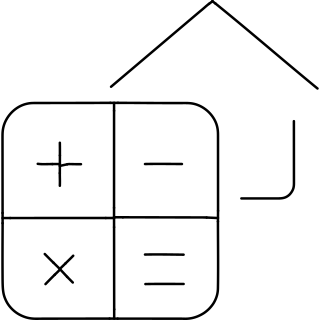 |
| 76 | real estate market house decrease_79bf90d8-329d-4a4d-83de-1b10b21a59b2 | [brief](briefs/real estate market house decrease_79bf90d8-329d-4a4d-83de-1b10b21a59b2.md) | 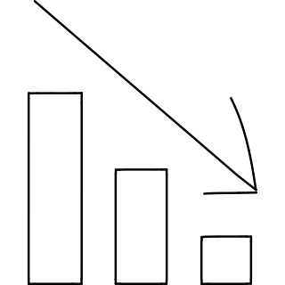 |
| 77 | real estate market house increase_a9eae52c-5fba-4c26-8ab9-e955eeea7260 | [brief](briefs/real estate market house increase_a9eae52c-5fba-4c26-8ab9-e955eeea7260.md) |  |
| 78 | real estate market house rise_7f6f3042-cf61-480a-9ce3-8fdb98d808ab | [brief](briefs/real estate market house rise_7f6f3042-cf61-480a-9ce3-8fdb98d808ab.md) | 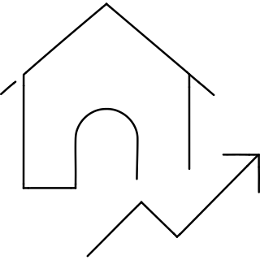 |
| 79 | real estate market house_1228a3cf-b0ac-41b8-a4db-2d272fbe1241 | [brief](briefs/real estate market house_1228a3cf-b0ac-41b8-a4db-2d272fbe1241.md) | 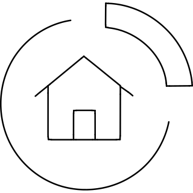 |
| 80 | real estate message couple building_c86928c6-4109-4558-bbc9-1f9ffaea2a41 | [brief](briefs/real estate message couple building_c86928c6-4109-4558-bbc9-1f9ffaea2a41.md) |  |
| 81 | real estate search house 2_eb4e4433-41fd-4f9e-9779-df93d4b8c025 | [brief](briefs/real estate search house 2_eb4e4433-41fd-4f9e-9779-df93d4b8c025.md) |  |
| 82 | real estate truck house_5fda1d00-7833-4fcb-89e8-8b235809140b | [brief](briefs/real estate truck house_5fda1d00-7833-4fcb-89e8-8b235809140b.md) |  |
| 83 | rear_2ae26408-156c-43de-9e16-97f3b148035f | [brief](briefs/rear_2ae26408-156c-43de-9e16-97f3b148035f.md) |  |
| 84 | reason studios logo_2d6a8cf5-2635-415b-98c2-e3cae60e130f | [brief](briefs/reason studios logo_2d6a8cf5-2635-415b-98c2-e3cae60e130f.md) |  |
| 85 | recruiting employee folder resume document_8d5e6cf1-f026-4d0c-84b1-8ddff92e028e | [brief](briefs/recruiting employee folder resume document_8d5e6cf1-f026-4d0c-84b1-8ddff92e028e.md) |  |
| 86 | recruiting resume document_37ae4172-af70-4ae7-8de2-52970a6302ab | [brief](briefs/recruiting resume document_37ae4172-af70-4ae7-8de2-52970a6302ab.md) |  |
| 87 | rectangle barcode_ff37a759-f10f-4dcd-9512-00c110068828 | [brief](briefs/rectangle barcode_ff37a759-f10f-4dcd-9512-00c110068828.md) | 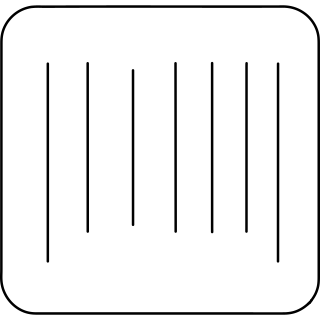 |
| 88 | rectangle code_0efa564f-5fe3-43ba-904f-a0826782e979 | [brief](briefs/rectangle code_0efa564f-5fe3-43ba-904f-a0826782e979.md) | 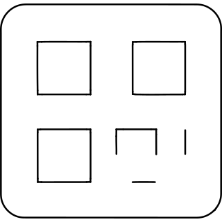 |
| 89 | rectangle history_5bf1aba4-f7d5-46d8-ad17-5b349ba3bb93 | [brief](briefs/rectangle history_5bf1aba4-f7d5-46d8-ad17-5b349ba3bb93.md) |  |
| 90 | rectangle list_592beacc-84e1-4868-af66-30a20a39dbfd | [brief](briefs/rectangle list_592beacc-84e1-4868-af66-30a20a39dbfd.md) |  |
| 91 | rectangle pro_59b573a0-e00b-4560-b257-24936664412e | [brief](briefs/rectangle pro_59b573a0-e00b-4560-b257-24936664412e.md) |  |
| 92 | rectangle vertical history_69099a2e-0b2c-47a9-931c-af42c66da3a2 | [brief](briefs/rectangle vertical history_69099a2e-0b2c-47a9-931c-af42c66da3a2.md) | 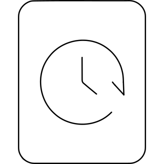 |
| 93 | rectangle wide_753a152c-625b-4b15-8566-137e4956530f | [brief](briefs/rectangle wide_753a152c-625b-4b15-8566-137e4956530f.md) |  |
| 94 | rectangle xmark_905a5e28-8eed-47b0-b505-a4ae89781974 | [brief](briefs/rectangle xmark_905a5e28-8eed-47b0-b505-a4ae89781974.md) |  |
| 95 | rectangle xmark_af669777-745b-4aab-b0c2-68b26b995e7c | [brief](briefs/rectangle xmark_af669777-745b-4aab-b0c2-68b26b995e7c.md) |  |
| 96 | rectangles mixed_5c65785a-f499-4809-9c22-9146af48fb1c | [brief](briefs/rectangles mixed_5c65785a-f499-4809-9c22-9146af48fb1c.md) |  |
| 97 | recycle_3b617167-6bc8-47b6-8ca4-ece9d9067e8d | [brief](briefs/recycle_3b617167-6bc8-47b6-8ca4-ece9d9067e8d.md) |  |
| 98 | recycling label_aec06f81-4835-4b96-93f1-57f1ca360f5e | [brief](briefs/recycling label_aec06f81-4835-4b96-93f1-57f1ca360f5e.md) | 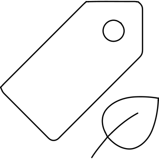 |
| 99 | recycling symbol_eba86955-13f5-4b0a-a78e-55e6a9fb7a6a | [brief](briefs/recycling symbol_eba86955-13f5-4b0a-a78e-55e6a9fb7a6a.md) |  |
| 100 | red_66fa1b1c-4a7d-479b-b8fa-448c1d6ca506 | [brief](briefs/red_66fa1b1c-4a7d-479b-b8fa-448c1d6ca506.md) |  |
| 101 | redhead_479da84f-9f73-458f-9606-5fa1f1bd0088 | [brief](briefs/redhead_479da84f-9f73-458f-9606-5fa1f1bd0088.md) |  |
| 102 | redux logo_eb47004b-f404-423b-86db-835fad7f0bcb | [brief](briefs/redux logo_eb47004b-f404-423b-86db-835fad7f0bcb.md) |  |
| 103 | reel_01503457-9580-4fc3-af04-5c52d2d80f5c | [brief](briefs/reel_01503457-9580-4fc3-af04-5c52d2d80f5c.md) |  |
| 104 | reel_48b88fe5-9eef-4d88-a78e-ddbebd5fdfd5 | [brief](briefs/reel_48b88fe5-9eef-4d88-a78e-ddbebd5fdfd5.md) |  |
| 105 | refectory_07dbd3bc-a48c-432b-9620-849c1e588851 | [brief](briefs/refectory_07dbd3bc-a48c-432b-9620-849c1e588851.md) |  |
| 106 | reflect both_dc001542-4db8-4f48-a35d-4b1ae859084a | [brief](briefs/reflect both_dc001542-4db8-4f48-a35d-4b1ae859084a.md) |  |
| 107 | reflect horizontal_e8127f5e-ebd2-4ce8-a46a-98e1139037cf | [brief](briefs/reflect horizontal_e8127f5e-ebd2-4ce8-a46a-98e1139037cf.md) |  |
| 108 | refugee immigration war 1_6595335f-49a0-4788-8fa4-1bde23722302 | [brief](briefs/refugee immigration war 1_6595335f-49a0-4788-8fa4-1bde23722302.md) |  |
| 109 | refugee immigration war 2_922ba268-0492-4ece-8f41-54253b52949a | [brief](briefs/refugee immigration war 2_922ba268-0492-4ece-8f41-54253b52949a.md) |  |
| 110 | reindeer_465734be-299b-4157-b9a5-e0d0ab85d590 | [brief](briefs/reindeer_465734be-299b-4157-b9a5-e0d0ab85d590.md) |  |
| 111 | religion buddhism_c05b17e7-e0ba-4c48-8386-49bcabf0cc2d | [brief](briefs/religion buddhism_c05b17e7-e0ba-4c48-8386-49bcabf0cc2d.md) |  |
| 112 | religion cao dai_77937bbd-92c4-4b29-ac40-52719ed0b6cd | [brief](briefs/religion cao dai_77937bbd-92c4-4b29-ac40-52719ed0b6cd.md) | 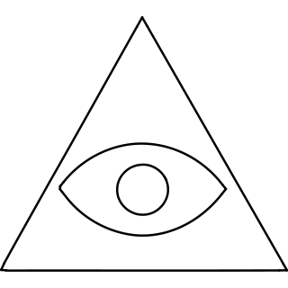 |
| 113 | religion hands_b2d21f34-88f5-4119-9e01-c79ec40a8337 | [brief](briefs/religion hands_b2d21f34-88f5-4119-9e01-c79ec40a8337.md) |  |
| 114 | remains_7c0ac5c3-a514-484c-9bdf-404c88d05eb7 | [brief](briefs/remains_7c0ac5c3-a514-484c-9bdf-404c88d05eb7.md) | 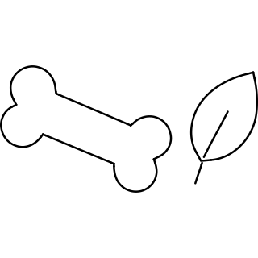 |
| 115 | remnant_f2a30549-19ad-459a-ac75-4bcb81aafc02 | [brief](briefs/remnant_f2a30549-19ad-459a-ac75-4bcb81aafc02.md) |  |
| 116 | remote access_c9953fdc-3825-4f26-8597-533126256825 | [brief](briefs/remote access_c9953fdc-3825-4f26-8597-533126256825.md) |  |
| 117 | remote_76968c26-fde4-46eb-82f4-b718c85a0c92 | [brief](briefs/remote_76968c26-fde4-46eb-82f4-b718c85a0c92.md) |  |
| 118 | remove row_321ddc46-d254-44b0-be3f-5fad65e304d5 | [brief](briefs/remove row_321ddc46-d254-44b0-be3f-5fad65e304d5.md) | 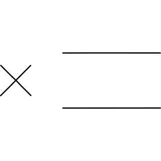 |
| 119 | renewable energy solar monitor_3dd8944a-87f8-4a77-b1c2-8daa2b2ed837 | [brief](briefs/renewable energy solar monitor_3dd8944a-87f8-4a77-b1c2-8daa2b2ed837.md) |  |
| 120 | renren logo_64bff921-1efc-4994-9d96-c01333bed3e2 | [brief](briefs/renren logo_64bff921-1efc-4994-9d96-c01333bed3e2.md) |  |
| 121 | replica_d45616b6-1630-467a-b2b0-1324e090298c | [brief](briefs/replica_d45616b6-1630-467a-b2b0-1324e090298c.md) |  |
| 122 | retouch landscape_9bf20118-a278-4080-979f-4ea937240a2a | [brief](briefs/retouch landscape_9bf20118-a278-4080-979f-4ea937240a2a.md) | 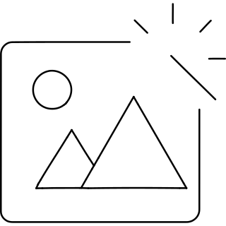 |
| 123 | rhinoceros_94f0b2d9-0d53-4bde-940f-e2260212a757 | [brief](briefs/rhinoceros_94f0b2d9-0d53-4bde-940f-e2260212a757.md) |  |
| 124 | rhubarb_eda88d9c-f520-4ee1-8598-6c7e973f256b | [brief](briefs/rhubarb_eda88d9c-f520-4ee1-8598-6c7e973f256b.md) |  |
| 125 | ribbon_8d04928d-83dd-4d17-a7ec-1662a74d856b | [brief](briefs/ribbon_8d04928d-83dd-4d17-a7ec-1662a74d856b.md) |  |
| 126 | ridge_c8570359-6199-47c7-98b5-62977c857112 | [brief](briefs/ridge_c8570359-6199-47c7-98b5-62977c857112.md) |  |
| 127 | right from bracket_bc2a6778-ef25-47fb-9edd-73d0b5963727 | [brief](briefs/right from bracket_bc2a6778-ef25-47fb-9edd-73d0b5963727.md) | 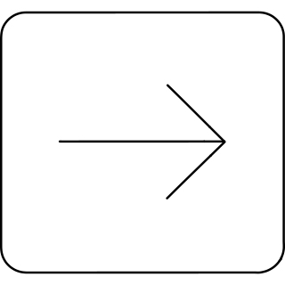 |
| 128 | right from line_b5fa2798-49f6-407b-a04a-a6f57dfb705c | [brief](briefs/right from line_b5fa2798-49f6-407b-a04a-a6f57dfb705c.md) |  |
| 129 | right left large_44026e74-48c0-45af-9fe8-c5711d1e8901 | [brief](briefs/right left large_44026e74-48c0-45af-9fe8-c5711d1e8901.md) |  |
| 130 | right long to line_9d15b8d2-355e-4368-9067-6467f7500659 | [brief](briefs/right long to line_9d15b8d2-355e-4368-9067-6467f7500659.md) |  |
| 131 | right to bracket_0bd98d1c-2291-4610-be55-e9292563a85a | [brief](briefs/right to bracket_0bd98d1c-2291-4610-be55-e9292563a85a.md) | 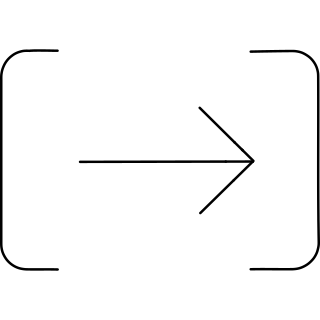 |
| 132 | right turn 1_0254907d-b07a-4f21-ac2c-2825ea80dde2 | [brief](briefs/right turn 1_0254907d-b07a-4f21-ac2c-2825ea80dde2.md) |  |
| 133 | ring of power_086e36e9-9599-4580-9ca5-4989b349d913 | [brief](briefs/ring of power_086e36e9-9599-4580-9ca5-4989b349d913.md) |  |
| 134 | riser_d28daa8d-db7e-47b2-8b1f-8053b65e3453 | [brief](briefs/riser_d28daa8d-db7e-47b2-8b1f-8053b65e3453.md) | 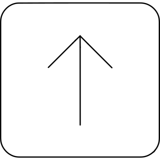 |
| 135 | rugby_5f1d3889-db71-4132-bcfc-995f498530ae | [brief](briefs/rugby_5f1d3889-db71-4132-bcfc-995f498530ae.md) |  |
