# Reconstruction worklist

127 icons from `icon_set/work/todo-solo-briefs-100-20260920-batch16/sources`.

Triage on the contact sheets in `sheets/`, then take one icon at a time:
read its brief, look at its render, and author it through
`icon_set/skills/icon-design/SKILL.md`.

| # | concept | brief | render |
|--:|---|---|---|
| 1 | riverbed_b49c8cb8-5668-460b-a654-dc45fa10b497 | [brief](briefs/riverbed_b49c8cb8-5668-460b-a654-dc45fa10b497.md) |  |
| 2 | rivet_ef0e3858-9207-4ba6-bf73-2c4515cdd238 | [brief](briefs/rivet_ef0e3858-9207-4ba6-bf73-2c4515cdd238.md) |  |
| 3 | rivulet_0f1f735e-fded-4823-8551-f88cb4026ab4 | [brief](briefs/rivulet_0f1f735e-fded-4823-8551-f88cb4026ab4.md) |  |
| 4 | road lock_ea945a43-10ca-4ee5-a157-515c7b4149fa | [brief](briefs/road lock_ea945a43-10ca-4ee5-a157-515c7b4149fa.md) |  |
| 5 | roadway_3b57f1cc-076e-4087-8826-2285cc40b569 | [brief](briefs/roadway_3b57f1cc-076e-4087-8826-2285cc40b569.md) |  |
| 6 | roar_7d2768e6-6b3f-4e84-8b06-c307fc8fb78c | [brief](briefs/roar_7d2768e6-6b3f-4e84-8b06-c307fc8fb78c.md) |  |
| 7 | robot wifi 5g_30dfa027-64b7-4bea-957e-c1a147e61020 | [brief](briefs/robot wifi 5g_30dfa027-64b7-4bea-957e-c1a147e61020.md) | 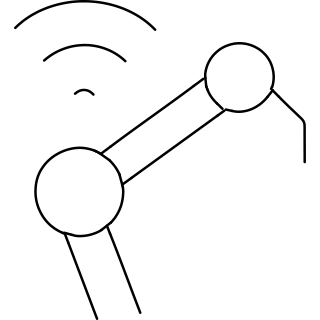 |
| 8 | rock_db769649-b58f-466d-a6bc-8e4e869c447f | [brief](briefs/rock_db769649-b58f-466d-a6bc-8e4e869c447f.md) |  |
| 9 | rocker_d50e4120-77d7-422c-a424-5d54b2dccc50 | [brief](briefs/rocker_d50e4120-77d7-422c-a424-5d54b2dccc50.md) |  |
| 10 | rocket attack global_316bef96-1836-4fb8-b6a2-7483304127ec | [brief](briefs/rocket attack global_316bef96-1836-4fb8-b6a2-7483304127ec.md) |  |
| 11 | rocket ship_16c00329-0bb9-472a-9c8e-6b656489f589 | [brief](briefs/rocket ship_16c00329-0bb9-472a-9c8e-6b656489f589.md) |  |
| 12 | rod of asclepius_3726d96a-f376-4f85-be5e-b05615cdd3f9 | [brief](briefs/rod of asclepius_3726d96a-f376-4f85-be5e-b05615cdd3f9.md) |  |
| 13 | rod_32a5ba4a-b977-46a3-8de2-a91927408c74 | [brief](briefs/rod_32a5ba4a-b977-46a3-8de2-a91927408c74.md) |  |
| 14 | rogue_4eebbb0e-3d47-4014-a9b8-95819896ada8 | [brief](briefs/rogue_4eebbb0e-3d47-4014-a9b8-95819896ada8.md) |  |
| 15 | roll_974b5e7a-03a8-4f9f-a872-b1b495a7375f | [brief](briefs/roll_974b5e7a-03a8-4f9f-a872-b1b495a7375f.md) |  |
| 16 | romaine_aa44650c-65b0-4d6c-a791-d54f9f0089c9 | [brief](briefs/romaine_aa44650c-65b0-4d6c-a791-d54f9f0089c9.md) |  |
| 17 | romance heterosextual symbol_1bf5b8f8-1714-40eb-bf12-43026ede4d1e | [brief](briefs/romance heterosextual symbol_1bf5b8f8-1714-40eb-bf12-43026ede4d1e.md) | 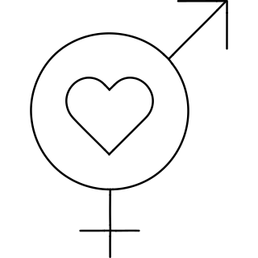 |
| 18 | romance pride gay lgbt heart_c0e31e5f-9872-4414-9334-38d9e1e42539 | [brief](briefs/romance pride gay lgbt heart_c0e31e5f-9872-4414-9334-38d9e1e42539.md) | 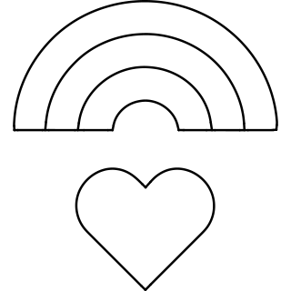 |
| 19 | romance pride lesbian lgbt flag hand_b50450df-a0b2-4543-acfe-30ea5158a73f | [brief](briefs/romance pride lesbian lgbt flag hand_b50450df-a0b2-4543-acfe-30ea5158a73f.md) |  |
| 20 | romance pride lgbt bracelet fist_384a95a6-c45c-4273-b3f9-f96619ec8a6c | [brief](briefs/romance pride lgbt bracelet fist_384a95a6-c45c-4273-b3f9-f96619ec8a6c.md) |  |
| 21 | romance pride lgbt heart hand holding_353c0a3e-5be1-4b87-8e05-ba32a7f03da8 | [brief](briefs/romance pride lgbt heart hand holding_353c0a3e-5be1-4b87-8e05-ba32a7f03da8.md) |  |
| 22 | romance pride lgbt heart protect hand gesture_2d833c6d-7e3c-4f1d-81d3-751c131f3ff5 | [brief](briefs/romance pride lgbt heart protect hand gesture_2d833c6d-7e3c-4f1d-81d3-751c131f3ff5.md) |  |
| 23 | room service cart food_ca1fd987-250d-4860-81ff-ff57cbc0fc0a | [brief](briefs/room service cart food_ca1fd987-250d-4860-81ff-ff57cbc0fc0a.md) |  |
| 24 | room_c7092668-c84c-4f0a-9961-2def3129ab7f | [brief](briefs/room_c7092668-c84c-4f0a-9961-2def3129ab7f.md) |  |
| 25 | roommate_a33b1513-8e9a-47e2-bfc0-67370010520d | [brief](briefs/roommate_a33b1513-8e9a-47e2-bfc0-67370010520d.md) |  |
| 26 | root_ad55a6d2-bba5-46c3-b8e3-7d8d8c092bf8 | [brief](briefs/root_ad55a6d2-bba5-46c3-b8e3-7d8d8c092bf8.md) |  |
| 27 | rope_50547aae-7288-4718-8be9-77e390938600 | [brief](briefs/rope_50547aae-7288-4718-8be9-77e390938600.md) |  |
| 28 | route highway_f33df336-5c6d-4615-8428-6e724d4f62ba | [brief](briefs/route highway_f33df336-5c6d-4615-8428-6e724d4f62ba.md) |  |
| 29 | route interstate_65d8507f-531a-4e81-bd3e-1e2516aebe33 | [brief](briefs/route interstate_65d8507f-531a-4e81-bd3e-1e2516aebe33.md) | 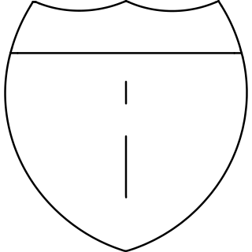 |
| 30 | route_63d9a298-746d-43cf-89b0-fd3c2f434c3c | [brief](briefs/route_63d9a298-746d-43cf-89b0-fd3c2f434c3c.md) |  |
| 31 | router table_bf0fa984-26f0-4a05-be58-0ac8e435353a | [brief](briefs/router table_bf0fa984-26f0-4a05-be58-0ac8e435353a.md) |  |
| 32 | router_6cbfb02b-c779-4616-8713-596471cd24f6 | [brief](briefs/router_6cbfb02b-c779-4616-8713-596471cd24f6.md) |  |
| 33 | rss_bb8fc343-a336-4027-84fb-5394db05a944 | [brief](briefs/rss_bb8fc343-a336-4027-84fb-5394db05a944.md) |  |
| 34 | rubber_dd064415-0162-4c64-b100-5b2d2467d82c | [brief](briefs/rubber_dd064415-0162-4c64-b100-5b2d2467d82c.md) |  |
| 35 | ruby_db53c972-161d-4540-b518-388b5f30fe08 | [brief](briefs/ruby_db53c972-161d-4540-b518-388b5f30fe08.md) |  |
| 36 | ruin_9d1b43d6-ae70-4d4b-bea5-eed175625154 | [brief](briefs/ruin_9d1b43d6-ae70-4d4b-bea5-eed175625154.md) |  |
| 37 | ruler combined_17b1bc43-8620-423d-ada3-242d9bb016f6 | [brief](briefs/ruler combined_17b1bc43-8620-423d-ada3-242d9bb016f6.md) |  |
| 38 | ruler horizontal_7dd79ecc-660d-4f56-b16d-363edb2e64e7 | [brief](briefs/ruler horizontal_7dd79ecc-660d-4f56-b16d-363edb2e64e7.md) |  |
| 39 | ruler vertical_eae67cef-853a-4f4b-ba6d-48257036ab7b | [brief](briefs/ruler vertical_eae67cef-853a-4f4b-ba6d-48257036ab7b.md) |  |
| 40 | rum_bfba09d2-166a-40ee-9535-f73ae6b9d640 | [brief](briefs/rum_bfba09d2-166a-40ee-9535-f73ae6b9d640.md) |  |
| 41 | rune stone_50f8b937-c3ef-4dbe-b3bb-69d8a2f54940 | [brief](briefs/rune stone_50f8b937-c3ef-4dbe-b3bb-69d8a2f54940.md) | 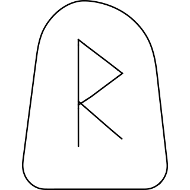 |
| 42 | rupee sign_e9b350be-f0e4-49b9-8413-4a4d1c678f43 | [brief](briefs/rupee sign_e9b350be-f0e4-49b9-8413-4a4d1c678f43.md) | 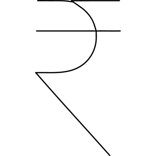 |
| 43 | rust_e03b0aa6-acfb-4b07-95e2-5b40a0108739 | [brief](briefs/rust_e03b0aa6-acfb-4b07-95e2-5b40a0108739.md) |  |
| 44 | rutabaga_fbb9c19e-0ab3-4e8c-bc9e-6ae59edafe98 | [brief](briefs/rutabaga_fbb9c19e-0ab3-4e8c-bc9e-6ae59edafe98.md) |  |
| 45 | rv_69df7fc9-635a-41eb-a9a9-286218efeaa5 | [brief](briefs/rv_69df7fc9-635a-41eb-a9a9-286218efeaa5.md) |  |
| 46 | sac_f4379ff0-769d-4b9e-bb01-f4f2ebcbd91e | [brief](briefs/sac_f4379ff0-769d-4b9e-bb01-f4f2ebcbd91e.md) |  |
| 47 | sad cat_7437c205-b66a-4baf-a3ae-45bde761a6d0 | [brief](briefs/sad cat_7437c205-b66a-4baf-a3ae-45bde761a6d0.md) |  |
| 48 | saddle_5aa2a9a8-1ae0-4989-b37b-383f5ec7682d | [brief](briefs/saddle_5aa2a9a8-1ae0-4989-b37b-383f5ec7682d.md) |  |
| 49 | safety fire right_10fe00ef-bdce-47d7-95cd-4727e2fc9f1a | [brief](briefs/safety fire right_10fe00ef-bdce-47d7-95cd-4727e2fc9f1a.md) | 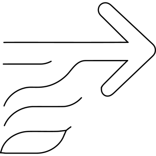 |
| 50 | safety gear_8ed61064-0d40-4fa9-bf92-3c21a62a5971 | [brief](briefs/safety gear_8ed61064-0d40-4fa9-bf92-3c21a62a5971.md) |  |
| 51 | safety goggles_21eee887-28cb-4e25-b739-4d7134cd9a28 | [brief](briefs/safety goggles_21eee887-28cb-4e25-b739-4d7134cd9a28.md) |  |
| 52 | saffron_461a7f22-1ab4-4abf-9b2a-64e495cdda20 | [brief](briefs/saffron_461a7f22-1ab4-4abf-9b2a-64e495cdda20.md) |  |
| 53 | sage_e09bedcc-da08-4eac-8460-809b82598f89 | [brief](briefs/sage_e09bedcc-da08-4eac-8460-809b82598f89.md) |  |
| 54 | sailor_2089a768-c666-4889-b84d-c0fcb7502528 | [brief](briefs/sailor_2089a768-c666-4889-b84d-c0fcb7502528.md) |  |
| 55 | salami_373dffde-a773-4e8f-a588-809417546632 | [brief](briefs/salami_373dffde-a773-4e8f-a588-809417546632.md) |  |
| 56 | salon_04bd675b-6157-4927-8314-93d0cfc43267 | [brief](briefs/salon_04bd675b-6157-4927-8314-93d0cfc43267.md) |  |
| 57 | salt_5236f877-601b-4642-891f-2b7c8f5ba6f3 | [brief](briefs/salt_5236f877-601b-4642-891f-2b7c8f5ba6f3.md) |  |
| 58 | sand bag 1_301c2e56-228d-43b7-8ad0-61ec9594e803 | [brief](briefs/sand bag 1_301c2e56-228d-43b7-8ad0-61ec9594e803.md) |  |
| 59 | sass circle logo_b60b81a4-9d88-4566-84d3-7931d6c1da67 | [brief](briefs/sass circle logo_b60b81a4-9d88-4566-84d3-7931d6c1da67.md) |  |
| 60 | satellite dish_fe738b2d-e29b-40d0-bcff-ed344cde5fa1 | [brief](briefs/satellite dish_fe738b2d-e29b-40d0-bcff-ed344cde5fa1.md) |  |
| 61 | saving bear increase_b70b7993-149f-4dd9-95d6-fe029f2c8b42 | [brief](briefs/saving bear increase_b70b7993-149f-4dd9-95d6-fe029f2c8b42.md) | 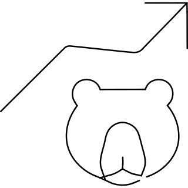 |
| 62 | saving bear market_d4ac73e1-75ba-437f-bb76-a2124650edec | [brief](briefs/saving bear market_d4ac73e1-75ba-437f-bb76-a2124650edec.md) |  |
| 63 | saving bull_936d0079-3089-4c8c-bc22-422921c13e69 | [brief](briefs/saving bull_936d0079-3089-4c8c-bc22-422921c13e69.md) | 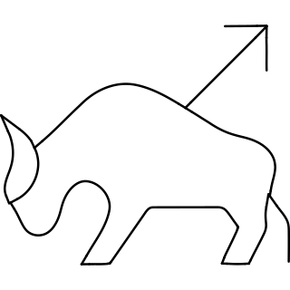 |
| 64 | scalpel_729f7ed8-419e-4844-bcf8-46e3b3ffd38b | [brief](briefs/scalpel_729f7ed8-419e-4844-bcf8-46e3b3ffd38b.md) |  |
| 65 | school_b5db931c-e746-41d7-8b45-22e2ce5e3009 | [brief](briefs/school_b5db931c-e746-41d7-8b45-22e2ce5e3009.md) |  |
| 66 | science apple gravity_3f5c0a54-044c-49ec-b70a-9297048b4eec | [brief](briefs/science apple gravity_3f5c0a54-044c-49ec-b70a-9297048b4eec.md) | 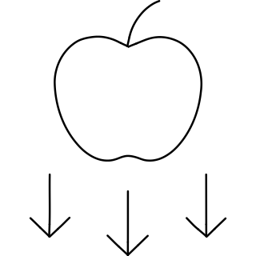 |
| 67 | science axis_336b0801-7074-4e6b-8a96-aa5b96abac66 | [brief](briefs/science axis_336b0801-7074-4e6b-8a96-aa5b96abac66.md) |  |
| 68 | science electricity_9ac0c54d-d3b5-4b3a-822d-460c4ff8f217 | [brief](briefs/science electricity_9ac0c54d-d3b5-4b3a-822d-460c4ff8f217.md) |  |
| 69 | scientist_c61c2ca8-17c1-4390-9206-72043bde469f | [brief](briefs/scientist_c61c2ca8-17c1-4390-9206-72043bde469f.md) |  |
| 70 | scooter faster rabbit_33cb52e5-93d5-46af-84aa-58da87b89511 | [brief](briefs/scooter faster rabbit_33cb52e5-93d5-46af-84aa-58da87b89511.md) |  |
| 71 | scooter parking security_109ac4f6-204a-4d3b-8da5-f02fdf8bb3cc | [brief](briefs/scooter parking security_109ac4f6-204a-4d3b-8da5-f02fdf8bb3cc.md) |  |
| 72 | scooter parking shade roof_090386bc-ec29-43fe-9dba-5fd9ed1f0f5e | [brief](briefs/scooter parking shade roof_090386bc-ec29-43fe-9dba-5fd9ed1f0f5e.md) | 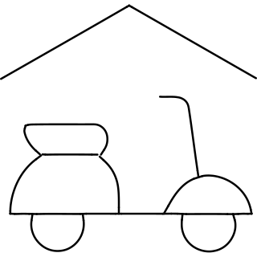 |
| 73 | scraper_73af18c2-249c-43bb-a0ff-ca52b89915b0 | [brief](briefs/scraper_73af18c2-249c-43bb-a0ff-ca52b89915b0.md) |  |
| 74 | screamer_82588f0d-abae-49d8-810c-3c4ef28dacb3 | [brief](briefs/screamer_82588f0d-abae-49d8-810c-3c4ef28dacb3.md) |  |
| 75 | scythe_7fdd94cb-5539-477f-8b3a-c028d0f9d10b | [brief](briefs/scythe_7fdd94cb-5539-477f-8b3a-c028d0f9d10b.md) |  |
| 76 | seagull_53f0c57d-069a-4318-b5b4-4522c89a47c3 | [brief](briefs/seagull_53f0c57d-069a-4318-b5b4-4522c89a47c3.md) |  |
| 77 | searching_77d2d2fc-d58d-41e5-8b4e-ed6dccc0d2ae | [brief](briefs/searching_77d2d2fc-d58d-41e5-8b4e-ed6dccc0d2ae.md) |  |
| 78 | seat find_c8e04970-7ef3-408d-aa2e-0b6ea0ec0b65 | [brief](briefs/seat find_c8e04970-7ef3-408d-aa2e-0b6ea0ec0b65.md) | 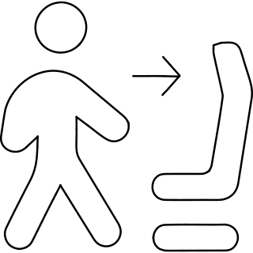 |
| 79 | sectional_e20da946-96cf-4a3e-abf7-b6101183f00f | [brief](briefs/sectional_e20da946-96cf-4a3e-abf7-b6101183f00f.md) |  |
| 80 | sediment_dfeebeb3-56f4-4934-b754-2c5add8fa9e0 | [brief](briefs/sediment_dfeebeb3-56f4-4934-b754-2c5add8fa9e0.md) |  |
| 81 | seed_950810fc-7530-4b10-b9cb-37e8104497bc | [brief](briefs/seed_950810fc-7530-4b10-b9cb-37e8104497bc.md) |  |
| 82 | seeker_eebf9355-e5dd-4833-b849-ec1865cc85fe | [brief](briefs/seeker_eebf9355-e5dd-4833-b849-ec1865cc85fe.md) |  |
| 83 | seep_2b014f10-c5df-40d6-be50-6891aa099557 | [brief](briefs/seep_2b014f10-c5df-40d6-be50-6891aa099557.md) |  |
| 84 | self care 2_efd5cbb3-73a1-456c-9d82-fa7470f26ad4 | [brief](briefs/self care 2_efd5cbb3-73a1-456c-9d82-fa7470f26ad4.md) |  |
| 85 | self driving car_7a8b5b6b-d72f-42df-9379-3389fd1e33fd | [brief](briefs/self driving car_7a8b5b6b-d72f-42df-9379-3389fd1e33fd.md) |  |
| 86 | seller_bfeaec06-7d30-43f5-a788-f6123492339a | [brief](briefs/seller_bfeaec06-7d30-43f5-a788-f6123492339a.md) |  |
| 87 | semicolon_c35549e9-c903-4de1-a698-9168b3d0ed04 | [brief](briefs/semicolon_c35549e9-c903-4de1-a698-9168b3d0ed04.md) |  |
| 88 | semiconductor_5d1a5aae-34f3-4ba1-98c6-b575f90d433a | [brief](briefs/semiconductor_5d1a5aae-34f3-4ba1-98c6-b575f90d433a.md) |  |
| 89 | send back_604a5046-da14-4a38-bc4b-6674a784c0f4 | [brief](briefs/send back_604a5046-da14-4a38-bc4b-6674a784c0f4.md) | 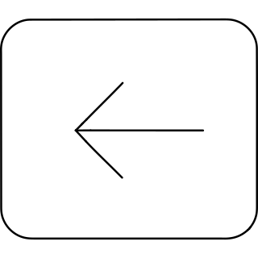 |
| 90 | send backward_8127f15e-c3e9-438a-b81b-82eb78736eac | [brief](briefs/send backward_8127f15e-c3e9-438a-b81b-82eb78736eac.md) | 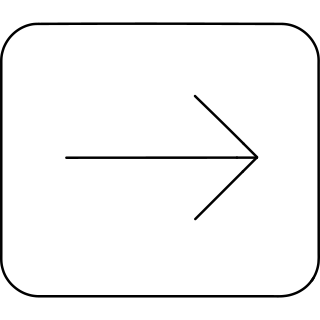 |
| 91 | send email fly_795d0a78-0ec5-465e-a5da-65de6eb5274c | [brief](briefs/send email fly_795d0a78-0ec5-465e-a5da-65de6eb5274c.md) |  |
| 92 | sense of stability_0257fd69-7a18-40fc-a7d2-903d1b421449 | [brief](briefs/sense of stability_0257fd69-7a18-40fc-a7d2-903d1b421449.md) | 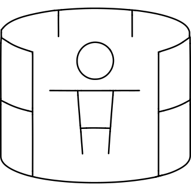 |
| 93 | sensor on_027e33e5-85c3-4fa5-9096-8ebd6243c295 | [brief](briefs/sensor on_027e33e5-85c3-4fa5-9096-8ebd6243c295.md) |  |
| 94 | seo search eye_4bd2f046-d00e-4c3d-99dd-153eae347474 | [brief](briefs/seo search eye_4bd2f046-d00e-4c3d-99dd-153eae347474.md) | 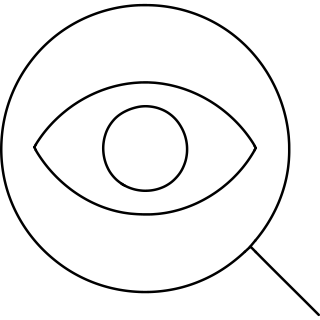 |
| 95 | sepal_cafb429b-195a-4ac5-a51d-c27387977241 | [brief](briefs/sepal_cafb429b-195a-4ac5-a51d-c27387977241.md) |  |
| 96 | serval_22366d36-5eea-4d6c-b5d6-62f3fe2703a8 | [brief](briefs/serval_22366d36-5eea-4d6c-b5d6-62f3fe2703a8.md) |  |
| 97 | servant_79e1fe21-1fbf-46fc-9839-666c3c1086e1 | [brief](briefs/servant_79e1fe21-1fbf-46fc-9839-666c3c1086e1.md) |  |
| 98 | shadow_6c649a13-9e18-406d-996c-fd87904e4be3 | [brief](briefs/shadow_6c649a13-9e18-406d-996c-fd87904e4be3.md) |  |
| 99 | shadowbox_3eb43dbe-b8a7-44bc-8374-47881eaf72c0 | [brief](briefs/shadowbox_3eb43dbe-b8a7-44bc-8374-47881eaf72c0.md) |  |
| 100 | share holder notification 2_57218de4-325d-49db-9661-2dd851d08161 | [brief](briefs/share holder notification 2_57218de4-325d-49db-9661-2dd851d08161.md) |  |
| 101 | shaw_4683deb3-c716-41ba-a197-fa79c507de7c | [brief](briefs/shaw_4683deb3-c716-41ba-a197-fa79c507de7c.md) |  |
| 102 | shipment fragile_6fb1e1e2-8daf-44eb-99ef-5f74d171ee0f | [brief](briefs/shipment fragile_6fb1e1e2-8daf-44eb-99ef-5f74d171ee0f.md) | 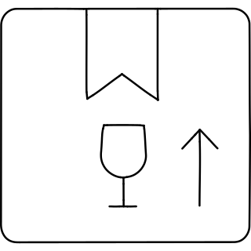 |
| 103 | shipper_6bb7f733-561a-4d2b-a952-3879ff5bb90f | [brief](briefs/shipper_6bb7f733-561a-4d2b-a952-3879ff5bb90f.md) |  |
| 104 | shipping logistic estimate time arrival 1_7420a5ad-20b8-4125-a020-7f6c31b74aac | [brief](briefs/shipping logistic estimate time arrival 1_7420a5ad-20b8-4125-a020-7f6c31b74aac.md) |  |
| 105 | shipping logistic free shipping delivery container_49e3783b-b77c-4b02-9013-5cd8c893c8f6 | [brief](briefs/shipping logistic free shipping delivery container_49e3783b-b77c-4b02-9013-5cd8c893c8f6.md) |  |
| 106 | shipping truck fast_c27d94c0-7a08-465e-a88a-9733bbd55e79 | [brief](briefs/shipping truck fast_c27d94c0-7a08-465e-a88a-9733bbd55e79.md) |  |
| 107 | shoe horn_6aea8bdb-fb8d-4eaf-aedc-68cf46a16a2c | [brief](briefs/shoe horn_6aea8bdb-fb8d-4eaf-aedc-68cf46a16a2c.md) |  |
| 108 | shopping pay hide advertising_59b04c40-2006-4e31-a230-a6be869385d4 | [brief](briefs/shopping pay hide advertising_59b04c40-2006-4e31-a230-a6be869385d4.md) |  |
| 109 | shuttlecock_97335598-fa75-4c18-a90d-4c7cc781b905 | [brief](briefs/shuttlecock_97335598-fa75-4c18-a90d-4c7cc781b905.md) |  |
| 110 | side road angle right 2_d19fe7af-bf3f-4193-8210-2e69b664727e | [brief](briefs/side road angle right 2_d19fe7af-bf3f-4193-8210-2e69b664727e.md) | 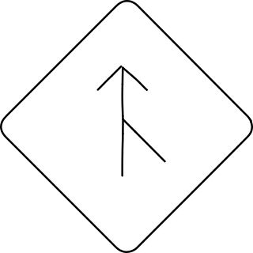 |
| 111 | sidewalk_cd3612e6-972a-48c9-b3ed-3d396f381c9a | [brief](briefs/sidewalk_cd3612e6-972a-48c9-b3ed-3d396f381c9a.md) |  |
| 112 | siding_d87ca7f7-87f2-42b7-ba16-07a6c2194443 | [brief](briefs/siding_d87ca7f7-87f2-42b7-ba16-07a6c2194443.md) |  |
| 113 | signet_22f235ba-70d4-491a-ac04-442dd44493d1 | [brief](briefs/signet_22f235ba-70d4-491a-ac04-442dd44493d1.md) |  |
| 114 | silica_5afbf3b8-cc49-4e47-9558-556ab12d8408 | [brief](briefs/silica_5afbf3b8-cc49-4e47-9558-556ab12d8408.md) |  |
| 115 | silo_eb094e57-6107-4f9f-aa41-6343ddbaeb33 | [brief](briefs/silo_eb094e57-6107-4f9f-aa41-6343ddbaeb33.md) |  |
| 116 | siren on_c6ed783d-b280-4b6d-885b-813f2326a220 | [brief](briefs/siren on_c6ed783d-b280-4b6d-885b-813f2326a220.md) |  |
| 117 | siren_44c5ea3c-73b1-415a-8c19-258fa8e8ebc5 | [brief](briefs/siren_44c5ea3c-73b1-415a-8c19-258fa8e8ebc5.md) |  |
| 118 | ski lift_1cbe0fa3-d908-4523-9409-acc3acb54a15 | [brief](briefs/ski lift_1cbe0fa3-d908-4523-9409-acc3acb54a15.md) |  |
| 119 | sleep time clock_fc73e8c6-6e9f-4862-b594-5fd64b8c8eab | [brief](briefs/sleep time clock_fc73e8c6-6e9f-4862-b594-5fd64b8c8eab.md) | 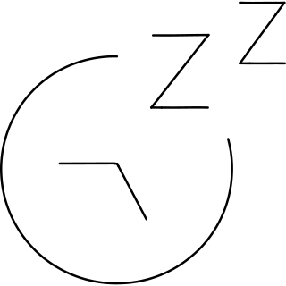 |
| 120 | smiley decode_2421c5d7-2ff1-480c-8526-9252cbdd43cf | [brief](briefs/smiley decode_2421c5d7-2ff1-480c-8526-9252cbdd43cf.md) |  |
| 121 | smoking_5a1155e0-7bcc-42cf-8cf2-d116d5369126 | [brief](briefs/smoking_5a1155e0-7bcc-42cf-8cf2-d116d5369126.md) |  |
| 122 | snarl_47ddf223-ee29-448c-9235-3145f69bc3fa | [brief](briefs/snarl_47ddf223-ee29-448c-9235-3145f69bc3fa.md) |  |
| 123 | snob_4d953f5b-fcd9-41c4-b7e4-d3f5f0027730 | [brief](briefs/snob_4d953f5b-fcd9-41c4-b7e4-d3f5f0027730.md) |  |
| 124 | snooze return repeat_4ae0f802-0947-49ab-948b-a13314a05022 | [brief](briefs/snooze return repeat_4ae0f802-0947-49ab-948b-a13314a05022.md) |  |
| 125 | soap_0e60b394-902b-4829-b58a-fc887786b98b | [brief](briefs/soap_0e60b394-902b-4829-b58a-fc887786b98b.md) |  |
| 126 | soccer_e9712b15-7e45-436f-be7e-f7e183485e03 | [brief](briefs/soccer_e9712b15-7e45-436f-be7e-f7e183485e03.md) |  |
| 127 | softball_d91cf897-8ec8-4512-b733-5f981860487c | [brief](briefs/softball_d91cf897-8ec8-4512-b733-5f981860487c.md) |  |
