# Reconstruction worklist

34 icons from `icon_set/work/todo-solo-briefs-100-20260920-batch18/sources`.

Triage on the contact sheets in `sheets/`, then take one icon at a time:
read its brief, look at its render, and author it through
`icon_set/skills/icon-design/SKILL.md`.

| # | concept | brief | render |
|--:|---|---|---|
| 1 | soprano_5a0aa177-0676-4a70-8fca-aebbf095a22b | [brief](briefs/soprano_5a0aa177-0676-4a70-8fca-aebbf095a22b.md) |  |
| 2 | spouse_2384e2e1-cdf9-4683-9a5b-04f5e95f8a86 | [brief](briefs/spouse_2384e2e1-cdf9-4683-9a5b-04f5e95f8a86.md) |  |
| 3 | sprinkler_eecb7d97-3137-43cb-80f0-402344e68d31 | [brief](briefs/sprinkler_eecb7d97-3137-43cb-80f0-402344e68d31.md) |  |
| 4 | square person confined_405a762c-b2c7-43c2-8ccd-42ddd4967863 | [brief](briefs/square person confined_405a762c-b2c7-43c2-8ccd-42ddd4967863.md) |  |
| 5 | square v_32c98c89-6e46-4737-9aa5-e927668b865d | [brief](briefs/square v_32c98c89-6e46-4737-9aa5-e927668b865d.md) |  |
| 6 | stablization operation female_852044c0-c346-4658-9c9c-035df8dc7b7b | [brief](briefs/stablization operation female_852044c0-c346-4658-9c9c-035df8dc7b7b.md) | 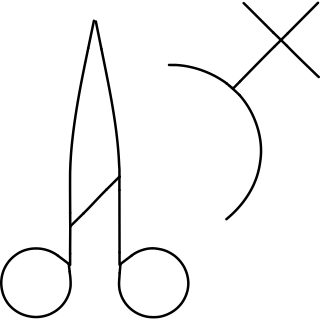 |
| 7 | stair_92aa617c-bfdc-4012-b1ef-c6b0390ff3d7 | [brief](briefs/stair_92aa617c-bfdc-4012-b1ef-c6b0390ff3d7.md) | 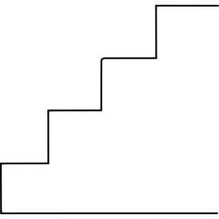 |
| 8 | star and crescent_b261f656-d077-46a8-afd0-2ebb46927dab | [brief](briefs/star and crescent_b261f656-d077-46a8-afd0-2ebb46927dab.md) |  |
| 9 | star half_f05f0eea-3253-47dc-9570-ec6a09110270 | [brief](briefs/star half_f05f0eea-3253-47dc-9570-ec6a09110270.md) |  |
| 10 | starter_68c9f8dd-f548-4290-9c86-5e06e74011fb | [brief](briefs/starter_68c9f8dd-f548-4290-9c86-5e06e74011fb.md) | 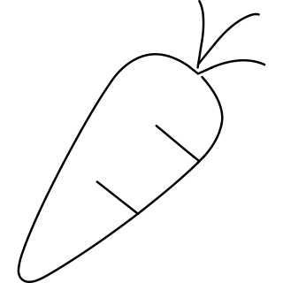 |
| 11 | station_db2595d8-7bdf-4379-90cf-f8c540b3d3cd | [brief](briefs/station_db2595d8-7bdf-4379-90cf-f8c540b3d3cd.md) |  |
| 12 | steak_f86a71e9-1309-4e71-9d3a-d71effcfc02f | [brief](briefs/steak_f86a71e9-1309-4e71-9d3a-d71effcfc02f.md) | 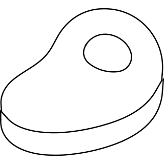 |
| 13 | steeple_585e8539-132b-43a8-b5b0-1e10b26ca71b | [brief](briefs/steeple_585e8539-132b-43a8-b5b0-1e10b26ca71b.md) | 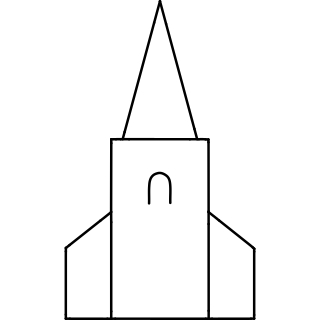 |
| 14 | step aunt_70680864-6c30-4596-a23a-894be18bdc1d | [brief](briefs/step aunt_70680864-6c30-4596-a23a-894be18bdc1d.md) |  |
| 15 | step daughter_03b72a93-412f-426a-b119-30b0d77366ce | [brief](briefs/step daughter_03b72a93-412f-426a-b119-30b0d77366ce.md) |  |
| 16 | step mother_b74e14f9-c061-4489-ae55-f97ea6c83e9a | [brief](briefs/step mother_b74e14f9-c061-4489-ae55-f97ea6c83e9a.md) |  |
| 17 | step sister_073b7984-a3fe-4699-87e9-47bf76004f1c | [brief](briefs/step sister_073b7984-a3fe-4699-87e9-47bf76004f1c.md) |  |
| 18 | stepdaughter_7bead6c0-72f2-44e3-81e8-617544d2ab4d | [brief](briefs/stepdaughter_7bead6c0-72f2-44e3-81e8-617544d2ab4d.md) |  |
| 19 | sting_d887ebc5-e028-4b29-95eb-d108a07e35c2 | [brief](briefs/sting_d887ebc5-e028-4b29-95eb-d108a07e35c2.md) | 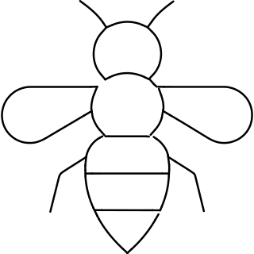 |
| 20 | stocking_24daeeb9-1c01-4de7-8ed2-697bd942fb08 | [brief](briefs/stocking_24daeeb9-1c01-4de7-8ed2-697bd942fb08.md) |  |
| 21 | stonework_5052672d-b690-4f47-83cc-e9462c05b2dd | [brief](briefs/stonework_5052672d-b690-4f47-83cc-e9462c05b2dd.md) |  |
| 22 | stove induction pot_a2ad6ee5-61c6-4099-a9f9-d90d628cc74b | [brief](briefs/stove induction pot_a2ad6ee5-61c6-4099-a9f9-d90d628cc74b.md) | 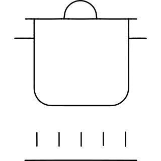 |
| 23 | stove pan_5176a0fc-0bbf-4775-a6b2-ae8262e5001e | [brief](briefs/stove pan_5176a0fc-0bbf-4775-a6b2-ae8262e5001e.md) | 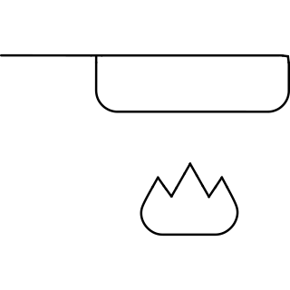 |
| 24 | stove steamer gas_c2d6e3ba-0e5d-412a-91cc-a017b6a6e6c9 | [brief](briefs/stove steamer gas_c2d6e3ba-0e5d-412a-91cc-a017b6a6e6c9.md) | 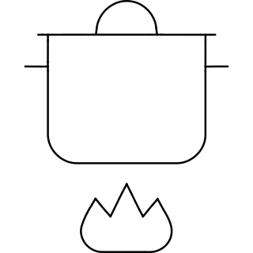 |
| 25 | strap_a0b1096c-7996-4f59-8ff7-e0f063af6cdf | [brief](briefs/strap_a0b1096c-7996-4f59-8ff7-e0f063af6cdf.md) | 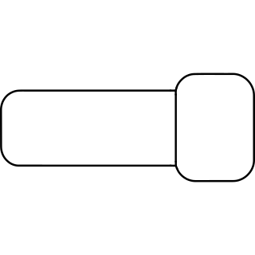 |
| 26 | straw_1924e02e-db4a-4b33-be67-bcd8d28b867c | [brief](briefs/straw_1924e02e-db4a-4b33-be67-bcd8d28b867c.md) |  |
| 27 | strip_537ef89a-3255-4de5-963f-3e20a738be5d | [brief](briefs/strip_537ef89a-3255-4de5-963f-3e20a738be5d.md) | 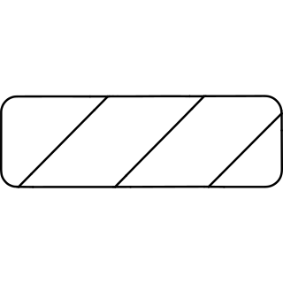 |
| 28 | stroopwafel_990104d5-be37-45c2-91c8-e084ab7d5e38 | [brief](briefs/stroopwafel_990104d5-be37-45c2-91c8-e084ab7d5e38.md) | 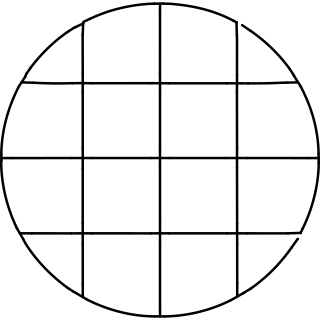 |
| 29 | stucco_09a317f7-f2a4-41c5-9e0a-3739286ec396 | [brief](briefs/stucco_09a317f7-f2a4-41c5-9e0a-3739286ec396.md) | 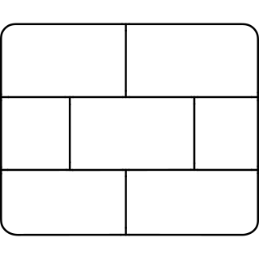 |
| 30 | studio_897ebcc8-d94a-49ad-a0bc-4e40ed50f511 | [brief](briefs/studio_897ebcc8-d94a-49ad-a0bc-4e40ed50f511.md) | 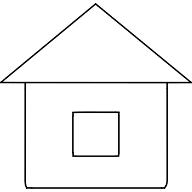 |
| 31 | stuff_9fefb84d-51a5-48e9-a1e8-eda6bcef1e28 | [brief](briefs/stuff_9fefb84d-51a5-48e9-a1e8-eda6bcef1e28.md) | 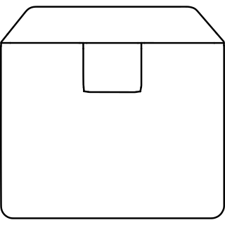 |
| 32 | stylus_5ad92bf3-ef37-4664-9967-0d831015cba6 | [brief](briefs/stylus_5ad92bf3-ef37-4664-9967-0d831015cba6.md) | 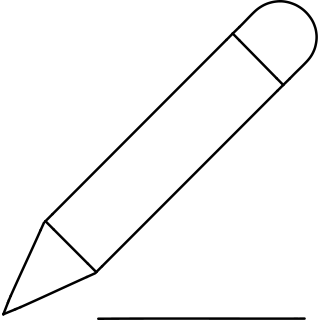 |
| 33 | subtitles slash_c9737be8-1096-4813-8fac-71d8f1cfa153 | [brief](briefs/subtitles slash_c9737be8-1096-4813-8fac-71d8f1cfa153.md) |  |
| 34 | sunbeam_9b208226-72aa-4fe0-b384-8dbba87a42dc | [brief](briefs/sunbeam_9b208226-72aa-4fe0-b384-8dbba87a42dc.md) |  |
