# Reconstruction worklist

103 icons from `icon_set/work/todo-solo-briefs-100-20260920-batch5/sources`.

Triage on the contact sheets in `sheets/`, then take one icon at a time:
read its brief, look at its render, and author it through
`icon_set/skills/icon-design/SKILL.md`.

| # | concept | brief | render |
|--:|---|---|---|
| 1 | bran_ea8b7e1a-9194-4186-bae2-7935346f4687 | [brief](briefs/bran_ea8b7e1a-9194-4186-bae2-7935346f4687.md) |  |
| 2 | branch_2f5900f6-5a24-49f0-8fab-d7cab2a4b8df | [brief](briefs/branch_2f5900f6-5a24-49f0-8fab-d7cab2a4b8df.md) | 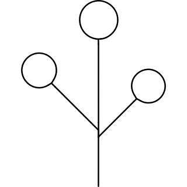 |
| 3 | brandy_d0b7f8bc-8c0a-41f6-af97-180b29fa64dd | [brief](briefs/brandy_d0b7f8bc-8c0a-41f6-af97-180b29fa64dd.md) |  |
| 4 | brass_1c3b1dee-2c1a-4e89-91de-95172d2201db | [brief](briefs/brass_1c3b1dee-2c1a-4e89-91de-95172d2201db.md) | 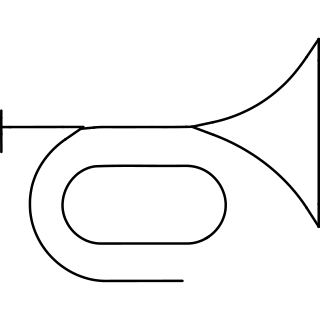 |
| 5 | brassiere_32e153d1-93d0-4f27-afd1-e276f48e77ad | [brief](briefs/brassiere_32e153d1-93d0-4f27-afd1-e276f48e77ad.md) | 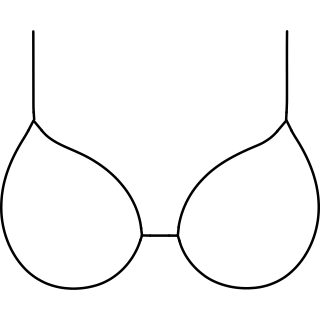 |
| 6 | bratwurst_b014012a-ab85-4245-8dbd-a66dc5a899be | [brief](briefs/bratwurst_b014012a-ab85-4245-8dbd-a66dc5a899be.md) | 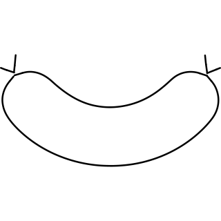 |
| 7 | bread slice spread_f9a5cfd4-e289-4257-90a9-77f15fa702fa | [brief](briefs/bread slice spread_f9a5cfd4-e289-4257-90a9-77f15fa702fa.md) | 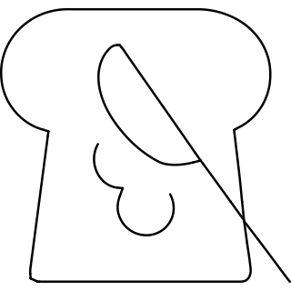 |
| 8 | bread wheat_8a02fc5d-81a6-4f72-8628-2ea73f78a5b6 | [brief](briefs/bread wheat_8a02fc5d-81a6-4f72-8628-2ea73f78a5b6.md) | 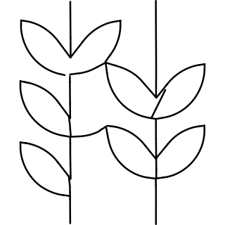 |
| 9 | breakfast cereal bowl spoon_3b2c9406-2092-4116-8769-4dc56a3eaba7 | [brief](briefs/breakfast cereal bowl spoon_3b2c9406-2092-4116-8769-4dc56a3eaba7.md) |  |
| 10 | breakfast cereal bowl_3cef2a0f-c31c-48a5-a764-03f1fb4a7468 | [brief](briefs/breakfast cereal bowl_3cef2a0f-c31c-48a5-a764-03f1fb4a7468.md) |  |
| 11 | breakfast english_9cd5bf77-b0ca-4e59-86ca-62d4b29d41fd | [brief](briefs/breakfast english_9cd5bf77-b0ca-4e59-86ca-62d4b29d41fd.md) | 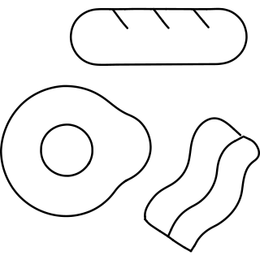 |
| 12 | breastplate_f8e53793-05b3-42da-a1ec-4dba6c2ce3f8 | [brief](briefs/breastplate_f8e53793-05b3-42da-a1ec-4dba6c2ce3f8.md) | 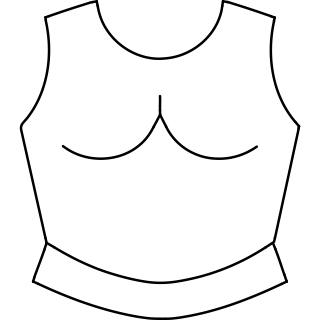 |
| 13 | breeding gender symbols_d98a91a3-2cf0-4bb4-a37a-26d5ea8781e0 | [brief](briefs/breeding gender symbols_d98a91a3-2cf0-4bb4-a37a-26d5ea8781e0.md) |  |
| 14 | bridge golden gate_86b37e1a-0047-497f-8897-cc61b8ea2db2 | [brief](briefs/bridge golden gate_86b37e1a-0047-497f-8897-cc61b8ea2db2.md) | 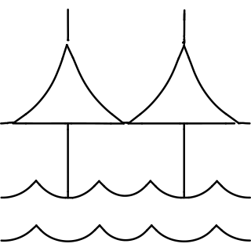 |
| 15 | briefs_9b44cc61-6847-480b-a308-1c8b5598d3b7 | [brief](briefs/briefs_9b44cc61-6847-480b-a308-1c8b5598d3b7.md) | 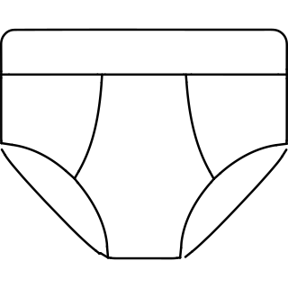 |
| 16 | broadcom logo_b139565d-6d13-483a-bd7e-4154bb78e1c1 | [brief](briefs/broadcom logo_b139565d-6d13-483a-bd7e-4154bb78e1c1.md) |  |
| 17 | broiler_9555863c-04f0-4a1d-97a0-34f34e0a22f8 | [brief](briefs/broiler_9555863c-04f0-4a1d-97a0-34f34e0a22f8.md) |  |
| 18 | brooch_da8e4b4b-2941-4694-9449-49cdee922e25 | [brief](briefs/brooch_da8e4b4b-2941-4694-9449-49cdee922e25.md) |  |
| 19 | brood_3e5e6e07-c3c4-4da3-a938-4c026589b78f | [brief](briefs/brood_3e5e6e07-c3c4-4da3-a938-4c026589b78f.md) |  |
| 20 | brook_5db1edb7-f7b6-4181-af59-5ba6571e9c71 | [brief](briefs/brook_5db1edb7-f7b6-4181-af59-5ba6571e9c71.md) |  |
| 21 | broom dustpan_9218d7b4-2468-48fa-baee-9384041eb713 | [brief](briefs/broom dustpan_9218d7b4-2468-48fa-baee-9384041eb713.md) | 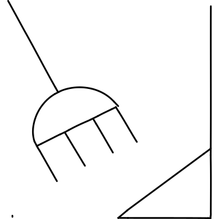 |
| 22 | broom sweep 1_23b1dce1-01a3-4d0e-9224-6b91d6c92bd5 | [brief](briefs/broom sweep 1_23b1dce1-01a3-4d0e-9224-6b91d6c92bd5.md) | 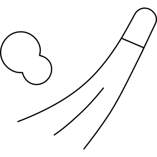 |
| 23 | broom sweep 2_9a0e03d9-b69e-480d-a8e2-6dac337ad0f9 | [brief](briefs/broom sweep 2_9a0e03d9-b69e-480d-a8e2-6dac337ad0f9.md) |  |
| 24 | broom sweep handle_71575066-8fed-4032-ab20-f2410cd6022f | [brief](briefs/broom sweep handle_71575066-8fed-4032-ab20-f2410cd6022f.md) |  |
| 25 | brownie_ab5fed77-bc1e-40f3-b02a-d2792caa0aa7 | [brief](briefs/brownie_ab5fed77-bc1e-40f3-b02a-d2792caa0aa7.md) | 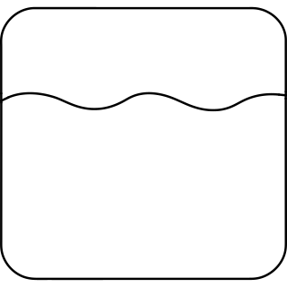 |
| 26 | brush toothpaste 1_30a98a8e-4d69-4039-8e6c-32e3fbfdabff | [brief](briefs/brush toothpaste 1_30a98a8e-4d69-4039-8e6c-32e3fbfdabff.md) | 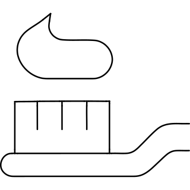 |
| 27 | brush toothpaste 2_8f1ca52a-e459-4737-9ab7-7cc089086a7f | [brief](briefs/brush toothpaste 2_8f1ca52a-e459-4737-9ab7-7cc089086a7f.md) | 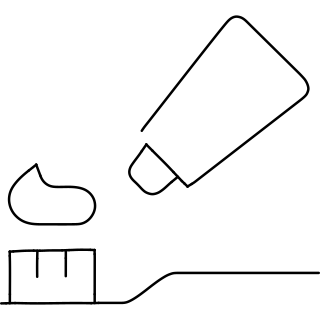 |
| 28 | bubble tea leaf_47b073e7-6d6d-4914-a060-1296929bd372 | [brief](briefs/bubble tea leaf_47b073e7-6d6d-4914-a060-1296929bd372.md) | 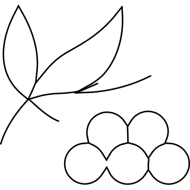 |
| 29 | bubble tea shake_273a7915-a08f-4e47-b937-2520d716f214 | [brief](briefs/bubble tea shake_273a7915-a08f-4e47-b937-2520d716f214.md) | 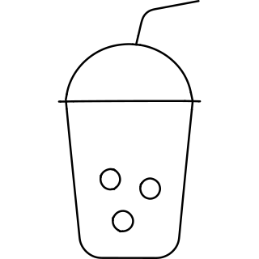 |
| 30 | bubble tea special_c1d62a0e-a7f2-495b-9223-523514e7c6ac | [brief](briefs/bubble tea special_c1d62a0e-a7f2-495b-9223-523514e7c6ac.md) | 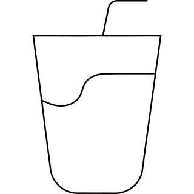 |
| 31 | bubble tea wipcream_e52ac83b-efdf-4e66-8e38-7a56b1b9fd8b | [brief](briefs/bubble tea wipcream_e52ac83b-efdf-4e66-8e38-7a56b1b9fd8b.md) | 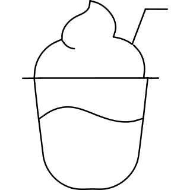 |
| 32 | buckle_0169368c-7bf4-4800-b2f3-bb9794f0b9da | [brief](briefs/buckle_0169368c-7bf4-4800-b2f3-bb9794f0b9da.md) | 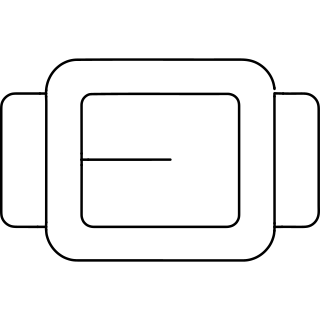 |
| 33 | buckwheat_9588ce1d-b11c-425d-9000-0a97517cf561 | [brief](briefs/buckwheat_9588ce1d-b11c-425d-9000-0a97517cf561.md) | 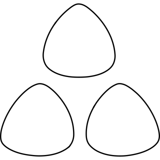 |
| 34 | bud_bf688152-38d6-4d2c-84e0-5399edca85e8 | [brief](briefs/bud_bf688152-38d6-4d2c-84e0-5399edca85e8.md) |  |
| 35 | bug_b480d4a6-e71f-4755-80ae-ea821a51f4c6 | [brief](briefs/bug_b480d4a6-e71f-4755-80ae-ea821a51f4c6.md) | 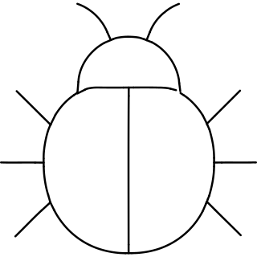 |
| 36 | buggy_f32dfbb3-c9cb-4afa-ab8c-f60fb98b6072 | [brief](briefs/buggy_f32dfbb3-c9cb-4afa-ab8c-f60fb98b6072.md) |  |
| 37 | build snowman_47428121-76fd-443d-8ee2-ab1ad5fe0dda | [brief](briefs/build snowman_47428121-76fd-443d-8ee2-ab1ad5fe0dda.md) |  |
| 38 | builder_5252f064-029f-4da1-8f2f-831de57b0962 | [brief](briefs/builder_5252f064-029f-4da1-8f2f-831de57b0962.md) |  |
| 39 | building cloudy_0291328f-6b9e-4cc3-80d5-84c234b92ad3 | [brief](briefs/building cloudy_0291328f-6b9e-4cc3-80d5-84c234b92ad3.md) |  |
| 40 | building on fire_b42b12a6-33e7-40fc-99c7-e1ed35cbf68d | [brief](briefs/building on fire_b42b12a6-33e7-40fc-99c7-e1ed35cbf68d.md) | 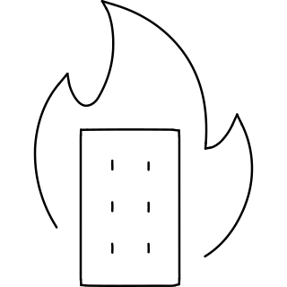 |
| 41 | building user_f45d9583-295d-48ad-a334-df8ed9d7581c | [brief](briefs/building user_f45d9583-295d-48ad-a334-df8ed9d7581c.md) |  |
| 42 | buildings modern_29ffcd51-7400-49d1-a260-59453f34b6be | [brief](briefs/buildings modern_29ffcd51-7400-49d1-a260-59453f34b6be.md) | 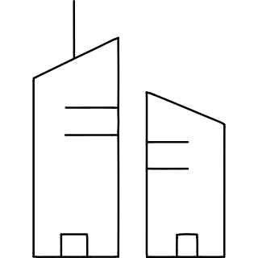 |
| 43 | bulldozer_d0f99117-6bd5-4d22-aa8c-bb2c7264ee3a | [brief](briefs/bulldozer_d0f99117-6bd5-4d22-aa8c-bb2c7264ee3a.md) | 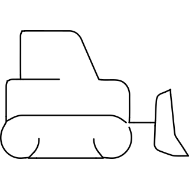 |
| 44 | bullet train_d8781f08-cfe6-4e26-bc3b-db1352f0f827 | [brief](briefs/bullet train_d8781f08-cfe6-4e26-bc3b-db1352f0f827.md) | 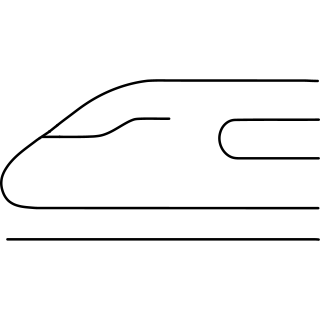 |
| 45 | bullhorn_42b9620f-0b8b-4f52-bd79-c77bb05931cb | [brief](briefs/bullhorn_42b9620f-0b8b-4f52-bd79-c77bb05931cb.md) |  |
| 46 | bump_8963d946-c616-4134-9f7d-55e72535aa68 | [brief](briefs/bump_8963d946-c616-4134-9f7d-55e72535aa68.md) |  |
| 47 | bun_d328ea7d-4599-4236-ba2c-ee74bc46d030 | [brief](briefs/bun_d328ea7d-4599-4236-ba2c-ee74bc46d030.md) | 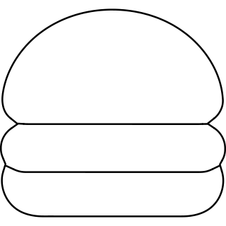 |
| 48 | burj kalifa uae_594d48c3-e95a-4c24-ab70-9732672baf73 | [brief](briefs/burj kalifa uae_594d48c3-e95a-4c24-ab70-9732672baf73.md) | 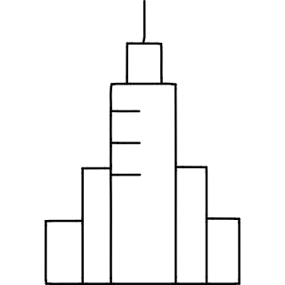 |
| 49 | burrito_b3b9d031-1b14-49cd-b640-12d78e2f90f7 | [brief](briefs/burrito_b3b9d031-1b14-49cd-b640-12d78e2f90f7.md) | 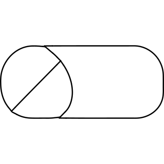 |
| 50 | bus double 1_c3f4b56e-b7d9-4000-bb93-f157d62f206a | [brief](briefs/bus double 1_c3f4b56e-b7d9-4000-bb93-f157d62f206a.md) |  |
| 51 | bus double_3c79c18d-55d6-4dfc-9ecf-737c14cf9a32 | [brief](briefs/bus double_3c79c18d-55d6-4dfc-9ecf-737c14cf9a32.md) | 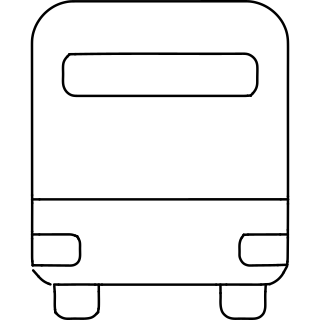 |
| 52 | bus driver_75949dbd-cdea-407f-acd0-a576b892a781 | [brief](briefs/bus driver_75949dbd-cdea-407f-acd0-a576b892a781.md) |  |
| 53 | business big small fish_ef3909ee-ca34-4bc7-88ca-385329aa590a | [brief](briefs/business big small fish_ef3909ee-ca34-4bc7-88ca-385329aa590a.md) | 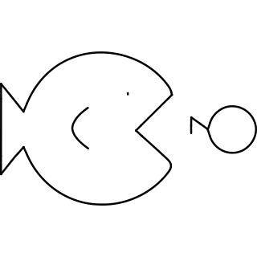 |
| 54 | business boat success_671c203b-1a97-4286-90fd-0ab7df5d9dea | [brief](briefs/business boat success_671c203b-1a97-4286-90fd-0ab7df5d9dea.md) |  |
| 55 | business burn money_0f17f506-249c-43ae-928f-f9f965a37095 | [brief](briefs/business burn money_0f17f506-249c-43ae-928f-f9f965a37095.md) |  |
| 56 | business paper boat_f9c83ed6-0e16-4381-b025-d8b3b24214c0 | [brief](briefs/business paper boat_f9c83ed6-0e16-4381-b025-d8b3b24214c0.md) |  |
| 57 | button arrow curve_64aa2f6c-f55b-4f9f-8700-1818ea4550e2 | [brief](briefs/button arrow curve_64aa2f6c-f55b-4f9f-8700-1818ea4550e2.md) |  |
| 58 | button_be4a9d67-241a-40d1-ad6f-ac28c0de01a1 | [brief](briefs/button_be4a9d67-241a-40d1-ad6f-ac28c0de01a1.md) |  |
| 59 | buzzard_3ca9c99f-67fa-4938-86d8-fb6ec5827812 | [brief](briefs/buzzard_3ca9c99f-67fa-4938-86d8-fb6ec5827812.md) |  |
| 60 | byte logo_501a1af2-eada-4b51-ab88-42eb6c350817 | [brief](briefs/byte logo_501a1af2-eada-4b51-ab88-42eb6c350817.md) | 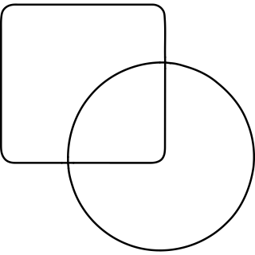 |
| 61 | c clamp_27d4aaa8-b81d-43f6-9c9d-037843e2726b | [brief](briefs/c clamp_27d4aaa8-b81d-43f6-9c9d-037843e2726b.md) | 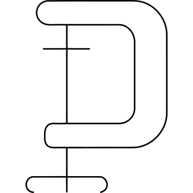 |
| 62 | cabinet_051c846c-5b40-442b-9abd-c400bc170236 | [brief](briefs/cabinet_051c846c-5b40-442b-9abd-c400bc170236.md) |  |
| 63 | cable split 1_c2b95326-67f0-4896-9c13-fe74ec04dca1 | [brief](briefs/cable split 1_c2b95326-67f0-4896-9c13-fe74ec04dca1.md) | 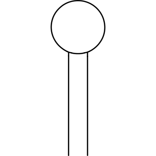 |
| 64 | cable zip tie 1_2366568f-1815-4e7c-8842-66b61e3ca6f2 | [brief](briefs/cable zip tie 1_2366568f-1815-4e7c-8842-66b61e3ca6f2.md) | 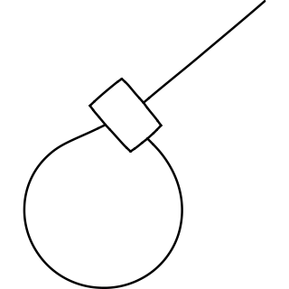 |
| 65 | cable zip tie 2_0555f378-857c-402a-91f7-d7c7007787c9 | [brief](briefs/cable zip tie 2_0555f378-857c-402a-91f7-d7c7007787c9.md) | 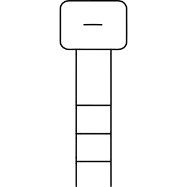 |
| 66 | caftan_a7d5f6cc-5e27-4b91-aa51-42aa97d7379a | [brief](briefs/caftan_a7d5f6cc-5e27-4b91-aa51-42aa97d7379a.md) |  |
| 67 | cake birthday_9481507d-7782-4ced-aed3-801c47c299db | [brief](briefs/cake birthday_9481507d-7782-4ced-aed3-801c47c299db.md) | 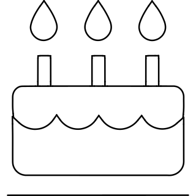 |
| 68 | cake sifter_d268d76a-a04f-4964-9dfa-50ef4b8866a4 | [brief](briefs/cake sifter_d268d76a-a04f-4964-9dfa-50ef4b8866a4.md) | 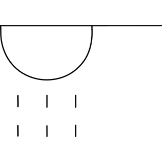 |
| 69 | cake_62aef05a-a111-475f-ac8e-5b3939ad1d77 | [brief](briefs/cake_62aef05a-a111-475f-ac8e-5b3939ad1d77.md) |  |
| 70 | calibre_ab87a92a-dc97-4241-8c99-6276c3a9d4a5 | [brief](briefs/calibre_ab87a92a-dc97-4241-8c99-6276c3a9d4a5.md) |  |
| 71 | camera double_057176ec-65ed-4033-9fea-d59ba549b2b1 | [brief](briefs/camera double_057176ec-65ed-4033-9fea-d59ba549b2b1.md) |  |
| 72 | camera holder_2c58f365-9526-4bfa-acdf-c82fbb9c3b18 | [brief](briefs/camera holder_2c58f365-9526-4bfa-acdf-c82fbb9c3b18.md) | 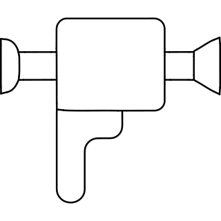 |
| 73 | camera settings focus_616d422f-12d3-43a6-93e6-1f80b251ffe7 | [brief](briefs/camera settings focus_616d422f-12d3-43a6-93e6-1f80b251ffe7.md) |  |
| 74 | camera settings frame 1_f5ada276-7815-4d75-9ba7-b74ca81c7919 | [brief](briefs/camera settings frame 1_f5ada276-7815-4d75-9ba7-b74ca81c7919.md) | 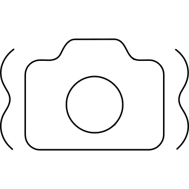 |
| 75 | camera settings rotate_c489d854-1f8e-43c0-9352-5f289afbebf9 | [brief](briefs/camera settings rotate_c489d854-1f8e-43c0-9352-5f289afbebf9.md) |  |
| 76 | camera studio_13b4bb4a-e80e-4d67-ba36-8ea8adaff4fa | [brief](briefs/camera studio_13b4bb4a-e80e-4d67-ba36-8ea8adaff4fa.md) | 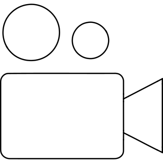 |
| 77 | camper_d86d46d5-367a-4ef9-b622-6b5791529dc1 | [brief](briefs/camper_d86d46d5-367a-4ef9-b622-6b5791529dc1.md) |  |
| 78 | campground_82646d5e-e035-4677-8d52-2b1ad4c2bbdf | [brief](briefs/campground_82646d5e-e035-4677-8d52-2b1ad4c2bbdf.md) | 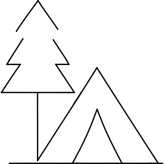 |
| 79 | camping tent forest_5ec0d821-df70-49aa-962a-1a4942629194 | [brief](briefs/camping tent forest_5ec0d821-df70-49aa-962a-1a4942629194.md) | 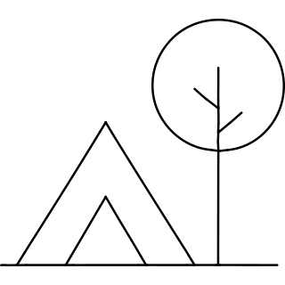 |
| 80 | camping trekking 1_5853dc01-f202-4aea-831c-868615df00b7 | [brief](briefs/camping trekking 1_5853dc01-f202-4aea-831c-868615df00b7.md) | 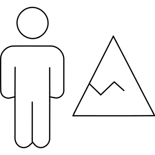 |
| 81 | camping trekking 2_a5dd1853-85b1-4551-9bed-6d6340338b74 | [brief](briefs/camping trekking 2_a5dd1853-85b1-4551-9bed-6d6340338b74.md) | 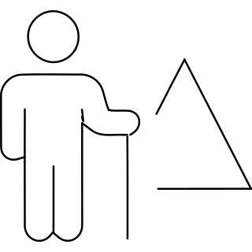 |
| 82 | camping trekking tent_23426642-b56a-47a6-8d29-43fd4e1c68f1 | [brief](briefs/camping trekking tent_23426642-b56a-47a6-8d29-43fd4e1c68f1.md) | 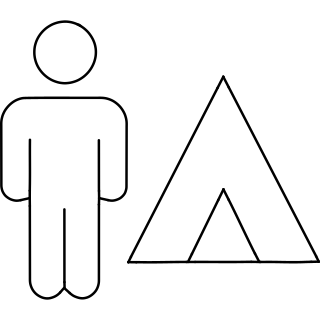 |
| 83 | camping trekking tree_606380e3-1059-40bf-ae0d-162336f79ab6 | [brief](briefs/camping trekking tree_606380e3-1059-40bf-ae0d-162336f79ab6.md) |  |
| 84 | candles chart_8a69a0c1-8325-4dbd-b8d6-0ebf18ca6165 | [brief](briefs/candles chart_8a69a0c1-8325-4dbd-b8d6-0ebf18ca6165.md) |  |
| 85 | canopy_a9ff6006-32d9-42c3-b47d-f9c8ddca6c2e | [brief](briefs/canopy_a9ff6006-32d9-42c3-b47d-f9c8ddca6c2e.md) | 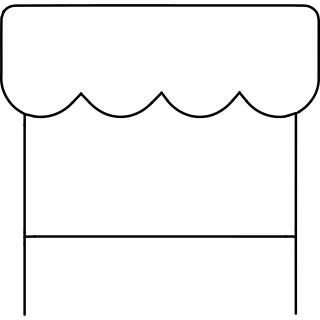 |
| 86 | cantaloupe_15dcbcba-2d38-4132-a44d-0a2eb36a8ed1 | [brief](briefs/cantaloupe_15dcbcba-2d38-4132-a44d-0a2eb36a8ed1.md) |  |
| 87 | cap sunglasses_264814f3-8ffa-45e9-be4e-00194dae68c2 | [brief](briefs/cap sunglasses_264814f3-8ffa-45e9-be4e-00194dae68c2.md) |  |
| 88 | car bomb 2_c6971772-3fa8-4789-ad98-7b4b6b388d5c | [brief](briefs/car bomb 2_c6971772-3fa8-4789-ad98-7b4b6b388d5c.md) |  |
| 89 | car clouds_ee5bbd28-411f-4a8f-bec4-24171fa57174 | [brief](briefs/car clouds_ee5bbd28-411f-4a8f-bec4-24171fa57174.md) |  |
| 90 | car dashboard gear_fa01e257-da76-436f-8013-7b6c13ededaf | [brief](briefs/car dashboard gear_fa01e257-da76-436f-8013-7b6c13ededaf.md) | 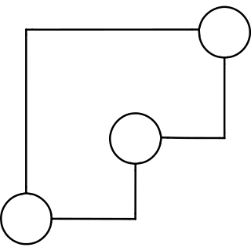 |
| 91 | car descending control_400b299b-3d6d-4ea5-900a-c45553cdafda | [brief](briefs/car descending control_400b299b-3d6d-4ea5-900a-c45553cdafda.md) | 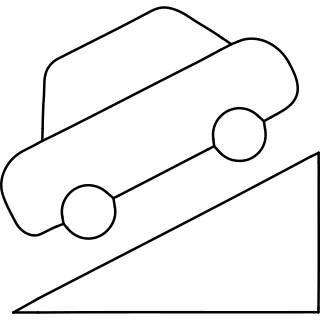 |
| 92 | car explode_757187c1-fd16-4577-8bb6-b25ad4df2330 | [brief](briefs/car explode_757187c1-fd16-4577-8bb6-b25ad4df2330.md) |  |
| 93 | car hood release_de4837e9-fc58-4000-be76-deb74b0a3723 | [brief](briefs/car hood release_de4837e9-fc58-4000-be76-deb74b0a3723.md) | 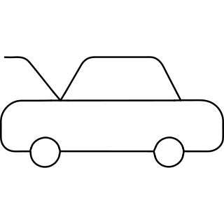 |
| 94 | car insurance hands_f7acffbb-95f3-4cdd-98e2-2243774f9339 | [brief](briefs/car insurance hands_f7acffbb-95f3-4cdd-98e2-2243774f9339.md) |  |
| 95 | car repair engine_e1beff0b-613f-4495-8b2d-c0b3036fad7e | [brief](briefs/car repair engine_e1beff0b-613f-4495-8b2d-c0b3036fad7e.md) |  |
| 96 | car repair wash 1_e8878e02-6a89-4f38-91b2-1f4b7dd92fdd | [brief](briefs/car repair wash 1_e8878e02-6a89-4f38-91b2-1f4b7dd92fdd.md) |  |
| 97 | car repair wash 2_d7783b02-e678-4b5f-a12d-e6dd227ecdd8 | [brief](briefs/car repair wash 2_d7783b02-e678-4b5f-a12d-e6dd227ecdd8.md) |  |
| 98 | car sensor 1_470a18bd-b01c-429e-96d1-77178c4d935a | [brief](briefs/car sensor 1_470a18bd-b01c-429e-96d1-77178c4d935a.md) |  |
| 99 | car sensor 3_3c675853-e649-4029-b679-cef625fb977e | [brief](briefs/car sensor 3_3c675853-e649-4029-b679-cef625fb977e.md) |  |
| 100 | car side_66a7bddb-97e8-4a0e-854b-1b3a855bbd18 | [brief](briefs/car side_66a7bddb-97e8-4a0e-854b-1b3a855bbd18.md) |  |
| 101 | car sun_b29c9138-b839-4d16-85c8-dd78ec3254c1 | [brief](briefs/car sun_b29c9138-b839-4d16-85c8-dd78ec3254c1.md) |  |
| 102 | car tool battery_f5bbb1d0-0733-4fe9-aa3d-53b1775cb2d5 | [brief](briefs/car tool battery_f5bbb1d0-0733-4fe9-aa3d-53b1775cb2d5.md) |  |
| 103 | car truck luggage_a2e89861-f395-4a39-b6ce-109ebb0f1ac0 | [brief](briefs/car truck luggage_a2e89861-f395-4a39-b6ce-109ebb0f1ac0.md) |  |
