# Reconstruction worklist

100 icons from `/Applications/Workspaces/pictographic/claude_skills/icon_set/work/todo-solo-briefs-100-20260920-batch7/sources`.

Triage on the contact sheets in `sheets/`, then take one icon at a time:
read its brief, look at its render, and author it through
`icon_set/skills/icon-design/SKILL.md`.

| # | concept | brief | render |
|--:|---|---|---|
| 1 | Touching Champagne Flutes | [brief](briefs/champagne cheers_8af7ae40-ea5a-48d3-bfc6-209e3b88e405.md) | 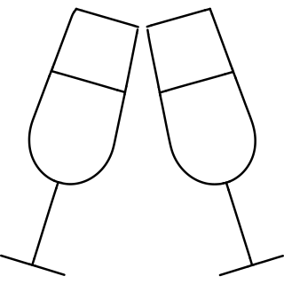 |
| 2 | Bare Three Arm Chandelier | [brief](briefs/chandelier_076c13f2-7525-47c3-b461-4fa44894212d.md) | 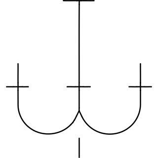 |
| 3 | Lobed Chard Leaf | [brief](briefs/chard_be6a6bc0-156a-4387-b9d6-e6375f4ca0cd.md) | 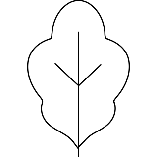 |
| 4 | Three Bars with Rising Trend Arrow | [brief](briefs/chart area_cefde376-e6c6-4228-9fa9-9c6b0e5d5a0e.md) | 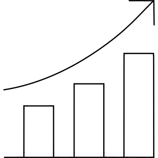 |
| 5 | Rising Connected Point Chart | [brief](briefs/chart network_d40fc99f-cce9-49f0-bd8e-6ec9ed9d0dbe.md) | 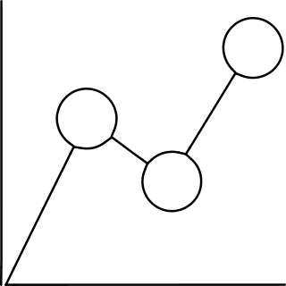 |
| 6 | Four Point Scatter Chart | [brief](briefs/chart scatter_d0eb4fa2-855f-47b7-9588-0ec9e03fcf18.md) | 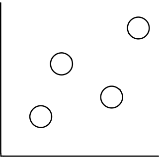 |
| 7 | Jagged Ground Fissure | [brief](briefs/chasm_c325c94a-e25b-4856-9d79-9c47ededff04.md) | 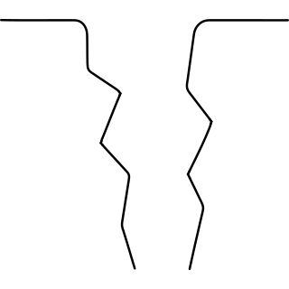 |
| 8 | Cross Marked Priestly Vestment | [brief](briefs/chasuble_ca129cae-cf8a-4b6f-b1a0-93c8ebaa460d.md) | 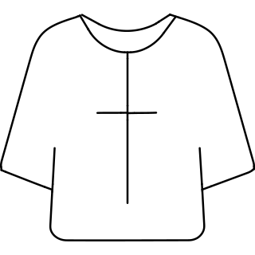 |
| 9 | Twin Tower Crenellated Castle | [brief](briefs/chateau_a3b074e2-03e7-49b3-b43a-facb1fea5e0f.md) | 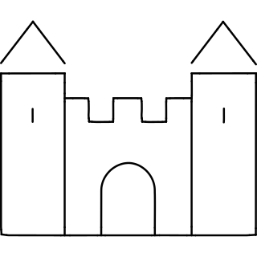 |
| 10 | Hanger with Hanging Garment | [brief](briefs/checkroom_a8d34e2a-aa59-4609-8339-2e44582330ee.md) | 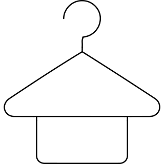 |
| 11 | Holey Cheese Wedge | [brief](briefs/cheddar_62328e10-0288-4b74-9efd-5656a2f3b021.md) | 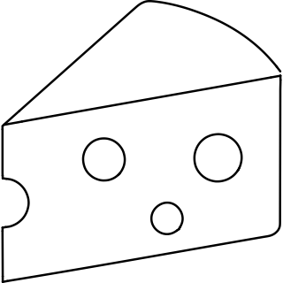 |
| 12 | Close Side View Face | [brief](briefs/cheek_a6f5a36d-d963-47a3-bbf8-3d73f4db6df2.md) | 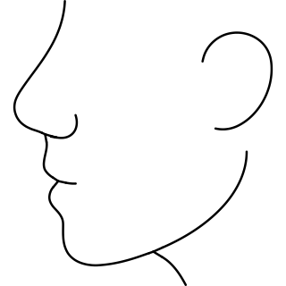 |
| 13 | Cherry Topped Cheesecake Slice | [brief](briefs/cheesecake_6b3e7a5a-f418-4efc-be04-216b265ddec8.md) | 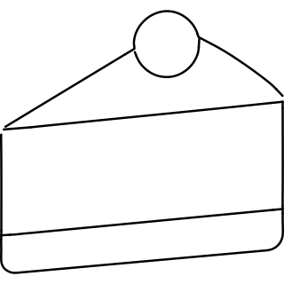 |
| 14 | Paired Cherries on Joined Stems | [brief](briefs/cherries_e529b655-07d4-4e9e-9bf4-04a73349171c.md) | 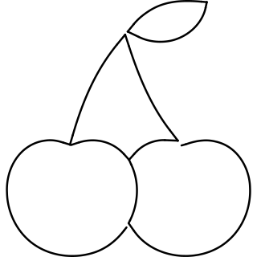 |
| 15 | Whole Chestnut with Basal Patch | [brief](briefs/chestnut_82d65976-9908-4544-8c19-ca1cdea52290.md) | 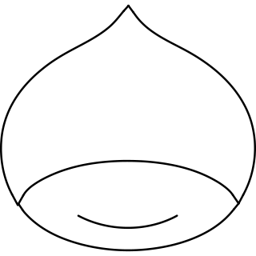 |
| 16 | Wide Downward Chevron | [brief](briefs/chevron down_8abc756f-c377-4696-aa20-1e5c7798f4f4.md) |  |
| 17 | Left Facing Hen with Split Crest | [brief](briefs/chicken animal_5ee8a983-7ca0-48b0-a3c8-3fbe81bd8f23.md) | 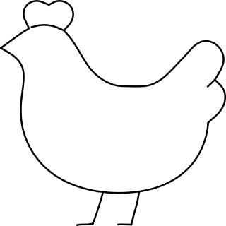 |
| 18 | Three Toed Bird Track | [brief](briefs/chicken footstep_ad358c09-b960-43ca-954d-80c6af3ca0cb.md) | 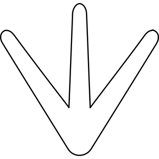 |
| 19 | Overlapping Pair of Person Busts | [brief](briefs/children_88b4b313-f864-4dcc-926e-0871b542975b.md) | 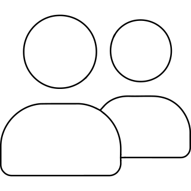 |
| 20 | Plain Left Facing Head | [brief](briefs/chin_0433e1a6-9f81-475a-a214-d9bf1e1020be.md) | 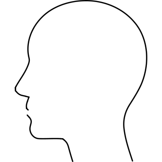 |
| 21 | Seated Chinchilla with Curved Tail | [brief](briefs/chinchilla_df04551f-f9b1-422f-a44f-8a7dfd1d0dda.md) | 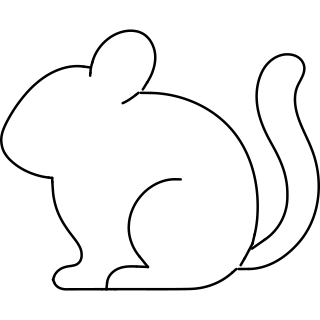 |
| 22 | Squirrel with Upright Bushy Tail | [brief](briefs/chipmunk_a51deaea-200e-4079-8de8-824f2bcd9803.md) | 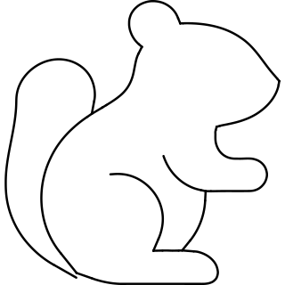 |
| 23 | Diagonal Segmented Chocolate Bar | [brief](briefs/chocolate_90727e4f-6950-41e8-a557-dfe10340c106.md) | 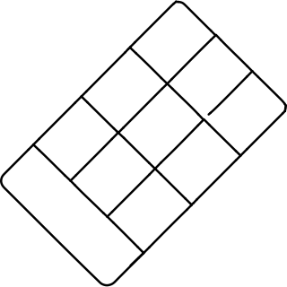 |
| 24 | Single Diagonal Chopstick | [brief](briefs/chop_009a26e9-2efc-461f-9de9-3fcc1e21218f.md) | 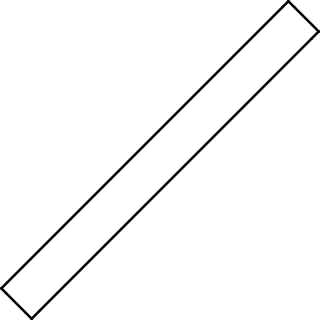 |
| 25 | Diagonal Cleaver with Hanging Hole | [brief](briefs/chops_cfcfcb82-64f9-4889-b3e8-32939823d9d7.md) | 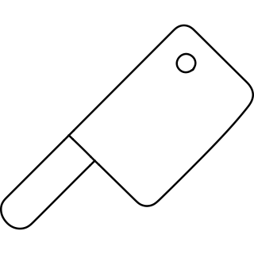 |
| 26 | Two Outward Tilting Bells | [brief](briefs/christmas bells 1_ebc9eed0-03aa-44c8-b4c7-1edc6eeb278b.md) | 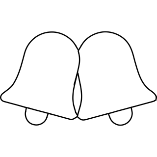 |
| 27 | Striped Party Hat with Star | [brief](briefs/christmas tree top_c3befecc-ffbb-4d26-a3ba-7b7a67b74fa8.md) | 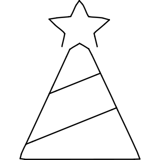 |
| 28 | Offset Circuit Paths with Nodes | [brief](briefs/circuit_b003cefb-7628-4518-a203-95ce607f5b82.md) | 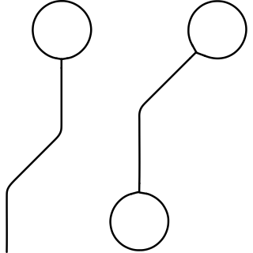 |
| 29 | Cloud with Stepped Left Lobes | [brief](briefs/cirrus_74df4e16-faa5-4931-9cd7-ddbd247089ab.md) | 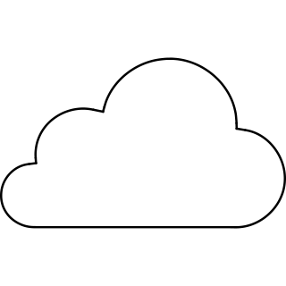 |
| 30 | Whole Lemon with Single Leaf | [brief](briefs/citron_2ce6dd5a-e886-4158-9462-4ec687e19a2f.md) | 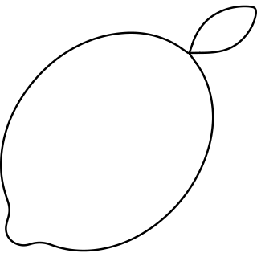 |
| 31 | Eight Segment Citrus Slice | [brief](briefs/citrus_d06f9723-9870-4475-b5d2-ce03876c7ec1.md) | 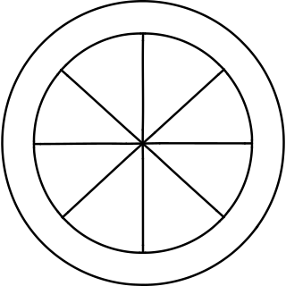 |
| 32 | Fanned Scallop Shell | [brief](briefs/clam_f0265e7e-4d69-44a0-89ab-ebd033f28d2b.md) | 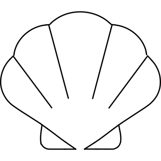 |
| 33 | Heavy C Clamp with Top Handle | [brief](briefs/clamp_2cfa5d85-df72-45ce-be9f-4e4595f8f055.md) | 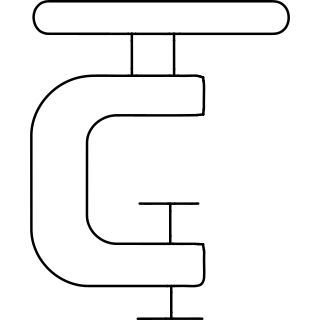 |
| 34 | Eight Tooth Gear Wheel | [brief](briefs/clank_362e5fd2-8e92-42c7-9bf3-83d09defb86f.md) |  |
| 35 | Plain Diagonal Clarinet | [brief](briefs/clarinet_dd078007-13b1-404c-882e-c01b57f0cba0.md) | 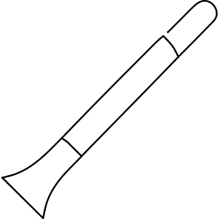 |
| 36 | Five Key Piano Section | [brief](briefs/clavier_703eb1b7-7012-4373-aa0a-70cb1f1a2aac.md) | 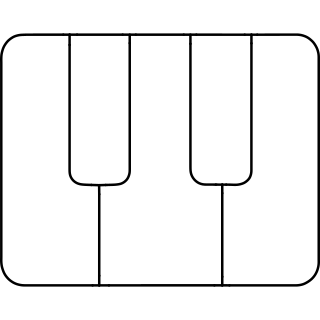 |
| 37 | Symmetric Claw Gripper | [brief](briefs/claw_8a8418ac-5b0f-416a-b52c-e5ff21929487.md) | 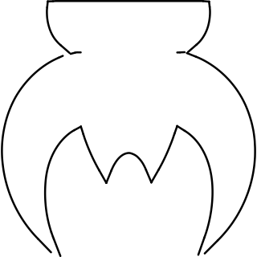 |
| 38 | Diagonal Broom with Curving Bristles | [brief](briefs/cleaning broom_63b13e7a-cfd8-40db-80b6-da30f17f8995.md) | 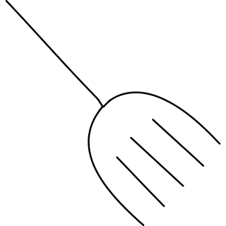 |
| 39 | Studded Soccer Cleat | [brief](briefs/cleat_92901ffc-8850-47e1-b64c-7fd71adcc49e.md) | 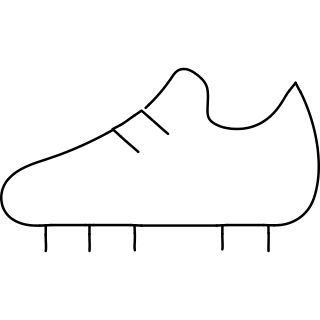 |
| 40 | Looped Treble Clef | [brief](briefs/clef_0bb5de88-a86b-409b-a1eb-82ac6ee78932.md) | 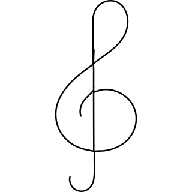 |
| 41 | Overhanging Cliff Profile | [brief](briefs/cliff_ac22c9c1-7d8b-4db5-aad6-081a55205d04.md) | 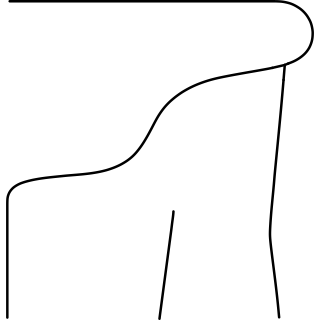 |
| 42 | Stepped Cliffs beneath Sun | [brief](briefs/cliffs of mother_c86f69ad-1fb2-4e7d-ac5c-71c6bf72365c.md) | 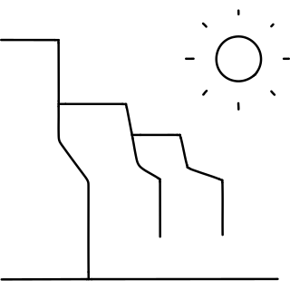 |
| 43 | Open Front Hooded Cloak | [brief](briefs/cloak_a31f3f41-e636-492d-ad83-a82ed5593583.md) | 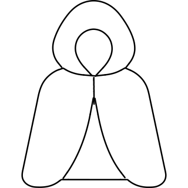 |
| 44 | Wardrobe with Round Door Knobs | [brief](briefs/closet_4fb857a1-bc4b-44f0-99c2-01a3ea3cbb39.md) | 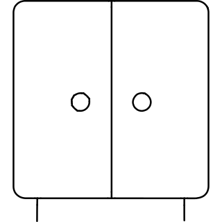 |
| 45 | Rounded Hem Short Sleeve Shirt | [brief](briefs/cloth_9d5dfe24-d47a-4395-a318-f90b949f37f4.md) | 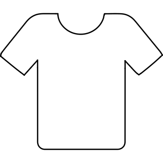 |
| 46 | Hanger with Inner Trouser Bar | [brief](briefs/clothes_2c523587-9090-4f12-8e9f-a33582451d43.md) | 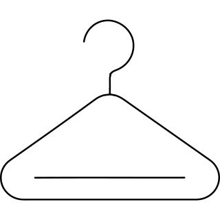 |
| 47 | Square Hem Short Sleeve Tee | [brief](briefs/clothing_f39ec545-3915-48b5-8c18-615d66beb701.md) | 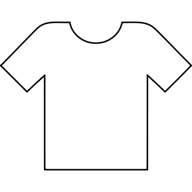 |
| 48 | Broad Three Lobe Cloud | [brief](briefs/cloud gamimg service 2_133b1d44-13e9-47f1-95fe-de4f673a7bf7.md) | 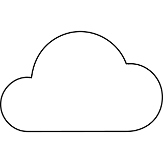 |
| 49 | Sun and Cloud with Rain | [brief](briefs/cloud sun rain_33b4f573-ff3c-49d0-b558-91f25f42f57a.md) | 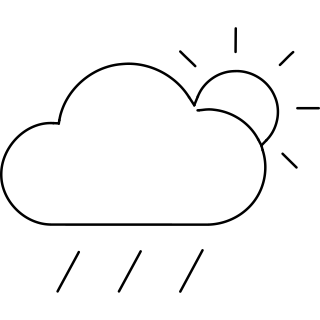 |
| 50 | Cloud with Sun at Upper Right | [brief](briefs/cloud sun_ac055412-82fc-4a86-8de7-cb179e5362be.md) | 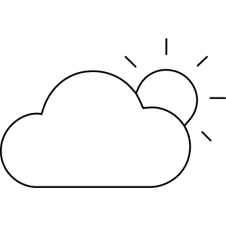 |
| 51 | Clove Bud with Pointed Sepals | [brief](briefs/cloves_2fe3535b-ed46-49bc-ad15-b91d93556dfe.md) | 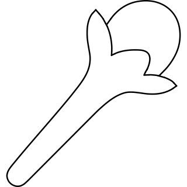 |
| 52 | Three Faceted Coal Chunks | [brief](briefs/coal_660db922-e536-44d1-a9b2-c00ca9afbd97.md) | 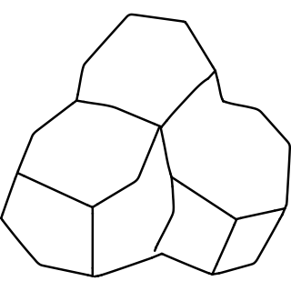 |
| 53 | Curved Shoreline and Water | [brief](briefs/coast_c8b9cdd9-b59e-4f2c-ab98-eaec94fa56c4.md) |  |
| 54 | Double Bordered Square Coaster | [brief](briefs/coaster_e2bf2dad-ab10-44ae-b3d3-f5a582d1a5ca.md) |  |
| 55 | Standing Coat Rack with Curved Hooks | [brief](briefs/coat rack_cfa1bba1-5b3f-4d10-8cf0-3b1b181af313.md) |  |
| 56 | Collared Long Sleeve Coat | [brief](briefs/coat_d94018b9-07e2-45ee-8c77-48c33f5b5d6b.md) |  |
| 57 | Corn Cob in Open Husk | [brief](briefs/cob_509d8c81-aff0-4d15-9237-c757ac95069a.md) |  |
| 58 | Dashboard with Foreground Steering Wheel | [brief](briefs/cockpit_1d59a930-4893-4b9f-8208-3db738cc0478.md) |  |
| 59 | Long Bodied Cockroach | [brief](briefs/cockroach_ed1d04e4-8a81-4353-8d4c-321c16995cfd.md) |  |
| 60 | Opened Cocoa Pod with Three Seeds | [brief](briefs/cocoa_a38a1dfc-66a1-438a-847f-a5131386c188.md) |  |
| 61 | Three Node Branch Junction | [brief](briefs/code branch_3ad1f13c-d23e-4783-a465-9f43c1ac5b56.md) |  |
| 62 | Two Branches Joining Round Node | [brief](briefs/code merge_84cd0786-5f29-452c-a8e4-47c5207efcc3.md) |  |
| 63 | Right Arrow between Data Rows | [brief](briefs/coding apps website big data arrow_e886dcde-7af5-41c6-a333-6a6ddf119555.md) |  |
| 64 | Central Hub with Four Nodes | [brief](briefs/coding apps website big data complexity_516ab5ea-7a01-421d-ad0d-96fc5bb3ab45.md) |  |
| 65 | Cloud with Descending Data Lines | [brief](briefs/coding apps website big data source plurality_cd051ff3-ee41-4ef2-8e69-035711204a47.md) |  |
| 66 | Apple with Upright Leaf | [brief](briefs/codling_8dab56ea-1c91-48e4-9197-a2a2de0bb76d.md) |  |
| 67 | Plain Narrow Front Underwear | [brief](briefs/codpiece_36d1d30d-0608-4321-9df3-408bff2b783a.md) |  |
| 68 | Steaming Cup with Side Handle | [brief](briefs/coffee_955afc46-e6af-4d4c-8b6c-2f662c431b52.md) |  |
| 69 | Two Interlocking Toothed Wheels | [brief](briefs/cog double 1_82c1163c-aaf6-4c80-9120-18bf38090361.md) |  |
| 70 | Diagonal Pair of Meshing Gears | [brief](briefs/cog double_b484255b-2a40-40d1-9943-7e27cfb9f399.md) |  |
| 71 | Three Turn Rounded Coil | [brief](briefs/coil_28b9f3cc-6933-4a12-91fc-92672d36ba2d.md) |  |
| 72 | Capped Contoured Soda Bottle | [brief](briefs/coke_dae21fd7-742b-44ac-ba3c-2e9c6e6066c6.md) |  |
| 73 | Bowl of Curled Coleslaw | [brief](briefs/coleslaw_9d6010e3-0f0e-4eff-be58-e66150706645.md) |  |
| 74 | Pointed Shirt Collar with Button | [brief](briefs/collar_32057a32-76a0-4772-a719-f437eee961f4.md) |  |
| 75 | Collard Leaf with Alternating Veins | [brief](briefs/collard_9fd1fed0-8147-4343-8f7f-8d36e34e9107.md) |  |
| 76 | Tilted Square Paint Bucket | [brief](briefs/color bucket 1_e33b86b4-fa83-4e92-b996-170c46bf04a1.md) |  |
| 77 | Tilted Open Paint Pail | [brief](briefs/color bucket_78957ac2-2cd6-40d7-880e-fe1886f1b394.md) |  |
| 78 | Notched Artist Palette with Paint Wells | [brief](briefs/color painting palette_abb40e14-e6e7-4d0c-8427-63328843fcd9.md) |  |
| 79 | Standing Horse with Pointed Ear | [brief](briefs/colt_45bb5924-488a-4d19-8c1a-2f26f1255b7f.md) |  |
| 80 | Wide Tooth Styling Comb | [brief](briefs/comb_ec58a5de-f714-4940-bc3c-e16505f17209.md) |  |
| 81 | Four Separate Rounded Squares | [brief](briefs/common file module_b64c7f38-6fc8-41f2-93a2-896ce70c7ab4.md) |  |
| 82 | Compact Disc with Reflection Marks | [brief](briefs/compact disc_9fc7318a-342b-45eb-a447-4399befc6a81.md) |  |
| 83 | Square Focus Grid with Circle | [brief](briefs/composition focus_432c781f-01e1-444d-b780-13f079a4a540.md) |  |
| 84 | Person beside Acoustic Guitar | [brief](briefs/concert guitarist_afc1bcf3-950c-46a6-badb-508c8b07dc93.md) |  |
| 85 | Two Cavity Concrete Block | [brief](briefs/concrete_f20bf364-b592-4325-9e9e-a9ef6996da39.md) |  |
| 86 | Hooked Beak Bird Bust | [brief](briefs/condor_7ea98f2c-77cb-4838-b4c3-330b98bee82d.md) |  |
| 87 | Conductor with Raised Baton | [brief](briefs/conductor_6659250b-ef9d-4624-8030-348af08008eb.md) |  |
| 88 | Plain Tapered Conga Drum | [brief](briefs/conga_3cd130ed-dcad-416d-9d64-a3e0fc74471e.md) |  |
| 89 | Person Bust with Wide Necktie | [brief](briefs/congressman_04313a0e-7d80-4d7f-a171-f45acd738ff2.md) |  |
| 90 | Oval Head User Bust | [brief](briefs/congressperson_6336c6f8-fcf4-4bb1-bc75-a0a36bba083d.md) |  |
| 91 | Upright Console with Circular Detail | [brief](briefs/console gamebox_011636cd-825d-4d3e-ab00-f39ea7cef3b3.md) |  |
| 92 | Trowel beside Unfinished Brick Wall | [brief](briefs/construction brick_838089d0-2c44-4425-80d7-6b79b53a0caf.md) |  |
| 93 | Uncapped Marker with Ink Drop | [brief](briefs/content brush pen_42b73bbf-7e8c-4f22-a7a2-81ccf67934d3.md) |  |
| 94 | Long Fountain Pen with Split Nib | [brief](briefs/content ink pen_22af1bb4-1496-4f32-9b2b-a1b9887ffdc1.md) |  |
| 95 | Typewriter with Folded Corner Paper | [brief](briefs/content typing machine 1_8e6749e6-21e4-420f-8e6f-915643ba5e1f.md) |  |
| 96 | Typewriter with Blank Upright Paper | [brief](briefs/content typing machine 3_10b0c285-5a68-47d5-aec7-ad4ae1ef562b.md) |  |
| 97 | Hard Hat Worker with Round Collar | [brief](briefs/contractor_3e7caf13-9071-4393-a911-7e857d63fad2.md) |  |
| 98 | Round Smiling Speech Bubble Pair | [brief](briefs/conversation smile type 1_32bc30ef-2d8b-40cd-a3d8-d06289f1ba6c.md) |  |
| 99 | Square Smiling Speech Bubble Pair | [brief](briefs/conversation smile type_8d648ec6-1ff1-4de1-a5b4-4e9f74b89aef.md) |  |
| 100 | Round Cookie with Two Bite Scallops | [brief](briefs/cookie bite_f430644f-0902-4de5-ab0c-9a50f0332a1a.md) |  |
