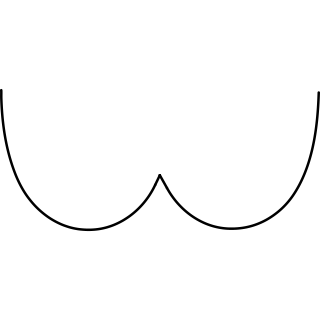
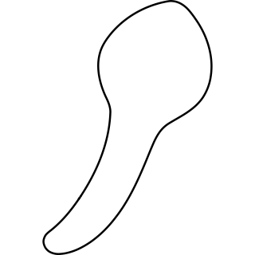
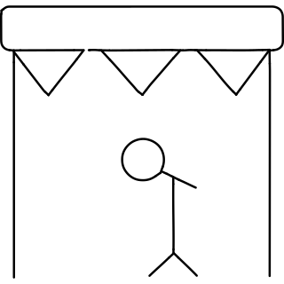

# Reconstruction worklist

105 icons from `icon_set/work/todo-solo-briefs-100-20260920-batch7/sources`.

Triage on the contact sheets in `sheets/`, then take one icon at a time:
read its brief, look at its render, and author it through
`icon_set/skills/icon-design/SKILL.md`.

| # | concept | brief | render |
|--:|---|---|---|
| 1 | champagne cheers_8af7ae40-ea5a-48d3-bfc6-209e3b88e405 | [brief](briefs/champagne cheers_8af7ae40-ea5a-48d3-bfc6-209e3b88e405.md) |  |
| 2 | chandelier_076c13f2-7525-47c3-b461-4fa44894212d | [brief](briefs/chandelier_076c13f2-7525-47c3-b461-4fa44894212d.md) |  |
| 3 | chard_be6a6bc0-156a-4387-b9d6-e6375f4ca0cd | [brief](briefs/chard_be6a6bc0-156a-4387-b9d6-e6375f4ca0cd.md) |  |
| 4 | chart area_cefde376-e6c6-4228-9fa9-9c6b0e5d5a0e | [brief](briefs/chart area_cefde376-e6c6-4228-9fa9-9c6b0e5d5a0e.md) |  |
| 5 | chart network_d40fc99f-cce9-49f0-bd8e-6ec9ed9d0dbe | [brief](briefs/chart network_d40fc99f-cce9-49f0-bd8e-6ec9ed9d0dbe.md) |  |
| 6 | chart scatter_d0eb4fa2-855f-47b7-9588-0ec9e03fcf18 | [brief](briefs/chart scatter_d0eb4fa2-855f-47b7-9588-0ec9e03fcf18.md) |  |
| 7 | chasm_c325c94a-e25b-4856-9d79-9c47ededff04 | [brief](briefs/chasm_c325c94a-e25b-4856-9d79-9c47ededff04.md) |  |
| 8 | chasuble_ca129cae-cf8a-4b6f-b1a0-93c8ebaa460d | [brief](briefs/chasuble_ca129cae-cf8a-4b6f-b1a0-93c8ebaa460d.md) |  |
| 9 | chateau_a3b074e2-03e7-49b3-b43a-facb1fea5e0f | [brief](briefs/chateau_a3b074e2-03e7-49b3-b43a-facb1fea5e0f.md) |  |
| 10 | checkroom_a8d34e2a-aa59-4609-8339-2e44582330ee | [brief](briefs/checkroom_a8d34e2a-aa59-4609-8339-2e44582330ee.md) |  |
| 11 | cheddar_62328e10-0288-4b74-9efd-5656a2f3b021 | [brief](briefs/cheddar_62328e10-0288-4b74-9efd-5656a2f3b021.md) |  |
| 12 | cheek_a6f5a36d-d963-47a3-bbf8-3d73f4db6df2 | [brief](briefs/cheek_a6f5a36d-d963-47a3-bbf8-3d73f4db6df2.md) |  |
| 13 | cheesecake_6b3e7a5a-f418-4efc-be04-216b265ddec8 | [brief](briefs/cheesecake_6b3e7a5a-f418-4efc-be04-216b265ddec8.md) |  |
| 14 | cherries_e529b655-07d4-4e9e-9bf4-04a73349171c | [brief](briefs/cherries_e529b655-07d4-4e9e-9bf4-04a73349171c.md) |  |
| 15 | chestnut_82d65976-9908-4544-8c19-ca1cdea52290 | [brief](briefs/chestnut_82d65976-9908-4544-8c19-ca1cdea52290.md) |  |
| 16 | chevron down_8abc756f-c377-4696-aa20-1e5c7798f4f4 | [brief](briefs/chevron down_8abc756f-c377-4696-aa20-1e5c7798f4f4.md) |  |
| 17 | chicken animal_5ee8a983-7ca0-48b0-a3c8-3fbe81bd8f23 | [brief](briefs/chicken animal_5ee8a983-7ca0-48b0-a3c8-3fbe81bd8f23.md) |  |
| 18 | chicken footstep_ad358c09-b960-43ca-954d-80c6af3ca0cb | [brief](briefs/chicken footstep_ad358c09-b960-43ca-954d-80c6af3ca0cb.md) |  |
| 19 | children_88b4b313-f864-4dcc-926e-0871b542975b | [brief](briefs/children_88b4b313-f864-4dcc-926e-0871b542975b.md) |  |
| 20 | chin_0433e1a6-9f81-475a-a214-d9bf1e1020be | [brief](briefs/chin_0433e1a6-9f81-475a-a214-d9bf1e1020be.md) |  |
| 21 | chinchilla_df04551f-f9b1-422f-a44f-8a7dfd1d0dda | [brief](briefs/chinchilla_df04551f-f9b1-422f-a44f-8a7dfd1d0dda.md) |  |
| 22 | chipmunk_a51deaea-200e-4079-8de8-824f2bcd9803 | [brief](briefs/chipmunk_a51deaea-200e-4079-8de8-824f2bcd9803.md) |  |
| 23 | chocolate_90727e4f-6950-41e8-a557-dfe10340c106 | [brief](briefs/chocolate_90727e4f-6950-41e8-a557-dfe10340c106.md) |  |
| 24 | chop_009a26e9-2efc-461f-9de9-3fcc1e21218f | [brief](briefs/chop_009a26e9-2efc-461f-9de9-3fcc1e21218f.md) |  |
| 25 | chops_cfcfcb82-64f9-4889-b3e8-32939823d9d7 | [brief](briefs/chops_cfcfcb82-64f9-4889-b3e8-32939823d9d7.md) |  |
| 26 | christmas bells 1_ebc9eed0-03aa-44c8-b4c7-1edc6eeb278b | [brief](briefs/christmas bells 1_ebc9eed0-03aa-44c8-b4c7-1edc6eeb278b.md) |  |
| 27 | christmas tree top_c3befecc-ffbb-4d26-a3ba-7b7a67b74fa8 | [brief](briefs/christmas tree top_c3befecc-ffbb-4d26-a3ba-7b7a67b74fa8.md) |  |
| 28 | circuit_b003cefb-7628-4518-a203-95ce607f5b82 | [brief](briefs/circuit_b003cefb-7628-4518-a203-95ce607f5b82.md) |  |
| 29 | cirrus_74df4e16-faa5-4931-9cd7-ddbd247089ab | [brief](briefs/cirrus_74df4e16-faa5-4931-9cd7-ddbd247089ab.md) |  |
| 30 | citron_2ce6dd5a-e886-4158-9462-4ec687e19a2f | [brief](briefs/citron_2ce6dd5a-e886-4158-9462-4ec687e19a2f.md) |  |
| 31 | citrus_d06f9723-9870-4475-b5d2-ce03876c7ec1 | [brief](briefs/citrus_d06f9723-9870-4475-b5d2-ce03876c7ec1.md) |  |
| 32 | clam_f0265e7e-4d69-44a0-89ab-ebd033f28d2b | [brief](briefs/clam_f0265e7e-4d69-44a0-89ab-ebd033f28d2b.md) |  |
| 33 | clamp_2cfa5d85-df72-45ce-be9f-4e4595f8f055 | [brief](briefs/clamp_2cfa5d85-df72-45ce-be9f-4e4595f8f055.md) |  |
| 34 | clank_362e5fd2-8e92-42c7-9bf3-83d09defb86f | [brief](briefs/clank_362e5fd2-8e92-42c7-9bf3-83d09defb86f.md) |  |
| 35 | clarinet_dd078007-13b1-404c-882e-c01b57f0cba0 | [brief](briefs/clarinet_dd078007-13b1-404c-882e-c01b57f0cba0.md) |  |
| 36 | clavier_703eb1b7-7012-4373-aa0a-70cb1f1a2aac | [brief](briefs/clavier_703eb1b7-7012-4373-aa0a-70cb1f1a2aac.md) |  |
| 37 | claw_8a8418ac-5b0f-416a-b52c-e5ff21929487 | [brief](briefs/claw_8a8418ac-5b0f-416a-b52c-e5ff21929487.md) |  |
| 38 | cleaning broom_63b13e7a-cfd8-40db-80b6-da30f17f8995 | [brief](briefs/cleaning broom_63b13e7a-cfd8-40db-80b6-da30f17f8995.md) |  |
| 39 | cleat_92901ffc-8850-47e1-b64c-7fd71adcc49e | [brief](briefs/cleat_92901ffc-8850-47e1-b64c-7fd71adcc49e.md) |  |
| 40 | cleavage_0d0ebc6d-1584-496e-8a2f-d5c90dd3bab5 | [brief](briefs/cleavage_0d0ebc6d-1584-496e-8a2f-d5c90dd3bab5.md) |  |
| 41 | clef_0bb5de88-a86b-409b-a1eb-82ac6ee78932 | [brief](briefs/clef_0bb5de88-a86b-409b-a1eb-82ac6ee78932.md) |  |
| 42 | cliff_ac22c9c1-7d8b-4db5-aad6-081a55205d04 | [brief](briefs/cliff_ac22c9c1-7d8b-4db5-aad6-081a55205d04.md) |  |
| 43 | cliffs of mother_c86f69ad-1fb2-4e7d-ac5c-71c6bf72365c | [brief](briefs/cliffs of mother_c86f69ad-1fb2-4e7d-ac5c-71c6bf72365c.md) |  |
| 44 | cloak_a31f3f41-e636-492d-ad83-a82ed5593583 | [brief](briefs/cloak_a31f3f41-e636-492d-ad83-a82ed5593583.md) |  |
| 45 | closet_4fb857a1-bc4b-44f0-99c2-01a3ea3cbb39 | [brief](briefs/closet_4fb857a1-bc4b-44f0-99c2-01a3ea3cbb39.md) |  |
| 46 | cloth_9d5dfe24-d47a-4395-a318-f90b949f37f4 | [brief](briefs/cloth_9d5dfe24-d47a-4395-a318-f90b949f37f4.md) |  |
| 47 | clothes_2c523587-9090-4f12-8e9f-a33582451d43 | [brief](briefs/clothes_2c523587-9090-4f12-8e9f-a33582451d43.md) |  |
| 48 | clothing_f39ec545-3915-48b5-8c18-615d66beb701 | [brief](briefs/clothing_f39ec545-3915-48b5-8c18-615d66beb701.md) |  |
| 49 | cloud gamimg service 2_133b1d44-13e9-47f1-95fe-de4f673a7bf7 | [brief](briefs/cloud gamimg service 2_133b1d44-13e9-47f1-95fe-de4f673a7bf7.md) |  |
| 50 | cloud sun rain_33b4f573-ff3c-49d0-b558-91f25f42f57a | [brief](briefs/cloud sun rain_33b4f573-ff3c-49d0-b558-91f25f42f57a.md) |  |
| 51 | cloud sun_ac055412-82fc-4a86-8de7-cb179e5362be | [brief](briefs/cloud sun_ac055412-82fc-4a86-8de7-cb179e5362be.md) |  |
| 52 | clove_f6f8dff7-4bbf-4a12-a864-fabb05b563d8 | [brief](briefs/clove_f6f8dff7-4bbf-4a12-a864-fabb05b563d8.md) |  |
| 53 | cloves_2fe3535b-ed46-49bc-ad15-b91d93556dfe | [brief](briefs/cloves_2fe3535b-ed46-49bc-ad15-b91d93556dfe.md) |  |
| 54 | coal_660db922-e536-44d1-a9b2-c00ca9afbd97 | [brief](briefs/coal_660db922-e536-44d1-a9b2-c00ca9afbd97.md) |  |
| 55 | coast_c8b9cdd9-b59e-4f2c-ab98-eaec94fa56c4 | [brief](briefs/coast_c8b9cdd9-b59e-4f2c-ab98-eaec94fa56c4.md) |  |
| 56 | coaster_e2bf2dad-ab10-44ae-b3d3-f5a582d1a5ca | [brief](briefs/coaster_e2bf2dad-ab10-44ae-b3d3-f5a582d1a5ca.md) |  |
| 57 | coat rack_cfa1bba1-5b3f-4d10-8cf0-3b1b181af313 | [brief](briefs/coat rack_cfa1bba1-5b3f-4d10-8cf0-3b1b181af313.md) |  |
| 58 | coat_d94018b9-07e2-45ee-8c77-48c33f5b5d6b | [brief](briefs/coat_d94018b9-07e2-45ee-8c77-48c33f5b5d6b.md) |  |
| 59 | cob_509d8c81-aff0-4d15-9237-c757ac95069a | [brief](briefs/cob_509d8c81-aff0-4d15-9237-c757ac95069a.md) |  |
| 60 | cockpit_1d59a930-4893-4b9f-8208-3db738cc0478 | [brief](briefs/cockpit_1d59a930-4893-4b9f-8208-3db738cc0478.md) |  |
| 61 | cockroach_ed1d04e4-8a81-4353-8d4c-321c16995cfd | [brief](briefs/cockroach_ed1d04e4-8a81-4353-8d4c-321c16995cfd.md) |  |
| 62 | cocoa_a38a1dfc-66a1-438a-847f-a5131386c188 | [brief](briefs/cocoa_a38a1dfc-66a1-438a-847f-a5131386c188.md) |  |
| 63 | code branch_3ad1f13c-d23e-4783-a465-9f43c1ac5b56 | [brief](briefs/code branch_3ad1f13c-d23e-4783-a465-9f43c1ac5b56.md) |  |
| 64 | code merge_84cd0786-5f29-452c-a8e4-47c5207efcc3 | [brief](briefs/code merge_84cd0786-5f29-452c-a8e4-47c5207efcc3.md) |  |
| 65 | coding apps website big data arrow_e886dcde-7af5-41c6-a333-6a6ddf119555 | [brief](briefs/coding apps website big data arrow_e886dcde-7af5-41c6-a333-6a6ddf119555.md) |  |
| 66 | coding apps website big data complexity_516ab5ea-7a01-421d-ad0d-96fc5bb3ab45 | [brief](briefs/coding apps website big data complexity_516ab5ea-7a01-421d-ad0d-96fc5bb3ab45.md) |  |
| 67 | coding apps website big data source plurality_cd051ff3-ee41-4ef2-8e69-035711204a47 | [brief](briefs/coding apps website big data source plurality_cd051ff3-ee41-4ef2-8e69-035711204a47.md) |  |
| 68 | codling_8dab56ea-1c91-48e4-9197-a2a2de0bb76d | [brief](briefs/codling_8dab56ea-1c91-48e4-9197-a2a2de0bb76d.md) |  |
| 69 | codpiece_36d1d30d-0608-4321-9df3-408bff2b783a | [brief](briefs/codpiece_36d1d30d-0608-4321-9df3-408bff2b783a.md) |  |
| 70 | coffee_955afc46-e6af-4d4c-8b6c-2f662c431b52 | [brief](briefs/coffee_955afc46-e6af-4d4c-8b6c-2f662c431b52.md) |  |
| 71 | cog double 1_82c1163c-aaf6-4c80-9120-18bf38090361 | [brief](briefs/cog double 1_82c1163c-aaf6-4c80-9120-18bf38090361.md) |  |
| 72 | cog double_b484255b-2a40-40d1-9943-7e27cfb9f399 | [brief](briefs/cog double_b484255b-2a40-40d1-9943-7e27cfb9f399.md) |  |
| 73 | coil_28b9f3cc-6933-4a12-91fc-92672d36ba2d | [brief](briefs/coil_28b9f3cc-6933-4a12-91fc-92672d36ba2d.md) |  |
| 74 | coke_dae21fd7-742b-44ac-ba3c-2e9c6e6066c6 | [brief](briefs/coke_dae21fd7-742b-44ac-ba3c-2e9c6e6066c6.md) |  |
| 75 | coleslaw_9d6010e3-0f0e-4eff-be58-e66150706645 | [brief](briefs/coleslaw_9d6010e3-0f0e-4eff-be58-e66150706645.md) |  |
| 76 | collar_32057a32-76a0-4772-a719-f437eee961f4 | [brief](briefs/collar_32057a32-76a0-4772-a719-f437eee961f4.md) |  |
| 77 | collard_9fd1fed0-8147-4343-8f7f-8d36e34e9107 | [brief](briefs/collard_9fd1fed0-8147-4343-8f7f-8d36e34e9107.md) |  |
| 78 | color bucket 1_e33b86b4-fa83-4e92-b996-170c46bf04a1 | [brief](briefs/color bucket 1_e33b86b4-fa83-4e92-b996-170c46bf04a1.md) |  |
| 79 | color bucket_78957ac2-2cd6-40d7-880e-fe1886f1b394 | [brief](briefs/color bucket_78957ac2-2cd6-40d7-880e-fe1886f1b394.md) |  |
| 80 | color painting palette 1_d88e751c-189b-4587-8170-ca75de2bf464 | [brief](briefs/color painting palette 1_d88e751c-189b-4587-8170-ca75de2bf464.md) |  |
| 81 | color painting palette_abb40e14-e6e7-4d0c-8427-63328843fcd9 | [brief](briefs/color painting palette_abb40e14-e6e7-4d0c-8427-63328843fcd9.md) |  |
| 82 | colt_45bb5924-488a-4d19-8c1a-2f26f1255b7f | [brief](briefs/colt_45bb5924-488a-4d19-8c1a-2f26f1255b7f.md) |  |
| 83 | comb_ec58a5de-f714-4940-bc3c-e16505f17209 | [brief](briefs/comb_ec58a5de-f714-4940-bc3c-e16505f17209.md) |  |
| 84 | common file module_b64c7f38-6fc8-41f2-93a2-896ce70c7ab4 | [brief](briefs/common file module_b64c7f38-6fc8-41f2-93a2-896ce70c7ab4.md) |  |
| 85 | compact disc_9fc7318a-342b-45eb-a447-4399befc6a81 | [brief](briefs/compact disc_9fc7318a-342b-45eb-a447-4399befc6a81.md) |  |
| 86 | composition focus_432c781f-01e1-444d-b780-13f079a4a540 | [brief](briefs/composition focus_432c781f-01e1-444d-b780-13f079a4a540.md) |  |
| 87 | concert guitarist_afc1bcf3-950c-46a6-badb-508c8b07dc93 | [brief](briefs/concert guitarist_afc1bcf3-950c-46a6-badb-508c8b07dc93.md) |  |
| 88 | concert microphone_a37d9a40-16b7-4abd-b2f5-962b0ceb5244 | [brief](briefs/concert microphone_a37d9a40-16b7-4abd-b2f5-962b0ceb5244.md) |  |
| 89 | concrete_f20bf364-b592-4325-9e9e-a9ef6996da39 | [brief](briefs/concrete_f20bf364-b592-4325-9e9e-a9ef6996da39.md) |  |
| 90 | condor_7ea98f2c-77cb-4838-b4c3-330b98bee82d | [brief](briefs/condor_7ea98f2c-77cb-4838-b4c3-330b98bee82d.md) |  |
| 91 | conductor_6659250b-ef9d-4624-8030-348af08008eb | [brief](briefs/conductor_6659250b-ef9d-4624-8030-348af08008eb.md) |  |
| 92 | conga_3cd130ed-dcad-416d-9d64-a3e0fc74471e | [brief](briefs/conga_3cd130ed-dcad-416d-9d64-a3e0fc74471e.md) |  |
| 93 | congressman_04313a0e-7d80-4d7f-a171-f45acd738ff2 | [brief](briefs/congressman_04313a0e-7d80-4d7f-a171-f45acd738ff2.md) |  |
| 94 | congressperson_6336c6f8-fcf4-4bb1-bc75-a0a36bba083d | [brief](briefs/congressperson_6336c6f8-fcf4-4bb1-bc75-a0a36bba083d.md) |  |
| 95 | console gamebox_011636cd-825d-4d3e-ab00-f39ea7cef3b3 | [brief](briefs/console gamebox_011636cd-825d-4d3e-ab00-f39ea7cef3b3.md) |  |
| 96 | construction brick_838089d0-2c44-4425-80d7-6b79b53a0caf | [brief](briefs/construction brick_838089d0-2c44-4425-80d7-6b79b53a0caf.md) |  |
| 97 | content brush pen_42b73bbf-7e8c-4f22-a7a2-81ccf67934d3 | [brief](briefs/content brush pen_42b73bbf-7e8c-4f22-a7a2-81ccf67934d3.md) |  |
| 98 | content ink pen_22af1bb4-1496-4f32-9b2b-a1b9887ffdc1 | [brief](briefs/content ink pen_22af1bb4-1496-4f32-9b2b-a1b9887ffdc1.md) |  |
| 99 | content typing machine 1_8e6749e6-21e4-420f-8e6f-915643ba5e1f | [brief](briefs/content typing machine 1_8e6749e6-21e4-420f-8e6f-915643ba5e1f.md) |  |
| 100 | content typing machine 2_780d121f-fc82-4f3e-a554-24f84ed4bd3c | [brief](briefs/content typing machine 2_780d121f-fc82-4f3e-a554-24f84ed4bd3c.md) |  |
| 101 | content typing machine 3_10b0c285-5a68-47d5-aec7-ad4ae1ef562b | [brief](briefs/content typing machine 3_10b0c285-5a68-47d5-aec7-ad4ae1ef562b.md) |  |
| 102 | contractor_3e7caf13-9071-4393-a911-7e857d63fad2 | [brief](briefs/contractor_3e7caf13-9071-4393-a911-7e857d63fad2.md) |  |
| 103 | conversation smile type 1_32bc30ef-2d8b-40cd-a3d8-d06289f1ba6c | [brief](briefs/conversation smile type 1_32bc30ef-2d8b-40cd-a3d8-d06289f1ba6c.md) |  |
| 104 | conversation smile type_8d648ec6-1ff1-4de1-a5b4-4e9f74b89aef | [brief](briefs/conversation smile type_8d648ec6-1ff1-4de1-a5b4-4e9f74b89aef.md) |  |
| 105 | cookie bite_f430644f-0902-4de5-ab0c-9a50f0332a1a | [brief](briefs/cookie bite_f430644f-0902-4de5-ab0c-9a50f0332a1a.md) |  |
