# Reconstruction worklist

104 icons from `icon_set/work/todo-solo-briefs-100-20260920/sources`.

Triage on the contact sheets in `sheets/`, then take one icon at a time:
read its brief, look at its render, and author it through
`icon_set/skills/icon-design/SKILL.md`.

| # | concept | brief | render |
|--:|---|---|---|
| 1 | amazon worklink_e646cbf4-8881-431c-b813-bdf9baaf2aab | [brief](briefs/amazon worklink_e646cbf4-8881-431c-b813-bdf9baaf2aab.md) | 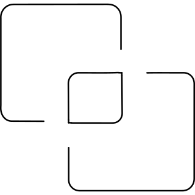 |
| 2 | amusement park disneyland_aee7722c-dd24-4d55-b610-ee4dcefeb9b6 | [brief](briefs/amusement park disneyland_aee7722c-dd24-4d55-b610-ee4dcefeb9b6.md) |  |
| 3 | angle up_259262e7-d283-452e-8f2c-70fdf473c993 | [brief](briefs/angle up_259262e7-d283-452e-8f2c-70fdf473c993.md) | 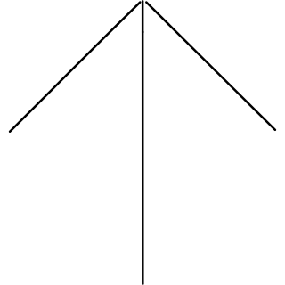 |
| 4 | antenna 2_04de1534-4976-4e50-b4ee-73d42fb5843b | [brief](briefs/antenna 2_04de1534-4976-4e50-b4ee-73d42fb5843b.md) | 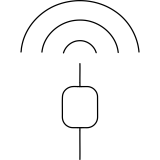 |
| 5 | apse_a873a693-6a3b-4ed0-9abe-dd43de459ce8 | [brief](briefs/apse_a873a693-6a3b-4ed0-9abe-dd43de459ce8.md) | 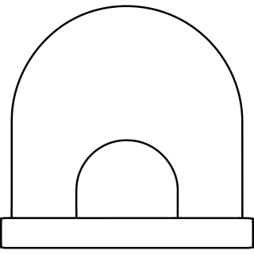 |
| 6 | arch linux logo_7f1ad0e2-4f9e-423b-9473-4df26eae6fed | [brief](briefs/arch linux logo_7f1ad0e2-4f9e-423b-9473-4df26eae6fed.md) | 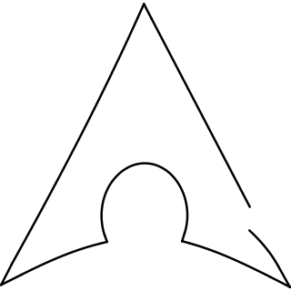 |
| 7 | archaeologist_434aebe0-5637-41b2-ba5b-e41942db8485 | [brief](briefs/archaeologist_434aebe0-5637-41b2-ba5b-e41942db8485.md) | 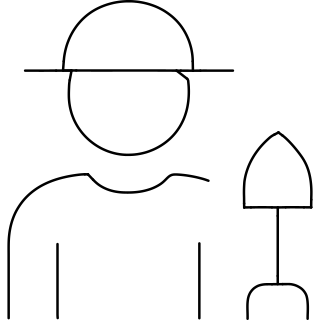 |
| 8 | archery person_291a797f-930c-4cb5-8b07-bb037ee2bfae | [brief](briefs/archery person_291a797f-930c-4cb5-8b07-bb037ee2bfae.md) | 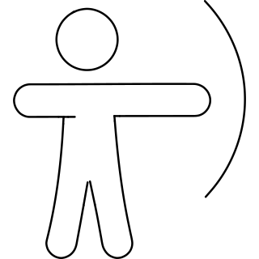 |
| 9 | archive books_42cdb953-b64a-446a-9e2f-0a5e1116e601 | [brief](briefs/archive books_42cdb953-b64a-446a-9e2f-0a5e1116e601.md) | 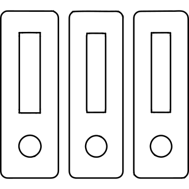 |
| 10 | archive drawer table_d7111f6c-45ed-41e2-8046-8e5db377b50c | [brief](briefs/archive drawer table_d7111f6c-45ed-41e2-8046-8e5db377b50c.md) | 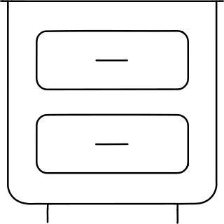 |
| 11 | archive folder_13db8562-1a7c-473f-8b82-2312e70e1f67 | [brief](briefs/archive folder_13db8562-1a7c-473f-8b82-2312e70e1f67.md) | 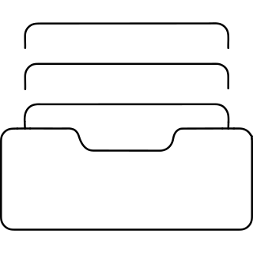 |
| 12 | archive locker 1_39bc7143-aab6-4bbb-9e54-1e955c556e69 | [brief](briefs/archive locker 1_39bc7143-aab6-4bbb-9e54-1e955c556e69.md) | 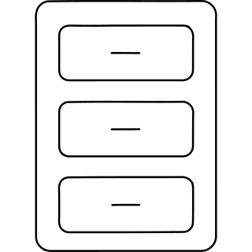 |
| 13 | archive locker_65e153d2-cde9-406a-87e3-e702b60b0b83 | [brief](briefs/archive locker_65e153d2-cde9-406a-87e3-e702b60b0b83.md) | 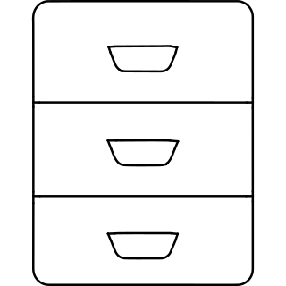 |
| 14 | archives_658192ad-5d22-4f1c-a6a6-35b2cd28f0b9 | [brief](briefs/archives_658192ad-5d22-4f1c-a6a6-35b2cd28f0b9.md) | 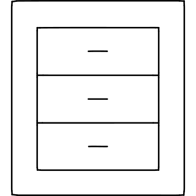 |
| 15 | arduino plus minus_ed08c4ae-cd2f-485c-a2ad-1642f69c286c | [brief](briefs/arduino plus minus_ed08c4ae-cd2f-485c-a2ad-1642f69c286c.md) | 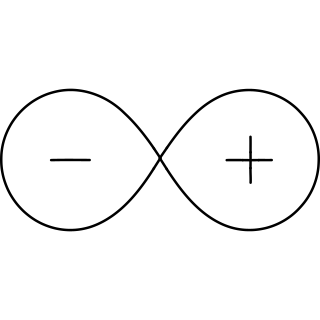 |
| 16 | arena_17920b8c-4d02-48c8-ae8c-57756cc50d28 | [brief](briefs/arena_17920b8c-4d02-48c8-ae8c-57756cc50d28.md) | 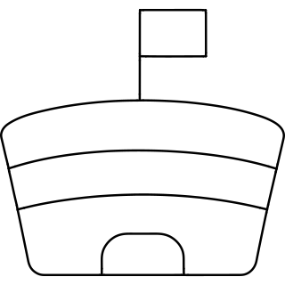 |
| 17 | ark_ad79e89e-1974-4afa-8c80-16f632d15a88 | [brief](briefs/ark_ad79e89e-1974-4afa-8c80-16f632d15a88.md) | 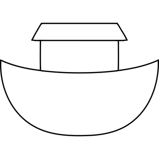 |
| 18 | arm_a7ae8bfd-85f6-4652-9b8a-570d2292ee9d | [brief](briefs/arm_a7ae8bfd-85f6-4652-9b8a-570d2292ee9d.md) |  |
| 19 | army symbol support_5c9f28ca-8e5c-4f35-a5d7-75fea38b0b0c | [brief](briefs/army symbol support_5c9f28ca-8e5c-4f35-a5d7-75fea38b0b0c.md) | 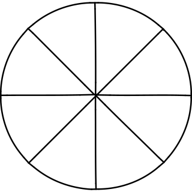 |
| 20 | arrows spin_e63cb3c3-10bb-4fb1-a675-1e6b119047a5 | [brief](briefs/arrows spin_e63cb3c3-10bb-4fb1-a675-1e6b119047a5.md) | 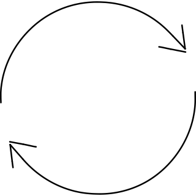 |
| 21 | artificial arm_9270cbcc-52de-4059-a27a-8e0287d0382e | [brief](briefs/artificial arm_9270cbcc-52de-4059-a27a-8e0287d0382e.md) |  |
| 22 | asalha puja group_37cca7c8-c737-48a1-b84a-f06486e9bba1 | [brief](briefs/asalha puja group_37cca7c8-c737-48a1-b84a-f06486e9bba1.md) |  |
| 23 | asalha puja_8c539ea0-c1e4-4239-86da-777c9408c3f4 | [brief](briefs/asalha puja_8c539ea0-c1e4-4239-86da-777c9408c3f4.md) | 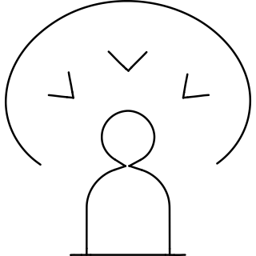 |
| 24 | ascending sort 2_b7434e69-9d9e-4d19-85db-eb9250eb7ced | [brief](briefs/ascending sort 2_b7434e69-9d9e-4d19-85db-eb9250eb7ced.md) | 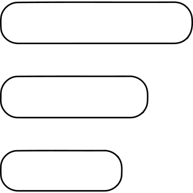 |
| 25 | ashram_6bf54c99-5c2d-4ba6-8a92-8e2924d208d9 | [brief](briefs/ashram_6bf54c99-5c2d-4ba6-8a92-8e2924d208d9.md) |  |
| 26 | ashtray_8a483511-912b-4068-b6e2-658e6ed7ea09 | [brief](briefs/ashtray_8a483511-912b-4068-b6e2-658e6ed7ea09.md) | 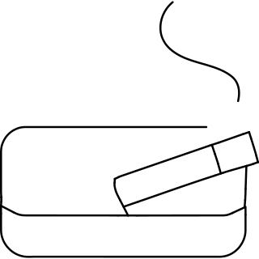 |
| 27 | ashura day of atonement tenth day of muharram_071c4c52-a190-4210-8d8d-e3f3838977f4 | [brief](briefs/ashura day of atonement tenth day of muharram_071c4c52-a190-4210-8d8d-e3f3838977f4.md) | 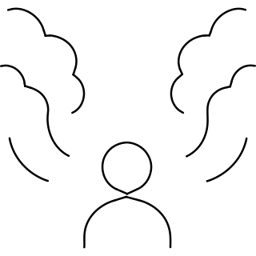 |
| 28 | asian food bao steam bun dimsum tray_fcba636a-131f-4ca8-9034-aa20ae0ca4ba | [brief](briefs/asian food bao steam bun dimsum tray_fcba636a-131f-4ca8-9034-aa20ae0ca4ba.md) | 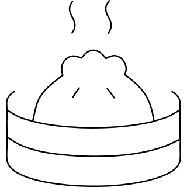 |
| 29 | asian monastery_38d9b634-f156-405a-b460-6fb467a50cb9 | [brief](briefs/asian monastery_38d9b634-f156-405a-b460-6fb467a50cb9.md) |  |
| 30 | askfm logo_09b24008-2fd9-4994-8d56-f0448e51ee39 | [brief](briefs/askfm logo_09b24008-2fd9-4994-8d56-f0448e51ee39.md) | 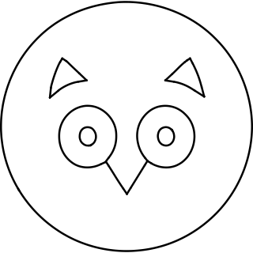 |
| 31 | assembly factory belt_b7b08f5f-04fe-479e-bafa-80221fd891d2 | [brief](briefs/assembly factory belt_b7b08f5f-04fe-479e-bafa-80221fd891d2.md) | 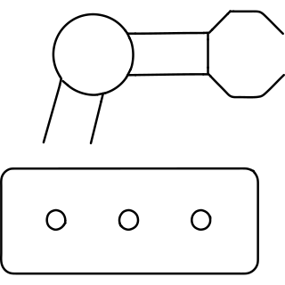 |
| 32 | astrology constellation_e8c9c913-e481-4d8a-aa60-7438e10a9131 | [brief](briefs/astrology constellation_e8c9c913-e481-4d8a-aa60-7438e10a9131.md) | 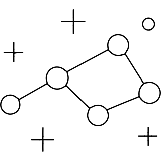 |
| 33 | astrology earth_37f2e936-d45d-4082-8529-a8e9d9f944d5 | [brief](briefs/astrology earth_37f2e936-d45d-4082-8529-a8e9d9f944d5.md) | 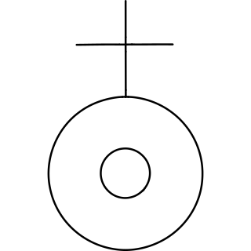 |
| 34 | astrology head node_7d94311e-bafe-40f0-8c01-f157e3bcab47 | [brief](briefs/astrology head node_7d94311e-bafe-40f0-8c01-f157e3bcab47.md) | 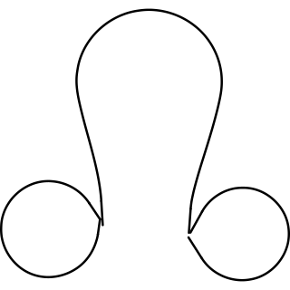 |
| 35 | astrology pluto_cef40aa5-a746-402a-888a-491c313181e9 | [brief](briefs/astrology pluto_cef40aa5-a746-402a-888a-491c313181e9.md) | 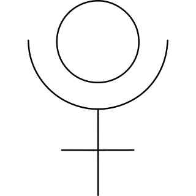 |
| 36 | astrology saggitarius_637049b4-5d80-4ec0-9968-de081b951103 | [brief](briefs/astrology saggitarius_637049b4-5d80-4ec0-9968-de081b951103.md) | 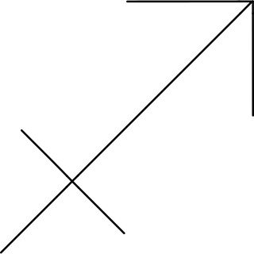 |
| 37 | astrology stars_2e3cad1b-f9fc-43b2-b7f0-4c06b892a8b9 | [brief](briefs/astrology stars_2e3cad1b-f9fc-43b2-b7f0-4c06b892a8b9.md) |  |
| 38 | astrology taurus_9ae5695b-6cd6-4194-8ef5-2006a62cdf59 | [brief](briefs/astrology taurus_9ae5695b-6cd6-4194-8ef5-2006a62cdf59.md) | 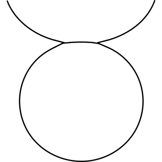 |
| 39 | astrology virgo_4ea58a40-e768-41fb-b322-fda6d281ceb7 | [brief](briefs/astrology virgo_4ea58a40-e768-41fb-b322-fda6d281ceb7.md) | 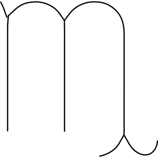 |
| 40 | astrology vulcan_3b30ee3e-d976-471c-8fd9-fef5b33797e9 | [brief](briefs/astrology vulcan_3b30ee3e-d976-471c-8fd9-fef5b33797e9.md) | 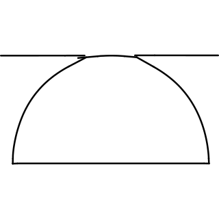 |
| 41 | astronomy comet 2_cc968864-9cbe-47b2-9f43-09b6e22ddf54 | [brief](briefs/astronomy comet 2_cc968864-9cbe-47b2-9f43-09b6e22ddf54.md) | 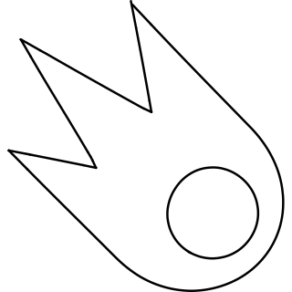 |
| 42 | astronomy comet_359119c5-151d-4bf5-b10f-c5ae639632bd | [brief](briefs/astronomy comet_359119c5-151d-4bf5-b10f-c5ae639632bd.md) | 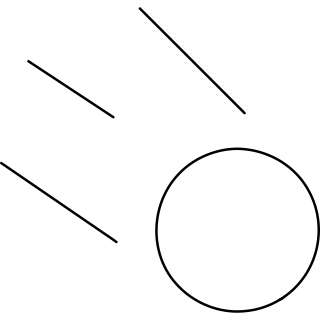 |
| 43 | astronomy earth rotation_87fce6c8-26b1-411d-877c-3b43d5067f7d | [brief](briefs/astronomy earth rotation_87fce6c8-26b1-411d-877c-3b43d5067f7d.md) |  |
| 44 | astronomy eclipse_6d179933-acab-43ec-bf9b-e0d73eebedfc | [brief](briefs/astronomy eclipse_6d179933-acab-43ec-bf9b-e0d73eebedfc.md) | 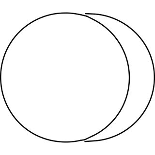 |
| 45 | astronomy moon_918bf38d-d107-4261-bb49-0141b95866e7 | [brief](briefs/astronomy moon_918bf38d-d107-4261-bb49-0141b95866e7.md) |  |
| 46 | astronomy planet jupiter_e44ac12f-4749-48aa-9071-2f48962ca3f8 | [brief](briefs/astronomy planet jupiter_e44ac12f-4749-48aa-9071-2f48962ca3f8.md) | 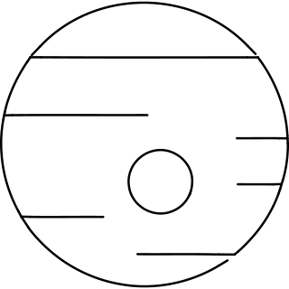 |
| 47 | astronomy planet mars_998d9922-3b84-4686-9849-bc9d470e42b7 | [brief](briefs/astronomy planet mars_998d9922-3b84-4686-9849-bc9d470e42b7.md) | 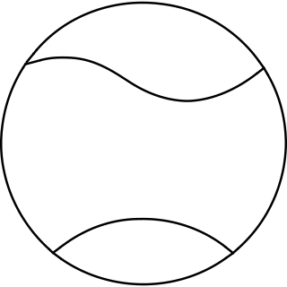 |
| 48 | astronomy planet neptune_4b501896-39ae-4d0f-82d0-50f8cd6f897d | [brief](briefs/astronomy planet neptune_4b501896-39ae-4d0f-82d0-50f8cd6f897d.md) | 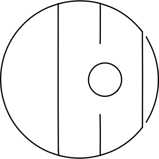 |
| 49 | astronomy planet ring star_1f8ba5cc-599b-4335-a3cb-9b86242182a8 | [brief](briefs/astronomy planet ring star_1f8ba5cc-599b-4335-a3cb-9b86242182a8.md) | 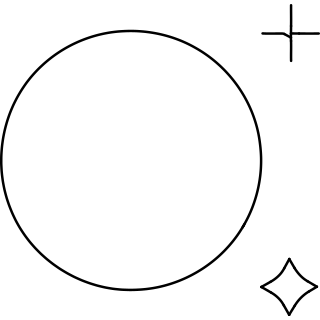 |
| 50 | astronomy planet ring_1e07607d-5598-4fe2-a63a-82f503d6f944 | [brief](briefs/astronomy planet ring_1e07607d-5598-4fe2-a63a-82f503d6f944.md) | 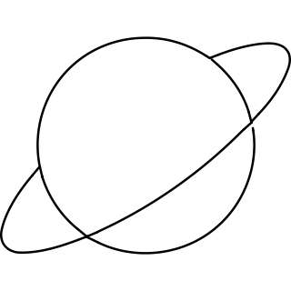 |
| 51 | astronomy planet saturn 1_d3179da3-e2e2-4329-8932-7b3c8044a535 | [brief](briefs/astronomy planet saturn 1_d3179da3-e2e2-4329-8932-7b3c8044a535.md) | 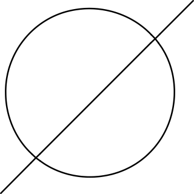 |
| 52 | astronomy planet saturn 2_a55f45de-c7d1-4563-93a4-39142d00a866 | [brief](briefs/astronomy planet saturn 2_a55f45de-c7d1-4563-93a4-39142d00a866.md) | 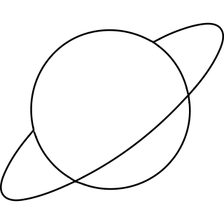 |
| 53 | astronomy planet venus_5ffc20eb-a0a5-4ec1-9a37-96aef256a323 | [brief](briefs/astronomy planet venus_5ffc20eb-a0a5-4ec1-9a37-96aef256a323.md) | 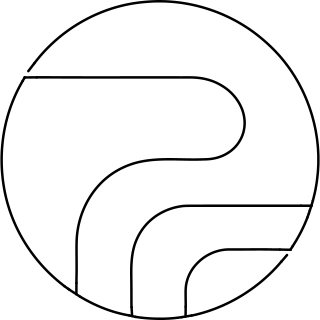 |
| 54 | astronomy planet_6a16304c-7690-48e3-b751-e98527720251 | [brief](briefs/astronomy planet_6a16304c-7690-48e3-b751-e98527720251.md) | 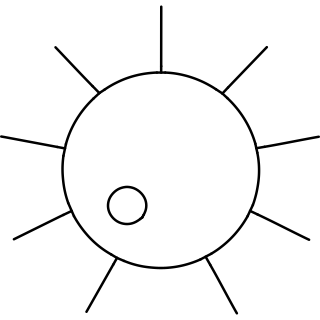 |
| 55 | astronomy telescope stars_4a8d494e-32cc-4073-96a3-0c1ca2d67952 | [brief](briefs/astronomy telescope stars_4a8d494e-32cc-4073-96a3-0c1ca2d67952.md) | 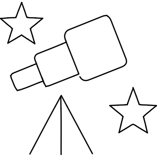 |
| 56 | astronomy telescope_a411b38b-0170-4301-bf5f-38c559aea73b | [brief](briefs/astronomy telescope_a411b38b-0170-4301-bf5f-38c559aea73b.md) | 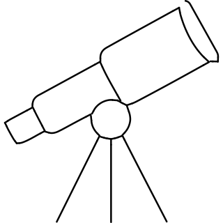 |
| 57 | atelier_f9d1ebd7-328b-4326-8efc-3c4aca3bef77 | [brief](briefs/atelier_f9d1ebd7-328b-4326-8efc-3c4aca3bef77.md) | 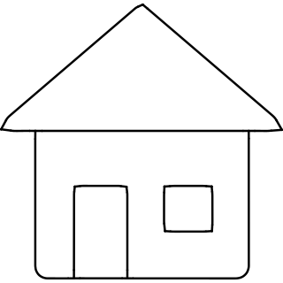 |
| 58 | athletics discus throwing_bd1577f2-0e5a-45a9-bb87-988b33687f00 | [brief](briefs/athletics discus throwing_bd1577f2-0e5a-45a9-bb87-988b33687f00.md) |  |
| 59 | athletics javelin throwing_ed2e2f29-f220-45d7-a61a-49096d243eef | [brief](briefs/athletics javelin throwing_ed2e2f29-f220-45d7-a61a-49096d243eef.md) |  |
| 60 | athletics long jumping_6f66d874-f536-41dd-bfae-be8151d586ac | [brief](briefs/athletics long jumping_6f66d874-f536-41dd-bfae-be8151d586ac.md) | 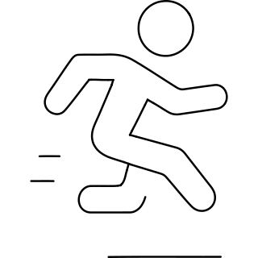 |
| 61 | athletics running 1_bbab0c61-cd66-44e3-8954-bcb31ddc3d23 | [brief](briefs/athletics running 1_bbab0c61-cd66-44e3-8954-bcb31ddc3d23.md) | 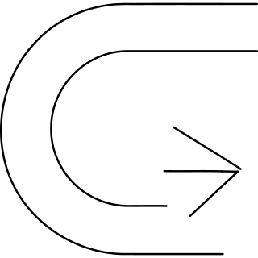 |
| 62 | athletics running_28c92329-3d76-4a8d-b49a-3e58b083b7b0 | [brief](briefs/athletics running_28c92329-3d76-4a8d-b49a-3e58b083b7b0.md) |  |
| 63 | athletics shooting_911ac869-135a-4c07-a867-4ded07c4f4e7 | [brief](briefs/athletics shooting_911ac869-135a-4c07-a867-4ded07c4f4e7.md) |  |
| 64 | athletics team running_52f16dbe-73c2-42ac-a2e9-1cf3f2731bef | [brief](briefs/athletics team running_52f16dbe-73c2-42ac-a2e9-1cf3f2731bef.md) |  |
| 65 | atlassian logo_ec087df7-a864-4434-b875-91ec2cc1535f | [brief](briefs/atlassian logo_ec087df7-a864-4434-b875-91ec2cc1535f.md) |  |
| 66 | atrium_9990c086-cf0b-49b8-ac14-f283aa034268 | [brief](briefs/atrium_9990c086-cf0b-49b8-ac14-f283aa034268.md) |  |
| 67 | audi pre sense warning_728da2ab-00cc-46d2-940b-827c80426d11 | [brief](briefs/audi pre sense warning_728da2ab-00cc-46d2-940b-827c80426d11.md) |  |
| 68 | audio book headphones person_8f662247-0935-46b5-ba77-cc454f1bafe3 | [brief](briefs/audio book headphones person_8f662247-0935-46b5-ba77-cc454f1bafe3.md) |  |
| 69 | audio book headphones_b0fa3cc1-6e0c-4af2-b4ad-57175c266a2a | [brief](briefs/audio book headphones_b0fa3cc1-6e0c-4af2-b4ad-57175c266a2a.md) |  |
| 70 | auto pilot car radius_8a6f5388-93e2-4e87-bb21-8db3666f5c20 | [brief](briefs/auto pilot car radius_8a6f5388-93e2-4e87-bb21-8db3666f5c20.md) |  |
| 71 | auto pilot car rear warning_474e097e-5638-4708-948a-6b1e5e6bcd8e | [brief](briefs/auto pilot car rear warning_474e097e-5638-4708-948a-6b1e5e6bcd8e.md) |  |
| 72 | auto pilot car signal 1_148a6d3d-6e93-44b0-ad9c-3c3c30856f29 | [brief](briefs/auto pilot car signal 1_148a6d3d-6e93-44b0-ad9c-3c3c30856f29.md) |  |
| 73 | auto pilot car sound warning_7a744411-5fc5-4b46-a2ca-fabc0d60942f | [brief](briefs/auto pilot car sound warning_7a744411-5fc5-4b46-a2ca-fabc0d60942f.md) |  |
| 74 | avatar adventure man_1ed85ce1-f76a-4b6a-8863-c9e201ffbd6b | [brief](briefs/avatar adventure man_1ed85ce1-f76a-4b6a-8863-c9e201ffbd6b.md) |  |
| 75 | avatar butcher barber_18c6f881-cfc6-4a2d-8932-bc97d73dabae | [brief](briefs/avatar butcher barber_18c6f881-cfc6-4a2d-8932-bc97d73dabae.md) |  |
| 76 | avatar carpenter_0a473297-da88-4e1f-8691-703bcbdef5cb | [brief](briefs/avatar carpenter_0a473297-da88-4e1f-8691-703bcbdef5cb.md) |  |
| 77 | avatar fire fighter man_512a90b8-56c0-4022-8dbd-b01e21fdd7e9 | [brief](briefs/avatar fire fighter man_512a90b8-56c0-4022-8dbd-b01e21fdd7e9.md) |  |
| 78 | aws iot services farm ipad_04aef027-7699-4c4d-a6e2-afbaea113fbc | [brief](briefs/aws iot services farm ipad_04aef027-7699-4c4d-a6e2-afbaea113fbc.md) |  |
| 79 | baboon_43a539c3-82f4-4fbd-b778-c77d1e22af44 | [brief](briefs/baboon_43a539c3-82f4-4fbd-b778-c77d1e22af44.md) |  |
| 80 | baby boy_4ec01feb-4215-413d-9fe1-82f8e7660a71 | [brief](briefs/baby boy_4ec01feb-4215-413d-9fe1-82f8e7660a71.md) |  |
| 81 | baby care pacifier_fcf2e80c-06a5-42d9-a45c-b4984bad2541 | [brief](briefs/baby care pacifier_fcf2e80c-06a5-42d9-a45c-b4984bad2541.md) |  |
| 82 | baby guard protect 2_0b0f724c-6381-4158-9f19-2b2a426b6450 | [brief](briefs/baby guard protect 2_0b0f724c-6381-4158-9f19-2b2a426b6450.md) |  |
| 83 | backbonejs logo_ea1369e6-eb5a-4c4d-b81f-f2ee0d7c669a | [brief](briefs/backbonejs logo_ea1369e6-eb5a-4c4d-b81f-f2ee0d7c669a.md) |  |
| 84 | backward_6d29648f-c9a8-4dec-bbe0-57e28586a4d0 | [brief](briefs/backward_6d29648f-c9a8-4dec-bbe0-57e28586a4d0.md) |  |
| 85 | badger_5bb2d73b-f3a4-43fd-add6-fac9786654ae | [brief](briefs/badger_5bb2d73b-f3a4-43fd-add6-fac9786654ae.md) |  |
| 86 | badminton shuttlecock racquet_de6f8f15-e075-4e2c-853a-cbcc18e0b3cc | [brief](briefs/badminton shuttlecock racquet_de6f8f15-e075-4e2c-853a-cbcc18e0b3cc.md) |  |
| 87 | badminton_73d5e308-a155-41b6-a284-6bbcb4d01b7b | [brief](briefs/badminton_73d5e308-a155-41b6-a284-6bbcb4d01b7b.md) |  |
| 88 | baggage roll_f44e1505-a761-4207-8901-519edfc7ee60 | [brief](briefs/baggage roll_f44e1505-a761-4207-8901-519edfc7ee60.md) |  |
| 89 | baggage weight 1_ac7ab444-ea22-41ad-ac0e-d5661e17d156 | [brief](briefs/baggage weight 1_ac7ab444-ea22-41ad-ac0e-d5661e17d156.md) |  |
| 90 | baguette_ec98192c-cf34-4d21-8f1f-3f5139450985 | [brief](briefs/baguette_ec98192c-cf34-4d21-8f1f-3f5139450985.md) |  |
| 91 | baidu logo_0e35f2af-227b-4dcc-9883-97fc7e054d59 | [brief](briefs/baidu logo_0e35f2af-227b-4dcc-9883-97fc7e054d59.md) |  |
| 92 | balaclava_ae1218cb-59f4-4df2-984f-467a5018de64 | [brief](briefs/balaclava_ae1218cb-59f4-4df2-984f-467a5018de64.md) |  |
| 93 | balloon_adab1a37-0438-4615-ab4e-fcb753ef6c7f | [brief](briefs/balloon_adab1a37-0438-4615-ab4e-fcb753ef6c7f.md) |  |
| 94 | ballpark_776dc545-fddf-46d7-8da8-cdfbb77f205c | [brief](briefs/ballpark_776dc545-fddf-46d7-8da8-cdfbb77f205c.md) |  |
| 95 | bandage leg_cb35bb55-0f0a-4845-a3b7-13caea7f8abf | [brief](briefs/bandage leg_cb35bb55-0f0a-4845-a3b7-13caea7f8abf.md) |  |
| 96 | bar step_af5465db-c598-4951-abe8-0254bea610c7 | [brief](briefs/bar step_af5465db-c598-4951-abe8-0254bea610c7.md) |  |
| 97 | barbed wire fence_78c0b26b-4a83-4ad9-9ab7-ec9eeeb021c0 | [brief](briefs/barbed wire fence_78c0b26b-4a83-4ad9-9ab7-ec9eeeb021c0.md) |  |
| 98 | bartender_c4436bf3-759b-41d0-b845-5ca2470d9b2a | [brief](briefs/bartender_c4436bf3-759b-41d0-b845-5ca2470d9b2a.md) |  |
| 99 | baseball glove_274ea3b9-c4e6-4996-af47-634f42957277 | [brief](briefs/baseball glove_274ea3b9-c4e6-4996-af47-634f42957277.md) |  |
| 100 | baseball helmet_e93a4ec7-1826-4d16-b85f-10f4fce227d7 | [brief](briefs/baseball helmet_e93a4ec7-1826-4d16-b85f-10f4fce227d7.md) |  |
| 101 | baseball player_c59f6204-2e2e-4ea5-9bb5-8c01e97f2ea3 | [brief](briefs/baseball player_c59f6204-2e2e-4ea5-9bb5-8c01e97f2ea3.md) |  |
| 102 | baseball score_0a9ee5d8-3550-452a-b859-653ff3a8c18e | [brief](briefs/baseball score_0a9ee5d8-3550-452a-b859-653ff3a8c18e.md) |  |
| 103 | basilisk_430d2703-1bb6-44cb-9617-2d121b3f6633 | [brief](briefs/basilisk_430d2703-1bb6-44cb-9617-2d121b3f6633.md) |  |
| 104 | bat fly_858e31f1-454e-40a0-86f3-444df304e673 | [brief](briefs/bat fly_858e31f1-454e-40a0-86f3-444df304e673.md) |  |
