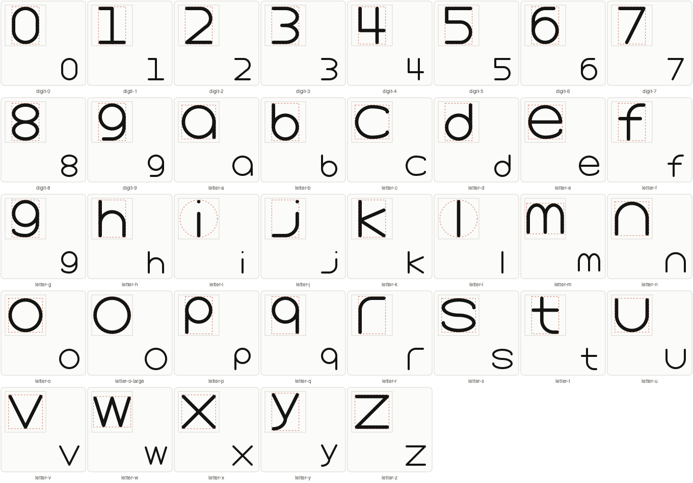
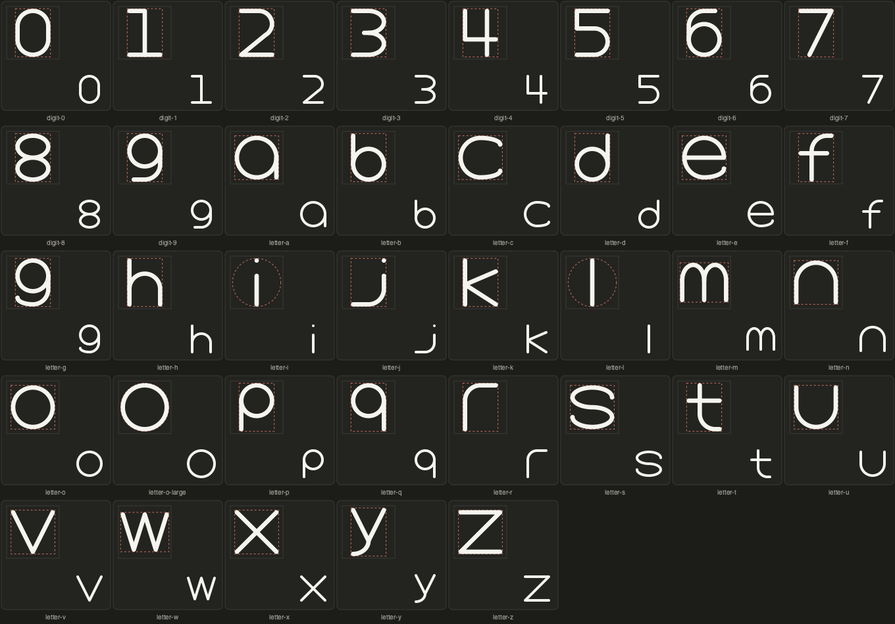

# Typeface reprocessing

Reprocessed all 37 SVG references from `Letters/` as independent SOLO48 icons in category `typeface`: ten digits, 26 lowercase letters and the second, larger o reference. Uppercase filenames identify lowercase artwork; the drawing determines the character. The original files remain available.

All 37 models validate with zero warnings and pass export QA (including spacing, negative space and symmetry). The targeted build exited successfully and all 37 appear in `icon_set/dist/solo48/manifest.json`. Native 48-pixel previews were inspected in light and dark themes.

## Construction

The Letters renders provide the character forms. The local Lucide `type` original and atomic-debug geometry informed coherent monoline strokes and explicit junctions. Curves were rebuilt with geometric arcs; source-specific curve irregularities were regularized without omitting any character. The intentional asymmetry of letters and digits is preserved. Symmetric bowls and repeated arches share their dimensions. Both o references are retained independently as `letter-o` and `letter-o-large`.

- `VRECT_M`: upright digits and letters with ascenders or descenders, with centerline extremes (10,4)–(38,44).
- `SQUARE`: balanced bowls and diagonal letters, with centerline extremes (6,6)–(42,42).
- `HRECT_L`: wider m and w, with centerline extremes (4,8)–(44,40).
- `CIRCLE`: the larger round o, and a radial envelope for narrow i/l that preserves the source forms without adding serifs. Centerline radius 20 about (24,24).

Author is `gpt-6`, an existing repository author value. No explicit source IDs were supplied; modules retain the exact source paths and use `SOURCE_ICON_ID = None`.

## Repository checks

The required unrestricted test-suite run with fail-fast stops in the existing `ActivityLogTests.test_actions_record_who_did_them` test: the expected `feedback_resolved` event is absent. Its failure does not involve these icon modules. The initial sandboxed run could not bind the test HTTP server; rerunning with local-server permissions exposed the activity-log assertion. The broad solo build and initial full suite were interrupted after expanding into thousands of unrelated icons. The subsequent targeted build checked exactly these 37 icons and exited 0. No validation rule was changed.

## Source mapping

| Reference | Icon | Keyshape | Result |
|---|---|---|---|
| 0.svg | digit-0 | VRECT_M | valid, no warnings |
| 1.svg | digit-1 | VRECT_M | valid, no warnings |
| 2.svg | digit-2 | VRECT_M | valid, no warnings |
| 3.svg | digit-3 | VRECT_M | valid, no warnings |
| 4.svg | digit-4 | VRECT_M | valid, no warnings |
| 5.svg | digit-5 | VRECT_M | valid, no warnings |
| 6.svg | digit-6 | VRECT_M | valid, no warnings |
| 7.svg | digit-7 | VRECT_M | valid, no warnings |
| 8.svg | digit-8 | VRECT_M | valid, no warnings |
| 9.svg | digit-9 | VRECT_M | valid, no warnings |
| A.svg | letter-a | SQUARE | valid, no warnings |
| B.svg | letter-b | VRECT_M | valid, no warnings |
| C.svg | letter-c | SQUARE | valid, no warnings |
| D.svg | letter-d | VRECT_M | valid, no warnings |
| E.svg | letter-e | SQUARE | valid, no warnings |
| F.svg | letter-f | VRECT_M | valid, no warnings |
| G.svg | letter-g | VRECT_M | valid, no warnings |
| H.svg | letter-h | VRECT_M | valid, no warnings |
| I.svg | letter-i | CIRCLE | valid, no warnings |
| J.svg | letter-j | VRECT_M | valid, no warnings |
| K.svg | letter-k | VRECT_M | valid, no warnings |
| L.svg | letter-l | CIRCLE | valid, no warnings |
| M.svg | letter-m | HRECT_L | valid, no warnings |
| N.svg | letter-n | SQUARE | valid, no warnings |
| o-1.svg | letter-o | SQUARE | valid, no warnings |
| o.svg | letter-o-large | CIRCLE | valid, no warnings |
| P.svg | letter-p | VRECT_M | valid, no warnings |
| Q.svg | letter-q | VRECT_M | valid, no warnings |
| R.svg | letter-r | VRECT_M | valid, no warnings |
| S.svg | letter-s | SQUARE | valid, no warnings |
| T.svg | letter-t | VRECT_M | valid, no warnings |
| U.svg | letter-u | SQUARE | valid, no warnings |
| V.svg | letter-v | SQUARE | valid, no warnings |
| W.svg | letter-w | HRECT_L | valid, no warnings |
| X.svg | letter-x | SQUARE | valid, no warnings |
| Y.svg | letter-y | VRECT_M | valid, no warnings |
| Z.svg | letter-z | SQUARE | valid, no warnings |

## Previews

## Text combine

Open `../../dist/gallery/text-combine.html` or choose **Text combine** in the gallery navigation. The page works offline and supports uppercase A–Z, lowercase a–z, digits, spaces, line breaks, body-height adjustment, letter and line spacing, stroke-width adjustment, guide display, individual body inspection, and clean SVG download. Punctuation is reported as unsupported rather than silently substituted.

`model/typeface.py` measures geometry using per-icon `typeface` declarations. A single closed contour identifies the bowl for a/b/d/g/o/p/q. Main stroke bounds exclude detached dots. Ambiguous open letters use authored centerline body bands (f/h/j/k/l/t/y), explicitly labeled in the inspector. These are curated typographic decisions for this alphabet, not a claim that arbitrary SVGs expose enough information to infer their baselines. The j band is a visual baseline estimate within its rounded hook. Adjust the source class's `body_band` when reviewing those decisions.

For lowercase glyphs, scale = target body height / measured body height; vertical shift aligns the measured baseline. Digits use the taller cap-height target. Horizontal positions use transformed visible widths plus spacing. Stroke width is inversely compensated within each scaled group so all output letters retain equal weight. Guides use centerlines; round ink extends by half a stroke on each side. The 48×48 primitive drawings remain unchanged; transforms are applied only to the composed text.

`dist/gallery/typeface.json` records all 63 metrics, measurement methods, paths, and artwork hashes. `scripts/typeface_gallery.py` regenerates it and the page during gallery builds. Stale or manually replaced artwork is excluded if its SVG hash differs from the source being measured.

Validation: six Python tests and JavaScript layout/export checks pass, including bowl alignment, ascending/descending extents, detached dots, the alternate o, spacing, character widths, digits and stale-artwork protection. Static exported previews were visually inspected. The browser's local-file URL policy prevented live UI verification.

## Uppercase and adjustable stroke width

Added 26 uppercase Solo48 modules in category `typeface`. Capitals use VRECT_M for upright proportions, except M/W, which use SQUARE for their broader structure. Lucide `type` informed monoline construction and shared junctions; the new characters were drawn from their letter names with no source SVG supplied. Nothing was omitted from the uppercase alphabet. Directional letter structures retain their necessary asymmetry; Q has a descending tail excluded from its cap-height band.

All 26 capital models validate with zero warnings, pass export QA, and are present in the solo release manifest. Both-theme native previews and mixed-case composed exports were visually inspected. The targeted uppercase build exited 0. Seven Python tests and JavaScript layout/export checks pass, including all 26 capitals and weights 0.5, 2, 4, 8 and 16. The text composer applies the chosen width consistently to uppercase, lowercase and digits, recomputes ink bounds and spacing, and preserves the width in downloads. The canonical primitive stroke stays 4.
